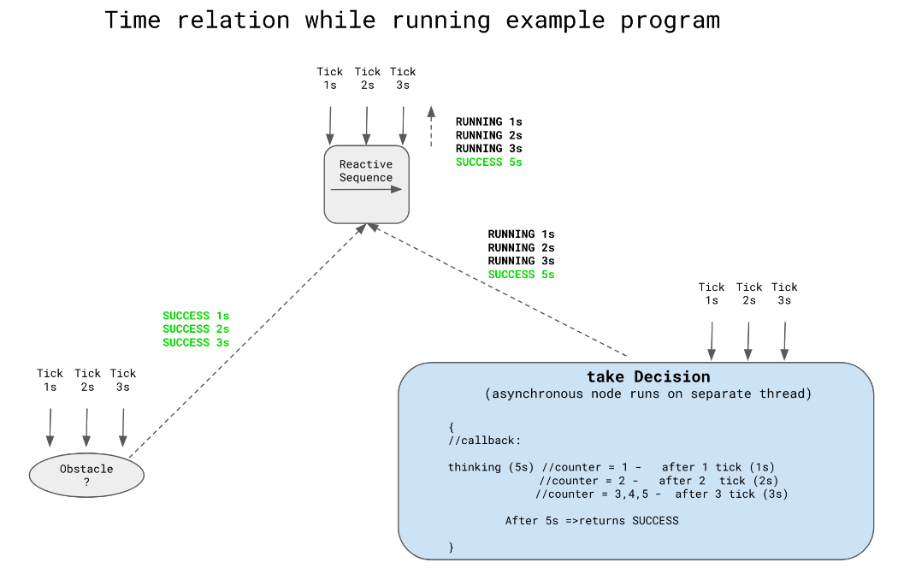
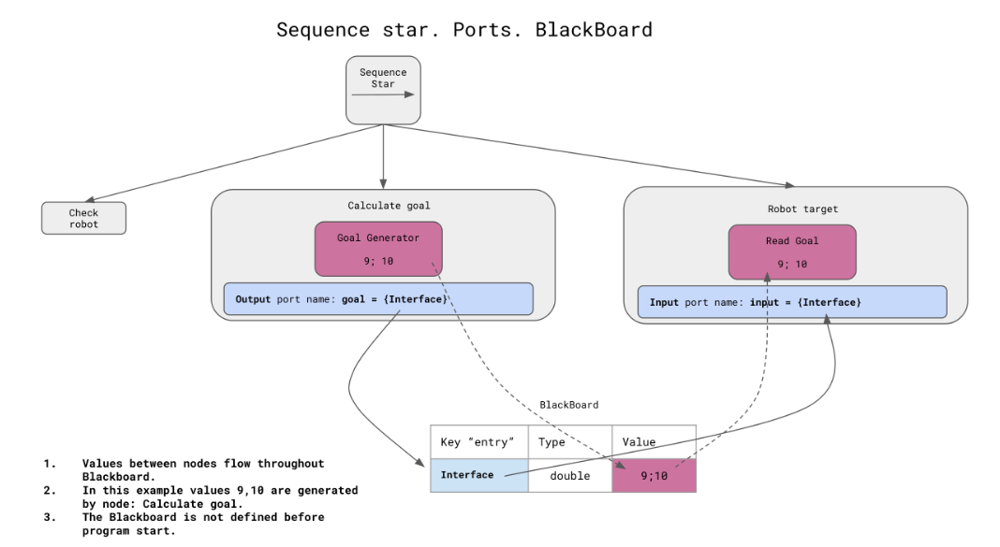

# Princípios de Design de Árvores Comportamentais no Contexto de uma Tarefa Bem-sucedida Descrição do Agente Autônomo

## Arquitetura de Árvores Comportamentais
Na Seção anterior, introduzimos o conceito de BT e definimos primitivas lógicas para arquitetar o comportamento de agentes autônomos (um robô). Agora você entende a pilha de abstração e pode localizar BT nela.

Embora os BTs sejam razoavelmente simples de compreender e usar, é benéfico estar ciente dos princípios e métodos de design que podem ser usados em muitos contextos para realizar plenamente seu potencial. Vários exemplos serão usados para ilustrar essas ideias.

Especificamos a interpretação lógica de como o robô se comporta durante a execução da tarefa conforme refletido no arquivo XML.

Neste seção, você usa o `framework BehaviourTree.CPP`, que habilita e protege as tarefas do robô que serão executadas de acordo com as definições lógicas (escritas em XML). Isso significa que o robô percorre o BT de acordo.

A pilha a seguir ilustra as relações e ações a serem executadas usando o BT para modelar a tarefa do robô. O diagrama fornece uma visão geral do fluxo de dados durante a execução do aplicativo do robô incorporado ao BT.

<div align="center">
     
</div>

#### Estudar este diagrama é essencial para entender BT e sua relação com ROS.

Imagine que seu robô deve executar a tarefa (por exemplo, limpar o chão). A tarefa consiste em várias ações, muitas vezes relacionadas à interação com o ambiente do robô. A aplicação do robô geralmente inclui mecanismos de supervisão de segurança e outras "verificações" (verificação da bateria). As ações do robô e mecanismos auxiliares são modelados em BT, onde as relações lógicas são expostas no arquivo XML.

Usando a estrutura BehaviourTree.CPP, você cria a declaração de nós (seguindo o XML; arquitetura BT) e definições. Então, criando as definições dos nós, você expressa as ações executadas neste nó BT.

Um conjunto de ações definidas por um nó BT é considerado um callback (BT chama outras funções/ações). Neste seção, você define um conjunto de ações executadas no nó ROS. Além disso, o nó ROS se comunica com um robô ou simulação (no seu caso, Gazebo). Os nós ROS recebem o feedback e enviam o estado (feedback) para o nó BT. A análise de feedback afeta o nó BT e envia o retorno para a Raiz (SUCCESS, FAILURE ou RUNNING).

Tendo em mente a pilha de abstrações definida anteriormente, você pode avaliar novamente o BT, que define o fluxo lógico. O projeto detalhado dos nós ROS é desvinculado do conceito BT.

Você não considera em detalhes como o nó executa a tarefa (por exemplo, calcula a cinemática inversa). No entanto, você considera apenas o comportamento do nó, ou seja, a funcionalidade do nó (como uma “caixa de bloco”). Ao arquitetar o BT, você sabe o que o nó ROS está fazendo, mas o detalhamento da implementação não é obrigatório nesse raciocínio abstrato.

Nas próximas seções, discutiremos as vantagens de utilizar a estrutura de arquivo XML explícita e a abordagem para modelar a estrutura lógica de BT. Além disso, você experimentará o mapeamento do XML na estrutura BehaviorTree.CPP e ROS2.

Você abordará uma visão mais profunda da BT e dos mecanismos que orquestram as definições lógicas das tarefas do robô. Referindo-se às suas suposições anteriores, arquitetando o BT, considere apenas o nível mais alto de abstração, evitando uma compreensão mais profunda dos mecanismos relacionados à implementação do nó ROS. O nó, como mencionado, é considerado uma “caixa preta” – executando uma função no sistema de robô que você constrói.

Considere o diagrama abaixo descrevendo conexões lógicas em BT. Comece pela função primária, que lê o arquivo XML.

A função primária e a estrutura BT incluem a declaração de nós. A estrutura BehaviourTree.CPP gerencia o fluxo lógico (marque o nó BT) de acordo com uma especificação XML (invoca um retorno de chamada).

Os nós BT executam seu callback (conjunto de ações). O retorno de chamada retorna SUCCESS, FAILURE ou RUNNING. A ação de retorno de chamada pode se comunicar com os nós ROS. Os nós ROS executam ações relacionadas ao robô.

<div align="center">
     
</div>

## Tipos de nó e comportamento. O Modelo de Fluxo Lógico BT em Formato XML

Aborde os desafios com o design conceitual de BT, que por natureza deve ser legível por humanos, introduzindo o conceito XML. O BehaviorTree.CPP oferece uma linguagem de script XML que suporta humanos para especificar árvores específicas e nós únicos.

Para arquitetar o BT de cada tarefa do robô, você definiu brevemente os primitivos BT (nós) na unidade anterior. Os nós Sequence, FallBack e Decorators foram descritos. Isso ajudou você a entender o BT em geral. No entanto, você deve adicionar mecanismos e abstrações lógicas para ser mais consistente e aderir ao conceito de framework BehaviorTree.CPP.

Para fornecer uma compreensão completa da arquitetura BT, veja abaixo uma variedade de técnicas e abstrações de estrutura na seção a seguir. A palestra seguirá os princípios orientadores da abordagem de design XML. No entanto, você se concentrará principalmente em uma abordagem prática (usando exemplos C++).

Por favor, esteja familiarizado com a hierarquia de tipo de nó representada no diagrama abaixo.

<div align="center">
     
</div>

Primeiro, considere o nó Sequência. O último diagrama descreve três tipos de nós de sequência. Na tabela a seguir, você pode entender o comportamento de cada um deles.

<div align="center">
     
</div>

Na tabela, Restart e Tick novamente podem ser compreendidos da seguinte forma:

* Reiniciar significa que todo o nó de sequência é reiniciado a partir do primeiro filho na lista. Se o nó de sequência incluir os filhos A, B, C e D, então A e B são SUCCESS. No entanto, C é FALHA. O próximo tick obriga você a verificar novamente, começando de A.

* Marcar novamente significa que na próxima vez que a sequência for marcada, o mesmo filho será marcado. Os filhos anteriores lembram-se do status. Se o nó de sequência incluir os filhos A, B, C e D, então A e B são SUCCESS. No entanto, C é FALHA. O próximo tick força você a verificar novamente C, NOT A e B, quais estados são lembrados.

Revise os exemplos simples, as definições lógicas em XML e os exemplos em C++. A estrutura BehaviorTree.CPP será estudada cuidadosamente na próxima unidade.

<div align="center">
     
</div>

A sequência a seguir é simples.

* O robô se move em linha reta e para frente, lendo o sensor laser. As leituras são precisas e fornecem uma excelente visão geral dos arredores. T
* O robô analisa os dados do sensor e percebe as condições para evitar obstáculos que possam aparecer nas proximidades do robô (enquanto se move em linha reta). Se o obstáculo estiver a menos de dois metros do robô `(CONDIÇÃO 1)`, o robô deve parar.
* O robô deve novamente analisar o ambiente e decidir como evitar o obstáculo (neste caso, assuma que o robô pode virar à esquerda ou à direita; o robô escolhe a direção aleatoriamente). O robô verifica se há energia suficiente armazenada na bateria para girar `(CONDIÇÃO 2)` antes do robô girar (esquerda ou direita). Nesse caso, o robô gira 90 graus `(AÇÃO 1)` e se move em linha reta `(AÇÃO 2)`.

Agora, você pode arquitetar o BT para essas ações do robô.

```xml
<root main_tree_to_execute = "MainTree" >

     <BehaviorTree ID="MainTree">
        <Sequence name="root_sequence">
            <Obstacle   name=" Obstacle detected"/>
            <EnoughBattery   name=" Battery OK"/>
            <Rotate       name=" Rotated"/>
            <MoveStraight name=" Moved"/>
        </Sequence>
    </BehaviorTree>

</root>
```

Verifique a tabela descrita acima. Se a CONDIÇÃO 1 for FALHA (sem obstáculo), a sequência terminará e o nó Sequência será reiniciado.

Considere o caso em que o robô precisa de cinco segundos para girar antes que o callback retorne RUNNING. Nesse caso, a ação, rotacionar, obterá o tick subsequente e determinará se o estado mudou de RUNNING para SUCCESS. O nó de sequência lembra as verificações anteriores (CONDIÇÃO 1 e CONDIÇÃO 2) e não há necessidade de verificá-las novamente.

Além disso, você descreveu exemplos na unidade anterior e agora é uma ótima oportunidade para entender o design XML. Conforme discutido, XML é usado para modelar o fluxo lógico em BT. Neste exemplo, você pode arquitetar o nó de sequência da seguinte maneira.

Novamente, é crucial enfatizar que você projeta as conexões lógicas e o fluxo das ações aqui. Cada ação descrita nesta unidade possui um callback (do ponto de vista do site Raiz), o que implica que possui rotinas específicas a serem executadas.

Para simplificar, se o robô verificar a bateria, ele receberá os resultados SUCESSO (energia suficiente) ou FALHA do retorno de chamada (a bateria está vazia). Em um sistema real, verificar a bateria é significativamente mais difícil e envolve mais etapas do que apenas verificar.

> bt1.cpp
```cpp
#include "behaviortree_cpp_v3/bt_factory.h"

using namespace BT;

class Obstacle : public BT::SyncActionNode
{
  public:
    Obstacle(const std::string& name) : BT::SyncActionNode(name, {})
    {
    }

    // You must override the virtual function tick()
    NodeStatus tick() override
    {
        std::cout << "OK. Detected !"
                  << "\n";
        return BT::NodeStatus::SUCCESS;
    }
};

class EnoughBattery : public BT::SyncActionNode
{
  public:
    EnoughBattery(const std::string& name) : BT::SyncActionNode(name, {})
    {
    }

    // You must override the virtual function tick()
    NodeStatus tick() override
    {
        std::cout << "is there energy remain?: " << this->name() << std::endl;
        return BT::NodeStatus::SUCCESS;
    }
};

class Rotate : public BT::SyncActionNode
{
  public:
    Rotate(const std::string& name) : BT::SyncActionNode(name, {})
    {
    }

    // You must override the virtual function tick()
    NodeStatus tick() override
    {
        std::cout << "rotating 90 deg : " << this->name() << std::endl;
        return BT::NodeStatus::SUCCESS;
    }
};

class MoveStraight : public BT::SyncActionNode
{
  public:
    MoveStraight(const std::string& name) : BT::SyncActionNode(name, {})
    {
    }

    // You must override the virtual function tick()
    NodeStatus tick() override
    {
        std::cout << "moving again straight : " << this->name() << std::endl;
        return BT::NodeStatus::SUCCESS;
    }
};

static const char* xml_text = R"(

 <root main_tree_to_execute = "MainTree" >

     <BehaviorTree ID="MainTree">
        <Sequence name="root_sequence">
            <Obstacle   name=" Obstacle detected"/>
            <EnoughBattery   name=" Battery OK"/>
            <Rotate       name=" Rotated"/>
            <MoveStraight name=" Moved"/>
        </Sequence>
     </BehaviorTree>

 </root>
 )";

int main()
{
    // We use the BehaviorTreeFactory to register our custom nodes
    BehaviorTreeFactory factory;

    // The recommended way to create a Node is through inheritance.
    // Even if it requires more boilerplate, it allows you to use more functionalities
    // like ports (we will discuss this in future tutorials).

    factory.registerNodeType<Obstacle>("Obstacle");
    factory.registerNodeType<EnoughBattery>("EnoughBattery");
    factory.registerNodeType<Rotate>("Rotate");
    factory.registerNodeType<MoveStraight>("MoveStraight");

    // Trees are created at deployment-time (i.e. at run-time, but only once at the beginning).
    // The currently supported format is XML.
    // IMPORTANT: when the object "tree" goes out of scope, all the TreeNodes are destroyed
    auto tree = factory.createTreeFromText(xml_text);

    // To "execute" a Tree you need to "tick" it.
    // The tick is propagated to the children based on the logic of the tree.
    // In this case, the entire sequence is executed, because all the children
    // of the Sequence return SUCCESS.
    tree.tickRoot();

    return 0;
}
```
Execute no Shell:

```bash
source ~/ros2_ws/install/setup.bash
./bt1
```

> Output 
```bash
OK. Detected !
is there energy remain?:  Battery OK
rotating 90 deg :  Rotated
moving again straight :  Moved
```

A unidade a seguir permite uma compreensão profunda da arquitetura e dos mecanismos de BT, permitindo arquitetar a conexão lógica do comportamento do robô.

Este exemplo é semelhante ao executado na unidade anterior.

1. O robô executa tarefas de sequência.
2. Primeiro, o robô verifica se existe algum obstáculo, o que, neste caso, é verdadeiro. Nó imprime OK. Detectou!
3. Em seguida, o robô verifica se tem bateria suficiente para realizar as tarefas de desvio. A verificação é SUCESSO. O nó imprime: há energia restante?: Bateria OK.
4. Em seguida, o robô gira. Impressões de nó: girando 90 graus: girado.
5. Finalmente, o robô se move em linha reta. Nó imprime: movendo-se novamente em linha reta: movido.

## Esquema XML
Observe que, apesar da biblioteca ser desenvolvida em C++, os BTs ainda podem ser criados durante o tempo de execução. O XML pode ser lido de um arquivo ou incorporado ao código C++.
```xml
 <root main_tree_to_execute = "MainTree" >
     <BehaviorTree ID="MainTree">
        <Sequence name="root_sequence">
            <SaySomething   name="action_hello" message="Hello"/>
            <OpenGripper    name="open_gripper"/>
            <ApproachObject name="approach_object"/>
            <CloseGripper   name="close_gripper"/>
        </Sequence>
     </BehaviorTree>
 </root>
```
Seguindo o padrão descrito:

* A primeira marca de árvore é a Raiz. Deve conter uma ou mais tags, BehaviorTree.
* A tag BehaviorTree deve ter o atributo ID.
     * A tag Root deve conter o atributo main_tree_to_execute.
     * O atributo `main_tree_to_execute` é obrigatório se o arquivo contiver vários `BehaviorTrees`; opcional caso contrário.
* Uma única tag representa cada nó da árvore. Em particular:

     * O nome do tag é o ID usado para registrar o TreeNode na fábrica.
     * O nome do atributo refere-se ao nome da instância e é opcional.
     * As portas são configuradas usando atributos.
Quanto ao número de filhos:

* **ControlNodes** contém de 1 a N filhos.
* **DecoratorNodes** e subárvores contêm apenas 1 filho.
* **ActionNodes** e ConditionNodes não têm filhos.

### Nós aninhados

Os conceitos básicos de projeto devem ser mantidos em mente quando você arquiteta o BT. Por exemplo, o BT é realizado de cima para baixo e da esquerda para a direita. Usando esses conceitos, você pode construir a figura a seguir e deduzir os princípios de fluxo lógico XML.

Em seguida, examine o diagrama enquanto considera o relacionamento XML entre as operações.

<div align="center">
     
</div>

```xml
 <root main_tree_to_execute = "MainTree" >

     <BehaviorTree ID="MainTree">
        <Sequence name="root_sequence">
                <Sequence name="sequence_1">
                        <Sequence name="sequence_1">
                            <Condition1   name="condition_1"/>
                            <Action1      name="action_1"/>
                        </Sequence>
                        <Fallback name="fallback_1">
                            <Action2      name="action_2"/>
                            <Action3      name="action_3"/>
                        </Fallback>
                </Sequence>
                <Fallback name="fallback_2">
                         <Sequence name="sequence_3">
                            <Condition2   name="condition_2"/>
                            <Action4      name="action_4"/>
                        </Sequence>
                        <Sequence name="sequence_4">
                            <Condition3   name="condition_3"/>
                            <Action5      name="action_5"/>
                        </Sequence>
                </Fallback>
        </Sequence>
     </BehaviorTree>

 </root>
```
### Nós assíncronos (nó sequencial reativo)
Como afirmado anteriormente, o Nó Sequencial Reativo é uma melhoria para o Nó Sequencial, particularmente quando o Nó Condicional é permanentemente verificado antes de retornar SUCCESS. Mas, novamente, revise a referência da tabela, que mostra que toda a sequência foi redefinida.

Este tipo de sequência (Sequencial Reativo) é empregado quando a ação do nó é assíncrona. Isso denota que, até terminar, o nó retorna RUNNING (a ação executada pelo nó leva mais tempo do que o tempo de amostra do tick). Pense na ilustração resumida.

<div align="center">
     
</div>

Por favor, considere o diagrama abaixo, que deve lhe dar uma melhor compreensão do que acontece durante a execução deste exemplo. Como não estamos discutindo a implementação de C++, recomendamos que você execute o programa e estude o código.

<div align="center">
     
</div>

Agora você explorará um aspecto crucial do BT e contrastará o nó sequencial descrito anteriormente com a sequência reativa no contexto do nó síncrono versus nó assíncrono.

Primeiro, observe que o thread para uma ação assíncrona é separado (próprio thread). Ao fazer isso, o usuário pode empregar métodos de bloqueio enquanto retorna o fluxo de execução para a árvore.

> bt2.cpp
```cpp
#include "behaviortree_cpp_v3/bt_factory.h"

using namespace BT;

class ObstacleCheck : public BT::SyncActionNode
{
  public:
    int count;

    ObstacleCheck(const std::string& name) : BT::SyncActionNode(name, {})
    {
        this->count = 0;
    }

    // You must override the virtual function tick()
    NodeStatus tick() override
    {
        std::cout << "OK. Detected !"
                  << "\n";
        return BT::NodeStatus::SUCCESS;
    }
};

class takeDecision : public BT::AsyncActionNode
{
  public:
    // Any TreeNode with ports must have a constructor with this signature
    takeDecision(const std::string& name, const BT::NodeConfiguration& config)
      : AsyncActionNode(name, config)
    {
    }

    // It is mandatory to define this static method.
    static BT::PortsList providedPorts()
    {
        return {};
    }

    BT::NodeStatus tick() override
    {
        {
            _halt_requested.store(false);

            int count = 0;

            while ((!_halt_requested) && (count < 5))
            {
                std::cout << "thinking for :: " << count << "\n";
                std::this_thread::sleep_for(std::chrono::seconds(1));
                count++;
            }

            std::cout << "[ Decision process: FINISHED ]" << std::endl;

            return _halt_requested ? BT::NodeStatus::FAILURE : BT::NodeStatus::SUCCESS;
        }
    }

    virtual void halt() override;

  private:
    std::atomic_bool _halt_requested;
};

void takeDecision::halt()
{
    _halt_requested.store(false);

    std::cout << __FUNCTION__ << " called!"
              << "\n";
}

static const char* xml_text_reactive = R"(

 <root main_tree_to_execute = "MainTree" >

     <BehaviorTree ID="MainTree">
        <ReactiveSequence name="root">
            <ObstacleCheck   name=" Obstacle detected"/>       
                <takeDecision   name="take Decision"/>
        </ReactiveSequence>
     </BehaviorTree>

 </root>
 )";

void Assert(bool condition)
{
    if (!condition)
        throw RuntimeError("this is not what I expected");
}

int main()
{
    using std::chrono::milliseconds;

    BehaviorTreeFactory factory;

    factory.registerNodeType<ObstacleCheck>("ObstacleCheck");
    factory.registerNodeType<takeDecision>("takeDecision");

    std::cout << "\n------------ BUILDING A NEW TREE ------------" << std::endl;

    auto tree = factory.createTreeFromText(xml_text_reactive);

    NodeStatus status;
    status = tree.tickRoot();

    std::cout << "\n--- 1st executeTick() ---" << std::endl;
    status = tree.tickRoot();

    std::this_thread::sleep_for(std::chrono::microseconds(1000));
    std::cout << "\n--- 2nd executeTick() ---" << std::endl;
    status = tree.tickRoot();

    std::this_thread::sleep_for(std::chrono::microseconds(1000));
    std::cout << "\n--- 3rd executeTick() ---" << std::endl;
    status = tree.tickRoot();

    return 0;
}
```
Execute no Shell:
```bash
source ~/ros2_ws/install/setup.bash
./bt2
```

> Output 
```bash

------------ BUILDING A NEW TREE ------------
OK. Detected !

--- 1st executeTick() ---
OK. Detected !
thinking for :: 0

--- 2nd executeTick() ---
OK. Detected !

--- 3rd executeTick() ---
OK. Detected !
thinking for :: 1
thinking for :: 2
thinking for :: 3
thinking for :: 4
```

Pense em como o software é executado. A cada segundo, o BT é assinalado. Como o robô está se aproximando do obstáculo, você pode assumir que a condição retorna SUCCESS.

Cada vez que o nó de obstáculo é marcado, ele imprime: OK. Detectou!

A ação Tomar Decisão é então verificada. A ação retorna RUNNING porque é assíncrona (o robô precisa de cinco segundos para pensar). O nó assíncrono opera em um encadeamento diferente (independentemente) quando o nó de sequência reativa é retomado; assim, o tempo passa enquanto o robô pensa. Cada vez que o nó é marcado, ele imprime: pensando por: (número de segundos).

Após o segundo tick da árvore, você pode observar a saída do programa. Apesar da condição de obstáculo ter sido verificada novamente, os tempos de reflexão aumentaram. Após o terceiro tick da árvore, o comportamento do nó ainda se aplica. O processo assíncrono ainda está em execução e termina (o status do nó muda de RUNNING para SUCCESS) depois que o contador se esgota.

### Simultaneidade

Para continuar esta discussão, você deve entender o paradigma da ciência da computação e compreender a diferença entre simultaneidade e paralelismo.

Considere o diagrama abaixo. Simultaneidade e paralelismo diferem fundamentalmente porque a simultaneidade envolve o processamento de várias tarefas simultaneamente (criando a aparência de simultaneidade).

Imagine que existe uma CPU (um núcleo) que lida com várias tarefas (executando simultaneamente) em paralelo, alternando o gerenciamento de uma tarefa para outra.

Ao contrário, o paralelismo envolve a realização de várias tarefas simultaneamente para acelerar o processamento. Portanto, o paralelismo é executado em vários núcleos de CPU (multicore CPU) e a restrição de tempo deve ser mantida.

<div align="center">
     
</div>

O framework BehaviorTree.CPP executa todos os nós simultaneamente (seguindo as definições do framework):

* O próprio mecanismo de execução da árvore é de thread único.
* Todos os métodos tick() são sempre executados sequencialmente. Se algum método tick() for bloqueado, toda a execução será bloqueada.

> Em outras palavras, uma ação que demora um pouco para ser concluída deve (como um nó assíncrono) retornar o estado RUNNING (em vez de SUCCESS ou FAILURE). Isso indica que a atividade foi iniciada e, quando marcada novamente, deve verificar se a ação foi concluída.

O RUNNING pode ser interrompido imediatamente quando o método halt() (a ser implementado pelo desenvolvedor) é invocado.

Esse mecanismo é considerado enquanto o robô está RUNNING o processo de decisão enquanto espera que a condição seja esgotada (obstáculo detectado).

Implemente comportamentos reativos por meio de execução assíncrona e "simultaneidade".

Observe que, quando a ação assíncrona retorna RUNNING, o estado RUNNING geralmente é propagado para trás por todo o BT.

<div align="center">
     
</div>

### Nó estrela de sequência, quadro-negro e portas

Na seção a seguir, discutiremos as portas do nó (básicas e genéricas). Você definirá o conceito Blackboard, que pode ser associado ao contêiner do mapa (par chave-valor). Esses novos mecanismos BT (quadro preto, portas) serão acomodados ao longo do nó de ação Sequence Star.

O foco principal é capturar os princípios e mecanismos de design da BT. A discussão sobre o framework BahaviourTree.CPP está agendada para a próxima unidade.

Um Sequence Star Node tem memória. Uma vez que os filhos retornam com SUCESSO, o estado é lembrado e, após a FALHA do próximo nó, o nó de sucesso não é verificado (marcado) novamente.

Assuma quatro ações A, B, C, D. As ações A e B são SUCESSO, mas C é FALHA, então o próximo tick começará em C (A e B são memorizados).

Além de demonstrar o desempenho de um nó sequencial, os exemplos seguintes introduzem novos mecanismos no conceito de BT. Blackboard e portas (entrada, saída) facilitam a interação do usuário com os nós.

A técnica recém-mencionada pode fazer o seguinte, de forma semelhante às funções de programação:

passar argumentos/parâmetros para um nó (entradas)
obter a variável de um nó (saídas).
As saídas de um nó podem ser as entradas de outro nó.
O Blackboard nada mais é do que a memória ou recipiente do mapa que armazena os pares: chave/valor.

O diagrama a seguir pode ser ilustrado pelo exemplo abaixo:

<div align="center">
     
</div>

Uma "entry" no Blackboard é um par chave/valor.

Os nós BT incluem portas de entrada, que leem uma entrada no Blackboard, enquanto uma porta de saída pode escrever em uma entrada. A porta pode ser considerada uma interface para a memória.

A mensagem é lida do arquivo XML; portanto, não pode mudar em tempo de execução. No entanto, pode ser alterado por um nó, como você pode ver no exemplo.

Estude cuidadosamente abaixo diagramas e XML. Observe cuidadosamente como o fluxo de dados entre os nós pode ser organizado.

Primeiro, defina o nome das portas de entrada e saída. Pode ser diferente. O nome da chave de acesso ao Blackboard deve ser o mesmo para ambos os nós. Como você pode perceber no diagrama abaixo, o Blackboard pode ser definido em tempo de execução ou antes do programa iniciar. Isso significa que a porta de entrada pode “receber” valores diretamente do Blackboard ou nó, mas através do Blackboard (veja os diagramas abaixo).

<div align="center">
     
</div>

A definição do `Blackboard` em XML é simples e pode ser expressa da seguinte forma:

<div align="center">
     
</div>

> bt3.cpp
```cpp
#include "behaviortree_cpp_v3/bt_factory.h"

using namespace BT;

// We want to be able to use this custom type
struct Position2D
{
    double x, y;
};

// It is recommended (or, in some cases, mandatory) to define a template
// specialization of convertFromString that converts a string to Position2D.
namespace BT
{
template <>
inline Position2D convertFromString(StringView str)
{
    printf("Converting string: \"%s\"\n", str.data());

    // real numbers separated by semicolons
    auto parts = splitString(str, ';');
    if (parts.size() != 2)
    {
        throw RuntimeError("invalid input)");
    }
    else
    {
        Position2D output;
        output.x = convertFromString<double>(parts[0]);
        output.y = convertFromString<double>(parts[1]);
        return output;
    }
}
}   // end namespace BT

class CheckEnviroment : public SyncActionNode
{
  public:
    CheckEnviroment(const std::string& name, const NodeConfiguration& config)
      : SyncActionNode(name, config)
    {
    }

    NodeStatus tick() override
    {
        std::cout << "Enviroment is NOT good!";
        return NodeStatus::SUCCESS;
    }

    static PortsList providedPorts()
    {
        return {};
    }
};

class CheckRobot : public SyncActionNode
{
  public:
    CheckRobot(const std::string& name, const NodeConfiguration& config)
      : SyncActionNode(name, config)
    {
    }

    NodeStatus tick() override
    {
        std::cout << "Robot is OK!"
                  << "\n";
        return NodeStatus::SUCCESS;
    }

    static PortsList providedPorts()
    {
        return {};
    }
};

class CalculateGoal : public SyncActionNode
{
  public:
    CalculateGoal(const std::string& name, const NodeConfiguration& config)
      : SyncActionNode(name, config)
    {
    }

    NodeStatus tick() override
    {
        Position2D mygoal = {1.1, 2.3};
        setOutput("goal", mygoal);
        return NodeStatus::SUCCESS;
    }
    static PortsList providedPorts()
    {
        return {OutputPort<Position2D>("goal")};
    }
};

class RobotTarget : public SyncActionNode
{
  public:
    RobotTarget(const std::string& name, const NodeConfiguration& config)
      : SyncActionNode(name, config)
    {
    }

    NodeStatus tick() override
    {
        auto res = getInput<Position2D>("input");
        if (!res)
        {
            throw RuntimeError("error reading port [input]:", res.error());
        }
        Position2D goal = res.value();
        printf("Target positions: [ %.1f, %.1f ]\n", goal.x, goal.y);
        return NodeStatus::SUCCESS;
    }

    static PortsList providedPorts()
    {
        // Optionally, a port can have a human readable description
        const char* description = "Simply print the target on console...";
        return {InputPort<Position2D>("input", description)};
    }
};

static const char* xml_text = R"(

 <root main_tree_to_execute = "MainTree" >
     <BehaviorTree ID="MainTree">
        <SequenceStar name="root">
            <CheckRobot   name=" Robot OK"/>
            <CalculateGoal   goal="{Interface}" />
            <RobotTarget     input="{Interface}" />
            <SetBlackboard   output_key="Goal1" value="-1;3" />
            <SetBlackboard   output_key="Goal2" value="5.2;8" />
            <SetBlackboard   output_key="Goal3" value="9;9" />
            <SetBlackboard   output_key="Interface" value="29;9" />
            <RobotTarget     input="{Goal2}" />
            <RobotTarget     input="{Interface}" />
        </SequenceStar>
     </BehaviorTree>
 </root>
 )";

int main()
{
    using namespace BT;

    BehaviorTreeFactory factory;

    factory.registerNodeType<CheckRobot>("CheckRobot");
    factory.registerNodeType<CalculateGoal>("CalculateGoal");
    factory.registerNodeType<RobotTarget>("RobotTarget");

    auto tree = factory.createTreeFromText(xml_text);
    tree.tickRoot();

    return 0;
}

```
Execute no Shell:
```bash
source ~/ros2_ws/install/setup.bash
./bt3
```
> Output
```bash
Robot is OK!
Target positions: [ 1.1, 2.3 ]
Converting string: "5.2;8"
Converting string: "29;9"
Target positions: [ 5.2, 8.0 ]
Target positions: [ 29.0, 9.0 ]
```

* O robô executa a tarefa sequencial.
* Primeiro, o status do robô é verificado. O nó imprime: O robô está OK!
* Em seguida, o robô calculou a meta e a impressão do nó: Posições alvo: [ 1.1, 2.3 ]
* Como a porta de entrada para o alvo do robô tem o nome de Goal2 e Interface, os valores do Blackboard são convertidos. Impressões de nó: string de conversão: "5.2;8" e string de conversão: "29;9"
* O nó de destino do robô recebe esses valores convertidos da porta (1 porta, dois nomes) e imprime: Posições de destino: [ 5,2, 8,0 ] e Posições de destino: [ 29,0, 9,0 ]

### Subárvores, decoradores e registradores

Concentre-se na arquitetura de BT hierárquica no exemplo a seguir. Você também entenderá os decoradores (aqui, inversor e Repetir até o sucesso).

O exemplo a seguir é fácil de entender. Conecte dois BTs. Ambos são vistos como ramos desta árvore, com um servindo como seu tronco principal. O comportamento de todo o sistema segue os princípios lógicos descritos anteriormente. O principal benefício é a oportunidade de reutilização e a redução da complexidade durante a arquitetura (modelagem de relacionamentos lógicos, discutida na Unidade 1).

Aqui está um exemplo de XML:

```xml
<root main_tree_to_execute = "MainTree">
    <!--------------------------------------->
    <BehaviorTree ID="CheckOpposite">
        <Sequence name="opposite_turn_sequence">
            <Inverter>
                <Condition ID="IsFreeToMove"/>
            </Inverter>
            <RetryUntilSuccessful num_attempts="4">
                <Measuring/>
            </RetryUntilSuccessful>
            <MoveOpposite/>
        </Sequence>
    </BehaviorTree>
    <!--------------------------------------->
    <BehaviorTree ID="MainTree">
        <Sequence>
            <Fallback name="root_Fallback">
                <Sequence name="turn_sequence">
                    <IsFreeToMove/>
                    <Move/>
                </Sequence>
                <SubTree ID="CheckOpposite"/>
                <Inverter>
                   <Condition ID="IsFreeToMoveForward"/>
                </Inverter>
            </Fallback>
            <MoveBack/>
        </Sequence>
    </BehaviorTree>
    <!---------------------------------------> 
</root>
```

Observe a bandeira:
```xml
<SubTree ID="CheckOpposite"/>
```

Isso indica o local onde a subárvore está inserida.

O diagrama lógico do BT é discutido.

<div align="center">
     
</div>

Dê uma olhada no diagrama e XML no exemplo. No exemplo a seguir, o robô tenta virar à direita e se mover; no entanto, o caminho está temporariamente fechado. Em seguida, o robô busca alternativas e tenta virar à esquerda. No entanto, para verificar possíveis autoestradas neste sentido, o robô deve ler o radar e confirmar que o caminho está livre. A verificação de colisões (por radar) leva quatro segundos (ou por tentativas). Considere Decorator: tente novamente até obter sucesso. Existe outro decorador (Inversor) que nega o estado. Neste exemplo, o robô se moverá para trás, pois o lado direito está fechado e a medição do lado esquerdo não é positiva. E não há possibilidade de ir adiante. Considere a sequência Fallback (root_Fallback).

Sua tarefa é executar a simulação no ROS e entender sua lógica.

Da mesma forma, embora o aplicativo Groot seja uma excelente ferramenta para modelar, visualizar e depurar BT.

<div align="center">
     
</div>

Como tornar isso possível em C++ virá mais tarde. Aqui você deve entender como conectar árvores. É feito fazendo o seguinte:

```cpp
<Inverter>
</Inverter>

<RetryUntilSuccessful num_attempts="4">
<RetryUntilSuccessful>
```
A outra coisa é o Decorador. Um nó útil desempenha funções auxiliares para arquitetar o BT.

O programa executado gera logs no arquivo `bt_trace.fbl`.

Abra o Groot e discuta a compilação do arquivo dobrada. No canto inferior esquerdo há um pequeno menu que permite capturar passo a passo o fluxo dos sinais que passam pelo BT. No lado esquerdo, você também pode ver os estados dentro do BT e como o estado muda durante a execução do programa. Incrível!

### Remapeamento de portas entre árvores e subárvores

O exemplo anterior mostrou como unir duas árvores (a árvore principal e a subárvore). Além disso, cada árvore e subárvore usa uma instância distinta do Blackboard para evitar conflitos de nome ao arquitetar grandes BTs.

Se você tivesse tentado fazer isso, teria descoberto que é impossível porque cada árvore e subárvore tem seu próprio quadro-negro. Por esse motivo, conecte explicitamente as portas de uma árvore às de suas subárvores. Na prática, você cria soft links entre a árvore e a porta da subárvore.

Execute o exemplo abaixo. Abra o Groot, onde você pode observar os estados de fluxo no BT. BT consiste na árvore principal e duas subárvores, contendo seus próprios Blackboards. O mapeamento (definido na árvore principal) é feito da seguinte forma:

```xml
<SubTree ID="MoveRobotXY" targetXY="move_goalXY" outputXY="move_resultXY" />
```

<div align="center">
     
</div>

```xml
<root main_tree_to_execute = "MainTree">
<!---------------------------------------> 
    <BehaviorTree ID="MainTree">

        <Sequence name="main_sequence">
            <SetBlackboard output_key="move_goalXY" value="1;2;3" />
            <SubTree ID="MoveRobotXY" targetXY="move_goalXY" outputXY="move_resultXY" />
            <RobotTarget     input="{move_resultXY}" />

            <SetBlackboard output_key="move_goal" value="1;2;3" />
            <SubTree ID="MoveRobot" target="move_goal" output="move_result" />
            <SaySomething message="{move_result}"/>
        </Sequence>
    </BehaviorTree>

<!---------------------------------------> 
    <BehaviorTree ID="MoveRobotXY">
        <Fallback name="move_robot_main">
            <SequenceStar>
                <MoveBase       goal="{targetXY}"/>
                <SetBlackboard output_key="outputXY" value="8;9" />
            </SequenceStar>
            <ForceFailure>
                <SetBlackboard output_key="outputXY" value="0;0" />
            </ForceFailure>
        </Fallback>
    </BehaviorTree>

    <!---------------------------------------> 

    <BehaviorTree ID="MoveRobot">
        <Fallback name="move_robot_main">
            <SequenceStar>
                <MoveBase       goal="{target}"/>
                <SetBlackboard output_key="output" value="mission accomplished" />
            </SequenceStar>
            <ForceFailure>
                <SetBlackboard output_key="output" value="mission failed" />
            </ForceFailure>
        </Fallback>
    </BehaviorTree>

</root>
```
> bt4.cpp
```cpp
#include "behaviortree_cpp_v3/loggers/bt_cout_logger.h"
#include "behaviortree_cpp_v3/bt_factory.h"
#include "behaviortree_cpp_v3/loggers/bt_file_logger.h"
#include <thread>
#include <chrono>

using namespace BT;

// We want to be able to use this custom type
struct Position2D
{
    double x, y;
};

// It is recommended (or, in some cases, mandatory) to define a template
// specialization of convertFromString that converts a string to Position2D.
namespace BT
{
template <>
inline Position2D convertFromString(StringView str)
{
    printf("Converting string: \"%s\"\n", str.data());

    // real numbers separated by semicolons
    auto parts = splitString(str, ';');
    if (parts.size() != 2)
    {
        throw RuntimeError("invalid input)");
    }
    else
    {
        Position2D output;
        output.x = convertFromString<double>(parts[0]);
        output.y = convertFromString<double>(parts[1]);
        return output;
    }
}
}   // end namespace BT

class CalculateGoal : public SyncActionNode
{
  public:
    CalculateGoal(const std::string& name, const NodeConfiguration& config)
      : SyncActionNode(name, config)
    {
    }

    NodeStatus tick() override
    {
        Position2D mygoal = {1.1, 2.3};
        setOutput("goal", mygoal);
        return NodeStatus::SUCCESS;
    }
    static PortsList providedPorts()
    {
        return {OutputPort<Position2D>("goal")};
    }
};

class RobotTarget : public SyncActionNode
{
  public:
    RobotTarget(const std::string& name, const NodeConfiguration& config)
      : SyncActionNode(name, config)
    {
    }

    NodeStatus tick() override
    {
        auto res = getInput<Position2D>("input");
        if (!res)
        {
            throw RuntimeError("error reading port [input]:", res.error());
        }
        Position2D goal = res.value();
        printf("Target positions: [ %.1f, %.1f ]\n", goal.x, goal.y);
        return NodeStatus::SUCCESS;
    }

    static PortsList providedPorts()
    {
        // Optionally, a port can have a human readable description
        const char* description = "Simply print the target on console...";
        return {InputPort<Position2D>("input", description)};
    }
};

class SaySomething : public BT::SyncActionNode
{
  public:
    SaySomething(const std::string& name, const BT::NodeConfiguration& config)
      : BT::SyncActionNode(name, config)
    {
    }

    // You must override the virtual function tick()
    NodeStatus tick() override
    {
        auto msg = getInput<std::string>("message");
        if (!msg)
        {
            throw BT::RuntimeError("missing required input [message]: ", msg.error());
        }

        std::cout << "Robot says: " << msg.value() << std::endl;
        return BT::NodeStatus::SUCCESS;
    }

    // It is mandatory to define this static method.
    static BT::PortsList providedPorts()
    {
        return {BT::InputPort<std::string>("message")};
    }
};

// Custom type
struct Pose2D
{
    double x, y, theta;
};

namespace BT
{

template <>
inline Pose2D convertFromString(StringView key)
{
    // three real numbers separated by semicolons
    auto parts = BT::splitString(key, ';');
    if (parts.size() != 3)
    {
        throw BT::RuntimeError("invalid input)");
    }
    else
    {
        Pose2D output;
        output.x = convertFromString<double>(parts[0]);
        output.y = convertFromString<double>(parts[1]);
        output.theta = convertFromString<double>(parts[2]);
        return output;
    }
}
}   // end namespace BT

class MoveBaseAction : public BT::AsyncActionNode
{
  public:
    // Any TreeNode with ports must have a constructor with this signature
    MoveBaseAction(const std::string& name, const BT::NodeConfiguration& config)
      : AsyncActionNode(name, config)
    {
    }

    // It is mandatory to define this static method.
    static BT::PortsList providedPorts()
    {
        return {BT::InputPort<Pose2D>("goal")};
    }

    BT::NodeStatus tick() override
    {
        Pose2D goal;
        if (!getInput<Pose2D>("goal", goal))
        {
            throw BT::RuntimeError("missing required input [goal]");
        }

        printf("[ MoveBase: STARTED ]. goal: x=%.f y=%.1f theta=%.2f\n", goal.x, goal.y,
               goal.theta);

        _halt_requested.store(false);
        int count = 0;

        // Pretend that "computing" takes 250 milliseconds.
        // It is up to you to check periodically _halt_requested and interrupt
        // this tick() if it is true.
        while (!_halt_requested && count++ < 25)
        {
            std::this_thread::sleep_for(std::chrono::milliseconds(10));
        }

        std::cout << "[ MoveBase: FINISHED ]" << std::endl;
        return _halt_requested ? BT::NodeStatus::FAILURE : BT::NodeStatus::SUCCESS;
    }

    virtual void halt() override;

  private:
    std::atomic_bool _halt_requested;
};

void MoveBaseAction::halt()
{
    _halt_requested.store(true);
}

static const char* xml_text = R"(
<root main_tree_to_execute = "MainTree">

    <BehaviorTree ID="MainTree">

        <Sequence name="main_sequence">
            <SetBlackboard output_key="move_goalXY" value="1;2;3" />
            <SubTree ID="MoveRobotXY" targetXY="move_goalXY" outputXY="move_resultXY" />
            <RobotTarget     input="{move_resultXY}" />

            <SetBlackboard output_key="move_goal" value="1;2;3" />
            <SubTree ID="MoveRobot" target="move_goal" output="move_result" />
            <SaySomething message="{move_result}"/>
        </Sequence>

    </BehaviorTree>

    <BehaviorTree ID="MoveRobotXY">
        <Fallback name="move_robot_main">
            <SequenceStar>
                <MoveBase       goal="{targetXY}"/>
                <SetBlackboard output_key="outputXY" value="8;9" />
            </SequenceStar>
            <ForceFailure>
                <SetBlackboard output_key="outputXY" value="0;0" />
            </ForceFailure>
        </Fallback>
    </BehaviorTree>


    <BehaviorTree ID="MoveRobot">
        <Fallback name="move_robot_main">
            <SequenceStar>
                <MoveBase       goal="{target}"/>
                <SetBlackboard output_key="output" value="mission accomplished" />
            </SequenceStar>
            <ForceFailure>
                <SetBlackboard output_key="output" value="mission failed" />
            </ForceFailure>
        </Fallback>
    </BehaviorTree>

</root>
 )";

using namespace BT;

int main()
{
    BehaviorTreeFactory factory;

    factory.registerNodeType<SaySomething>("SaySomething");
    factory.registerNodeType<MoveBaseAction>("MoveBase");
    factory.registerNodeType<RobotTarget>("RobotTarget");

    auto tree = factory.createTreeFromText(xml_text);
    FileLogger logger_file(tree, "bt_trace56.fbl");

    NodeStatus status = NodeStatus::RUNNING;
    // Keep on ticking until you get either a SUCCESS or FAILURE state
    while (status == NodeStatus::RUNNING)
    {
        status = tree.tickRoot();

        std::this_thread::sleep_for(std::chrono::microseconds(1));
    }

    // let's visualize some information about the current state of the blackboards.
    std::cout << "--------------" << std::endl;
    tree.blackboard_stack[0]->debugMessage();
    std::cout << "--------------" << std::endl;
    tree.blackboard_stack[1]->debugMessage();
    std::cout << "--------------" << std::endl;

    return 0;
}
```
Execute no Shell:
```bash
source ~/ros2_ws/install/setup.bash
./bt4
```
> Output 
```bash
[ MoveBase: STARTED ]. goal: x=1 y=2.0 theta=3.00
[ MoveBase: FINISHED ]
Converting string: "8;9"
Target positions: [ 8.0, 9.0 ]
[ MoveBase: STARTED ]. goal: x=1 y=2.0 theta=3.00
[ MoveBase: FINISHED ]
Robot says: mission OK
--------------
move_result (std::string) -> full
move_goal (Pose2D) -> full
move_resultXY (Position2D) -> full
move_goalXY (Pose2D) -> full
--------------
outputXY (Position2D) -> remapped to parent [move_resultXY]
targetXY (Pose2D) -> remapped to parent [move_goalXY]
```
O exemplo a seguir é derivado do anterior; no entanto, inclui a subárvore e o mapeamento de portas. A ideia e o mecanismo de como funciona são descritos acima. Como o robô não executa ações específicas, recomendamos que você estude como os dados entre as portas **"flow"**.

Desta vez, o robô avança; no entanto, durante esta viagem, surgem obstáculos.

* Os obstáculos são detectados como anteriormente pelo laser instalado.
* A ideia é exibir o nó assíncrono em ação (laser).
* Assim que o obstáculo for removido (manualmente por você - veja abaixo o movimento de simulação esperado e suas tarefas manuais), o robô pode continuar.
* Remova os obstáculos manualmente. Primeiro, investigue a propriedade do BT. Considere a figura que descreve o comportamento correto do robô e a implementação atual do BT. Algo está faltando. Tente analisar o que está faltando e “consertar” o BT.
* Analise o script test_unit3.cpp e adicione as partes que faltam para que o robô execute o comportamento esperado.
> DICA: A parte a ser modificada é a seção XML do script.

## Editor gráfico: Groot

O programa Groot mencionado anteriormente é o aplicativo que suporta o framework BehaviorTree.CPP. Você pode usar o Groot para criação, edição e visualização de estados de BTs.

Encontre o código-fonte aqui: https://github.com/BehaviorTree/Groot

Você pode iniciar o programa executando o seguinte comando em scripts de shell:
```bash
source /home/ws/devel/setup.bash
rosrun groot Groot
```
Quando você executa seu programa, o estado do robô ou (estados de BT) pode ser capturado em um arquivo. Para salvar os estados granulares do BT enquanto você executa o programa, adicione um cabeçalho ao seu programa C++ (insira esta linha na simulação do ROS que você executa na seguinte unidade):
```cpp
#include "behaviortree_cpp_v3/loggers/bt_file_logger.h"
```
Adicione a seguinte linha de código em algum lugar acima: `tree.tickRoot()`. A linha deve ser executada apenas uma vez - não a coloque no loop.

Insira esta linha na execução da simulação ROS na seguinte unidade e construa o pacote ROS2:
```cpp
FileLogger logger_file(tree, "bt_trace_unit3.fbl");
```

1. Depois de inserir as linhas de código e executar novamente a simulação, você está pronto para inspecionar tudo no Groot.
2. Abra o Groot como indicado acima.
3. Pressione Repetição de registro.
4. Na janela Manu (canto superior esquerdo, pressione: Carregar log)
5. Procure o arquivo bt_trace_unit3.fbl - ele está na mesma pasta onde você roda a simulação.
6. Inspecione o BT (compare seu BT com o BT representado na figura do notebook).
7. Verifique como o estado do BT está mudando enquanto você pressiona o botão PLAY (simulated tick()).

O arquivo é criado na mesma pasta quando você inicia seu código. Posteriormente você pode visualizar a arquitetura dos BTs e simular sua resposta ao `tick()`.

Você pode ver os estados BT registrados executando seu aplicativo no lado esquerdo. (Observe a figura acima da simulação da unidade anterior).

Groot permite modelar BT e salvar seu modelo em um arquivo XML. Em seguida, inicie o subprograma adequado na janela pop-up principal. No lado esquerdo estão os nós BT disponíveis que você usa para arquitetar seu BT. Faça conexões entre nós específicos que você faz usando o mouse.