# Introdução às Árvores Comportamentais

## Software Architecture. Behavior Trees - ROS2
```bash
git clone https://bitbucket.org/theconstructcore/bt_course_files.git
```

Pense em **motores, drives, sensores, controladores de robôs e software**. Por fim, seu robô executa com excelência a tarefa programada. Por exemplo, seu manipulador pode pegar algo da mesa e colocá-lo em outro lugar, ou um robô de limpeza pode limpar o chão.

Para simplificar, imagine seu robô realizando tarefas de pegar e colocar.

* Primeiro, seu robô captura a posição do objeto a ser escolhido.
* Em seguida, o robô calcula o caminho curto e livre de colisões até o destino (onde o objeto deve ser colocado).
* Enquanto o caminho sem colisão é calculado, o robô executa a tarefa programada.

Como você pode imaginar, a descrição acima é simples e não inclui muitas outras tarefas que devem ser avaliadas. Aqui mencionamos a otimização da posição de agarrar, estratégias de agarrar ao falhar e planejamento de movimento, onde o modelo dinâmico do robô deve ser considerado. Além disso, pense em supervisão de movimento, segurança e outras tarefas, não relevantes em seu caso simples.

O BT não é o único framework dedicado ao ROS. O framework BT pode ser incorporado a qualquer outro software onde você desenvolva sua aplicação (aqui, em C++). A indústria de jogos é um bom exemplo do avanço da BT na experiência do usuário. As possibilidades são enormes.

* Por exemplo, nesta unidade, você experimentará a estrutura BT pura sem ROS (você compilará e executará o programa sem ROS).
* Enquanto você entende os princípios básicos, mostraremos como incorporar a mesma estrutura do programa BT no ambiente ROS2. (Preparamos uma simulação ROS2 para o final de cada unidade). Isso é fácil. Não se preocupe.
Por favor, estude o código e as figuras representadas para ajudá-lo a construir uma intuição sobre o BT e a conexão com o ROS2.

<div align="center">
     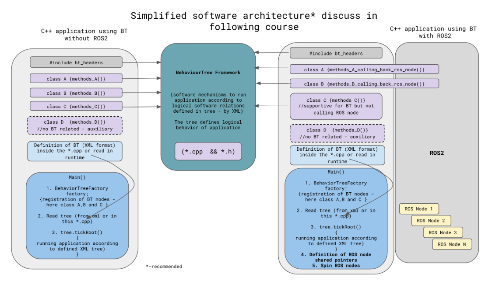
</div>

Como você pode ver, a estrutura BT pode ser executada sem o ROS.

* Nesse caso, o BT fornece mecanismos abstratos (construídos em C++) que permitem arquitetar seu BT e imaginar as conexões lógicas dentro de seu aplicativo. Por exemplo, suponha que você desenvolva um jogo. Nesse caso, o BT pode estar relacionado ao desempenho do jogo ou definir como os personagens do jogo se comportam em determinadas situações do jogo, etc. Nesse contexto, o framework BT fornece os mecanismos para suportar relações lógicas/abstratas entre as classes C++, cujos métodos são chamados de acordo com a estrutura da árvore lógica de sua aplicação.

* É simples. Considere a classe C++ como um nó ROS2 que interage com o ambiente ROS2 e seu robô. O ROS2 executando seu aplicativo BT pode incluir classes de função C++ auxiliares que suportam funções e não são chamadas diretamente da árvore lógica (considere a figura abaixo).

Enquanto o robô executa a tarefa, por exemplo, planejamento de caminho, considere várias ações a serem incorporadas ao seu programa. Primeiro, você deve saber sobre a posição e orientação do robô. Para obter sucesso com o cálculo do caminho, você deve conhecer a posição do objeto escolhido, o alvo. O cálculo de um caminho livre de colisões exige posições de obstáculos.

Todas essas informações podem ser subscritas/recebidas de outros módulos de sistema de robô do seu programa ou sensores de robô. Com essas informações, execute o algoritmo planejador de caminho adequado. Pode ser o `Dijkstra`, `A*`, `RRT` ou outro. Para acelerar o processo de busca do caminho sem colisão, incorpore diferentes heurísticas e execute seus algoritmos planejadores de caminho em diferentes unidades de destino, como `CPU`, `GPU` ou `FPGA`.

Uma descrição mais ou menos detalhada revela que a tarefa de planejamento de caminho compreende múltiplas atividades de baixo nível (módulos encapsulados de baixo nível).

Ao projetar um sistema de robô, ainda é importante considerar como os componentes fundamentais do robô (ações de baixo nível) executam as tarefas dadas e buscam otimização (por exemplo, aumentar o desempenho dos algoritmos de caminho adicionando heurísticas).

> No entanto, para construir a arquitetura de toda a aplicação do robô, passe para um nível mais alto de abstração de programação, ou seja, avaliando a tarefa como no exemplo, planejador de caminho como um componente simples (considere a figura abaixo).

A BT ganha arquitetos de robôs para orquestrar mapas de tomada de decisão para os aplicativos de robôs.

<div align="center">
     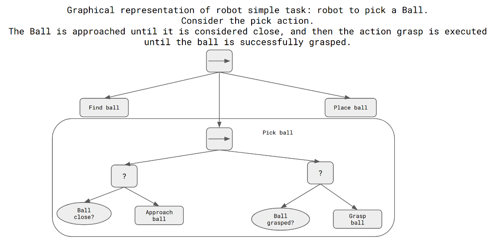
</div>

Os blocos BT representados serão formulados posteriormente. No entanto, o símbolo
⟶
   é considerada uma operação lógica AND (Sequência), pois o símbolo “?” define OR lógico (Fallback). Levando em consideração os operadores lógicos, você pode derivar como o robô se comporta. O robô deve primeiro encontrar, pegar e colocar a bola. As operações de picking requerem a execução de ações específicas.

Todas as ações abaixo do bloco Sequência devem ser bem-sucedidas para obter sucesso no “galho de uma árvore”. Para o bloco Fallback, no entanto, apenas uma ação deve ser bem-sucedida para encerrar (Succeed) a execução das ações (naquele ramo da árvore). Volte para a operação de separação. Você pode ver que a escolha requer duas ações para ter sucesso (Fallbacks). Se a bola estiver próxima e a bola agarrada for bem-sucedida, a ramificação (ação de coleta é concluída) e a operação de local pode ser continuada. A árvore executada terá sucesso se o último robô colocar a bola.

Considerando os conjuntos de componentes simples (tarefas), você pode facilmente compor e orquestrar o comportamento do Root enquanto interage com o ambiente e executa as tarefas planejadas.

O mapeamento das tarefas do robô no BT hierárquico traz uma oportunidade para (da perspectiva humana) compreensão e modelagem perfeitas de tarefas complexas do robô. Você pode imaginar que a construção de BT (mapeamento de tarefas em uma árvore hierárquica) é considerada programação de abstração de nível superior.

**Na introdução, o framework BehaviorTree.CPP**. Como é muito cedo para uma discussão profunda, recomendamos que você execute uma simulação em C++ do BT acima. Os detalhes serão dados na próxima unidade.

**Para arquitetar o BT do aplicativo do robô, primeiro, especifique o contexto lógico do aplicativo e modele conexões consistentes entre ações e comportamentos específicos do robô (detalhes posteriormente). O contexto lógico é expresso no arquivo XML**. A definição de nós, classes e funções são definidas no framework BehaviorTree.CPP. Dê uma olhada em como você define a lógica BT em XML.

> bt.cpp
```cpp
//"header" to BT - our software connection to BT framework
#include "behaviortree_cpp_v3/bt_factory.h"

using namespace BT;

/** Behavior Tree are used to create a logic to decide what
 * to "do" and when. 
 * The exercises as it was discussed and depicted in the
 * figure do not include a “connection” to ROS.
 * The action for the robot, in our case, is defined as a separate C++ class.
 */

//C++ classes defines robot actions/behaviors

//----------------Class ApproachBall---------------------------------------
class ApproachBall : public BT::SyncActionNode // we inherit the SyncActionNode - for synchronous behaviour
//later we inherit the AsyncActionNode instead to run action in asynchronous mode. Details later
{
  public:
    ApproachBall(const std::string& name) : BT::SyncActionNode(name, {})
    {
    }

    // You must override the virtual function tick()
    NodeStatus tick() override
    {
        //we just print on the terminal 
        std::cout << "ApproachBall: " << this->name() << std::endl; 
        //the action completes with SUCCESS, you can see below the action can "finish" with FAILURE
        return BT::NodeStatus::SUCCESS;
    }
};

//----------------Class FindBall------------------------------------------
class FindBall : public BT::SyncActionNode
{
  public:
    FindBall(const std::string& name) : BT::SyncActionNode(name, {})
    {
    }

    // You must override the virtual function tick()
    NodeStatus tick() override
    {
        std::cout << "FindBall: " << this->name() << std::endl;
        return BT::NodeStatus::SUCCESS;
    }
};

//----------------Class PlaceBall------------------------------------------
class PlaceBall : public BT::SyncActionNode
{
  public:
    PlaceBall(const std::string& name) : BT::SyncActionNode(name, {})
    {
    }

    // You must override the virtual function tick()
    NodeStatus tick() override
    {
        std::cout << "PlaceBall: " << this->name() << std::endl;
        return BT::NodeStatus::SUCCESS;
    }
};

//----------------Class GripperInterface------------------------------------------
class GripperInterface
{
  private:
    bool _opened;

  public:
    GripperInterface() : _opened(true)
    {
    }

    NodeStatus open()
    {
        _opened = true;
        std::cout << "GripperInterface::open" << std::endl;
        return BT::NodeStatus::SUCCESS;
    }

    NodeStatus close()
    {
        std::cout << "GripperInterface::close" << std::endl;
        _opened = false;
        return BT::NodeStatus::SUCCESS;
    }
};

BT::NodeStatus BallClose()
{
    std::cout << "[ Close to ball: NO ]" << std::endl;
    return BT::NodeStatus::FAILURE;
}

BT::NodeStatus BallGrasped()
{
    std::cout << "[ Grasped: NO ]" << std::endl;
    return BT::NodeStatus::FAILURE;
}

//definition of BT which reflects logical connection between robot actions
//-------------------------------------------------------------------------
//-------------------------------------------------------------------------
static const char* xml_text = R"(
 <root main_tree_to_execute = "MainTree" >

     <BehaviorTree ID="MainTree">
        <Sequence name="root_sequence">
            <FindBall   name="ball_ok"/>
                <Sequence>
                    <Fallback>
                        <BallClose   name="no_ball"/>
                        <ApproachBall    name="approach_ball"/>
                    </Fallback>
                    <Fallback>
                        <BallGrasped   name="no_grasp"/>
                        <GraspBall  name="grasp_ball"/>
                    </Fallback>
                </Sequence>
            <PlaceBall   name="ball_placed"/>
        </Sequence>
     </BehaviorTree>
 </root>
 )";
    
//-------------------------------------------------------------------------
//-------------------------------------------------------------------------

int main()
{
    // We use the BehaviorTreeFactory to register our custom nodes
    
    BehaviorTreeFactory factory;
    
    //Node registration process
    
    factory.registerNodeType<ApproachBall>("ApproachBall");
    factory.registerNodeType<FindBall>("FindBall");
    factory.registerNodeType<PlaceBall>("PlaceBall");

    // Registering a SimpleActionNode using a function pointer.
    // you may also use C++11 lambdas instead of std::bind
    //this method is not recommended so we are not going to use any more
    
    factory.registerSimpleCondition("BallClose", std::bind(BallClose));
    factory.registerSimpleCondition("BallGrasped", std::bind(BallGrasped));

    //You can also create SimpleActionNodes using methods of a class
    //this method is not recommended so we are not going to use any more
    
    GripperInterface gripper;
    factory.registerSimpleAction("GraspBall", std::bind(&GripperInterface::close, &gripper));

    // Trees are created at deployment-time (i.e. at run-time, but only once at the beginning).
    // The currently supported format is XML.
    // IMPORTANT: when the object "tree" goes out of scope, all the TreeNodes are destroyed
    auto tree = factory.createTreeFromText(xml_text);

    // To "execute" a Tree you need to "tick" it.
    // The tick is propagated to the children based on the logic of the tree.

    
    tree.tickRoot();

    return 0;
}
```
O arquivo XML que descreve o comportamento do robô (descrito acima) pode ser formulado.
```xml
 <root main_tree_to_execute = "MainTree" >

     <BehaviorTree ID="MainTree">
        <Sequence name="root_sequence">
            <FindBall   name="ball_ok"/>
                <Sequence>
                    <Fallback>
                        <BallClose   name="no_ball"/>
                        <ApproachBall    name="approach_ball"/>
                    </Fallback>
                    <Fallback>
                        <BallGrasped   name="no_grasp"/>
                        <GraspBall  name="grasp_ball"/>
                    </Fallback>
                </Sequence>
            <PlaceBall   name="ball_placed"/>
        </Sequence>
     </BehaviorTree>

 </root>
```
Agora, execute seu primeiro BT. Você usa a estrutura BehaviourTree.CPP (detalhes mais adiante) para modelar o comportamento do robô. O arquivo XML que formula o nível lógico de abstração é incorporado ao código C++.

Antes de poder executar o BT, você precisará construir o script.
```bash
cd ~/ros2_ws/src/bt_course_files/BehaviorTree.CPP
mkdir build && cd build
cmake ..
make
```
Execute o programa e avalie o resultado. Considere o diagrama BT.
```bash
source ~/ros2_ws/install/setup.bash
./bt
```
> Output
```bash

FindBall: ball_ok
[ Close to ball: NO ]
ApproachBall: approach_ball
[ Grasped: NO ]
GripperInterface::close
PlaceBall: ball_placed
```
* A tarefa do robô pode ser compreendida como uma tarefa sequencial - a análoga é uma função lógica AND.
* O robô procura a bola.
* O robô encontra a bola, então o nó imprime: ball_ok.
* A próxima tarefa do robô é pegar a bola.
* Como você pode ver, esta tarefa consiste em duas subtarefas. A bola não é visível para o robô (a bola não está perto) - a impressão do nó [ Close to the ball: NO ].
* A condição acima não é satisfeita; portanto, o robô executa positivamente: Aproximar tarefa de bola e o nó produz ApproachBall: abordagem_bola.
* Da mesma forma, o robô analisa se a bola é agarrada. (Imagine que a garra do robô está equipada com sensores dedicados). Aqui, o robô detectou que a bola não foi agarrada, então o nó imprime: [Pegou: NÃO].
Depois de executar a tarefa Graspball, o nó produz GripperInterface::close.
* A Sequência retorna VERDADEIRO.
* A tarefa PlaceBall pode ser executada, então a mensagem é impressa PlaceBall: ball_placed.

## Conceito de Árvores Comportamentais

**Introduzimos um conceito de abstração de alto nível no domínio do software robótico. Portanto, é razoável elaborar sobre a localização dessa abstração. Você pode considerar a pilha de abstração a seguir e reassumir suas suposições anteriores.** 

* Os seres humanos ficam no topo desta pilha. Os requisitos para a aplicação do robô diminuem. Usando um conjunto herdado de habilidades e conceitos de BT, os humanos podem arquitetar o raciocínio lógico do aplicativo de robô necessário.
* Os humanos usam árvores de comportamento para modelar a conexão lógica entre as tarefas do robô. Posteriormente, você aprenderá que o modelo é executado em um arquivo XML. Abaixo da abstração lógica, você enfrenta a implementação de BTs.

<div align="center">
     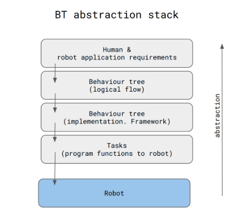
</div>

Seguindo a configuração e transições do programa do robô, você pode especificar que o BT organize as transições de agentes autônomos (robôs) entre tarefas (componentes simples).

BT é formalmente definido como uma árvore raiz direcionada com nós centrais chamados nós de fluxo de controle e nós folhas chamados nós de execução. Você emprega a linguagem usual de pai e filho para cada nó conectado. A Raiz é o único nó sem pais; os outros nós têm um pai. Há pelo menos um filho em cada nó de fluxo de controle. Os filhos de um nó são mostrados graficamente abaixo.

A estrutura BehaviorTree.CPP será amplamente discutida na próxima unidade. Aqui, no entanto, você define um componente BT simples e descreve implementações C++ que podem ser executadas em seu shell da web (terminal).

Agora, defina o primeiro bloco BT: Sequência.

<div align="center">
     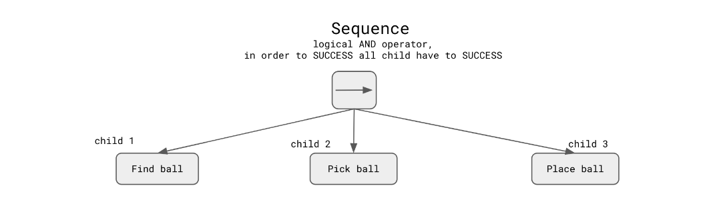
</div>

Dê uma olhada no fluxo de tick e callback e estude os seguintes diagramas:

<div align="center">
     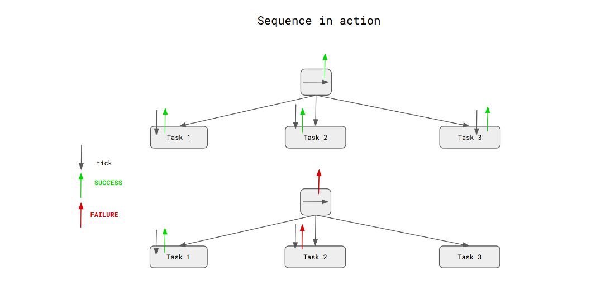
</div>

O XML: descrevendo o comportamento do robô (nó Sequence) pode ser formulado. 

```xml
<root main_tree_to_execute = "MainTree" >

     <BehaviorTree ID="MainTree">
        <Sequence name="root_sequence">
            <RobotTask1   name="task1"/>
            <RobotTask2   name="task2"/>
            <RobotTask3   name="task3"/>
        </Sequence>
     </BehaviorTree>

 </root>
```
> bt2.cpp
```cpp
#include "behaviortree_cpp_v3/bt_factory.h"

using namespace BT;


class RobotTask1 : public BT::SyncActionNode
{
  public:
    RobotTask1(const std::string& name) : BT::SyncActionNode(name, {})
    {
    }

    // You must override the virtual function tick()
    NodeStatus tick() override
    {
        std::cout << "RobotTask1: " << this->name() << std::endl;
        return BT::NodeStatus::FAILURE;
    }
};

class RobotTask2 : public BT::SyncActionNode
{
  public:
    RobotTask2(const std::string& name) : BT::SyncActionNode(name, {})
    {
    }

    // You must override the virtual function tick()
    NodeStatus tick() override
    {
        std::cout << "RobotTask2: " << this->name() << std::endl;
        return BT::NodeStatus::SUCCESS;
    }
};

class RobotTask3 : public BT::SyncActionNode
{
  public:
    RobotTask3(const std::string& name) : BT::SyncActionNode(name, {})
    {
    }

    // You must override the virtual function tick()
    NodeStatus tick() override
    {
        std::cout << "RobotTask3: " << this->name() << std::endl;
        return BT::NodeStatus::SUCCESS;
    }
};

static const char* xml_text = R"(

 <root main_tree_to_execute = "MainTree" >

     <BehaviorTree ID="MainTree">
        <Sequence name="root_sequence">
            <RobotTask1   name="task1"/>
            <RobotTask2   name="task2"/>
            <RobotTask3   name="task3"/>
        </Sequence>
     </BehaviorTree>

 </root>
 )";

// clang-format on

int main()
{
    // We use the BehaviorTreeFactory to register our custom nodes
    BehaviorTreeFactory factory;

    factory.registerNodeType<RobotTask1>("RobotTask1");
    factory.registerNodeType<RobotTask2>("RobotTask2");
    factory.registerNodeType<RobotTask3>("RobotTask3");

    // Trees are created at deployment-time (i.e. at run-time, but only once at the beginning).
    // The currently supported format is XML.
    // IMPORTANT: when the object "tree" goes out of scope, all the TreeNodes are destroyed
    auto tree = factory.createTreeFromText(xml_text);

    // To "execute" a Tree you need to "tick" it.
    // The tick is propagated to the children based on the logic of the tree.
    // In this case, the entire sequence is executed, because all the children
    // of the Sequence return SUCCESS.
    tree.tickRoot();

    return 0;
}

```
Execute no Shell:
```bash
source ~/ros2_ws/install/setup.bash
./bt2
```
> Output
```bash
RobotTask1: task1
```
Imagine que o robô execute três tarefas: encontre a bola, pegue a bola e coloque a bola - denominadas tarefa1, tarefa2 e tarefa3, respectivamente.
Aqui, as tarefas devem terminar com sucesso a tarefa “principal”.
Neste exemplo, apenas a primeira tarefa é BEM-SUCEDIDA e imprime RobotTask1: task1.
A segunda tarefa é FALHA (não imprime texto) e a Sequência é FALHA.

Embora a estrutura `BehaviourTree.CPP` seja discutida posteriormente, observe a implementação de software do nó Sequencial (operador AND). Brinque com as bandeiras para a tarefa do robô e alterne entre FALHA e SUCESSO. Em seguida, compare a saída. Como você pode ver, a primeira falha no nó filho encerra a sequência. Para ter sucesso na Sequência, todos os nós devem retornar SUCCESS.

Um BT começa com o nó Raiz, que fornece sinais que permitem a execução de um nó chamado ticks com uma frequência específica, que é enviada para seus filhos. Se e somente se um nó receber ticks, ele é executado. Se a execução estiver em andamento, o filho retorna instantaneamente Corrida para o pai, Sucesso se a meta foi atingida e Falha, caso contrário.

Existem quatro nós de fluxo de controle na formulação clássica (Sequência, Fallback, Paralelo e Decorador) e dois tipos de nós de execução (Ação e Condição).

O nó Sequence executa um algoritmo equivalente a rotear ticks para seus filhos da esquerda até encontrar um filho que retorne Falha ou Em execução, então ele retorna Falha ou Em execução para seu pai. Ele só retorna Sucesso se todos os seus filhos também retornarem Sucesso. Deve-se observar que quando um filho retorna Running ou Failure, o nó Sequence não encaminha os ticks para o próximo filho (se houver). Para simplificar, o nó Sequência pode ser considerado uma função AND lógica.

```cpp
#Do not run the cell

BT::NodeStatus RobotTask1::tick()
{
    std::cout << "RobotTask1: " << this->name() << std::endl;
    return BT::NodeStatus::FAILURE;
}

BT::NodeStatus RobotTask2::tick()
{
    std::cout << "RobotTask2: " << this->name() << std::endl;
    return BT::NodeStatus::FAILURE;
}

BT::NodeStatus RobotTask3::tick()
{
    std::cout << "RobotTask3: " << this->name() << std::endl;
    return BT::NodeStatus::SUCCESS;
```
Abaixo, veja uma definição do próximo bloco BT: Fallback.

<div align="center">
     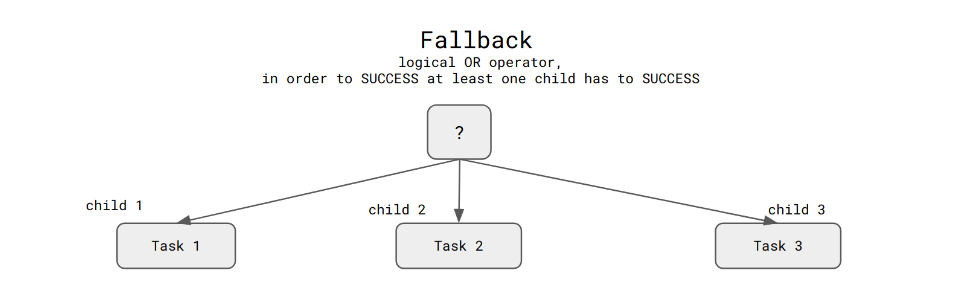
</div>

O nó `Fallback` conduz um algoritmo, que consiste em enviar os ticks para seus filhos da esquerda até localizar um filho que retorne Success ou Running. Em seguida, ele envia Success ou Running para seu pai de acordo com essa descoberta. Se e somente se todos os seus filhos também retornarem Falha, ele retornará Falha. Observe que quando um filho retorna `Running ou Success`, o nó `Fallback` não transmite os ticks para o filho subsequente (se houver), seja `Running ou Success`.

Seguindo essa abordagem simples, considere o nó Fallback uma função OR lógica.

Dê uma olhada no fluxo de tick e callback. Estude os seguintes esquemas:

<div align="center">
     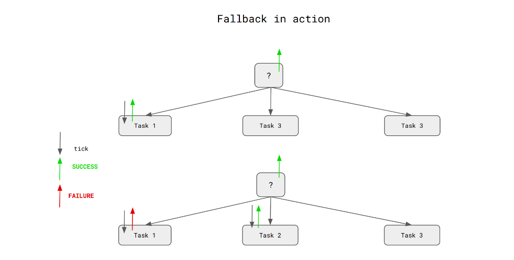
</div>

O XML que descreve o comportamento do robô (nó Fallback) pode ser formulado da seguinte forma:
```xml
 <root main_tree_to_execute = "MainTree" >

     <BehaviorTree ID="MainTree">
        <Fallback name="root_sequence">
            <RobotTask1   name="task1"/>
            <RobotTask2   name="task2"/>
            <RobotTask3   name="task3"/>
        </Fallback>
     </BehaviorTree>

 </root>
```
> bt3.cpp
```cpp
#include "behaviortree_cpp_v3/bt_factory.h"

using namespace BT;


class RobotTask1 : public BT::SyncActionNode
{
  public:
    RobotTask1(const std::string& name) : BT::SyncActionNode(name, {})
    {
    }

    // You must override the virtual function tick()
    NodeStatus tick() override
    {
        std::cout << "RobotTask1: " << this->name() << std::endl;
        return BT::NodeStatus::FAILURE;
    }
};

class RobotTask2 : public BT::SyncActionNode
{
  public:
    RobotTask2(const std::string& name) : BT::SyncActionNode(name, {})
    {
    }

    // You must override the virtual function tick()
    NodeStatus tick() override
    {
        std::cout << "RobotTask2: " << this->name() << std::endl;
        return BT::NodeStatus::SUCCESS;
    }
};

class RobotTask3 : public BT::SyncActionNode
{
  public:
    RobotTask3(const std::string& name) : BT::SyncActionNode(name, {})
    {
    }

    // You must override the virtual function tick()
    NodeStatus tick() override
    {
        std::cout << "RobotTask3: " << this->name() << std::endl;
        return BT::NodeStatus::SUCCESS;
    }
};
static const char* xml_text = R"(

 <root main_tree_to_execute = "MainTree" >

     <BehaviorTree ID="MainTree">
        <Fallback name="root_sequence">
            <RobotTask1   name="task1"/>
            <RobotTask2   name="task2"/>
            <RobotTask3   name="task3"/>
        </Fallback>
     </BehaviorTree>

 </root>
 )";

int main()
{
    // We use the BehaviorTreeFactory to register our custom nodes
    BehaviorTreeFactory factory;

    factory.registerNodeType<RobotTask1>("RobotTask1");
    factory.registerNodeType<RobotTask2>("RobotTask2");
    factory.registerNodeType<RobotTask3>("RobotTask3");

    auto tree = factory.createTreeFromText(xml_text);

    tree.tickRoot();

    return 0;
}

```
Execute no Shell:
```bash
source ~/ros2_ws/install/setup.bash
./bt3
```
> Output
```bash
RobotTask1: task1
RobotTask2: task2
```
Neste exemplo, imagine que o robô tenha que executar três tarefas - task1, task2 e task3.
Aqui apenas uma tarefa tem que ser SUCESSO para retornar com SUCESSO do nó Fallback (esta é uma função lógica OU).
Neste exemplo, o primeiro nó retorna FALHA e imprime RobotTask1: task1.
Se task2 for SUCCESS, o nó imprimirá RobotTask2: task2 e o Fallback será SUCCESS. (O robô não executa a task3).

## BT em Ação
Aqui, considere o BT simples e entenda o fluxo do sinal. Como você se lembra, um sinal de "tick" é transmitido da raiz da árvore e percorre a árvore até atingir um nó de folha.

O retorno de chamada de um TreeNode é executado quando recebe um sinal de tick. Esse retorno de chamada tem três resultados possíveis. A atividade é SUCCESS, FAILURE ou ainda RUNNING.

O exemplo a seguir exibe o "recurso" do BT ainda não discutido. A estrutura BehaviorTree.CPP será amplamente discutida na próxima unidade. Antes, porém, é importante mencionar que a ação "comer banana" retorna um callback: RUNNING, que, neste caso, reflete o processo de alimentação e requer tempo. Portanto, chamamos essa ação de Ação Assíncrona. Geralmente, essa funcionalidade BT é obtida pela implementação de um nó assíncrono em execução em um thread separado.

Na seção seguinte, é crucial entender o contexto básico e lógico.

<div align="center">
     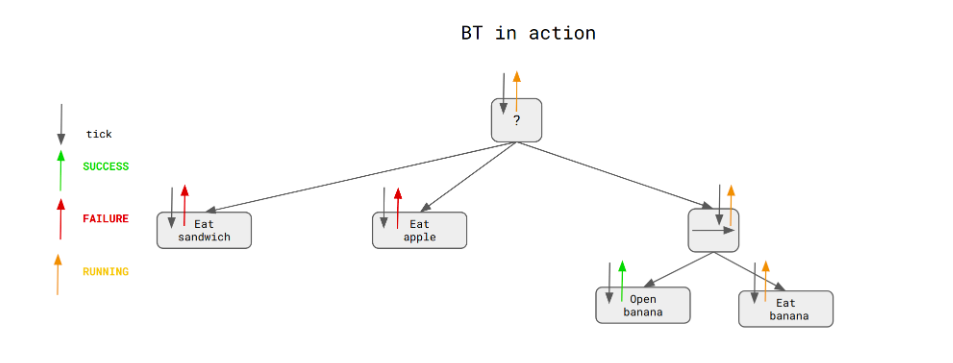
</div>

O XML que descreve a lógica do BT descrito acima pode ser formulado.
```xml
 <root main_tree_to_execute = "MainTree" >

     <BehaviorTree ID="MainTree">
        <ReactiveFallback name="root">
            <EatSandwich name="eat_sandwich"/>
            <EatApple name="eat_apple"/>
            <Sequence>
                <OpenBanana name="open_banana"/>
                <EatBanana       goal="1;2;3"/>
                <SaySomething   message="banan is gone!" />
            </Sequence>
        </ReactiveFallback>
     </BehaviorTree>

 </root>
```
> bt4.cpp
```cpp
#include "behaviortree_cpp_v3/bt_factory.h"

using namespace BT;

class EatSandwich : public BT::SyncActionNode
{
  public:
    EatSandwich(const std::string& name) : BT::SyncActionNode(name, {})
    {
    }

    // You must override the virtual function tick()
    NodeStatus tick() override
    {
        std::cout << "EatSandwich: " << this->name() << std::endl;
        return BT::NodeStatus::FAILURE;
    }
};

class EatApple : public BT::SyncActionNode
{
  public:
    EatApple(const std::string& name) : BT::SyncActionNode(name, {})
    {
    }

    // You must override the virtual function tick()
    NodeStatus tick() override
    {
        std::cout << "EatApple: " << this->name() << std::endl;
        return BT::NodeStatus::FAILURE;
    }
};

class OpenBanana : public BT::SyncActionNode
{
  public:
    OpenBanana(const std::string& name) : BT::SyncActionNode(name, {})
    {
    }

    // You must override the virtual function tick()
    NodeStatus tick() override
    {
        std::cout << "OpenBanana: " << this->name() << std::endl;
        return BT::NodeStatus::SUCCESS;
    }
};

class EatAction : public BT::AsyncActionNode
{
  public:
    // Any TreeNode with ports must have a constructor with this signature
    EatAction(const std::string& name, const BT::NodeConfiguration& config)
      : AsyncActionNode(name, config)
    {
    }

    // It is mandatory to define this static method.
    static BT::PortsList providedPorts()
    {
        return {};
    }

    BT::NodeStatus tick() override
    {
        printf("[ EatBanana: STARTED ]");

        _halt_requested.store(false);
        int count = 0;

        // Pretend that "computing" takes 250 milliseconds.
        // It is up to you to check periodically _halt_requested and interrupt
        // this tick() if it is true.
        while (!_halt_requested && count++ < 25)
        {
            std::this_thread::sleep_for(std::chrono::milliseconds(10));
        }

        std::cout << "[ EatBanana: FINISHED ]" << std::endl;
        return _halt_requested ? BT::NodeStatus::FAILURE : BT::NodeStatus::SUCCESS;
    }

    virtual void halt() override;

  private:
    std::atomic_bool _halt_requested;
};

void EatAction::halt()
{
    _halt_requested.store(true);
}

class SaySomething : public BT::SyncActionNode
{
  public:
    SaySomething(const std::string& name, const BT::NodeConfiguration& config)
      : BT::SyncActionNode(name, config)
    {
    }

    // You must override the virtual function tick()
    NodeStatus tick() override
    {
        auto msg = getInput<std::string>("message");
        if (!msg)
        {
            throw BT::RuntimeError("missing required input [message]: ", msg.error());
        }

        std::cout << "Robot says: " << msg.value() << std::endl;
        return BT::NodeStatus::SUCCESS;
    }

    // It is mandatory to define this static method.
    static BT::PortsList providedPorts()
    {
        return {BT::InputPort<std::string>("message")};
    }
};

static const char* xml_text_reactive = R"(

 <root main_tree_to_execute = "MainTree" >

     <BehaviorTree ID="MainTree">
        <ReactiveFallback name="root">
            <EatSandwich name="eat_sandwich"/>
            <EatApple name="eat_apple"/>
            <Sequence>
                <OpenBanana name="open_banana"/>
                <EatBanana  name="eat_banana"/>
                <SaySomething   message="mission completed!" />
            </Sequence>
        </ReactiveFallback>
     </BehaviorTree>

 </root>
 )";

// clang-format on

void Assert(bool condition)
{
    if (!condition)
        throw RuntimeError("this is not what I expected");
}

int main()
{
    using std::chrono::milliseconds;

    BehaviorTreeFactory factory;

    factory.registerNodeType<EatSandwich>("EatSandwich");
    factory.registerNodeType<EatApple>("EatApple");
    factory.registerNodeType<OpenBanana>("OpenBanana");
    factory.registerNodeType<EatAction>("EatBanana");
    factory.registerNodeType<SaySomething>("SaySomething");

    std::cout << "\n------------ BUILDING A NEW TREE ------------" << std::endl;

    auto tree = factory.createTreeFromText(xml_text_reactive);

    NodeStatus status;

    std::cout << "\n--- 1st executeTick() ---" << std::endl;
    status = tree.tickRoot();
    Assert(status == NodeStatus::RUNNING);

    std::this_thread::sleep_for(std::chrono::milliseconds(150));
    std::cout << "\n--- 2nd executeTick() ---" << std::endl;
    status = tree.tickRoot();
    Assert(status == NodeStatus::RUNNING);

    std::this_thread::sleep_for(std::chrono::milliseconds(150));
    std::cout << "\n--- 3rd executeTick() ---" << std::endl;
    status = tree.tickRoot();
    Assert(status == NodeStatus::SUCCESS);

    std::cout << std::endl;

    // }

    return 0;
}
```
Execute o programa a seguir e entenda o diagrama e o XML. Observe que o seguinte tipo de BT será discutido e analisado na próxima unidade.
```bash
source ~/ros2_ws/install/setup.bash
./bt4
```
> Output 
```bash
------------ BUILDING A NEW TREE ------------

--- 1st executeTick() ---
EatSandwich: eat_sandwich
EatApple: eat_apple
OpenBanana: open_banana
[ EatBanana: STARTED ]
--- 2nd executeTick() ---
EatSandwich: eat_sandwich
EatApple: eat_apple
[ EatBanana: FINISHED ]

--- 3rd executeTick() ---
EatSandwich: eat_sandwich
EatApple: eat_apple
Robot says: banan is gone!
- Short Output Analysis -
```
Derivando essa filosofia BT, você pode descrever as obras BT considerando o seguinte exemplo:

* BT consiste em quatro ações, Fallback e Sequence.
* Comece a partir de um Root que envia o tick para aquele Fallback. Siga a regra do lado esquerdo. Fallback envia um carrapato para “sanduíche” - você tem um sanduíche para comer?. Não. Portanto, o retorno de chamada retorna Falha.
* Seguindo a lógica do Fallback, o próximo tick é enviado para apple. Você tem uma maçã para comer? Não. Como anteriormente, o retorno de chamada retorna Falha. O Fallback não pode enviar o retorno de chamada positivo para Root, então ele continua.
* Agora o tick é enviado para Sequence. Sequence envia um tick para abrir uma banana e receber Success (a banana está aberta), mas a Sequence é uma operação AND lógica, então você continua.
* Em seguida, o carrapato é enviado para comer uma banana. Como o processo leva tempo, o retorno de chamada para Root está em execução.

## Notação do Nó BT
Um comando é executado por um nó de ação sempre que recebe ticks. Se a ação for realizada com sucesso, retorna Success; caso contrário, retorna Falha. Por fim, a ação retorna Running enquanto ainda está em andamento.

Um nó de condição avalia uma proposição cada vez que recebe um tick. Então, dependendo se a proposição é verdadeira, ela retorna Sucesso ou Falha. Lembre-se de que um nó Condition nunca retorna o status em execução.

<div align="center">
     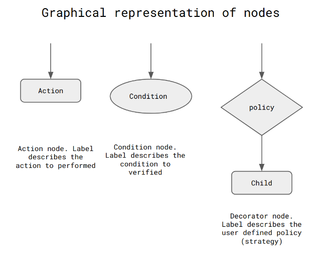
</div>

O nó Decorator é um nó de fluxo de controle com um único filho que marca seletivamente o filho de acordo com algumas regras estabelecidas e modifica o status de retorno de seu filho de acordo com uma regra definida pelo usuário. Por exemplo, um decorador invertido inverte o status Sucesso/Falha do filho. Um decorador max-N-tries só permite que o filho falhe N vezes antes de retornar Falha sem assinalar o filho, e um decorador max-T-sec permite apenas que o filho execute por T segundos antes de retornar Falha sem assinalar o filho.

**A tabela a seguir condensa e define o raciocínio lógico dos nós BT.**

<div align="center">
     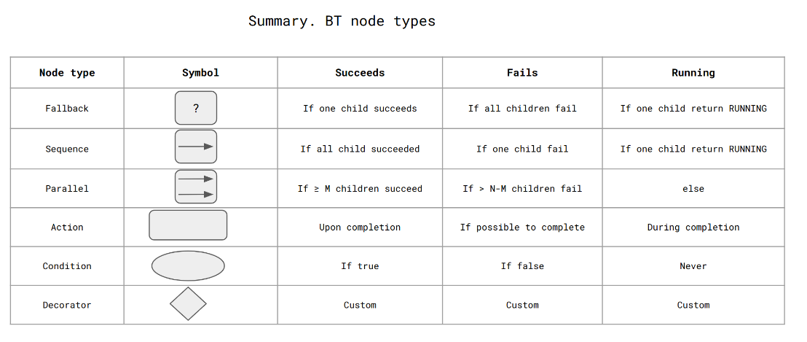
</div>

## Abordagem para BT

**A seção anterior definiu os nós de comportamento lógico comuns usados durante a arquitetura de BT para aplicativos de robô (tarefas). Agora, tente entender o principal motivo pelo qual o BT está ganhando popularidade nos domínios da robótica, jogos e inteligência artificial.**

Embora os BTs tenham ganhado popularidade nos últimos anos, as Finite State Machines (FSMs) ainda são um dos paradigmas mais conhecidos para definir o comportamento de robôs ou agentes de software.

Para ser consistente, lembre-se do conceito simples de uma máquina de estado finito. Um FSM é baseado em uma máquina abstrativa (virtual) com um ou mais estados. A máquina alterna entre os estados para realizar várias tarefas porque apenas um estado pode estar ativo.

Ao implementar algoritmos, robótica ou jogos, os FSMs são frequentemente usados para estruturar e descrever um fluxo de execução. Um FSM, por exemplo, pode ser usado para criar o “cérebro” do robô. Geralmente, o FSM ajuda a arquitetar o aplicativo do robô a partir do nível de abstração mais alto. Cada estado corresponde às ações do robô (considere a figura abaixo) o que permite realizar ações dedicadas a este estado. Você também pode afirmar que o robô é observável, o que significa que em cada carimbo de data/hora, você conhece o estado do robô. O robô que segue o fluxo FSM é previsível, no que diz respeito às ações que o robô realiza e às transições que o robô é capaz de realizar.

Um grafo pode representar FSMs, com os nós denotando os estados e as arestas denotando as transições. Cada aresta possui um rótulo indicando quando a transição deve ocorrer. Por exemplo, em relação à figura, você pode diferenciar vários estados do robô, como se aproximar da bola, agarrar a bola ou esperar por ajuda.

<div align="center">
     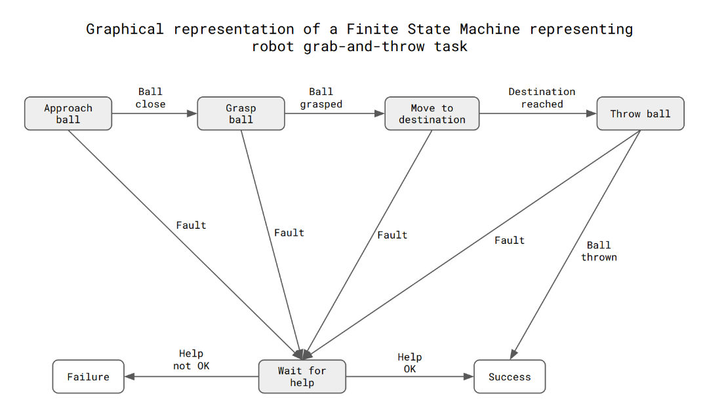
</div>

## Desafios com FSMs, transição para BTs

Numerosos problemas afetam os FSMs e surgem em situações do mundo real se houver transições suficientes entre estado e condições.

* Pode haver transições de estado NxN em um FSM com N estados.
* Como o contexto de execução afeta o número de estados, N pode aumentar rapidamente.
* Todos os outros estados que fizeram a transição para o estado novo ou antigo devem alterar suas condições quando um novo estado é adicionado ou removido.
* Os estados estão fortemente conectados, o que afeta como os estados podem ser reutilizados.

* As representações gráficas e verbais do comportamento completo tornam-se muito complicadas para o designer compreender quando o número de estados é suficientemente grande.

Não os computadores, mas principalmente as pessoas, são afetados por esses problemas. Por exemplo, uma enorme máquina de estado pode ser facilmente manuseada por um interpretador de software, mas uma pessoa sem dúvida achará difícil compreender e prever o comportamento geral do sistema.

**Em outras palavras, o problema fundamental com o FSM é que ele logo se torna incontrolável à medida que o número de estados aumenta devido à carga cognitiva enfrentada pelos desenvolvedores, mais notavelmente pelos Designers Comportamentais.**

A maioria desses problemas é resolvida pelos BTs, que aprimoram a modularidade e podem ser reutilizados. Eles são, por natureza, hierárquicos.

* Qualquer subárvore fornece uma ação possivelmente reutilizável de uma perspectiva semântica.
* O desenvolvedor pode utilizar e expandir a linguagem fornecida pela BT para aplicar padrões de design populares.
* O fato de a hierarquia ser ordenada de cima para baixo e a precedência dos nós da esquerda para a direita facilita a "leitura" das representações textuais e gráficas.
* BT geralmente usa Ações em oposição a Estados (como em FSMs); essa estratégia está mais de acordo com o "modelo conceitual" usado para definir o comportamento e as interfaces de software fornecidas pelas arquiteturas orientadas a serviços.

As figuras abaixo mostram como o mesmo exemplo pode ser mais facilmente usando BTs.

Os nós onde a Detecção de Obstáculos é implementada podem ser um DecoratorNode, que só executará seu nó filho se a condição interna for satisfeita, ou um ConditionNode, que é uma folha da árvore que pode retornar `SUCCESS` ou `FAILURE`.

<div align="center">
     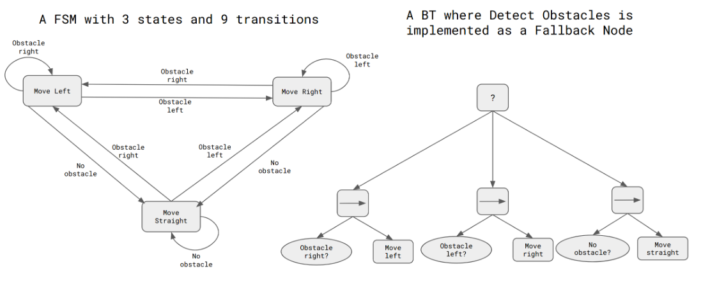
</div>

## Principais Vantagens do BT

Conforme discutido anteriormente, vários benefícios resultam de BTs serem modulares e reativos. Listamos alguns benefícios do BT abaixo.

* `Modular`: Um sistema modular refere-se à facilidade com que suas partes podem ser desmontadas em unidades menores e depois remontadas.

Um sistema modular pode ser criado, implementado, testado e reutilizado, um módulo por vez. As vantagens da modularidade, portanto, aumentam com a complexidade do sistema, permitindo uma estratégia de dividir e conquistar em todo o projeto, implementação e teste.

Como cada subárvore de uma BT pode ser percebida como um módulo, as BTs são modulares em todos os tamanhos, desde as subárvores mais altas até as folhas da árvore.

* `Organização hierárquica`: Uma arquitetura de controle é hierárquica se possui muitas camadas de tomada de decisão (seguindo a estrutura em árvore).

* `Código reutilizável`: ter um código reutilizável é muito importante em qualquer projeto grande, complexo e de longo prazo. A capacidade de reutilizar projetos depende da construção de coisas maiores a partir de peças menores e da independência da entrada e saída dessas peças. Para permitir a reutilização de código, cada módulo deve interagir com a arquitetura de controle de forma clara e bem definida.

BTs permitem código reutilizável, pois, dada a implementação adequada, qualquer subárvore pode ser reutilizada em vários locais de um BT. Além disso, ao escrever o código de um nó folha, o desenvolvedor precisa retornar o status de retorno correto, que é universalmente predefinido como Running, Success ou Failure.

* `Reatividade`: Por reativo, entendemos a capacidade de responder às mudanças de maneira oportuna e eficaz. Os planos que foram gerados off-line e posteriormente executados em um loop aberto são frequentemente propensos a falhas em configurações não estruturadas, onde os resultados das ações são incertos e os atores externos modificam continuamente o estado do mundo. Os BTs são reativos porque um loop fechado é executado devido à criação contínua dos ticks e à travessia da árvore. De acordo com o percurso dos ticks, que é baseado nos status de retorno dos nós folha, as ações são executadas e canceladas. O ambiente está estreitamente associado aos nós de folha (por exemplo, os nós de condição avaliam as qualidades gerais do sistema (sensores completos). Em contraste, os nós de ação relatam Falha/Sucesso se a ação foi bem-sucedida ou malsucedida). Os BTs são, portanto, muito sensíveis às mudanças ambientais.

* `Legível para pessoas`: quando um trabalho é criado por humanos, é essencial ter uma estrutura legível para reduzir o custo de desenvolvimento e solução de problemas. A estrutura precisa continuar a ser compreensível, mesmo para grandes sistemas. A legibilidade humana requer uma estrutura coerente e compacta.

Por causa de sua modularidade e estrutura semelhante a uma árvore, os BTs são legíveis por humanos.

Você aprenderá como construir esse BT.

* Agora, imagine o robô parado, e sua missão é virar à esquerda.
* O robô é equipado com um laser que escaneia o ambiente e detecta obstáculos.
* Primeiro, o robô recebe informações para girar 45 graus. O robô pode continuar sua viagem nessa direção se houver um caminho livre de colisões. Caso contrário, o robô gira 90 graus e verifica novamente o obstáculo.
* Se houver uma colisão (detectada pelo laser), o robô gira até os 135 graus finais e se move nessa direção desde que não haja colisão.

Esta simulação exibe o comportamento do nó Fallback. O robô continua verificando as opções de movimento se o callback for `FAILURE`. Uma vez que é `SUCCESS`, todo o nó é `SUCCESS`.

Conforme descrito acima, o comportamento do robô é o padrão. Se você remover um obstáculo (por exemplo, na direção de 90 graus), o robô se moverá nessa direção.

Ao executar a simulação, observe o comportamento de falha. O robô não se move depois de encontrar um caminho livre de obstáculos. Melhore o formato BT - XML e incorpore o comportamento de movimento ausente do robô. Modifique o arquivo CPP discutido. Você encontrará a resposta no final da unidade. Lembre-se de compilar o arquivo modificado executando o comando colcon build.

> test2.cpp
```cpp
//we need to include header both for BT and ROS2
//there are also includes to the standard C++ libraries
//----------------------------------------------------------------------------------
#include <behaviortree_ros2/bt_action_node.hpp>
#include <iostream>
#include <rclcpp/executors.hpp>
#include <rclcpp/rclcpp.hpp>

#include "behaviortree_cpp_v3/basic_types.h"
#include "behaviortree_cpp_v3/tree_node.h"
#include "std_msgs/msg/string.hpp"
#include <atomic>
#include <chrono>
#include <cmath>
#include <functional>
#include <memory>
#include <string>
#include <thread>

#include "geometry_msgs/msg/twist.hpp"
#include "nav_msgs/msg/odometry.hpp"
#include "sensor_msgs/msg/laser_scan.hpp"
#include <geometry_msgs/msg/pose_stamped.hpp>
#include <tf2_geometry_msgs/tf2_geometry_msgs.h>

#include "behaviortree_cpp_v3/loggers/bt_file_logger.h"

using namespace std::chrono_literals;
using std::chrono::milliseconds;
using std::placeholders::_1;
std::atomic_bool switchActive{true};

using namespace BT;

//------------------------------------------------------------------------------------
//IMPORTANT!!
//Auxiliary variables that hold the data from the subscriber
//and later can be delivered to the BT node
//BESIDE subscriber and BT node are defined in the same class!!! 

float data1;
float data2;
float robotAngle;
//-------------------------------------------------------------------------------------

// we have 5 robot actions - 5 ROS2 nodes: Laser, Print, Move robot, Stop Robot and Rotate Robot
// the "architecture" of all included ROS nodes is the same
//-------------------------------------------------------------------------------------
//------------------------------LASER--------------------------------------------------
//-------------------------------------------------------------------------------------

// standard ROS2 node with BT: public BT::SyncActionNode
class ReadingLaser : public BT::SyncActionNode, public rclcpp::Node {

private:
  rclcpp::Subscription<sensor_msgs::msg::LaserScan>::SharedPtr subscription_;

  void topic_callback(const sensor_msgs::msg::LaserScan::SharedPtr _msg) {

    data2 = _msg->ranges[100];
    data1 = _msg->ranges[0];
  }

public:
    
//Node constructor 
//See how we define the subscriber. We use lambda function which "provide mechanism"
// to collect data and later reuse data in BT node.

  ReadingLaser(const std::string &name, const BT::NodeConfiguration &config)
      : BT::SyncActionNode(name, config), Node("scanner_node") {
    auto sensor_qos = rclcpp::QoS(rclcpp::SensorDataQoS());

    subscription_ = this->create_subscription<sensor_msgs::msg::LaserScan>(
        "/scan", sensor_qos,
        [&](const sensor_msgs::msg::LaserScan::SharedPtr msg) {
          topic_callback(msg);
        });
  }
// As previously.  
// You must override the virtual function tick()
  BT::NodeStatus tick() override {

    RCLCPP_INFO(this->get_logger(), "This is a tick()-------");
    RCLCPP_INFO(this->get_logger(), "NODE : LASER DATA ===>: '%f' '%f'", data1,
                data2);
    // 200 readings, from right to left, from -57 to 57 degress
    // calculate new velocity cmd
    float min = 10;
    float current;
    for (int i = 0; i < 200; i++) {
      current = data1;
      if (current < min) {
        min = current;
      }
    }

    std::this_thread::sleep_for(std::chrono::seconds(1));
    return data1 > 3 ? NodeStatus::SUCCESS : NodeStatus::FAILURE;
  }
  // Each Node can include port IN/OUT for "communication" between BT node
  // and BlackBoard. Dateil will be proivided later
  //Here all is empty 

  static BT::PortsList providedPorts() { return {}; }
};

//-------------------------------------------------------------------------------------
//------------------------------PRINT--------------------------------------------------
//-------------------------------------------------------------------------------------

class PrintValue : public BT::SyncActionNode, public rclcpp::Node {
private:
  rclcpp::TimerBase::SharedPtr timer_;
  rclcpp::Publisher<std_msgs::msg::String>::SharedPtr publisher_;
  size_t count_;

public:
  PrintValue(const std::string &name, const BT::NodeConfiguration &config)
      : BT::SyncActionNode(name, config), Node("minimum_publisher") {}

  void timer_callback() {
    auto message = std_msgs::msg::String();
    message.data = "Hello, world! 11111" + std::to_string(count_++);
    RCLCPP_INFO(this->get_logger(), "Publishing:111111 '%s'",
                message.data.c_str());
    publisher_->publish(message);
  }

  BT::NodeStatus tick() override {
    std::string msg;
    if (getInput("message", msg)) {
      std::cout << "PrintValue: " << msg << std::endl;
      //------------------------------------------------------------
      publisher_ = this->create_publisher<std_msgs::msg::String>("topicX", 10);
      auto message = std_msgs::msg::String();
      message.data = "Hello, world 222222! " + std::to_string(count_++);
      RCLCPP_INFO(this->get_logger(), "Publishing: 22222'%s'",
                  message.data.c_str());
      publisher_->publish(message);

      return NodeStatus::SUCCESS;
    } else {

      return NodeStatus::SUCCESS;
    }
  }

  static BT::PortsList providedPorts() {
    return {BT::InputPort<std::string>("message")};
  }
};

//-------------------------------------------------------------------------------------
//--------------------------MOVE_ROBOT-------------------------------------------------
//-------------------------------------------------------------------------------------

class MoveRobot : public BT::SyncActionNode, public rclcpp::Node {
private:
  rclcpp::TimerBase::SharedPtr timer_;
  rclcpp::Publisher<geometry_msgs::msg::Twist>::SharedPtr publisher_;
  size_t count_;

public:
  MoveRobot(const std::string &name, const BT::NodeConfiguration &config)
      : BT::SyncActionNode(name, config), Node("moving_robot") {}

  BT::NodeStatus tick() override {
    RCLCPP_INFO(this->get_logger(), "MOVING ROBOT");
    RCLCPP_INFO(this->get_logger(), "MOVE AND LASER ===>: '%f' '%f'", data1,
                data2);

    publisher_ =
        this->create_publisher<geometry_msgs::msg::Twist>("/cmd_vel", 10);
    auto message = geometry_msgs::msg::Twist();

    message.linear.x = 0.1;

    publisher_->publish(message);

    return NodeStatus::SUCCESS;
  }

  static BT::PortsList providedPorts() { return {}; }
};

//-------------------------------------------------------------------------------------
//--------------------------STOP_ROBOT-------------------------------------------------
//-------------------------------------------------------------------------------------

class StopRobot : public BT::SyncActionNode, public rclcpp::Node {
private:
  rclcpp::TimerBase::SharedPtr timer_;
  rclcpp::Publisher<geometry_msgs::msg::Twist>::SharedPtr publisher_;
  size_t count_;

public:
  StopRobot(const std::string &name, const BT::NodeConfiguration &config)
      : BT::SyncActionNode(name, config), Node("stop_robot") {}

  BT::NodeStatus tick() override {
    RCLCPP_INFO(this->get_logger(), "STOPPING");
    publisher_ =
        this->create_publisher<geometry_msgs::msg::Twist>("/cmd_vel", 10);
    auto message = geometry_msgs::msg::Twist();
    message.linear.x = 0.0;
    message.angular.z = 0.0;
    const geometry_msgs::msg::PoseStamped::SharedPtr msg;
    publisher_->publish(message);

    std::this_thread::sleep_for(std::chrono::seconds(1));
    return NodeStatus::SUCCESS;
  }

  static BT::PortsList providedPorts() { return {}; }
};
//-------------------------------------------------------------------------------------
//---------------------ROTATING_ROBOT--------------------------------------------------
//-------------------------------------------------------------------------------------
class Rotating : public BT::SyncActionNode, public rclcpp::Node {

public:
  Rotating(const std::string &name, const BT::NodeConfiguration &config)
      : BT::SyncActionNode(name, config), Node("rotating_node") {

    auto sensor_qos = rclcpp::QoS(rclcpp::SensorDataQoS());

    subscription_ = this->create_subscription<nav_msgs::msg::Odometry>(
        "/odom", sensor_qos, [&](const nav_msgs::msg::Odometry::SharedPtr msg) {
          odometry_callback(msg);
        });
  }

  NodeStatus tick() override {
    auto res = getInput<float>("input");
    if (!res) {
      throw RuntimeError("error reading port [input]:", res.error());
    }
    float angle = res.value();
    printf("Angle positions: [ %.1f]\n", angle);

    publisher_ =
        this->create_publisher<geometry_msgs::msg::Twist>("/cmd_vel", 10);

    RCLCPP_INFO(this->get_logger(), "yaw: '%f'", robotAngle);
    RCLCPP_INFO(this->get_logger(), "ROTATE NODE: LASER ===>: '%f' '%f'", data1,
                data2);
    auto message = geometry_msgs::msg::Twist();

    if (robotAngle < angle) {
      message.angular.z = 0.3;
    }

    if (robotAngle > angle) {
      message.angular.z = 0.0;
    }

    const geometry_msgs::msg::PoseStamped::SharedPtr msg;

    publisher_->publish(message);

    std::this_thread::sleep_for(std::chrono::milliseconds(1250));
    return robotAngle > angle ? NodeStatus::SUCCESS : NodeStatus::FAILURE;
  }

  static PortsList providedPorts() {

    const char *description = "Simply print the target on console...";
    return {InputPort<float>("input", description)};
  }

private:
  void odometry_callback(const nav_msgs::msg::Odometry::SharedPtr _msg) {

    tf2::Quaternion quat_tf;
    geometry_msgs::msg::Quaternion quat_msg = _msg->pose.pose.orientation;
    tf2::fromMsg(quat_msg, quat_tf);
    double roll{}, pitch{}, yaw{};
    tf2::Matrix3x3 m(quat_tf);
    m.getRPY(roll, pitch, yaw);

    robotAngle = yaw * 180 / M_PI;

    RCLCPP_INFO(this->get_logger(), "position: '%f' '%f'",
                _msg->pose.pose.position.x, _msg->pose.pose.position.y);
  }

  void timer_callback() {
    RCLCPP_INFO(this->get_logger(), "yaw: '%f'", robotAngle);
    auto message = geometry_msgs::msg::Twist();
    // message.linear.x = 0.0;
    if (robotAngle < 30.0) {
      message.angular.z = 0.3;
    }

    if (robotAngle > 30.0) {
      message.angular.z = 0.0;
    }

    const geometry_msgs::msg::PoseStamped::SharedPtr msg;

    publisher_->publish(message);
  }

  rclcpp::TimerBase::SharedPtr timer_;
  rclcpp::Subscription<nav_msgs::msg::Odometry>::SharedPtr subscription_;
  rclcpp::Publisher<geometry_msgs::msg::Twist>::SharedPtr publisher_;
};

//------------------------------------------------------------------------------------------------------------
//------------------------------------------------------------------------------------------------------------
// //definition of BT which reflects logical connection between robot actions
// Simple tree, used to execute once each action.

static const char *xml_text = R"(
 <root >
     <BehaviorTree>
     <Sequence>
         <SetBlackboard   output_key="Interface" value="45" />
         <Rotating     input="{Interface}" /> 
        <Fallback>
            <ReadingLaser name="scanner"/>
            <Sequence>
              <SetBlackboard   output_key="Interface" value="90" />
              <Rotating     input="{Interface}" />
                <Fallback>
                    <ReadingLaser name="scanner"/>
                    <Sequence>
                        <SetBlackboard   output_key="Interface" value="135" />
                        <Rotating     input="{Interface}" />
                        <ReadingLaser name="scanner"/>
                    </Sequence>
                </Fallback>
            </Sequence>
        </Fallback>    
            <something is meesing here/>
    </Sequence>
     </BehaviorTree>
 </root>
 )";
//------------------------------------------------------------------------------------------------------------
//------------------------------------------------------------------------------------------------------------

int main(int argc, char **argv) {
  rclcpp::init(argc, argv);
  auto nh = std::make_shared<rclcpp::Node>("sleep_client");

  // We use the BehaviorTreeFactory to register our custom nodes
  BehaviorTreeFactory factory;

  //Node registration process
  factory.registerNodeType<PrintValue>("PrintValue");
  factory.registerNodeType<MoveRobot>("MoveRobot");
  factory.registerNodeType<StopRobot>("StopRobot");
  factory.registerNodeType<ReadingLaser>("ReadingLaser");
  factory.registerNodeType<Rotating>("Rotating");

  // we incorporated the BT (XML format)
  auto tree = factory.createTreeFromText(xml_text);

  NodeStatus status = NodeStatus::FAILURE;
  BT::NodeConfiguration con = {};
  
   // start laser
  //definiion of smart pointers
  auto lc_listener = std::make_shared<ReadingLaser>("lc_listener", con);
  auto lc_odom = std::make_shared<Rotating>("lc_odom", con);
    
  // for logging purposes. Details later
  FileLogger logger_file(tree, "bt_trace_unit1.fbl");
  
    while (status == BT::NodeStatus::FAILURE) {
    rclcpp::spin_some(lc_odom);
    rclcpp::spin_some(lc_listener);
    //we check the status of node
    status = tree.tickRoot();
    tree.sleep(std::chrono::milliseconds(200));
  }

  return 0;
}
```
Lançando a simulação ROS2:
```bash
source /home/simulations/ros2_sims_ws/install/setup.bash
ros2 launch my_package launch_world_unit2.launch.py
```
Agora vamos rodar o BT:
```bash
cd ~/ros2_ws/build/behaviortree_ros2
./test2
```
O bloco XML completo ficaria assim:
```xml
static const char *xml_text = R"(
 <root >
     <BehaviorTree>
     <Sequence>
         <SetBlackboard   output_key="Interface" value="45" />
         <Rotating     input="{Interface}" /> 
        <Fallback>
            <ReadingLaser name="scanner"/>
            <Sequence>
              <SetBlackboard   output_key="Interface" value="90" />
              <Rotating     input="{Interface}" />
                <Fallback>
                    <ReadingLaser name="scanner"/>
                    <Sequence>
                        <SetBlackboard   output_key="Interface" value="135" />
                        <Rotating     input="{Interface}" />
                        <ReadingLaser name="scanner"/>
                    </Sequence>
                </Fallback>
            </Sequence>
        </Fallback>
        <MoveRobot name="move_robot"/>  
    </Sequence>
     </BehaviorTree>
 </root>
 )";
```