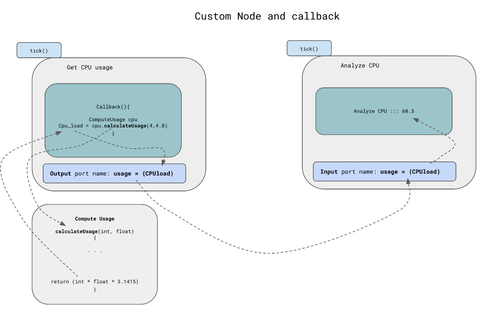

# `BehaviorTree.CPP` como uma biblioteca C++ e ROS Framework para suportar a modelagem do comportamento do robô

## Integração BT - ROS2
BehaviorTree.CPP é a estrutura de modelo abstrato implementada em C++ para arquitetar a estrutura de comutação lógica entre as diferentes tarefas do robô.

O objetivo desta biblioteca de software é facilitar a criação de Behavior Tree Executors ou componentes de software que carregam e executam Behavior Trees (BTs) durante o tempo de execução, agrupando o código existente (por exemplo, seu código no ROS) em nós personalizados da árvore. Os nós personalizados geralmente são ações que o robô pode realizar sob certas condições.

É fundamental destacar que o usuário (aqui, usuário ROS) tira proveito do framework, e seu trabalho se limita à arquitetura do BT (usando XML) e à implementação de nós (callback). Do ponto de vista do usuário, a implementação da estrutura é uma preocupação secundária.

Mais uma vez, observe a pilha de design do fluxo de trabalho do BT que acomoda a discussão. O diagrama produz os links lógicos entre a hierarquia da arquitetura de software. Conforme discutido na última unidade, os BTs usam XML para definir o comportamento da tarefa e o fluxo lógico do robô.

<div align="center">
     
</div>

O Executor aloca instâncias de nós personalizados ou integrados e os monta em uma árvore após analisar a representação textual da árvore.

Uma única instância de cada tipo de nó deve ser registrada na Fábrica. Isso pode ser feito diretamente no código C++, com a ajuda de links estáticos, ou em tempo de execução, quando novos nós são carregados de uma coleção de plug-ins. Oferecemos um processo direto e totalmente explicado para produzir bibliotecas dinâmicas de autorregistro que contêm nós exclusivos.

Durante a etapa de cadastramento, a Fábrica cria um modelo dos nós customizados.

O Executor passa a representação textual da Árvore, aloca instâncias de nós personalizados ou integrados e os compõe em uma árvore.

Uma única instância de cada tipo de nó deve ser registrada na Fábrica. Isso pode ser feito diretamente no código C++, com a ajuda de links estáticos ou em tempo de execução.

Durante a etapa de cadastramento, a Fábrica cria um modelo dos nós customizados. Primeiro, dê uma olhada em (bt_factory.h) que tipo de nós (build-in) você pode registrar:

```cpp
BehaviorTreeFactory::BehaviorTreeFactory()
{
    parser_ = std::make_shared<XMLParser>(*this);
    registerNodeType<FallbackNode>("Fallback");
    registerNodeType<SequenceNode>("Sequence");
    registerNodeType<SequenceStarNode>("SequenceStar");
    registerNodeType<ParallelNode>("Parallel");
    registerNodeType<ReactiveSequence>("ReactiveSequence");
    registerNodeType<ReactiveFallback>("ReactiveFallback");
    registerNodeType<IfThenElseNode>("IfThenElse");
    registerNodeType<WhileDoElseNode>("WhileDoElse");

    registerNodeType<InverterNode>("Inverter");
    //registerNodeType<RetryNodeTypo>("RetryUntilSuccesful"); //typo but back compatibility
    registerNodeType<RetryNode>("RetryUntilSuccessful"); // correct one
    registerNodeType<KeepRunningUntilFailureNode>("KeepRunningUntilFailure");
    registerNodeType<RepeatNode>("Repeat");
    registerNodeType<TimeoutNode<>>("Timeout");
    registerNodeType<DelayNode>("Delay");

    registerNodeType<ForceSuccessNode>("ForceSuccess");
    registerNodeType<ForceFailureNode>("ForceFailure");

    registerNodeType<AlwaysSuccessNode>("AlwaysSuccess");
    registerNodeType<AlwaysFailureNode>("AlwaysFailure");
    registerNodeType<SetBlackboard>("SetBlackboard");

    registerNodeType<SubtreeNode>("SubTree");
    registerNodeType<SubtreePlusNode>("SubTreePlus");

    registerNodeType<BlackboardPreconditionNode<int>>("BlackboardCheckInt");
    registerNodeType<BlackboardPreconditionNode<double>>("BlackboardCheckDouble");
    registerNodeType<BlackboardPreconditionNode<std::string>>("BlackboardCheckString");
    registerNodeType<BlackboardPreconditionNode<bool>>("BlackboardCheckBool");

    registerNodeType<SwitchNode<2>>("Switch2");
    registerNodeType<SwitchNode<3>>("Switch3");
    registerNodeType<SwitchNode<4>>("Switch4");
    registerNodeType<SwitchNode<5>>("Switch5");
    registerNodeType<SwitchNode<6>>("Switch6");
}
```

## Os retornos de chamada `tick()`
Você aborda uma visão mais profunda sobre BT e mecanismos que orquestram definições lógicas de tarefas de robôs. Referindo-se às premissas anteriores, ao arquitetar o BT, você considera apenas o nível mais alto de abstração, evitando um entendimento mais profundo dos mecanismos relacionados à implementação do nó ROS. Conforme apontado, o nó é considerado uma “caixa preta” – executando uma função no sistema de robô que você constrói.

Qualquer TreeNode pode ser visto como uma maneira de executar código ou chamar um retorno de chamada. Você decide o que esse retorno de chamada executa. Por exemplo, pode enviar comandos para um robô ou gerenciar outros processos internos.

Um sinal de "tick" é transmitido para a raiz da árvore e sobe na árvore até atingir um nó de folha.

<div align="center">
     
</div>

## BT e criação de nós
Antes de se aprofundar no BehaviorTree.CPP, é essencial compreender como o BT é construído dentro do framework. Para simplificar, consulte o exemplo a seguir, que fornece uma excelente visão geral do processo de criação em C++.

O BT consiste em três nós personalizados (uma condição (C:) CheckBattery e duas ações (A:) ApproachObject, OpenGripper).
```xml
 <root main_tree_to_execute = "MainTree" >

     <BehaviorTree ID="MainTree">
        <Sequence name="root_sequence">
            <CheckBattery   name="battery_ok"/>
            <ApproachObject name="approach_object"/>
            <OpenGripper    name="open_gripper"/>
        </Sequence>
     </BehaviorTree>

 </root>
```
O programa C++ para executar o BT e executá-lo é o seguinte:
```cpp
int main()
{
    // We use the BehaviorTreeFactory to register our custom nodes
    BehaviorTreeFactory factory;
    factory.registerNodeType<ApproachObject>("ApproachObject");

    // Registering a SimpleActionNode using a function pointer.
    factory.registerSimpleCondition("CheckBattery", std::bind(CheckBattery));

    //You can also create SimpleActionNodes using methods of a class
    GripperInterface gripper;
    factory.registerSimpleAction("OpenGripper", std::bind(&GripperInterface::open, &gripper));

    auto tree = factory.createTreeFromText(xml_text);

    FileLogger logger_file(tree, "bt_trace_u4_ex1.fbl");
    tree.tickRoot();

    return 0;
}
```
> bt1.cpp
```cpp
#include "behaviortree_cpp_v3/bt_factory.h"
#include "behaviortree_cpp_v3/loggers/bt_file_logger.h"

using namespace BT;

class ApproachObject : public BT::SyncActionNode
{
  public:
    ApproachObject(const std::string& name) : BT::SyncActionNode(name, {})
    {
    }

    // You must override the virtual function tick()
    NodeStatus tick() override

    {
        std::cout << "ApproachObject: " << this->name() << std::endl;
        return BT::NodeStatus::SUCCESS;
    }
};

class CheckBattery : public BT::SyncActionNode
{
  public:
    CheckBattery(const std::string& name) : BT::SyncActionNode(name, {})
    {
    }

    // You must override the virtual function tick()
    NodeStatus tick() override
    {
        std::cout << "[ Battery: OK ]" << std::endl;
        return BT::NodeStatus::SUCCESS;
    }
};

class GripperInterface
{
  private:
    bool _opened;

  public:
    GripperInterface() : _opened(true)
    {
    }

    NodeStatus open()
    {
        _opened = true;
        std::cout << "GripperInterface::open" << std::endl;
        return BT::NodeStatus::SUCCESS;
    }

    NodeStatus close()
    {
        std::cout << "GripperInterface::close" << std::endl;
        _opened = false;
        return BT::NodeStatus::SUCCESS;
    }
};

static const char* xml_text = R"(

 <root main_tree_to_execute = "MainTree" >

     <BehaviorTree ID="MainTree">
        <Sequence name="root_sequence">
            <CheckBattery   name="battery_ok"/>
            <ApproachObject name="approach_object"/>
            <OpenGripper    name="open_gripper"/>
        </Sequence>
     </BehaviorTree>

 </root>
 )";

int main()
{
    BehaviorTreeFactory factory;

    factory.registerNodeType<ApproachObject>("ApproachObject");
    factory.registerNodeType<CheckBattery>("CheckBattery");

    GripperInterface gripper;
    factory.registerSimpleAction("OpenGripper", std::bind(&GripperInterface::open, &gripper));

    auto tree = factory.createTreeFromText(xml_text);

    FileLogger logger_file(tree, "bt_trace_u3_ex1.fbl");
    tree.tickRoot();

    return 0;
}
```
Execute no Shell:
```bash
source ~/ros2_ws/install/setup.bash
./bt1
```
> Output

```bash
[ Battery: OK ]
ApproachObject: approach_object
GripperInterface::open
```

Este exemplo é semelhante ao BT que você executou antes.

* O robô verifica o estado da bateria. O nó imprime `[bateria: OK]`
* O robô se aproxima do objeto para segurá-lo. O nó imprime `ApproachObject: approach_object`
* Finalmente, o robô abre a pinça. Impressões de nó: `GripperInterface::open`

Antes de entender a estrutura discutida e a implementação C++ acima do BT, é crucial analisar o próximo diagrama:

<div align="center">
     
</div>

Uma análise profunda do diagrama acima fornece uma visão geral da reflexão dentro da estrutura. Os nós integrados arquitetam o fluxo funcional sobre o BT, fornecem as primitivas fundamentais para a estrutura para construir nós personalizados e definem a lógica do BT (consulte a definição do construtor em `bt_factory.cpp`).

Fábrica de objetos da classe `BehaviorTreeFactory` construída como nós personalizados de fluxo de programa. O nó integrado é construído (pelo Executor) quando `xml_text` é “carregado”.

## Criar retorno de chamada. Definir porta

O último exemplo ilustrou como o processo de criação do nó é executado e quais “componentes” do framework estão engajados. Neste parágrafo, crie um nó personalizado e defina um retorno de chamada. O retorno de chamada retorna o valor um simples. Além disso, o valor (cpu_usage) é enviado para outro nó pela porta.

**A maneira padrão (e recomendada) de criar um TreeNode é por herança (public SyncActionNode ou public AsyncActionNode).**

Node personalizado:

```cpp
class GetCPUusage: public SyncActionNode, public ComputeUsage
{

private:
    float usage;
public:
    GetCPUusage(const std::string& name, const NodeConfiguration& config):
        SyncActionNode(name,config) 
    {}
    //----------------------
    //node callback
    //----------------------
    NodeStatus tick() override
    {

       ComputeUsage cpu;
       auto cpu_load = cpu.calulateUsege(4,4.8);
       this->usage = cpu_load;
       CPU cpuX = {cpu_load};
       
       setOutput("usage", cpuX);
       return NodeStatus::SUCCESS;
    }
    static PortsList providedPorts()
    {
        return { OutputPort<CPU>("usage") };
    }
};
```

Analise o diagrama abaixo, a definição de retorno de chamada e a implementação do retorno de chamada. Para simplificar, você chamou a função calulateUsage() dentro da classe ComputeUsage.

Seu retorno de chamada deve ser incluído na função:

```cpp

    //----------------------
    //node callback
    //----------------------
    
    NodeStatus tick() override
    {
        //here you can call e.g ROS
    }
```

Analise o código fonte e veja como você criou a comunicação entre nós (porta de entrada/saída). Entenda o esquema abaixo:

<div align="center">
     
</div>

> bt2.cpp
```cpp
#include "behaviortree_cpp_v3/bt_factory.h"
#include "behaviortree_cpp_v3/loggers/bt_file_logger.h"

using namespace BT;

class ApproachObject : public BT::SyncActionNode
{
  public:
    ApproachObject(const std::string& name) : BT::SyncActionNode(name, {})
    {
    }

    // You must override the virtual function tick()
    NodeStatus tick() override

    {
        std::cout << "ApproachObject: " << this->name() << std::endl;
        return BT::NodeStatus::SUCCESS;
    }
};

class CheckBattery : public BT::SyncActionNode
{
  public:
    CheckBattery(const std::string& name) : BT::SyncActionNode(name, {})
    {
    }

    // You must override the virtual function tick()
    NodeStatus tick() override
    {
        std::cout << "[ Battery: OK ]" << std::endl;
        return BT::NodeStatus::SUCCESS;
    }
};

class GripperInterface
{
  private:
    bool _opened;

  public:
    GripperInterface() : _opened(true)
    {
    }

    NodeStatus open()
    {
        _opened = true;
        std::cout << "GripperInterface::open" << std::endl;
        return BT::NodeStatus::SUCCESS;
    }

    NodeStatus close()
    {
        std::cout << "GripperInterface::close" << std::endl;
        _opened = false;
        return BT::NodeStatus::SUCCESS;
    }
};

struct Position2D
{
    double x, y;
};

struct CPU
{
    float cpu;
};

class ComputeUsage
{
  private:
    int cores;
    float load_pr_core;

  public:
    ComputeUsage()
    {
    }

    float calulateUsege(int c, float load)
    {
        return (c * load * 3.1415);
    }
};

class GetCPUusage : public SyncActionNode, public ComputeUsage
{
  private:
    float usage;

  public:
    GetCPUusage(const std::string& name, const NodeConfiguration& config)
      : SyncActionNode(name, config)
    {
    }

    //node callback
    NodeStatus tick() override
    {
        ComputeUsage cpu;
        auto cpu_load = cpu.calulateUsege(4, 4.8);
        this->usage = cpu_load;
        CPU cpuX = {cpu_load};

        setOutput("usage", cpuX);
        return NodeStatus::SUCCESS;
    }
    static PortsList providedPorts()
    {
        return {OutputPort<CPU>("usage")};
    }
};

class AnalyzeCPU : public SyncActionNode
{
  public:
    AnalyzeCPU(const std::string& name, const NodeConfiguration& config)
      : SyncActionNode(name, config)
    {
    }

    NodeStatus tick() override
    {
        auto res = getInput<CPU>("input");
        if (!res)
        {
            throw RuntimeError("error reading port [input]:", res.error());
        }
        CPU usage = res.value();
        printf("Analyze CPU ::: [ %.1f ]\n", usage.cpu);
        return NodeStatus::SUCCESS;
    }

    static PortsList providedPorts()
    {
        // Optionally, a port can have a human readable description
        const char* description = "Simply print cpu usage on terminal...";
        return {InputPort<CPU>("input", description)};
    }
};

static const char* xml_text = R"(

 <root main_tree_to_execute = "MainTree" >

     <BehaviorTree ID="MainTree">
        <Sequence name="root_sequence">
            <CheckBattery   name="battery_ok"/>
            <ApproachObject name="approach_object"/>
            <OpenGripper    name="open_gripper"/>
            <GetCPUusage   usage="{CPUload}" />
            <AnalyzeCPU   input="{CPUload}" />
        </Sequence>
     </BehaviorTree>

 </root>
 )";

int main()
{
    // We use the BehaviorTreeFactory to register our custom nodes
    BehaviorTreeFactory factory;

    factory.registerNodeType<ApproachObject>("ApproachObject");
    factory.registerNodeType<GetCPUusage>("GetCPUusage");
    factory.registerNodeType<AnalyzeCPU>("AnalyzeCPU");
    factory.registerNodeType<CheckBattery>("CheckBattery");

    GripperInterface gripper;
    factory.registerSimpleAction("OpenGripper", std::bind(&GripperInterface::open, &gripper));

    auto tree = factory.createTreeFromText(xml_text);

    FileLogger logger_file(tree, "bt_trace_u3_ex2.fbl");
    tree.tickRoot();

    return 0;
}

```
Execute no Shell:
```bash
source ~/ros2_ws/install/setup.bash
./bt2
```
> Output 
```bash
[ Battery: OK ]
ApproachObject: approach_object
GripperInterface::open
Analyze CPU ::: [ 60.3 ]
```

Este exemplo aprimora o exemplo anterior incorporando dois nós que enviam dados usando o mecanismo de porta (veja a figura acima).

* O robô verifica o estado da bateria. O nó imprime [bateria: OK]
* O robô se aproxima do objeto para segurá-lo. O nó imprime ApproachObject: approach_object
* Em seguida, o robô abre a garra GripperInterface::open
* Por fim, o robô envia os dados da CPU para o nó Analyze, onde os dados são analisados. Nó imprime CPU ::: [ 60.3 ]

## Criar nodes assíncronos

A execução de um nó reativo (Sequência reativa ou Fallback reativo) permite executar tarefas em um encadeamento separado. Nesse caso, a única coisa que você precisa fazer é (para seu nó assíncrono) herdar de AsyncActionNode em vez de SyncActionNode.

Discutimos a execução assíncrona na unidade anterior; no entanto, é razoável lembrar que ele retorna RUNNING ao executar a tarefa (o que leva tempo). Portanto, a ação assíncrona pode ser interrompida imediatamente quando o método halt() é invocado. Agora, observe a implementação C++ simples do nó assíncrono.

```cpp
class AnalyzeCPU: public AsyncActionNode
{
private:
    std::atomic_bool _halt_requested;
public:
    AnalyzeCPU(const std::string& name, const NodeConfiguration& config):
        AsyncActionNode(name,config)
    {}
    
    // you have to override 
    
    virtual void halt() override; 

    NodeStatus tick() override
    {
        auto res = getInput<CPU>("input");
        if( !res )
        {
            throw RuntimeError("error reading port [input]:", res.error() );
        }
        CPU usage = res.value();
        _halt_requested.store(false);
  
        int count = 0;

    while ((!_halt_requested) && (count < 10))
      {

        std:: cout << "analyzing for :: " << count << "\n";
        std::this_thread::sleep_for(std::chrono::seconds(1));
        count ++;
       }
   
        printf("Analyze CPU ::: [ %.1f ]\n", usage.cpu );
        //return NodeStatus::SUCCESS;
   
       std::cout << "[ Analysis process: FINISHED ]" << std::endl;

      return _halt_requested ? BT::NodeStatus::FAILURE : BT::NodeStatus::SUCCESS;
   
    }

    static PortsList providedPorts()
    {
        // Optionally, a port can have a human readable description
        const char*  description = "Simply print cpu usage on terminal...";
        return { InputPort<CPU>("input", description) };
    }
    
};

void AnalyzeCPU::halt()
{
    
    _halt_requested.store(false);

    std::cout << __FUNCTION__ << " called!" << "\n";
}
```
Você pode executar o programa e observar a saída. Você pode perceber o comportamento do nó assíncrono em ação. Além disso, toda a árvore é remarcada quatro vezes e o nó assíncrono (thread separado) ainda está em execução.

A atividade mais importante a ser executada é substituir o halt().
> bt3.cpp
```cpp
#include "behaviortree_cpp_v3/bt_factory.h"
#include "behaviortree_cpp_v3/loggers/bt_file_logger.h"
#include <thread>
#include <chrono>

using namespace BT;

struct CPU
{
    float cpu;
};

class ComputeUsage
{
  private:
    int cores;
    float load_pr_core;

  public:
    ComputeUsage()
    {
    }

    float calulateUsege(int c, float load)
    {
        return (c * load * 1);
    }
};

class ApproachObject : public BT::SyncActionNode
{
  public:
    ApproachObject(const std::string& name) : BT::SyncActionNode(name, {})
    {
    }

    NodeStatus tick() override
    {
        std::cout << "ApproachObject: " << this->name() << std::endl;
        return BT::NodeStatus::SUCCESS;
    }
};

class AnalyzeBattery : public BT::SyncActionNode
{
  public:
    AnalyzeBattery(const std::string& name) : BT::SyncActionNode(name, {})
    {
    }

    NodeStatus tick() override
    {
        std::cout << "Analyze Battery: " << this->name() << std::endl;
        return BT::NodeStatus::SUCCESS;
    }
};

class GetCPUusage : public SyncActionNode, public ComputeUsage
{
    static int count;

  private:
    float usage;

  public:
    GetCPUusage(const std::string& name, const NodeConfiguration& config)
      : SyncActionNode(name, config)
    {
    }

    //node callback
    NodeStatus tick() override
    {
        count += 1;
        ComputeUsage cpu;
        auto cpu_load = cpu.calulateUsege(1, 3.1);
        this->usage = cpu_load;
        CPU cpuX = {cpu_load};
        std::cout << "current COUNTER ===> : " << count << "\n";

        std::cout << "[ getting: FINISHED ]" << std::endl;
        setOutput("usage", cpuX);

        return NodeStatus::SUCCESS;
    }
    static PortsList providedPorts()
    {
        return {OutputPort<CPU>("usage")};
    }
};

class AnalyzeCPU : public AsyncActionNode
{
  private:
    std::atomic_bool _halt_requested;

  public:
    AnalyzeCPU(const std::string& name, const NodeConfiguration& config)
      : AsyncActionNode(name, config)
    {
    }

    virtual void halt() override;

    NodeStatus tick() override
    {
        auto res = getInput<CPU>("input");
        if (!res)
        {
            throw RuntimeError("error reading port [input]:", res.error());
        }
        CPU usage = res.value();
        _halt_requested.store(false);

        int count = 0;

        while ((!_halt_requested) && (count < 10))
        {
            std::cout << "analyzing for :: " << count << "\n";
            std::this_thread::sleep_for(std::chrono::seconds(1));
            count++;
        }

        printf("Analyze CPU ::: [ %.1f ]\n", usage.cpu);
        //return NodeStatus::SUCCESS;

        std::cout << "[ Analysis process: FINISHED ]" << std::endl;

        return _halt_requested ? BT::NodeStatus::FAILURE : BT::NodeStatus::SUCCESS;
    }

    static PortsList providedPorts()
    {
        // Optionally, a port can have a human readable description
        const char* description = "Simply print cpu usage on terminal...";
        return {InputPort<CPU>("input", description)};
    }
};

void AnalyzeCPU::halt()
{
    _halt_requested.store(false);

    std::cout << __FUNCTION__ << " called!"
              << "\n";
}

class osCPU : public SyncActionNode
{
  public:
    osCPU(const std::string& name, const NodeConfiguration& config) : SyncActionNode(name, config)
    {
    }

    NodeStatus tick() override
    {
        int count = 0;

        while (count < 5)
        {
            std::cout << "OS running :: " << count << "\n";
            std::this_thread::sleep_for(std::chrono::seconds(1));
            count++;
        }

        std::cout << "[ OS process: FINISHED ]" << std::endl;

        return BT::NodeStatus::SUCCESS;
    }

    static PortsList providedPorts()
    {
        return {};
    }
};

static const char* xml_text = R"(

 <root main_tree_to_execute = "MainTree" >

     <BehaviorTree ID="MainTree">
        <ReactiveSequence name="root_sequence">
            <AnalyzeBattery   name="battery_ok"/>   
            <GetCPUusage   usage="{CPUload}" />
            <AnalyzeCPU   input="{CPUload}" />
        </ReactiveSequence>
     </BehaviorTree>

 </root>
 )";

int GetCPUusage::count{0};
int main()
{
    BehaviorTreeFactory factory;
    using std::chrono::milliseconds;

    factory.registerNodeType<AnalyzeBattery>("AnalyzeBattery");
    factory.registerNodeType<GetCPUusage>("GetCPUusage");
    factory.registerNodeType<AnalyzeCPU>("AnalyzeCPU");

    auto tree = factory.createTreeFromText(xml_text);

    FileLogger logger_file(tree, "bt_trace_u3_ex3.fbl");

    std::cout << "\n--- 1 executeTick() ---" << std::endl;
    tree.tickRoot();
    std::this_thread::sleep_for(std::chrono::microseconds(1000));

    std::cout << "\n--- 2 executeTick() ---" << std::endl;
    tree.tickRoot();
    std::this_thread::sleep_for(std::chrono::microseconds(1000));

    std::cout << "\n--- 3 executeTick() ---" << std::endl;
    tree.tickRoot();
    std::this_thread::sleep_for(std::chrono::microseconds(1000));

    std::cout << "\n--- 4 executeTick() ---" << std::endl;
    tree.tickRoot();
    std::this_thread::sleep_for(std::chrono::microseconds(1000));

    return 0;
}

```
Execute no Shell:

```bash
source ~/ros2_ws/install/setup.bash
./bt3
```
> Output 
```bash
--- 1 executeTick() ---
Analyze Battery: battery_ok
current COUNTER ===> : 1
[ getting: FINISHED ]
analyzing for :: 0

--- 2 executeTick() ---
analyzing for :: Analyze Battery: battery_ok
current COUNTER ===> : 2
[ getting: FINISHED ]
1
analyzing for :: 2

--- 3 executeTick() ---
Analyze Battery: battery_ok
current COUNTER ===> : 3
[ getting: FINISHED ]
analyzing for :: 3

--- 4 executeTick() ---
Analyze Battery: battery_ok
current COUNTER ===> : 4
[ getting: FINISHED ]
analyzing for :: 4
analyzing for :: 5
analyzing for :: 6
analyzing for :: 7
analyzing for :: 8
analyzing for :: 9
Analyze CPU ::: [ 3.1 ]
[ Analysis process: FINISHED ]
```
Executar este exemplo lhe dá a chance de se familiarizar com o threading. A beleza da estrutura BT é que o thread extra necessário para seu aplicativo é criado em segundo plano, criando o nó assíncrono.

* Desde que você marque () a árvore quatro vezes, você receberá uma saída semelhante.
* Mas veja, como o nó AnylyzeCPU é executado em um thread separado, isso não afeta o status desse nó (aqui, contador para 10).
* Quando a contagem até 10 se esgota (pense que o sistema de controle do robô precisa de 10 segundos para calcular os dados), a saída é produzida (Analyze CPU ::: [ 3.1 ] [ Analysis process: FINISHED ]).

## Passando argumentos adicionais para um nó durante a inicialização do BT

* Do OOP, você entende a necessidade de passar argumentos adicionais como parâmetros, ponteiros, objetos ou referências ao construtor da classe.

* Mesmo que, em teoria, esses parâmetros possam ser fornecidos por meio de portas de entrada, isso seria incorreto se (seguindo o padrão):
     * Os argumentos são conhecidos no momento da implantação.
     * Os argumentos não mudam em tempo de execução.
     * Os argumentos não precisam ser definidos a partir do XML.

O uso de portas ou do Blackboard nessas circunstâncias é trabalhoso e fortemente desencorajado.

**A estrutura BehaviorTree.CPP oferece duas opções para inicializar o nó com parâmetros externos.**

O primeiro mecanismo é um método simples conhecido em OOP. Envie argumentos aos membros da classe ao inicializar a classe.

O mecanismo alternativo está relacionado ao método de classe, que pode ser chamado antes do primeiro tick().

Os mecanismos discutidos não são surpreendentes em C++; no entanto, a inicialização e o registro do nó são ligeiramente diferentes.

```cpp
//mechanism 1

NodeBuilder builder_A = [](const std::string& name, const NodeConfiguration& config)
    {
        return std::make_unique<Sensor>( name, config, 10, 30);
    };

    // BehaviorTreeFactory::registerBuilder is the more general way to register a custom node.
    // Not the most user friendly, but definitely the most flexible one.
    factory.registerBuilder<Sensor>( "Sensor", builder_A);

//mechanism 2

    for( auto& node: tree.nodes )
    {
        if( auto Compute_node = dynamic_cast<Compute*>( node.get() ))
        {
            Compute_node->init( 1.1, 1.2, 1.3 );
        }
    }
```
Execute e estude o programa completo, que roda de acordo com o BT, que pode entrar no Groot.
Neste exemplo, inicialize o sensor com a faixa de trabalho (baixo, alto). A classe assume esses valores enquanto o nó é inicializado e enviado por meio da porta Output para o nó Compute. Em seguida, o nó Compute executa cálculos internos e envia medições usando uma porta de saída para o nó Analyze Measurement, que publica os resultados.

<div align="center">
     
</div>

> bt4.cpp
```cpp
#include "behaviortree_cpp_v3/bt_factory.h"
#include "behaviortree_cpp_v3/loggers/bt_file_logger.h"

using namespace BT;

struct Range
{
    int low;
    int high;
};

class Sensor : public SyncActionNode
{
  private:
    int _arg1;
    int _arg2;

  public:
    // additional arguments passed to the constructor
    Sensor(const std::string& name, const NodeConfiguration& config, int arg1, int arg2)
      : SyncActionNode(name, config), _arg1(arg1), _arg2(arg2)
    {
    }

    NodeStatus tick() override
    {
        Range range = {range.low = _arg1, range.high = _arg2};

        std::cout << "sensor range low : " << range.low << " high :" << range.high << "\n";
        setOutput("range", range);

        return NodeStatus::SUCCESS;
    }
    static PortsList providedPorts()
    {
        return {OutputPort<Range>("range")};
    }
};

class RobotBrain
{
  private:
    float result;

  public:
    RobotBrain(){};

    float compute(float f1, float f2, float f3)
    {
        return (f1 * f1 + f2 * 0.43 + f3 * 3.1415);
    }
};

class Compute : public SyncActionNode, public RobotBrain
{
  private:
    float _arg1;
    float _arg2;
    float _arg3;

  public:
    Compute(const std::string& name, const NodeConfiguration& config) : SyncActionNode(name, config)
    {
    }

    void init(float arg1, float arg2, float arg3)
    {
        _arg1 = (arg1);
        _arg2 = (arg2);
        _arg3 = (arg3);
    }

    NodeStatus tick() override
    {
        auto res = getInput<Range>("brain_input");
        if (!res)
        {
            throw RuntimeError("FROM BRAIN error reading port [input]:", res.error());
        }
        auto range = res.value();

        std::cout << "Compute init factors: " << _arg1 << " : " << _arg2 << " : " << _arg3
                  << std::endl;

        RobotBrain brain;
        float result = brain.compute(_arg1 * range.low, _arg2 * range.high, _arg3);
        setOutput("brain_output", result);

        return NodeStatus::SUCCESS;
    }

    static PortsList providedPorts()
    {
        return {InputPort<Range>("brain_input"), OutputPort<float>("brain_output")};
    }
};

class AnalyzeMeasurement : public SyncActionNode
{
  public:
    AnalyzeMeasurement(const std::string& name, const NodeConfiguration& config)
      : SyncActionNode(name, config)
    {
    }

    NodeStatus tick() override
    {
        auto res = getInput<float>("input");
        if (!res)
        {
            throw RuntimeError("error reading port [input]:", res.error());
        }
        auto meas = res.value();

        std::cout << " Measurements ::: " << meas << "\n";

        std::cout << "[ Analysis process: FINISHED ]" << std::endl;

        return NodeStatus::SUCCESS;
    }

    static PortsList providedPorts()
    {
        // Optionally, a port can have a human readable description
        const char* description = "Simply print cpu usage on terminal...";
        return {InputPort<float>("input")};
    }
};

static const char* xml_text = R"(

 <root >
     <BehaviorTree>
        <Sequence>
            <Sensor range="{range}"/>
            <Compute brain_input="{range}" brain_output="{meas}"/>
             <AnalyzeMeasurement  input="{meas}"/>
            
            
        </Sequence>
     </BehaviorTree>
 </root>
 )";

int main()
{
    BehaviorTreeFactory factory;

    NodeBuilder builder_A = [](const std::string& name, const NodeConfiguration& config) {
        return std::make_unique<Sensor>(name, config, 10, 30);
    };

    factory.registerBuilder<Sensor>("Sensor", builder_A);

    factory.registerNodeType<Compute>("Compute");

    factory.registerNodeType<AnalyzeMeasurement>("AnalyzeMeasurement");

    auto tree = factory.createTreeFromText(xml_text);

    FileLogger logger_file(tree, "bt_trace_u3_ex4.fbl");

    for (auto& node : tree.nodes)
    {
        if (auto Compute_node = dynamic_cast<Compute*>(node.get()))
        {
            Compute_node->init(1.1, 1.2, 1.3);
        }
    }

    tree.tickRoot();

    return 0;
}
```
Execute no shell:
```bash
source ~/ros2_ws/install/setup.bash
./bt4
```

> Output 
```bash
sensor range low : 10 high :30
Compute init factors: 1.1 : 1.2 : 1.3
 Measurements ::: 140.564
[ Analysis process: FINISHED ]
```
Este exemplo descreve o fluxo de dados entre as portas do nó. Considere a figura acima e analise o código.