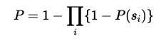

# Árvores de Comportamento Estocástico e Planejamento Automatizado

Você pode arquitetar o comportamento do robô no mundo estático usando os conceitos apresentados. Isso significa que todo o comportamento possível do robô pode ser previsto e modelado no BT de acordo.

Como você pode esperar, o robô pode operar em um ambiente complexo onde o robô tem que colaborar com outros robôs. No entanto, outros robôs geralmente têm conjuntos distintos de metas e objetivos. Como resultado, o resultado de uma ação planejada pode ser inesperado, desviar-se da trajetória do estado pretendido e inviabilizar a próxima ação planejada.

Nesse caso, o replanejamento regular do zero é uma solução popular para esse problema, mas pode ser caro em termos de tempo e esforço de computação.

Um método de lidar com essas questões é combinar o planejamento com os BTs. Como os BTs são reativos, o agente pode continuar a executar os subplanos anteriores sem replantar a tarefa completamente. Além disso, por serem modulares, podem ser estendidos recursivamente.

Na realidade, visto nos exemplos abaixo, o uso de BTs permite a reatividade no sentido de que, se um obstáculo aparecer, o robô irá parar e evitar o obstáculo automaticamente sem replantar.

## Abordagem de planejamento e ação usando BT

Esta seção discute a abordagem Backchaining, Planejamento e Atuação Usando Árvores Comportamentais (PA-BT).

Pela complexidade da ideia e da implementação do software, o conceito será demonstrado discutindo e executando exemplos, em vez de elaborar as relações matemáticas.

O princípio deve ser claro, pois discutimos BT no ambiente estático de contatos, onde todos os estados são previsíveis.

O princípio pode ser representado na BT a seguir, onde a pós-condição C pode ser alcançada pela ação A1 ou A2, que têm as pré-condições C1, C2, C3 e C4, respectivamente.

     

Como o robô precisa concluir a tarefa planejada (alcançar a meta), você expande BT iterativamente para satisfazer as condições inesperadas que ocorrem enquanto o robô executa o movimento (tarefa planejada).

O ambiente dinâmico influencia o projeto do BT, que deve incluir mecanismos específicos para proteger o robô contra obstáculos ou desvios que o impeçam de continuar a tarefa.

Lembre-se de que o BT é atualizado durante o tempo de execução!

Simplificamos seu exemplo para BT descrito abaixo (BT na primeira iteração).

O robô tem que atingir o alvo; no entanto, durante o movimento, ocorrem obstáculos. A ocorrência de obstáculos afeta o BT é estendido por novas ramificações para cumprir a tarefa planejada. BT indica que para satisfazer o BT, um dos filhos tem que dar TRUE (Fallback node). Podemos assumir que o robô não atinge o objetivo, então a criança com o nó Sequência deve dar VERDADEIRO. Aqui, o robô verifica se o caminho está livre, para que o robô possa se mover. Se a condição for livre, o movimento falha, então o BT é estendido (reorganização).

     

## BT Estocástico

Inúmeras extensões foram sugeridas à medida que a ideia de BT se tornou mais amplamente aceita no domínio da IA e da robótica. O nó Fallback e a percepção de que sua ordem é frequentemente arbitrária estão no centro de muitos deles. No entanto, a própria ordenação é irrelevante no caso nominal porque os filhos de um nó Fallback representam maneiras alternativas de obter o mesmo resultado (para ser mais preciso, o nó Fallback executa a lógica ou a função).

De acordo com a teoria da utilidade, faz sentido selecionar a opção que será mais útil se você puder avaliar a utilidade de todas as seleções possíveis. Isso significa que o robô escolherá a opção mais valiosa em termos de desempenho, custo ou tempo (ou outros).

A consideração das probabilidades de sucesso é uma modificação natural da noção de utilidade apresentada acima. A atividade com a melhor chance de sucesso pode ser uma boa candidata se algo precisar ser feito. Antes de entrar em detalhes, observe que custo, tempo de execução e possíveis quedas negativas são igualmente importantes.

Um benefício de levar em consideração a probabilidade de sucesso é que é teoricamente simples agregar em Sequências e Fallbacks. Por exemplo, as probabilidades podem ser agregadas conforme mostrado abaixo.

Fallbacks precisam apenas de um filho para obter sucesso, enquanto as sequências exigem que os filhos sejam bem-sucedidos, com uma chance igual ao complemento de todas as falhas.

Embora isso tenha validade teórica, é baseado na premissa não declarada de que cada ação é tentada apenas uma vez. Por exemplo, você pode imaginar o robô pegando algo da mesa, deixando-o cair inadvertidamente no meio do caminho e depois pegando-o novamente. Observe que os cálculos acima não consideram tais eventos.

> NOTA, a probabilidade de um evento é um número entre 0 e 1, onde 0 indica a impossibilidade do evento e 1 indica 100% de certeza.

**Probabilidade para o nó Fallback:**

     

**Probabilidade para o nó Sequência:**

     

Para tornar a discussão clara, considere o BT abaixo.

Imagine o robô com base na medição a laser para decidir qual caminho escolher. No exemplo, o laser não produz a medição correta, portanto os resultados devem ser estimados. O sistema de controle do robô estimou que o caminho B tem a maior probabilidade de estar aberto. A probabilidade, neste caso, é de 0,8 (oito testes positivos para um total de dez testes realizados). As vias A e C têm uma probabilidade menor de 0,4 e 0,2, respectivamente. O robô escolhe o caminho B (maior probabilidade de passar) neste caso. Depois que o robô escolhe o caminho, o robô executa o movimento. A probabilidade do movimento do robô pode ser estimada em 0,95, pois o sistema de bateria do robô pode falhar e o robô não executará a tarefa.

A probabilidade total desta árvore pode ser estimada da seguinte forma.

     

O exemplo descrito é simples para destacar o conceito; no entanto, cálculos semelhantes podem ser incorporados em todo o BT. Então, o robô sempre escolhe a melhor decisão (o tempo, custo ou desempenho mais valioso) em um carimbo de data/hora específico.

## Cadeia de Markov

Como a teoria deste parágrafo está além do escopo, você se concentrará na intuição e investigará as probabilidades de sucesso e a confiabilidade de execução dos nós BT.

Para entender melhor o conceito discutido, considere o diagrama abaixo (o exemplo é derivado do livro recomendado: "Behaviour Trees in Robotics and AI" de Michele Colledanchise e Petter Ögren).

Imagine o seguinte:

* O robô procura na mesa.
* O robô abre a gaveta e faz uma segunda busca caso o objeto não seja encontrado sobre a mesa.

A probabilidade de sucesso de cada tarefa é mostrada no diagrama. Por exemplo, pesquisar na tabela tem uma probabilidade de sucesso de 0,1. Com esse tipo de fluxo lógico, é fácil determinar sua confiabilidade geral em termos de taxas de sucesso para cada ação.

     

Tendo em conta as probabilidades definidas no parágrafo anterior, calcule a probabilidade de sucesso, neste caso, igual a = 0,829 (considere o diagrama acima).

Para realizar uma análise de desempenho profunda, transforme o BT em Cadeia de Markov, onde as transições entre os estados são especificadas por probabilidades de transição.

A característica mais importante da Cadeia de Markov é o fato de que ela precisa ser "sem memória". Em outras palavras, a probabilidade da próxima ação é completamente independente da ação tomada para chegar ao estado atual.

O equivalente BT da cadeia de Markov em BT pode ser composto e apresentado da seguinte forma:

     

A seguinte simulação ROS2 pode ser considerada a segunda parte da simulação anterior. Porém, desta vez, defina a probabilidade de detecção do obstáculo (pelo laser do robô).

* Como sua tarefa é aproveitar a simulação, repita uma tarefa semelhante da unidade anterior e crie o BT (em CPP) com base na figura acima criada no Groot. Entenda o comportamento da tarefa do robô (abaixo dos marcadores).
* Considere que o laser tem alguma falha interna, então a probabilidade de detecção errada é alta.
* Defina a probabilidade através do Blackboard.
* O valor padrão é ajustado para 0,1. Removendo o obstáculo (como na unidade anterior) o robô classificará o sinal (do laser) como valioso (ou não) com uma probabilidade de 0,9. Essa simulação simples fornece o princípio básico de como esse mecanismo funciona.
* Definir o valor mais alto de probabilidade de falha (valor próximo a 1,0) diminui as chances de o robô sair da armadilha. Verifique como funciona rodando a simulação para diferentes valores de probabilidade (o valor é ajustado em XML).