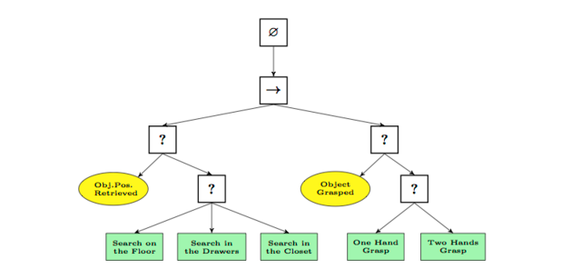
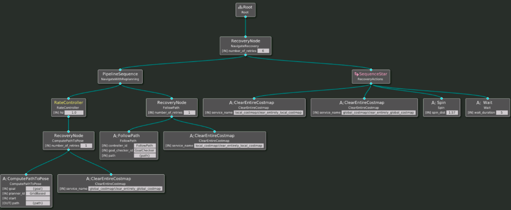
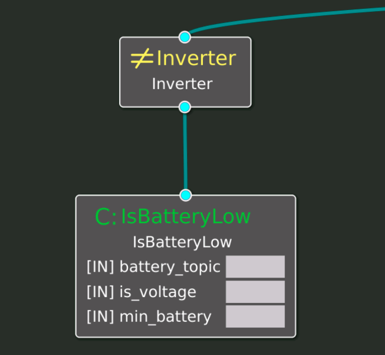

# Comportamentos Nav2 (Nav2 Behaviors)

<div align="center">
     
</div>

O Nav2 usa Árvores Comportamentais (BTs) para controlar o comportamento de navegação do robô. Os BTs são usados durante a navegação padrão para uma situação de objetivo e durante as situações em que o robô não pode navegar (devido a erros, situações de bloqueio, etc.).

## O que é o Navegador BT
O pacote do sistema de navegação é responsável por gerenciar as árvores de comportamento no nav2_bt_navigator.

O nav2_bt_navigator é responsável por controlar o movimento até a meta do robô. É composto por várias partes:

1. O node `bt_navigator` e seu arquivo de configuração
2. O comportamento do node `bt_navigator`
3. O node `recoveryies_server` e seu arquivo de configuração

O comportamento do node bt_navigator e como ele se conecta com o recovery_server é especificado usando Árvores de Comportamento. Nesta topico, você aprenderá como criar esses comportamentos e fornecê-los ao sistema de navegação.

## O Node bt_navigator
O `bt_navigator` é o node do Nav2 encarregado de gerenciar o planejador de caminho, o controlador e os comportamentos de recuperação.

A maneira como o bt_navigator deve gerenciar esses nós é definida em uma árvore de comportamento.

> VOCÊ DEVE CRIAR UM COMPORTAMENTO PARA O bt_navigator definir corretamente como ele deve mover o robô.

### Como criar um comportamento
Para criar o comportamento, crie um arquivo XML usando os tipos de nós para comportamentos disponíveis. Este XML será fornecido ao bt_navigator para ser executado quando necessário.

A biblioteca Behavior `Tree.CPP` fornece um conjunto de nós de comportamento já criados. No entanto, o Nav2 incluiu seu próprio tipo de nós de comportamento. Neste capítulo, você aprenderá sobre os nós de comportamento que o Nav2 oferece. 

> IMPORTANTE: Você não deve confundir nós ROS com nós de comportamento; são duas coisas diferentes. Para evitar confusão, neste topico, você escreverá os nós ROS em letras normais e os nós de comportamento em itálico.

Exemplo de comportamento: o arquivo `behavior.xml`
```xml
<!--
  This Behavior Tree replans the global path periodically at 1 Hz, and it also has
  recovery actions.
-->
<root main_tree_to_execute="MainTree">
  <BehaviorTree ID="MainTree">
    <RecoveryNode number_of_retries="6" name="NavigateRecovery">
      <PipelineSequence name="NavigateWithReplanning">
        <RateController hz="1.0">
          <RecoveryNode number_of_retries="1" name="ComputePathToPose">
            <ComputePathToPose goal="{goal}" path="{path}" planner_id="GridBased"/>
            <ClearEntireCostmap service_name="global_costmap/clear_entirely_global_costmap"/>
          </RecoveryNode>
        </RateController>
        <RecoveryNode number_of_retries="1" name="FollowPath">
          <FollowPath path="{path}" controller_id="FollowPath"/>
          <ClearEntireCostmap service_name="local_costmap/clear_entirely_local_costmap"/>
        </RecoveryNode>
      </PipelineSequence>
      <SequenceStar name="RecoveryActions">
        <ClearEntireCostmap service_name="local_costmap/clear_entirely_local_costmap"/>
        <ClearEntireCostmap service_name="global_costmap/clear_entirely_global_costmap"/>
        <Spin spin_dist="1.57"/>
        <Wait wait_duration="5"/>
      </SequenceStar>
    </RecoveryNode>
  </BehaviorTree>
</root>
```
Este comportamento especificado em XML pode ser representado por esta imagem:

<div align="center">
     
</div>

### Analisando o comportamento do arquivo XML
Agora analise os nós de comportamento envolvidos no comportamento anterior.

Para cada comportamento, comece com as seguintes tags:
```xml
<root main_tree_to_execute="MainTree">
  <BehaviorTree ID="MainTree">
    ...
  </BehaviorTree>
</root>
```
* A tag raiz identifica a árvore principal a ser executada
* A tag BehaviorTree identifica o que segue como uma árvore de comportamento com um determinado nome (ID contém seu nome)

Em seguida, na tag BehaviorTree, inclua os nós da árvore de comportamento que deseja usar e na ordem que cria o comportamento desejado. Por exemplo, para o comportamento padrão que você está usando na navegação, você deseja o seguinte comportamento:

* Replaneje o caminho global a cada segundo (1 Hz)
* Siga esse caminho
* Se o robô estiver preso, faça o seguinte:
     1. Limpe o mapa de custos local
     2. Limpe o mapa de custos global
     3. Gire para verificar os novos obstáculos e construa novamente os Costmaps
     4. Aguarde 5 segundos e volte ao comportamento principal

Veja como é implementado usando os nós de comportamento fornecidos pelo Nav2.

## Node BT usados
* `RecoveryNode` (nó definido pelo Nav2)
Este nó é usado para encapsular dois outros sub-nós e controlar sua ativação da seguinte maneira:

* Este nó começará a executar o primeiro sub-nó
* Se o primeiro subnó retornar SUCCESS, o RecoveryNode retornará SUCCESS
* Se o primeiro subnó retornar FALHA, ele executa o segundo subnó
* Se o segundo subnó retornar SUCCESS, ele executará o primeiro subnó novamente
* Se o segundo subnó retornar FALHA, ele retornará FALHA e terminará

Geralmente é usado para iniciar uma tarefa de navegação (o primeiro sub-nó) e definir sua ação de recuperação em caso de falha (o segundo sub-nó).

> Veja um exemplo do arquivo XML anterior:
```xml
<RecoveryNode number_of_retries="6" name="NavigateRecovery">
    <PipelineSequence name="NavigateWithReplanning">
      ...
    </PipelineSequence>
    <SequenceStar name="RecoveryActions">
      ...
    </SequenceStar>
</RecoveryNode>
```
* Este nó é denominado NavigateRecovery
* Seu comportamento começa a iniciar o nó PipelineSequence chamado NavigateWithReplanning
* Se o nó NavigateWithReplanning falhar, ele iniciará o nó SequenceStar chamado RecoveryActions
* Se RecoveryActions for bem-sucedido, ele iniciará NavigateWithReplanning novamente
* Se RecoveryActions falhar, o nó NavigateRecovery também falhará e encerrará sua execução

No entanto, este nó fará até seis tentativas para concluir a sequência com sucesso. Se após seis tentativas ainda der FALHA, também retornará FALHA.

> NOTA: Lembre-se de que os nós de comportamento podem ter portas de entrada (o equivalente aos parâmetros passados para o nó) e portas de saída (o equivalente aos resultados retornados pelo nó). Por exemplo, o RecoveryNode tem uma porta de entrada chamada number_of_retries (o nome é outra porta de entrada que existe para cada nó por padrão). Verifique a documentação de cada nó para sua lista de portas de entrada-saída.

* `PipelineSequence` (nó definido por Nav2)

Este nó ativará os subnós da seguinte forma:

* O primeiro nó ativa o primeiro subnó até retornar SUCCESS.
* Isso ativa o primeiro e o segundo subnó (novamente) até que o segundo retorne SUCCESS.
* Em seguida, ele ativa o primeiro, o segundo e o terceiro subnó (novamente) até que o terceiro retorne SUCCESS e assim por diante.
* Ele irá parar se algum dos subnós retornar FALHA ou o último submódulo retornar SUCESSO.

> Veja um exemplo do arquivo XML anterior:
```xml
<PipelineSequence name="NavigateWithReplanning">
    <RateController hz="1.0">
    ...
    </RateController>
    <RecoveryNode number_of_retries="1" name="FollowPath">
    ...
    </RecoveryNode>
</PipelineSequence>
```

Aqui, esse nó é usado para calcular o caminho global a cada segundo e, em seguida, fazer o robô seguir o novo caminho calculado. Isso é útil para considerar modificações na posição atual do robô, para adaptar o caminho global a essas modificações.

* Este nó é denominado NavigateWithReplanning e possui dois subnós
* O primeiro é um nó RateController (confira abaixo o seu significado). Este nó inclui o cálculo do caminho para o objetivo.
* O segundo é um nó RecoveryNode. Esse é usado para fazer o robô seguir o caminho calculado.

* `RateController` (node definido pelo Nav2)

Este nó chamará os nós subseqüentes em uma determinada frequência que você especificar como parâmetro.

> Exemplo do arquivo XML anterior:
```xml
<RateController hz="1.0">
    <RecoveryNode number_of_retries="1" name="ComputePathToPose">
            ...
    </RecoveryNode>
</RateController>
```
Neste caso, o RateController irá chamar um RecoveryNode em 1 Hz.
```xml
<RecoveryNode number_of_retries="1" name="ComputePathToPose">
   <ComputePathToPose goal="{goal}" path="{path}" planner_id="GridBased"/>
   <ClearEntireCostmap service_name="global_costmap/clear_entirely_global_costmap"/>
</RecoveryNode>
```
O RecoveryNode chamado ComputePathToPose possui dois subnós:

1. Um nó ComputePathToPose
2. Um nó ClearEntireCostmap

Ambos são explicados abaixo.

* `ComputePathToPose` (nó definido por Nav2)
Chamadas para o servidor de ação ComputePathToPose ROS2 fornecido pelo `nav2_planner` ROS2-node (o `Planner Server`) para calcular o caminho para a meta. A meta é introduzida no nó usando uma variável do `blackboard`(variável denominada `{goal}`). Em seguida, o resultado do planejador é introduzido em outra variável do `blackboard` chamada `{path}`.

O que é o `blackboard`?

O `blackboard` é como um espaço para variáveis que todos os nós podem acessar. É usado para compartilhar informações entre os nós. Um nó pode colocar um valor lá e outro nó pode lê-lo.

> Exemplo do arquivo XML anterior:
```xml
<ComputePathToPose goal="{goal}" path="{path}" planner_id="GridBased"/>
```
Nesse caso, alguém colocou o valor da variável `{goal}` no `blackboard` e o nó está preenchendo a variável `{path}` do `blackboard` com o caminho calculado resultante. Objetivo e `planner_id` são as portas de entrada do nó e o caminho é sua porta de saída.

* `ClearEntireCostmap` (node definido por Nav2)
Chama o serviço que limpa o Costmap. Você deve indicar qual servidor chamar para limpar os Costmaps locais ou globais.

> Exemplo do arquivo XML anterior:
```xml
<ClearEntireCostmap service_name="global_costmap/clear_entirely_global_costmap"/>
```

* `SequenceStar` (node definido por BT)

Funciona da mesma forma que o nó `PipelineSequence`, mas não ativará os nós que já terminaram com SUCCESS.

> Exemplo do arquivo XML anterior:
```xml
<SequenceStar name="RecoveryActions">
    <ClearEntireCostmap service_name="local_costmap/clear_entirely_local_costmap"/>
    <ClearEntireCostmap service_name="global_costmap/clear_entirely_global_costmap"/>
    <Spin spin_dist="1.57"/>
    <Wait wait_duration="5"/>
</SequenceStar>
```
* `FollowPath` (node definido pelo Nav2)
Chama o servidor de ação no controlador que enviará comandos para as rodas do robô seguirem o caminho calculado.

> Exemplo do arquivo XML anterior:
```xml
<FollowPath path="{path}" controller_id="FollowPath"/>
```

* `Spin` (nó definido pelo Nav2)
Chama o servidor de ação spin ROS2 fornecido pelo nó `nav2_recoveries` ROS. Este servidor fará com que o robô gire no local o número de graus indicado no parâmetro `spin_dist`.

> Exemplo do arquivo XML anterior:
```xml
<Spin spin_dist="1.57"/>
```

* `Wait` (nó definido pelo Nav2)
Chame o servidor de ação wait ROS2 fornecido pelo nó ROS nav2_recoveries. Isso fará com que o comportamento espere o número de segundos indicado.

> Exemplo do arquivo XML anterior:
```xml
<Wait wait_duration="5"/>
```
#### Conclusões
Existem muitos outros nós que você pode usar para o seu comportamento. Confira aqui a lista [oficial](https://navigation.ros.org/configuration/packages/configuring-bt-xml.html) de nós Nav2 disponíveis para saber mais sobre os nós e como configurá-los.

Além disso, se você precisa trabalhar intensamente com comportamentos, deve aprender mais sobre árvores de comportamento em geral e a biblioteca de implementação BehaviorTree.CPP. Verifique os seguintes recursos:

* [A documentação oficial do Nav2 BT Navigator](https://navigation.ros.org/configuration/packages/configuring-bt-xml.html#)
* [Árvores Comportamentais e Robótica no livro AI](https://arxiv.org/pdf/1709.00084.pdf)
* [A documentação BehaviorTree.CPP](https://www.behaviortree.dev/)

#### Como fornecer o comportamento para o bt_navigator
Você deve especificar duas coisas para o nó bt_navigation durante o lançamento do nó:

o arquivo `bt_navigator.yaml` com a configuração do nó.
`behavior.xml` usando o parâmetro `default_nav_to_pose_bt_xml`.

> bt_navigator.yaml
```yaml
bt_navigator:
  ros__parameters:
    use_sim_time: True
    global_frame: map
    robot_base_frame: base_link
    odom_topic: /odom
    bt_loop_duration: 10
    default_nav_to_pose_bt_xml: "/home/user/ros2_ws/src/path_planner_server/config/behavior.xml"
    default_server_timeout: 20
    plugin_lib_names:
    - nav2_compute_path_to_pose_action_bt_node
    - nav2_compute_path_through_poses_action_bt_node
    - nav2_follow_path_action_bt_node
    - nav2_back_up_action_bt_node
    - nav2_spin_action_bt_node
    - nav2_wait_action_bt_node
    - nav2_clear_costmap_service_bt_node
    - nav2_is_stuck_condition_bt_node
    - nav2_goal_reached_condition_bt_node
    - nav2_goal_updated_condition_bt_node
    - nav2_initial_pose_received_condition_bt_node
    - nav2_reinitialize_global_localization_service_bt_node
    - nav2_rate_controller_bt_node
    - nav2_distance_controller_bt_node
    - nav2_speed_controller_bt_node
    - nav2_truncate_path_action_bt_node
    - nav2_goal_updater_node_bt_node
    - nav2_recovery_node_bt_node
    - nav2_pipeline_sequence_bt_node
    - nav2_round_robin_node_bt_node
    - nav2_transform_available_condition_bt_node
    - nav2_time_expired_condition_bt_node
    - nav2_distance_traveled_condition_bt_node
    - nav2_single_trigger_bt_node
    - nav2_is_battery_low_condition_bt_node
    - nav2_navigate_through_poses_action_bt_node
    - nav2_navigate_to_pose_action_bt_node
    - nav2_remove_passed_goals_action_bt_node
```

No parâmetro, `pluging_lib_names` especifica a lista de nós de comportamento necessários para seu arquivo de comportamento XML. Lembre-se de adicionar os que você precisa neste parâmetro.

Uma lista completa de plug-ins de nó disponíveis pode ser encontrada aqui

Verifique o código que você criou no topico `Path Planning`, onde realiza o carregamento do arquivo de configuração:

```python
bt_navigator_yaml = os.path.join(get_package_share_directory('path_planner_server'), 'config', 'bt_navigator.yaml')
...
Node(
    package='nav2_bt_navigator',
    executable='bt_navigator',
    name='bt_navigator',
    output='screen',
    parameters=[bt_navigator_yaml])
```
#### Exemplo

- Sempre que um novo destino de meta é fornecido, o robô viaja para essa meta.
- Se a bateria estiver abaixo de 25% em qualquer ponto, aborte a meta atual.
- Chame o tópico da bateria /bateria. Publique nesse tópico um status de bateria de 100%.
- Em algum momento, altere o valor publicado naquele tópico para 20%. O robô deve mudar seu comportamento e abortar seu objetivo naquele momento.
#### Notas
- Use o behavior.xml como modelo e modifique-o de acordo.
- Há um nó de [comportamento do Nav2](https://navigation.ros.org/configuration/packages/bt-plugins/conditions/IsBatteryLow.html) usado para detecção do status da bateria: IsBatteryLow. Verifique a documentação oficial para saber como usá-lo em seu código.
- Como o nó IsBatteryLow retorna FALSE quando o nível da bateria está ok (porque está verificando IsBatteryLow), você precisará usar um nó BT chamado **Inverter** para negar essa verificação.
- Para publicar em um tópico de bateria, use o seguinte comando (de acordo com os testes necessários):
```bash
ros2 topic pub /battery sensor_msgs/BatteryState '{voltage: 12.0, percentage: 1.0, power_supply_status: 3}' 
```
> abort_when_low_battery_2
```xml
<!--
  This Behavior Tree replans the global path periodically at 1 Hz, and it also has
  recovery actions.
-->
<root main_tree_to_execute="MainTree">
  <BehaviorTree ID="MainTree">
    <RecoveryNode number_of_retries="6" name="NavigateRecovery">
      <PipelineSequence name="NavigateWithReplanning">
        <Inverter>
            <IsBatteryLow battery_topic="/battery" is_voltage="false" min_battery="0.25" />
        </Inverter>
        <RateController hz="1.0">                
            <RecoveryNode number_of_retries="1" name="ComputePathToPose">
                <ComputePathToPose goal="{goal}" path="{path}" planner_id="GridBased"/>
                <ClearEntireCostmap service_name="global_costmap/clear_entirely_global_costmap"/>
            </RecoveryNode>
        </RateController>
        <RecoveryNode number_of_retries="1" name="FollowPath">
            <FollowPath path="{path}" controller_id="FollowPath"/>
            <ClearEntireCostmap service_name="local_costmap/clear_entirely_local_costmap"/>
        </RecoveryNode>
      </PipelineSequence>
      <SequenceStar name="RecoveryActions">
        <ClearEntireCostmap service_name="local_costmap/clear_entirely_local_costmap"/>
        <ClearEntireCostmap service_name="global_costmap/clear_entirely_global_costmap"/>
        <Spin spin_dist="1.57"/>
        <Wait wait_duration="5"/>
      </SequenceStar>
    </RecoveryNode>
  </BehaviorTree>
</root>
```

Criar código de digitação de comportamento pode ser uma dor. Além disso, depurar ou entender o estado de uma árvore de comportamento pode ser bastante difícil. Para simplificar, use o Groot, uma ferramenta visual para criar o comportamento e visualizar seu estado. Foi criado por Davide Faconti enquanto estava na Eurecat.

Para iniciar o Groot, digite o seguinte em um terminal:
```bash
rosrun groot Groot
```
Como o Groot não é instalado em um sistema ROS por padrão. Você precisará verificar a [documentação oficial](https://github.com/BehaviorTree/Groot) do Groot para obter instruções de instalação.

## Configurar Groot para propósitos de Nav2
1. Abra o Groot e selecione o modo Editor
2. Agora você precisa carregar os nós Nav2 personalizados nele. Para isso, selecione o ícone Load Palette.
3. Selecione o arquivo /opt/ros/galactic/share/nav2_behavior_tree/nav2_tree_nodes.xml
4. Os novos nós aparecerão na lista de nós

#### Visualize um comportamento existente
Carregue seu arquivo `behavior.xml` no editor. Por isso:

1. Clique no ícone Carregar Árvore
2. Em seguida, selecione o arquivo do comportamento original que você está usando (abra o arquivo `behavior.xml`)

Você deve ver a árvore aparecendo.

### Modificar um comportamento existente
Modifique o comportamento carregado adicionando um noce que verifica o status da bateria. Para isso, faça os seguintes passos:

- Selecione o nó Inversor na paleta de nós. Arraste-o e solte-o na área de trabalho de comportamento.
- Selecione o nó IsBatteryLow na paleta de nós. Arraste-o e solte-o na área de trabalho de comportamento.
- Conecte o nó Inverter ao nó PipelineSequence chamado NavigateWithReplanning. Mova-o para a extrema esquerda, para que seja o primeiro subnó que ele iniciará.
- Agora conecte o nó Inversor ao nó `IsBatteryLow`.

Você deve ter algo assim:

<div align="center">
     
</div>

1. Em seguida, preencha o `battery_topic` com o valor `/battery`
2. Preencha o `min_battery` com o valor `0,25`
3. Preencha o campo `is_voltage` com `false`

4. Salve-o como `abort_when_low_battery_2.xml`.
5. Modifique o arquivo de ativação de navegação para que ele carregue esse novo arquivo de comportamento.
6. Em outro terminal, publique um valor de `100%` no tópico `/battery`
```bash
ros2 topic pub /battery sensor_msgs/BatteryState '{voltage: 12.0, percentage: 1.0, power_supply_status: 3}' 
```
7. Localize o robô e envie a ele uma meta de navegação.
8. Agora altere o valor publicado no tópico `/battery` para `20%`. O robô deve abortar seu caminho.

## Conclusões
Atualmente, o Nav2 não permite o monitoramento em tempo real de seu comportamento. Portanto, o Groot só pode ser usado para criar e modificar comportamentos, mas não para monitorar sua execução.

Para permitir o monitoramento em tempo real da execução de um comportamento, o Nav2 deve suportar a publicação ZeroMQ de seu comportamento, que foi removido no ROS2 Humble (verifique a nota de lançamento do Humble).

#### Comportamentos de recuperação
Os Comportamentos de Recuperação do Nav2 são ativados automaticamente quando o robô fica preso, para tentar se recuperar.

Os comportamentos de recuperação são ativados pelo bt_navigator quando um dos verificadores especificados no arquivo de configuração do `controller_server` sinaliza que o robô não está progredindo para seu objetivo:

O controller_server detecta a situação em que o robô está travado e notifica o bt_navigator.
Conforme indicado em seu arquivo de configuração, o `bt_navigator` chama o `recovery_server` para ativar os plugins de recuperação.
Você configurou os comportamentos de recuperação no arquivo de configuração `recovery.yaml` do `recovery_server`.
```yaml
recoveries_server:
  ros__parameters:
    costmap_topic: local_costmap/costmap_raw
    footprint_topic: local_costmap/published_footprint
    cycle_frequency: 10.0
    recovery_plugins: ["spin", "backup", "wait"]
    spin:
      plugin: "nav2_recoveries/Spin"
    backup:
      plugin: "nav2_recoveries/BackUp"
    wait:
      plugin: "nav2_recoveries/Wait"
    global_frame: odom
    robot_base_frame: base_link
    transform_timeout: 0.1
    use_sim_time: true
    simulate_ahead_time: 2.0
    max_rotational_vel: 1.0
    min_rotational_vel: 0.4
    rotational_acc_lim: 3.2
```

No momento, existem três `plug-ins` disponíveis fornecidos pelo pacote `nav2_recoveries`:

* **Spin**: fará uma rotação no local enquanto os Costmaps são atualizados. Isso é útil quando o robô vê o Costmap ao seu redor cheio de obstáculos (que podem existir na realidade ou não). Esse comportamento ajudará a determinar os obstáculos existentes no momento e, portanto, aumentará as chances de encontrar um novo caminho para a meta.

* **BackUp**: executa um movimento linear do robô por uma certa distância.

* **Wait**: para o robô no lugar e espera por um determinado período de tempo. O tempo de espera é fornecido na solicitação de ação.

#### Configuração
Alguns parâmetros estão relacionados ao próprio `recovery_server` e outros estão relacionados apenas aos plugins.

Os parâmetros `recovery_server` são:
```yaml
    costmap_topic: local_costmap/costmap_raw
    footprint_topic: local_costmap/published_footprint
    cycle_frequency: 10.0
```
Todos os plug-ins funcionarão sob um determinado conjunto de condições que se aplicam a todos eles. Essas condições dizem respeito às limitações de velocidade e aos frames a serem utilizados.
```yaml
    global_frame: odom
    robot_base_frame: base_link
    transform_timeout: 0.1
    use_sim_time: true
    simulate_ahead_time: 2.0
    max_rotational_vel: 1.0
    min_rotational_vel: 0.4
    rotational_acc_lim: 3.2
```
### Como eles trabalham
Cada plug-in fornece um servidor de ação que será chamado pelos nós de comportamento que o exigem.

Inicie o sistema de navegação, caso não o tenha feito, e solicite uma lista dos servidores de ação disponíveis:
```bash
ros2 action list
```
Você deve obter algo como isto:
```bash
/backup
/compute_path_through_poses
/compute_path_to_pose
/follow_path
/move_robot_as
/navigate_through_poses
/navigate_to_pose
/spin
/wait
```
Como você pode ver, existem os servidores de ação `/backup`, `/spin` e `/wait` prontos para serem chamados.

Quando um nó BT solicita um comportamento de recuperação, o navegador BT chamará o servidor de ação do comportamento de recuperação. O navegador BT também os chamará se o `controller_server` solicitar devido à falta de progresso no objetivo.

> NOTA IMPORTANTE: No ROS2 Humble, o recovery_server é chamado de behavior_server.