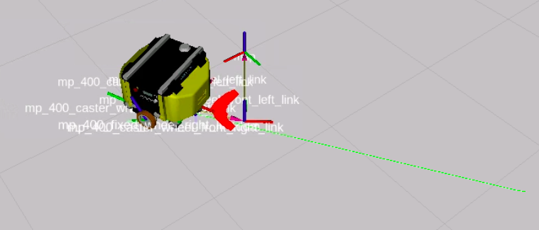

# Servidor controlador em profundidade
O `controller_server` é onde as velocidades da roda são calculadas. Esta é a chave para resolver problemas quando seu robô não se comporta corretamente. Então você precisa dominar como isso funciona.

Se você verificar o arquivo de configuração `controller_server`, verá a configuração geral dele no início:
```python
controller_server:
  ros__parameters:
    use_sim_time: True
    controller_frequency: 20.0
    min_x_velocity_threshold: 0.001
    min_y_velocity_threshold: 0.5
    min_theta_velocity_threshold: 0.001
    failure_tolerance: 0.3
    progress_checker_plugin: "progress_checker"
    goal_checker_plugins: ["general_goal_checker"] 
    controller_plugins: ["FollowPath"]
```

Essa parte indica os parâmetros básicos para controlar o `controller_server`. No final desta parte, você pode ver três plugins importantes sendo usados:

* o progress_checker_plugin
* o goal_checker_plugins
* o controller_plugins
Você precisa dominá-los para adaptar o Nav2 às suas necessidades.

> IMPORTANTE: Enquanto isso, o `progress_checker_plugin` requer que um único plugin seja especificado. O `goal_checker_plugins` e o `controller_plugins` podem conter mais de um plugin.

## Os três plugins principais do controller_server
O controller_server controla seu comportamento usando esses três plugins. Portanto, você deve especificar esses três plug-ins para sua tarefa de navegação.

### O progress_checker_plugin
Este plugin verifica se o robô está progredindo em direção ao objetivo, ou seja, se o robô está fazendo alguma melhoria para atingir o objetivo.

Este plugin é chamado pelo controlador.

Atualmente, há apenas um plug-in disponível no Nav2 como `progress_check_plugin`: o plug-in `SimpleProgressChecker`.
```yaml
     # Progress checker parameters
     progress_checker:
          plugin: "nav2_controller::SimpleProgressChecker"
          required_movement_radius: 0.5
          movement_time_allowance: 10.0
```
O `nav2_controller` fornece o plug-in atualmente disponível. Ele verifica se o robô moveu uma certa quantidade (especificada no required_movement_radius) em um determinado período de tempo (que você especificou no `motion_time_allowance`).

Este é um plugin simples. Não verifica se o movimento faz sentido ou se é em direção ao objetivo. Em vez disso, ele verifica se o robô se moveu pelo menos `required_movement_radius` metros em `motion_time_allowance` segundos.

Este plugin é básico. Você pode tentar implementar plugins mais complexos por conta própria. Revise a unidade sobre como criar seus próprios plug-ins para Nav2.

### O goal_checker_plugins
Este plug-in verifica se o robô alcançou a pose desejada dentro de tolerâncias específicas. Lembre-se que diminuir muito as tolerâncias pode fazer com que o robô nunca atinja a meta. Por outro lado, aumentar demais as tolerâncias resultaria em uma posição final muito distante do esperado.

O `nav2_controller` fornece o plug-in atualmente disponível. Atualmente, o Nav2 fornece duas implementações de `goal_checker_plugins`:

#### O SimpleGoalChecker
Veja um exemplo de parâmetros de configuração:
```yaml
     # Goal checker parameters
     general_goal_checker:
          stateful: True
          plugin: "nav2_controller::SimpleGoalChecker"
          xy_goal_tolerance: 0.25    # m
          yaw_goal_tolerance: 0.25   # rad
```
Verifique se o robô está dentro da faixa de meta indicada pelos parâmetros de tolerância. Então, você pode especificar as tolerâncias para a posição e a orientação alcançada.

#### O Verificador de Golos Parados
Exemplo de parâmetros de configuração:
```yaml
# Goal checker parameters
     general_goal_checker:
          stateful: True
          plugin: "nav2_controller::StopedGoalChecker"
          xy_goal_tolerance: 0.25        # m
          yaw_goal_tolerance: 0.25       # rad
          trans_stopped_velocity: 0.25   # m/s
          rot_stopped_velocity: 0.25     # rad/s
```
Semelhante ao anterior, verifica se o robô está dentro das tolerâncias ao objetivo e se as velocidades (linear e rotacional) estão abaixo do valor indicado nos parâmetros.

### Os controller_plugins
Eles são responsáveis por calcular o plano local, as velocidades para as rodas seguirem aquele caminho e considerar os obstáculos de perto.

No momento, existem dois `controller_plugins` disponíveis:

#### O controlador DWBLocalPlanner
Este controlador é fornecido por `dwb_core`. É uma implementação do algoritmo de prevenção de obstáculos DWA.

Exemplo de parâmetros de configuração:
```yaml
     # DWB parameters
     FollowPath:
          plugin: "dwb_core::DWBLocalPlanner"
          debug_trajectory_details: True
          trajectory_generator_name: “dwb_plugins::StandardTrajectoryGenerator”
          min_vel_x: 0.0
          min_vel_y: 0.0
          max_vel_x: 0.26
          max_vel_y: 0.0
          max_vel_theta: 1.0
          min_speed_xy: 0.0
          max_speed_xy: 0.26
          min_speed_theta: 0.0
          acc_lim_x: 2.5
          acc_lim_y: 0.0
          acc_lim_theta: 3.2
          decel_lim_x: -2.5
          decel_lim_y: 0.0
          decel_lim_theta: -3.2
          vx_samples: 20
          vy_samples: 5
          vtheta_samples: 20
          sim_time: 1.7
          linear_granularity: 0.05
          angular_granularity: 0.025
          transform_tolerance: 0.2
          xy_goal_tolerance: 0.25
          trans_stopped_velocity: 0.25
          short_circuit_trajectory_evaluation: True
          stateful: True
          critics: ["RotateToGoal", "Oscillation", "BaseObstacle", "GoalAlign", "PathAlign", "PathDist", "GoalDist"]
          BaseObstacle.scale: 0.02
          PathAlign.scale: 32.0
          PathAlign.forward_point_distance: 0.1
          GoalAlign.scale: 24.0
          GoalAlign.forward_point_distance: 0.1
          PathDist.scale: 32.0
          GoalDist.scale: 24.0
          RotateToGoal.scale: 32.0
          RotateToGoal.slowing_factor: 5.0
          RotateToGoal.lookahead_time: -1.0
```

Para uma explicação completa de cada um dos parâmetros, consulte a [documentação oficial](https://navigation.ros.org/configuration/packages/dwb-params/controller.html) aqui.

As partes mais importantes de sua configuração são explicadas aqui: o plugin do gerador de trajetória e os críticos de trajetória.

#### Plugin Gerador de Trajetória

Este plugin é o que implementa o cálculo da trajetória local. No momento, apenas dois plugins possíveis estão disponíveis:

#### Definições da documentação oficial

* nStandardTrajectoryGenerator: Isso é semelhante ao algoritmo de implantação de trajetória usado em base_local_planner no ROS 1.
* LimitedAccelGenerator: É semelhante ao DWA usado no ROS 1.

#### Críticos de Trajetória DWB
Críticos são pequenos plugins que afetam o comportamento do DWB para forçar mais ou menos o seguimento da trajetória global, principalmente quando diante de obstáculos inesperados que ainda não constam no Costmap global.

Cada crítico pontuará as diferentes trajetórias calculadas pelo plugin do gerador de trajetória.

#### Definições da documentação oficial

* **BaseObstacle**: pontua uma trajetória com base em onde o caminho passa sobre o Costmap. Para usar isso corretamente, você deve usar a camada de inflação no Costmap para expandir os obstáculos pelo raio do robô.
* **GoalAlign**: pontua uma trajetória com base em quão bem alinhada a trajetória está com a pose de gol.
* **GoalDist**: pontua uma trajetória com base em quão perto a trajetória leva o robô à pose de meta.
* **ObstacleFootprint**: Marca uma trajetória com base na verificação de que todos os pontos ao longo da pegada do robô não tocam um obstáculo marcado no Costmap.
* **Oscillation**: Impede que o robô se mova para frente e para trás.
* **PathAlign**: pontua uma trajetória com base em quão bem ela está alinhada ao caminho fornecido pelo planejador global.
* **PathDist**: pontua uma trajetória com base em quão longe ela termina do caminho fornecido pelo planejador global.
* **PreferForward**: Pontua trajetórias que movem o robô para frente mais altamente
* **RotateToGoal**: permite apenas que o robô gire para a orientação do objetivo quando estiver suficientemente próximo do local do objetivo
* **Twirling**: Impede que os robôs holonômicos girem enquanto progridem para o objetivo.

Diferença entre usar um crítico ou outro.

1. Primeiro, configure o Costmap global sem o plug-in do obstáculo_layer. Remova-o do arquivo de configuração. Ao removê-lo, o planejador global não considerará novos obstáculos detectados para seu planejamento.
2. Recompile, crie e reinicie o sistema de navegação. Forneça uma localização inicial usando RVIZ.
3. Agora, gere o cone novamente, caso ainda não o tenha, com a seguinte instrução:
```bash
source /home/simulations/ros2_sims_ws/install/setup.bash
ros2 run gazebo_ros spawn_entity.py -entity construction_cone -database construction_cone
```
4. Coloque o robô na frente do cone a aproximadamente 1 metro.
5. Agora, use RVIZ para fornecer uma meta ao robô. O gol deve estar na frente do robô, do outro lado do cone. O caminho planejado deve ser o seguinte:

Isso significa que o planejador de caminho agora não está considerando o novo obstáculo (porque você desativou o `obstáculo_layer`). Então o caminho passa por cima dele.

Se tudo estiver correto, o controlador deve levar isso em consideração e contornar o obstáculo, pois esse obstáculo ESTÁ INCLUÍDO no Costmap local. No entanto, não é isso que você vai conseguir. Em vez disso, o robô irá parar na frente do obstáculo, sem evitá-lo.

<div align="center">
     
</div>

O motivo é que o crítico chamado `PathAlign` está forçando demais para fazer o robô seguir a trajetória computada (seja ela qual for), para que ele siga reto. Porém, o crítico `BaseObstacle` impede que o robô bata no obstáculo, mas isso não resolve a situação, e o robô não consegue atingir a meta.

Remova o crítico `PathAlign` da configuração do controlador.
Recompile, crie e reinicie o sistema de navegação.
Repita a mesma situação: coloque o robô na frente do cone. Selecione um caminho na frente dele e do outro lado. O que acontece?
Você deve obter algo como isto:

#### A Pursuit Pursuit Regulamentada

Este plugin é feito especificamente para aplicações industriais onde a segurança na velocidade é obrigatória. Ele regula as velocidades lineares pela curvatura do caminho para ajudar a reduzir o `overshoot` em altas velocidades em curvas cegas, permitindo que as operações sejam muito mais seguras.

Exemplo de parâmetros de configuração:
```yaml
    FollowPath:
      plugin: "nav2_regulated_pure_pursuit_controller::RegulatedPurePursuitController"
      desired_linear_vel: 0.5
      lookahead_dist: 0.6
      min_lookahead_dist: 0.3
      max_lookahead_dist: 0.9
      lookahead_time: 1.5
      rotate_to_heading_angular_vel: 1.8
      transform_tolerance: 0.1
      use_velocity_scaled_lookahead_dist: false
      min_approach_linear_velocity: 0.05
      max_allowed_time_to_collision_up_to_carrot: 1.0
      use_regulated_linear_velocity_scaling: true
      use_cost_regulated_linear_velocity_scaling: false
      regulated_linear_scaling_min_radius: 0.9
      regulated_linear_scaling_min_speed: 0.25
      use_rotate_to_heading: true
      allow_reversing: false
      rotate_to_heading_min_angle: 0.785
      max_angular_accel: 3.2
      max_robot_pose_search_dist: 10.0
      use_interpolation: false
```

Verifique a documentação completa para esse plug-in [aqui](https://navigation.ros.org/configuration/packages/configuring-regulated-pp.html).