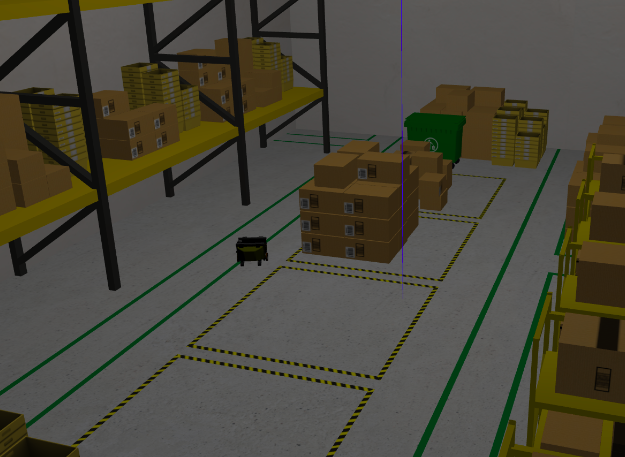
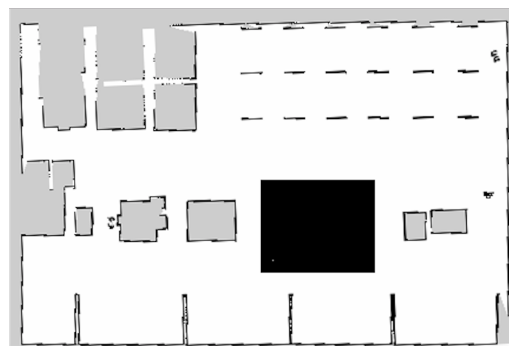
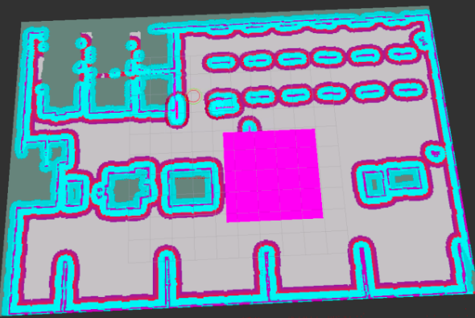
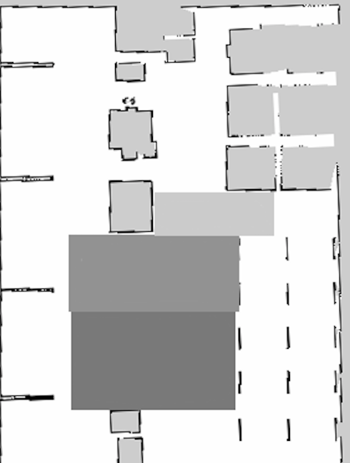
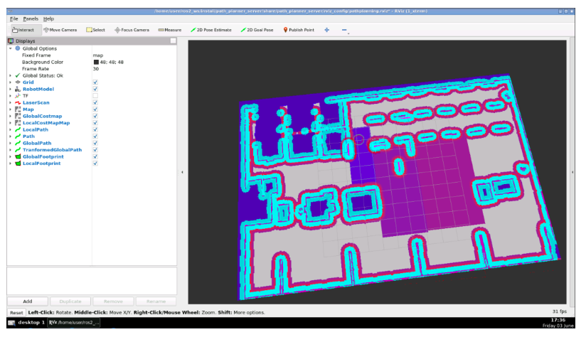
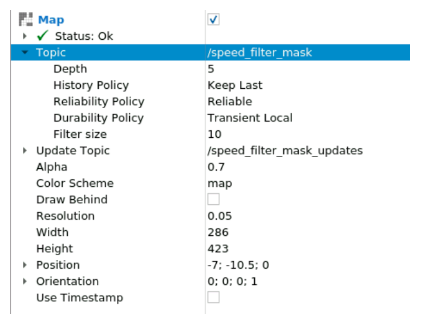

# Novos recursos do Nav2

* Operações Nav2 básicas por meio da API Simple Commander
* Uso dos plugins Waypoint Follower e Task Executor via FollowWaypoints
* Introdução às zonas de exclusão e zonas com restrição de velocidade

<div align="center">
     
</div>

## Iniciar pacote

```bash
cd ~/ros2_ws/src
git clone https://bitbucket.org/theconstructcore/nav2_pkgs.git
```
Depois de baixar o repositório, certifique-se de compilar seu espaço de trabalho:
```bash
cd ~/ros2_ws/
colcon build
source install/setup.bash
```
Agora você está pronto para iniciar a navegação!
```bash
ros2 launch path_planner_server navigation.launch.py
```
Defina a posição inicial do robô usando a ferramenta `2D Pose Estimation`. Você também pode fazer isso programaticamente para um sistema real que você pode simular (em um novo terminal):
```bash
ros2 topic pub /initialpose geometry_msgs/msg/PoseWithCovarianceStamped "{header: {stamp: {sec: 0}, frame_id: 'map'}, pose: {pose: {posição: {x: 3,45, y: 2,15, z: 0,0 }, orientação: {z: 1,0, w: 0,0}}}}"
```
Agora você deve ver o robô inicializado em sua posição e os Costmaps atualizados no RVIZ2. Use o botão Objetivo do `Nav2` para solicitar que o robô vá para um objetivo específico para testá-lo!

## API de comando simples
O Nav2 Simple Commander fornece um conjunto de métodos para interagir por meio do código Python3 com o sistema Nav2. Portanto, você pode pensar nisso como uma API Python que permite interagir facilmente com a pilha de navegação.

Métodos importantes para criar um aplicativo para um robô de navegação. Isso inclui: `goToPose()`, `goThroughPoses()` e `followWaypoints()`.

Instalar o módulo Nav2 Simple Commander manualmente. Você pode fazer isso com os seguintes comandos:
```bash
sudo apt update
sudo apt install ros-<ROS_DISTRO>-nav2-simple-commander
```

### Navegar para pose (Navigate To Pose)
A ação `NavigateToPose` é mais adequada para solicitações de navegação ponto a ponto ou outras tarefas que podem ser representadas em uma árvore de comportamento com uma pose de condição de limite, como acompanhamento de objeto dinâmico.

Encontre abaixo a estrutura da ação NavigateToPose.
>    NavigateToPose.action
```bash
# goal definition
geometry_msgs/PoseStamped pose
string behavior_tree
---
# result definition
std_msgs/Empty result
---
# feedback definition
geometry_msgs/PoseStamped current_pose
builtin_interfaces/Duration navigation_time
builtin_interfaces/Duration estimated_time_remaining
int16 number_of_recoveries
float32 distance_remaining
```

As entradas primárias da ação são a pose para a qual você gostaria que o robô navegasse e a (opcional) `behavior_tree` a ser usada. Ele usa a árvore de comportamento padrão no BT Navigator se nenhuma for especificada. Durante a execução da ação, você obtém feedback com informações essenciais como a pose do robô, quanto tempo passou, o tempo restante estimado, a distância restante e o número de recuperações executadas durante a navegação até o objetivo. Essas informações podem ser usadas para tomar boas decisões de autonomia ou acompanhar o progresso.

#### Demonstração
Na demonstração a seguir, você usa a ação NavigateToPose para que seu robô conduza de seu ponto de parada até uma prateleira para que um humano coloque um item no robô. Em seguida, você dirigirá até o porta-paletes para envio no próximo caminhão fora do armazém.

Comece criando um novo pacote chamado **nav2_new_features**, onde você coloca todos os scripts criados nesta unidade.
```bash
ros2 pkg create --build-type ament_python nav2_new_features --dependencies rclpy geometry_msgs
```
Agora, dentro deste pacote, crie uma nova pasta chamada scripts e adicione um script Python chamado browse_to_pose.py:
>    navigate_to_pose.py
```python
#! /usr/bin/env python3
# Copyright 2021 Samsung Research America
#
# Licensed under the Apache License, Version 2.0 (the "License");
# you may not use this file except in compliance with the License.
# You may obtain a copy of the License at
#
#     http://www.apache.org/licenses/LICENSE-2.0
#
# Unless required by applicable law or agreed to in writing, software
# distributed under the License is distributed on an "AS IS" BASIS,
# WITHOUT WARRANTIES OR CONDITIONS OF ANY KIND, either express or implied.
# See the License for the specific language governing permissions and
# limitations under the License.

import time
from copy import deepcopy

from geometry_msgs.msg import PoseStamped
from rclpy.duration import Duration
import rclpy

from nav2_simple_commander.robot_navigator import BasicNavigator, TaskResult

# Shelf positions for picking
shelf_positions = {
    "shelf_A": [-3.829, -7.604],
    "shelf_B": [-3.791, -3.287],
    "shelf_C": [-3.791, 1.254],
    "shelf_D": [-3.24, 5.861]}

# Shipping destination for picked products
shipping_destinations = {
    "recycling": [-0.205, 7.403],
    "pallet_jack7": [-0.073, -8.497],
    "conveyer_432": [6.217, 2.153],
    "frieght_bay_3": [-6.349, 9.147]}

'''
Basic item picking demo. In this demonstration, the expectation
is that a person is waiting at the item shelf to put the item on the robot
and at the pallet jack to remove it
(probably with a button for 'got item, robot go do next task').
'''


def main():
    # Recieved virtual request for picking item at Shelf A and bringing to
    # worker at the pallet jack 7 for shipping. This request would
    # contain the shelf ID ("shelf_A") and shipping destination ("pallet_jack7")
    ####################
    request_item_location = 'shelf_C'
    request_destination = 'pallet_jack7'
    ####################

    rclpy.init()

    navigator = BasicNavigator()

    # Set your demo's initial pose
    initial_pose = PoseStamped()
    initial_pose.header.frame_id = 'map'
    initial_pose.header.stamp = navigator.get_clock().now().to_msg()
    initial_pose.pose.position.x = 3.45
    initial_pose.pose.position.y = 2.15
    initial_pose.pose.orientation.z = 1.0
    initial_pose.pose.orientation.w = 0.0
    navigator.setInitialPose(initial_pose)

    # Wait for navigation to activate fully
    navigator.waitUntilNav2Active()

    shelf_item_pose = PoseStamped()
    shelf_item_pose.header.frame_id = 'map'
    shelf_item_pose.header.stamp = navigator.get_clock().now().to_msg()
    shelf_item_pose.pose.position.x = shelf_positions[request_item_location][0]
    shelf_item_pose.pose.position.y = shelf_positions[request_item_location][1]
    shelf_item_pose.pose.orientation.z = 1.0
    shelf_item_pose.pose.orientation.w = 0.0
    print('Received request for item picking at ' + request_item_location + '.')
    navigator.goToPose(shelf_item_pose)

    # Do something during your route
    # (e.x. queue up future tasks or detect person for fine-tuned positioning)
    # Print information for workers on the robot's ETA for the demonstration
    i = 0
    while not navigator.isTaskComplete():
        i = i + 1
        feedback = navigator.getFeedback()
        if feedback and i % 5 == 0:
            print('Estimated time of arrival at ' + request_item_location +
                  ' for worker: ' + '{0:.0f}'.format(
                      Duration.from_msg(feedback.estimated_time_remaining).nanoseconds / 1e9)
                  + ' seconds.')

    result = navigator.getResult()
    if result == TaskResult.SUCCEEDED:
        print('Got product from ' + request_item_location +
              '! Bringing product to shipping destination (' + request_destination + ')...')
        shipping_destination = PoseStamped()
        shipping_destination.header.frame_id = 'map'
        shipping_destination.header.stamp = navigator.get_clock().now().to_msg()
        shipping_destination.pose.position.x = shipping_destinations[request_destination][0]
        shipping_destination.pose.position.y = shipping_destinations[request_destination][1]
        shipping_destination.pose.orientation.z = 1.0
        shipping_destination.pose.orientation.w = 0.0
        navigator.goToPose(shipping_destination)

    elif result == TaskResult.CANCELED:
        print('Task at ' + request_item_location +
              ' was canceled. Returning to staging point...')
        initial_pose.header.stamp = navigator.get_clock().now().to_msg()
        navigator.goToPose(initial_pose)

    elif result == TaskResult.FAILED:
        print('Task at ' + request_item_location + ' failed!')
        exit(-1)

    while not navigator.isTaskComplete():
        pass

    exit(0)


if __name__ == '__main__':
    main()
```
Código extraído da documentação [oficial do Nav2](https://github.com/ros-planning/navigation2/tree/main/nav2_simple_commander/nav2_simple_commander).

Observe o código e identifique onde você está usando a API Simple Commander e qual deve ser o comportamento esperado do robô. Não se preocupe se você não entender todo o código, pois ele será revisto posteriormente na unidade.

Compile o pacote:
```bash
cd ros2_ws
colcon build
source install/setup.bash
```
Teste o novo código! Primeiro, você precisa ter o sistema de navegação instalado e funcionando.
```bash
ros2 launch path_planner_server navigation.launch.py
```
Neste caso, você não precisa definir a pose inicial do robô a partir do RVIZ2, pois o script Python fez isso.

Em outro terminal, execute o script Python:
```bash
python3 ros2_ws/src/nav2_new_features/scripts/navigate_to_pose.py
```

#### Revisão de código
Analise com mais profundidade o que está acontecendo no script Python que você executou. Preste atenção especial à parte em que você usa a API. Comece pelo início:
```python
from nav2_simple_commander.robot_navigator import BasicNavigator, TaskResult
```
Esta linha de código é uma das mais importantes. Você está importando a classe BasicNavigator, que fornece acesso à API Simple Commander. Portanto, sempre que quiser usar a API Simple Commander, importe esta classe.
```python
navigator = BasicNavigator()
```
Claro, você também precisa instanciar a classe para usá-la.
```python
navigator.setInitialPose(initial_pose)
```
Aqui, você está usando o método setInitialPose(), que irá definir a pose inicial do robô (o mesmo que fazer com a ferramenta `2D Pose Estimate` do RVIZ2). Neste caso, você está especificando a pose inicial na variável `initial_pose` (deve ser do tipo `PoseStamped`).
```python
navigator.waitUntilNav2Active()
```
O método `waitUntilNav2Active()` bloqueia a execução do programa até que o Nav2 esteja totalmente online e os nós do ciclo de vida estejam no estado ativo.
```python
navigator.goToPose(shelf_item_pose)
```
Aqui, você está usando o método `goToPose()`, que solicita que o robô navegue até a pose especificada. Neste caso, você está especificando a pose na variável `shelf_item_pose` (deve ser do tipo `PoseStamped`).
```python
while not navigator.isTaskComplete():
```
O método `isNavComplete()` retornará True somente após o robô atingir a meta. Ele retornará `False` enquanto ainda estiver em processo.
```python
feedback = navigator.getFeedback()
```
O método `getFeedback()` retorna o feedback do servidor de ação `NavigateToPose`.
```python
result = navigator.getResult()
```
O método `getResult()` retorna o resultado do servidor de ação `NavigateToPose`.

Você pode revisar todos os métodos do Nav2 Simple Commander [aqui]( https://navigation.ros.org/commander_api/index.html)

### Navegue pelas poses (Navigate Through Poses)
A ação `NavigateThroughPoses` é mais adequada para solicitações de navegação restritas por pose ou outras tarefas representadas em uma árvore de comportamento com um conjunto de poses. Isso NÃO irá parar em cada waypoint, mas passar por eles como uma restrição de pose.

>  NavigateThroughPoses.action
```bash
# goal definition
geometry_msgs/PoseStamped[] poses
string behavior_tree
---
# result definition
std_msgs/Empty result
---
# feedback definition
geometry_msgs/PoseStamped current_pose
builtin_interfaces/Duration navigation_time
builtin_interfaces/Duration estimated_time_remaining
int16 number_of_recoveries
float32 distance_remaining
int16 number_of_poses_remaining
```

As entradas da ação são quase idênticas a NavigateToPose, exceto que agora você recebe um vetor de poses. O feedback também é semelhante, contendo apenas o novo campo `number_of_poses_remaining` para rastrear o progresso através dos pontos de passagem.

#### Demonstração
Nesta demonstração, use a ação `NavigateThroughPoses` para que seu robô dirija de seu ponto de parada por todo o armazém em uma rota conhecida. A ação NavigateThroughPoses, como NavigateToPose, pode desviar na presença de obstáculos, como você verá com a paleteira nesta demonstração. Depois de terminar o percurso, recomeça e continua até parar.

Crie um novo script Python chamado `browse_through_poses.py`:
> navigate_through_poses.py
```python
#! /usr/bin/env python3
# Copyright 2021 Samsung Research America
#
# Licensed under the Apache License, Version 2.0 (the "License");
# you may not use this file except in compliance with the License.
# You may obtain a copy of the License at
#
#     http://www.apache.org/licenses/LICENSE-2.0
#
# Unless required by applicable law or agreed to in writing, software
# distributed under the License is distributed on an "AS IS" BASIS,
# WITHOUT WARRANTIES OR CONDITIONS OF ANY KIND, either express or implied.
# See the License for the specific language governing permissions and
# limitations under the License.

import time
from copy import deepcopy

from geometry_msgs.msg import PoseStamped
from rclpy.duration import Duration
import rclpy

from nav2_simple_commander.robot_navigator import BasicNavigator, TaskResult

'''
Basic security route patrol demo. In this demonstration, the expectation
is that there are security cameras mounted on the robots recording or being
watched live by security staff.
'''


def main():
    rclpy.init()

    navigator = BasicNavigator()

    # Security route, probably read in from a file for a real application
    # from either a map or drive and repeat.
    security_route = [
        [1.792, 2.144],
        [1.792, -5.44],
        [1.792, -9.427],
        [-3.665, -9.427],
        [-3.665, -4.303],
        [-3.665, 2.330],
        [-3.665, 9.283]]

    # Set your demo's initial pose
    initial_pose = PoseStamped()
    initial_pose.header.frame_id = 'map'
    initial_pose.header.stamp = navigator.get_clock().now().to_msg()
    initial_pose.pose.position.x = 3.45
    initial_pose.pose.position.y = 2.15
    initial_pose.pose.orientation.z = 1.0
    initial_pose.pose.orientation.w = 0.0
    navigator.setInitialPose(initial_pose)

    # Wait for navigation to activate fully 
    navigator.waitUntilNav2Active()

    # Do security route until dead
    while rclpy.ok():
        # Send your route
        route_poses = []
        pose = PoseStamped()
        pose.header.frame_id = 'map'
        pose.header.stamp = navigator.get_clock().now().to_msg()
        pose.pose.orientation.w = 1.0
        for pt in security_route:
            pose.pose.position.x = pt[0]
            pose.pose.position.y = pt[1]
            route_poses.append(deepcopy(pose))
        navigator.goThroughPoses(route_poses)

        # Do something during your route (e.x. AI detection on camera images for anomalies)
        # Print ETA for the demonstration
        i = 0
        while not navigator.isTaskComplete():
            i = i + 1
            feedback = navigator.getFeedback()
            if feedback and i % 5 == 0:
                print('Estimated time to complete current route: ' + '{0:.0f}'.format(
                      Duration.from_msg(feedback.estimated_time_remaining).nanoseconds / 1e9)
                      + ' seconds.')

                # Some failure mode, must stop since the robot is clearly stuck
                if Duration.from_msg(feedback.navigation_time) > Duration(seconds=180.0):
                    print('Navigation has exceeded timeout of 180s, canceling the request.')
                    navigator.cancelTask()

        # If at the end of the route, reverse the route to restart
        security_route.reverse()

        result = navigator.getResult()
        if result == TaskResult.SUCCEEDED:
            print('Route complete! Restarting...')
        elif result == TaskResult.CANCELED:
            print('Security route was canceled, exiting.')
            exit(1)
        elif result == TaskResult.FAILED:
            print('Security route failed! Restarting from the other side...')

    exit(0)


if __name__ == '__main__':
    main()
```
Código extraído da documentação [oficial do Nav2](https://github.com/ros-planning/navigation2/tree/main/nav2_simple_commander/nav2_simple_commander).

```bash
ros2 launch path_planner_server navigation.launch.py
```

No segundo terminal, execute o script Python:
```bash
python3 ros2_ws/src/nav2_new_features/scripts/navigate_through_poses.py
```
#### Revisão de código
Como você pode ver, o código é semelhante ao primeiro script, com algumas modificações.
```yaml
security_route = [
        [1.792, 2.144],
        [1.792, -5.44],
        [1.792, -9.427],
        [-3.665, -9.427],
        [-3.665, -4.303],
        [-3.665, 2.330],
        [-3.665, 9.283]]
```
Primeiro, defina um conjunto de poses que você deseja que o robô faça.
```python
for pt in security_route:
        pose.pose.position.x = pt[0]
        pose.pose.position.y = pt[1]
        route_poses.append(deepcopy(pose))
```
Anexe essas poses a um vetor route_poses. Observe que cada pose deve ser definida como uma mensagem PoseStamped.
```python
navigator.goThroughPoses(route_poses)
```
Em seguida, use este vetor como entrada para chamar o método `goThroughPoses()`. Este método solicita que o robô navegue por um conjunto de poses.
```python
if Duration.from_msg(feedback.navigation_time) > Duration(seconds=180.0):
                print('Navigation has exceeded timeout of 180s, canceling the request.')
                navigator.cancelTask()
```
Observe que neste script, você também está adicionando um tempo limite. Se a tarefa de navegação demorar mais de 180 segundos, você cancelará a tarefa atual usando o método cancelTask().

### Waypoint Following
A ação `FollowWaypoints` é mais adequada para tarefas simples de autonomia onde você deseja parar em cada waypoint e executar um comportamento (por exemplo, pausar por 2 segundos, tirar uma foto, esperar que alguém coloque uma caixa sobre ela, etc.). O servidor seguidor de ponto de referência Nav2 contém plug-ins `TaskExecutor` para executar uma tarefa em cada ponto de referência.
> FollowWaypoints.action
```bash
# goal definition
geometry_msgs/PoseStamped[] poses
---
# result definition
int32[] missed_waypoints
---
# feedback definition
uint32 current_waypoint
```
Como você pode ver, a API é simples. Leva no conjunto de poses, onde a última pose é o objetivo final. O feedback é o ID do ponto de referência atual que está sendo executado e retorna um vetor de IDs de ponto de referência perdidos no final, caso algum não seja navegável.

#### Inicie a ação FollowWaypoints
A ação **FollowWaypoints** não é iniciada por padrão com o sistema de navegação. Portanto, adicione-o ao seu arquivo de inicialização de navegação se desejar usá-lo.

Comece criando um arquivo de configuração para ele. Na pasta config do pacote path_planner_server, adicione um novo arquivo de configuração chamado `waypoint_follower.yaml`.
> waypoint_follower.yaml
```yaml
waypoint_follower:
  ros__parameters:
    loop_rate: 20
    stop_on_failure: false
    waypoint_task_executor_plugin: "wait_at_waypoint"
    wait_at_waypoint:
      plugin: "nav2_waypoint_follower::WaitAtWaypoint"
      enabled: True
      waypoint_pause_duration: 200
```

Neste exemplo, carregue o plugin padrão WaitAtWaypoint. Esses plug-ins pausam o robô por um tempo especificado após atingir cada ponto de referência. O tempo de espera pode ser configurado com o parâmetro waypoint_pause_duration (especificado em milissegundos).

Existem outros plugins disponíveis, como PhotoAtWaypoint ou InputAtWaypoint. Se você quiser aprender mais sobre eles, revise a documentação oficial aqui.

Agora é hora de adicionar a ação FollowWaypoints ao seu arquivo de inicialização. Para isso, algumas modificações serão necessárias.

Primeiro, adicione o novo caminho do arquivo de configuração:
> Add to navigation.launch.py
```python
waypoint_follower_yaml = os.path.join(get_package_share_directory(
        'path_planner_server'), 'config', 'waypoint_follower.yaml')
```
Em seguida, adicione um novo elemento Node para iniciar o servidor `waypoint_follower`:
> Add to navigation.launch.py
```python
Node(
    package='nav2_waypoint_follower',
    executable='waypoint_follower',
    name='waypoint_follower',
    output='screen',
    parameters=[waypoint_follower_yaml]),
```
Finalmente, e importante, você precisa adicionar o novo nó a ser iniciado no gerenciador de ciclo de vida:
> Add to navigation.launch.py
```python
Node(
    package='nav2_lifecycle_manager',
    executable='lifecycle_manager',
    name='lifecycle_manager',
    output='screen',
    parameters=[{'autostart': True},
                {'node_names': ['map_server',
                                'amcl',
                                'controller_server',
                                'planner_server',
                                'recoveries_server',
                                'bt_navigator',
                                'waypoint_follower']}])
```
Compile depois de adicionar as novas modificações.
```bash
cd ros2_ws
colcon build
source install/setup.bash
```
#### Demonstração
Nesta demonstração, use a ação FollowWaypoints para que seu robô conduza de seu ponto de parada para um conjunto de pontos de inspeção. O plug-in `TaskExecutor` do seguidor de waypoint Nav2 obtém imagens e varreduras de RFID das prateleiras que podem ser analisadas para gerenciamento de estoque.

Crie um novo script Python chamado `follow_waypoints.py`:
> follow_waypoints.py
```python
#! /usr/bin/env python3
# Copyright 2021 Samsung Research America
#
# Licensed under the Apache License, Version 2.0 (the "License");
# you may not use this file except in compliance with the License.
# You may obtain a copy of the License at
#
#     http://www.apache.org/licenses/LICENSE-2.0
#
# Unless required by applicable law or agreed to in writing, software
# distributed under the License is distributed on an "AS IS" BASIS,
# WITHOUT WARRANTIES OR CONDITIONS OF ANY KIND, either express or implied.
# See the License for the specific language governing permissions and
# limitations under the License.

import time
from copy import deepcopy

from geometry_msgs.msg import PoseStamped
from rclpy.duration import Duration
import rclpy

from nav2_simple_commander.robot_navigator import BasicNavigator, TaskResult


def main():
    rclpy.init()

    navigator = BasicNavigator()

     # Inspection route, probably read in from a file for a real application
     # from either a map or drive and repeat.
     inspection_route = [
          [3.461, -0.450],
          [3.461, -2.200],
          [3.661, -4.121],
          [3.661, -5.850]]

    # Set your demo's initial pose
    initial_pose = PoseStamped()
    initial_pose.header.frame_id = 'map'
    initial_pose.header.stamp = navigator.get_clock().now().to_msg()
    initial_pose.pose.position.x = 3.45
    initial_pose.pose.position.y = 2.15
    initial_pose.pose.orientation.z = 1.0
    initial_pose.pose.orientation.w = 0.0
    navigator.setInitialPose(initial_pose)

    # Wait for navigation to activate fully 
    navigator.waitUntilNav2Active()

    # Send your route
    inspection_points = []
    inspection_pose = PoseStamped()
    inspection_pose.header.frame_id = 'map'
    inspection_pose.header.stamp = navigator.get_clock().now().to_msg()
    inspection_pose.pose.orientation.z = 1.0
    inspection_pose.pose.orientation.w = 0.0
    for pt in inspection_route:
        inspection_pose.pose.position.x = pt[0]
        inspection_pose.pose.position.y = pt[1]
        inspection_points.append(deepcopy(inspection_pose))
    nav_start = navigator.get_clock().now()
    navigator.followWaypoints(inspection_points)

    # Do something during your route (e.x. AI to analyze stock information or upload to the cloud)
    # Print the current waypoint ID for the demonstration
    i = 0
    while not navigator.isTaskComplete():
        i = i + 1
        feedback = navigator.getFeedback()
        if feedback and i % 5 == 0:
            print('Executing current waypoint: ' +
                  str(feedback.current_waypoint + 1) + '/' + str(len(inspection_points)))

    result = navigator.getResult()
    if result == TaskResult.SUCCEEDED:
        print('Inspection of shelves complete! Returning to start...')
    elif result == TaskResult.CANCELED:
        print('Inspection of shelving was canceled. Returning to start...')
        exit(1)
    elif result == TaskResult.FAILED:
        print('Inspection of shelving failed! Returning to start...')

    # go back to start
    initial_pose.header.stamp = navigator.get_clock().now().to_msg()
    navigator.goToPose(initial_pose)
    while not navigator.isTaskComplete():
        pass

    exit(0)


if __name__ == '__main__':
    main()
```
Código extraído da documentação [oficial do Nav2](https://github.com/ros-planning/navigation2/tree/main/nav2_simple_commander/nav2_simple_commander).

```bash
ros2 launch path_planner_server navigation.launch.py
```
Execute o comando:
```bash
ros2 action list
```
Deverá ver os /follow_waypoints entre a lista de ações disponíveis.

#### Revisão de código
```python
navigator.followWaypoints(inspection_points)
```
Como você fez antes, use o vetor `inspector_points` como entrada para chamar o método followWaypoints(). Este método solicita que o robô siga um conjunto de waypoints (lista de mensagens `PoseStamped`). Isso executará o plug-in `TaskExecutor` escolhido em cada pose.
```python
i = 0
while not navigator.isTaskComplete():
    i = i + 1
    feedback = navigator.getFeedback()
    if feedback and i % 5 == 0:
        print('Executing current waypoint: ' +
              str(feedback.current_waypoint + 1) + '/' + str(len(inspection_points)))
```
Neste código, você está imprimindo o waypoint atual do robô. No entanto, lembre-se de que você pode fazer outras tarefas (mais significativas) aqui.

### Filtros de mapa de custo (Costmap Filters)
O Nav2 fornece um conjunto interessante de recursos na forma de filtros Costmap. Você pode pensar em um filtro Costmap como uma camada extra (máscara) adicionada aos seus Costmaps regulares. O interessante é que, com essa máscara extra, você pode fazer com que seu robô tenha um comportamento específico dependendo da área (zona) do mapa.

Por exemplo, você pode fazer com que o robô evite ir para uma determinada zona do mapa (também conhecida como Keepout Zones) ou limitar a velocidade do robô dependendo da área do mapa (Speed Restricted Zones).

#### Máscara de Proteção
**Editar o mapa**
Revise como fazer o robô evitar certas zonas do ambiente usando um `filtro Keepout Mask`.

A Keepout Mask é um arquivo semelhante a um mapa, contendo a máscara a ser aplicada como Keepout Zone. Portanto, para aplicar uma máscara, você precisará de um arquivo de mapa do ambiente. Então comece baixando o arquivo map_rotated.pgm. Você pode baixar facilmente o arquivo do IDE clicando com o botão direito nele e selecionando a opção Download.

Agora, você pintará a área do mapa que deseja que seu robô evite em **PRETO**. Um exemplo simples é o seguinte:

<div align="center">
     
</div>

Você pode perguntar: "Por que tenho que pintar de preto?" A sombra de cada pixel na máscara significa informações codificadas para o filtro Costmap específico que você usará. O arquivo de máscara de entrada está sendo lido pelo Map-Server e convertido em valores OccupancyGrid do intervalo [0..100] onde:

0 significa célula livre
100 significa célula ocupada
Para a máscara Keepout Filter, quanto maior o valor, mais restrita a área. Portanto, uma área preta corresponde a um valor de 100 (o robô não pode navegar por ela). Para valores intermediários, o robô poderá se mover nessas áreas, mas sua presença será “indesejável” (quanto maior o valor, mais cedo os planejadores tentarão tirar o robô dessa área).

Depois de editar seu mapa, carregue-o novamente. Renomeie o arquivo de mapa editado para map_keepout.pgm e carregue-o na pasta de mapas do pacote map_server.

Finalmente, você também terá que criar o arquivo YAML associado ao mapa:
>  map_keepout.yaml
```yaml
image: map_keepout.pgm
resolution: 0.050000
origin: [-7.000, -10.500000, 0.000000]
negate: 0
occupied_thresh: 0.65
free_thresh: 0.196
```
#### Inicie os nós do filtro Costmap
Depois de criar os arquivos de mapa editados, é hora de iniciar os nós necessários. Mas antes disso, atualize os arquivos de configuração. Primeiro, você atualizará a configuração do Costmap, que pode ser encontrada nos arquivos `planner_server.yaml` e `controller.yaml`.
Comece adicionando um parâmetro de `filter`:
```python
filters: ["keepout_filter"]
```
Adicionar a configuração do filtro:
```python
keepout_filter:
    plugin: "nav2_costmap_2d::KeepoutFilter"
    enabled: True
    filter_info_topic: "/costmap_filter_info"
```
Como você pode ver, você especifica o filtro a ser usado, `KeepoutFilter`.
Lembre-se que você deve aplicar as alterações aos Costmaps globais e locais. No final, você deve ter algo assim:
> planner_server.yaml
```yaml
...

global_costmap:
  global_costmap:
    ros__parameters:
      ...
      plugins: ["static_layer", "obstacle_layer", "inflation_layer"]
      filters: ["keepout_filter"]
      ...
      keepout_filter:
        plugin: "nav2_costmap_2d::KeepoutFilter"
        enabled: True
        filter_info_topic: "/costmap_filter_info"
            
...
```
> controller.yaml
```yaml
...

local_costmap:
  local_costmap:
    ros__parameters:
      ...
      plugins: ["voxel_layer", "inflation_layer"]
      filters: ["keepout_filter"]
      ...
      keepout_filter:
        plugin: "nav2_costmap_2d::KeepoutFilter"
        enabled: True
        filter_info_topic: "/costmap_filter_info"

...
```
Agora, defina parâmetros extras para os novos nós de filtro que você iniciará. Você estará lançando dois novos nós:

* `Costmap Filter Info Server`: esse nó publicará mensagens nav2_msgs/CostmapFilterInfo. Essas mensagens contêm metadados, como o tipo de filtro ou coeficientes de conversão de dados.

* `Mask Map Server`: Este nó publicará mensagens OccupancyGrid.

Ambas as mensagens devem ser publicadas como um par para gerar o filtro Costmap. Se quiser saber mais sobre esse intraprocesso, você pode revisar o documento de design.
filters
Comece criando um novo arquivo de configuração denominado `filters.yaml`, onde você coloca os parâmetros exigidos por estes nós:
> filters.yaml
```yaml
costmap_filter_info_server:
  ros__parameters:
    use_sim_time: true
    filter_info_topic: "/costmap_filter_info"
    type: 0
    mask_topic: "/keepout_filter_mask"
    base: 0.0
    multiplier: 1.0

filter_mask_server:
  ros__parameters:
    use_sim_time: true
    frame_id: "map"
    topic_name: "/keepout_filter_mask"
    yaml_filename: "/home/user/ros2_ws/src/nav2_pkgs/map_server/maps/map_keepout.yaml"
```
O parâmetro `type` define o tipo de filtro Costmap usado. Os valores são:

* 0 para zonas de exclusão/filtro de faixas preferenciais
* 1 para filtro de velocidade (se o limite de velocidade for especificado em % da velocidade máxima)
* 2 para filtro de velocidade (se o limite de velocidade for especificado em valor absoluto (m/s))
O parâmetro mask_topic define o tópico para publicar a máscara de filtro. Portanto, o nome do tópico especificado deve ser o mesmo que o parâmetro topic_name do Map-Server.

A base e o multiplier são coeficientes usados para aplicar a máscara para o filtro. Eles são usados na seguinte fórmula: `filter_space_value = base + multiplier * mask_value`

Para `Keepout Zones`, eles precisam ser definidos como 0,0 e 1,0, respectivamente, para mostrar explicitamente que você tem uma conversão de um para um dos valores OccupancyGrid -> para um espaço de valor de filtro.

Agora é hora de adicionar os nós de filtro ao seu arquivo de inicialização. Para isso, serão necessárias algumas modificações no arquivo `navigation.launch.py`.

Primeiro, adicione o novo caminho do arquivo de configuração:
> Add to navigation.launch.py
```python
filters_yaml = os.path.join(get_package_share_directory(
        'path_planner_server'), 'config', 'filters.yaml')
```
Em seguida, dois novos elementos Node:
> Add to navigation.launch.py
```python
Node(
    package='nav2_map_server',
    executable='map_server',
    name='filter_mask_server',
    output='screen',
    emulate_tty=True,
    parameters=[filters_yaml]),

Node(
    package='nav2_map_server',
    executable='costmap_filter_info_server',
    name='costmap_filter_info_server',
    output='screen',
    emulate_tty=True,
    parameters=[filters_yaml]),
```
Finalmente, e importante, você precisa adicionar os novos nós a serem iniciados no gerenciador de ciclo de vida:
> Add to navigation.launch.py
```python
Node(
    package='nav2_lifecycle_manager',
    executable='lifecycle_manager',
    name='lifecycle_manager',
    output='screen',
    parameters=[{'autostart': True},
                {'node_names': ['map_server',
                                'amcl',
                                'controller_server',
                                'planner_server',
                                'recoveries_server',
                                'bt_navigator',
                                'waypoint_follower',
                                'filter_mask_server',
                                'costmap_filter_info_server']}])
```
Compilar depois de adicionar as novas modificações.
```bash
cd ros2_ws
colcon build
source install/setup.bash
```
Teste o novo código!
```bash
ros2 launch path_planner_server navigation.launch.py
```
Se você seguiu todas as instruções corretamente, você obtém um Costmap como o mostrado abaixo:

<div align="center">
     
</div>
Agora, quando você enviar um gol perto da Keepout Zone, o plano evitará a área rosa.

Ao tentar navegar perto da Keepout Zone, você pode acabar recebendo erros como este:
```bash
[controller_server-3] [ERROR] [1654803915.474550722] [DWBLocalPlanner]: 1.00: ObstacleFootprint/Trajectory Hits Obstacle.
```
Se você receber esse erro, poderá abrir os parâmetros `controller.yaml` e remover o crítico chamado `ObstacleFootprint` da lista de críticos.
```yaml
#critics: ["RotateToGoal", "Oscillation", "ObstacleFootprint", "GoalAlign", "PathAlign", "PathDist", "GoalDist"]
    
critics: ["RotateToGoal", "Oscillation", "GoalAlign", "PathAlign", "PathDist", "GoalDist"]
```
Você também pode inverter essa lógica para faixas preferenciais em vez de zonas de exclusão. Abaixo, veja um exemplo em que você define a faixa principal do armazém como a faixa preferencial de deslocamento, mas o robô pode navegar fora dela para a aproximação final ao objetivo quando necessário.

<div align="center">
     
</div>

### Speed Limits

#### Editar o mapa
O princípio do filtro de limites de velocidade é semelhante ao usado para zonas de exclusão. Porém, neste caso, os valores da máscara terão um significado diferente: limites de velocidade codificados para as áreas correspondentes à célula do mapa.

Como você já sabe, os valores de OccupancyGrid pertencem ao intervalo [0..100]. Para o Filtro de Velocidade, um valor 0 significa que não há limite de velocidade na área correspondente ao mapa. Os valores do intervalo [1..100] estão sendo convertidos linearmente em um valor de limite de velocidade pela seguinte fórmula: speed_limit = filter_mask_data * multiplicador + base

Simplificar significa que quanto mais claro for o percentual de cinza utilizado, menor será o limite de velocidade e vice-versa.

Comece baixando o arquivo map_rotated.pgm novamente.

Agora, pinte em CINZA (use tons diferentes para áreas diferentes) as áreas do mapa onde você deseja que seu robô tenha limites de velocidade.

Um exemplo é o seguinte:

<div align="center">
     
</div>

Depois de editar seu mapa, carregue-o novamente. Renomeie o arquivo de mapa editado para `map_speed.pgm` e carregue-o na pasta maps do pacote `map_server`.

Por fim, crie o arquivo YAML associado do mapa:
>  map_speed.yaml
```yaml
image: map_speed.pgm
resolution: 0.050000
origin: [-7.000, -10.500000, 0.000000]
negate: 0
occupied_thresh: 0.65
free_thresh: 0.196
```
#### Configurar os nós de limite de velocidade
Nesta unidade, aplique o filtro de velocidade somente ao mapa de custo global. Então, primeiro, atualize o parâmetro do filtro:

>  Add to planner_server.yaml
```yaml
# For Keepout Zones
#filters: ["keepout_filter"]

# For Speed Limits
filters: ["speed_filter"]
```
Adicionar a configuração do filtro:
>  Add to planner_server.yaml
```yaml
speed_filter:
    plugin: "nav2_costmap_2d::SpeedFilter"
    enabled: True
    filter_info_topic: "/costmap_filter_info"
    speed_limit_topic: "/speed_limit"
```
Como você pode ver, você especifica o filtro a ser usado, SpeedFilter.

Além disso, você precisa especificar o mesmo speed_limit_topic para a configuração do controller_server:
> controller.yaml
```yaml
...

controller_server:
  ros__parameters:
    ...
    # For Speed Limits
    speed_limit_topic: "/speed_limit"
    ...
```
Agora atualize o arquivo `Filters.yaml` para definir os parâmetros necessários para o filtro de velocidade:
>  filters.yaml
```yaml
costmap_filter_info_server:
  ros__parameters:
    use_sim_time: true
    filter_info_topic: "/costmap_filter_info"
    # For Keepout Zones
    #type: 0
    #mask_topic: "/keepout_filter_mask"
    #base: 0.0
    #multiplier: 1.0
    # For Speed Limits
    type: 1
    mask_topic: "/speed_filter_mask"
    base: 100.0
    multiplier: -1.0

filter_mask_server:
  ros__parameters:
    use_sim_time: true
    frame_id: "map"
    # For Keepout Zones
    #topic_name: "/keepout_filter_mask"
    #yaml_filename: "/home/user/ros2_ws/src/map_server/maps/map_keepout.yaml"
    # For Speed Limits
    topic_name: "/speed_filter_mask"
    yaml_filename: "/home/user/ros2_ws/src/nav2_pkgs/map_server/maps/map_speeds.yaml"
```
Compile depois de adicionar as novas modificações.
```bash
cd ros2_ws
colcon build
source install/setup.bash
```
Teste o novo código!
```bash
ros2 launch path_planner_server navigation.launch.py
```
Se você seguiu todas as instruções corretamente, você obtém um Costmap como o mostrado abaixo:
<div align="center">
     
</div>

Para visualizar a máscara de filtro, adicione uma exibição de mapa com a seguinte configuração:

<div align="center">
     
</div>

Envie um Nav2 Goal para o robô e verifique como o limite de velocidade muda dependendo da área de navegação do robô.

Você também pode visualizar o tópico `/speed_limit` para obter dados extras. Cada vez que o robô entrar em uma nova área de velocidade limitada, uma mensagem como a seguinte será publicada neste tópico: