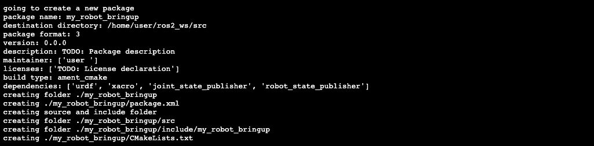
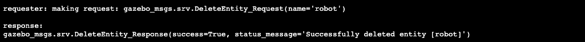
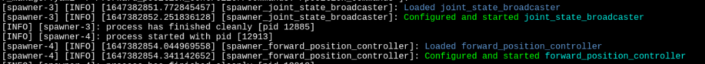

# Noções básicas de controle ROS2
* Como configurar controladores para um robô simulado
* Como atualizar o arquivo de descrição do robô
* Como iniciar o ros2_control
* Como enviar comandos para mover um robô usando `ros2_control`

### Baixando os arquivos
A primeira coisa que você precisa fazer é baixar os pacotes ROS2 fornecidos.

Vá para o diretório `ros2_ws` e, em seguida, em src e baixe o repositório:
```bash
cd ~/ros2_ws/src
git clone https://bitbucket.org/theconstructcore/ros2_control_course.git
```
Agora, volte para o diretório `ros2_ws` e construa-o com colcon build e o código-fonte dele:
```bash
cd ~/ros2_ws/
colcon build
```
Além disso, após a compilação, você deve fornecer o espaço de trabalho para garantir que os pacotes recém-adicionados se tornem detectáveis pelo ROS2.
```bash
source install/setup.bash
```

### Gere o robô no Gazebo
Como você pode ver na janela Gazebo, a simulação exibe um plano vazio.

Execute o comando abaixo para colocar um modelo de robô no ambiente simulado.
```bash
source /home/simulations/ros2_sims_ws/install/setup.bash
ros2 launch unit2_simulation spawn_rrbot.launch.py
```
Agora você deve ver o modelo do robô aparecer no Gazebo e os elos superiores do braço do robô cair devido ao efeito da gravidade.

Atualmente, o modelo de robô que você adicionou ao mundo simulado não implementa nada de ros2_control. Mas não se preocupe! Isso é ótimo porque nesta unidade você aprenderá como implementar ros2_control do zero. Tudo o que precisamos para começar é a descrição do robô como um arquivo urdf ou xacro, que já temos, pois usamos essa descrição do robô para exibir o robô no Gazebo.

Então, temos tudo o que precisamos para começar agora. Tudo pronto e pronto para ir?? Vamos ao trabalho!

Para adicionar `ros2_control` ao nosso robô, seguiremos os seguintes passos:

* Criar um novo pacote
* Crie um arquivo de configuração para o gerenciador do controlador e os algoritmos de controle
* Atualize o arquivo xacro de descrição do robô
* Crie um arquivo de inicialização que abrirá os controladores
* Teste o robô controlado por `ros2_control`

## Criar um novo pacote
Ao trabalhar com o ROS, geralmente é recomendável dividir um projeto robótico em pacotes separados, pois isso permite um design modular e minimiza as dependências por pacote. Portanto, vamos começar criando um novo pacote dedicado exclusivamente a manter a configuração do `ros2_control` e os arquivos de inicialização.

Agora, vá para o diretório src dentro de `ros2_ws`:
```bash
cd ~/ros2_ws/src
```
Crie um novo pacote chamado `my_robot_bringup` digitando o seguinte em seu shell:
```bash
ros2 pkg create --build-type=ament_cmake my_robot_bringup --dependencies urdf xacro robot_state_publisher
```
Ele produzirá a seguinte saída:

<div align="center">
     
</div>

Crie um arquivo de configuração para o gerenciador do controlador e os algoritmos de controle
Dentro do pacote recém-criado podemos adicionar os arquivos de configuração do próprio `ros2_control` e do(s) controlador(es) que serão utilizados.

Nosso arquivo de configuração estará dentro da pasta config, então vamos adicionar essa pasta ao nosso pacote.
```bash
cd ~/ros2_ws/src/my_robot_bringup
mkdir config
```
Com a pasta config no lugar, crie um arquivo vazio chamado controller_configuration.yaml dentro dele e cole as linhas de código mostradas abaixo nele:
>    controller_configuration.yaml
```yaml
# Controller manager configuration
controller_manager:
  ros__parameters:
    update_rate: 10  # Hz

    ### Controllers available
    joint_state_broadcaster:
      type: joint_state_broadcaster/JointStateBroadcaster

    forward_position_controller:
      type: forward_command_controller/ForwardCommandController

    position_trajectory_controller:
      type: joint_trajectory_controller/JointTrajectoryController


### Properties of the controllers that we will use and definition of joints to use ###
forward_position_controller:
  ros__parameters:
    joints:
      - joint1
    interface_name: position


position_trajectory_controller:
  ros__parameters:
    joints:
      - joint1

    command_interfaces:
      - position

    state_interfaces:
      - position

    state_publish_rate: 200.0 # Defaults to 50
    action_monitor_rate: 20.0 # Defaults to 20

    allow_partial_joints_goal: false # Defaults to false
    open_loop_control: true
    allow_integration_in_goal_trajectories: true
    constraints:
      stopped_velocity_tolerance: 0.01 # Defaults to 0.01
      goal_time: 0.0 # Defaults to 0.0 (start immediately)
```
O arquivo de configuração explicado
```yaml
# Controller manager configuration
controller_manager:
  ros__parameters:
    update_rate: 10  # Hz
```
Os arquivos de configuração do `ROS2_control` são apenas arquivos de parâmetros típicos para o ROS2. Como tal, a primeira linha deve especificar o nome do nó ROS2 e a segunda linha `ros__parameters`: com um recuo. Em outro nível de recuo, configuramos o gerenciador do controlador definindo a frequência do loop de controle em 10 Hz. Da teoria de controle, sabemos que a frequência do loop é um dos parâmetros que você pode ajustar para obter o comportamento que esperamos em nossos atuadores.
```yaml
     ### Controllers available
     joint_state_broadcaster:
          type: joint_state_broadcaster/JointStateBroadcaster

     forward_position_controller:
          type: forward_command_controller/ForwardCommandController

     position_trajectory_controller:
          type: joint_trajectory_controller/JointTrajectoryController
```
Depois, no mesmo nível de indentação, definimos os controladores que queremos ter disponíveis. Para definir um controlador, devemos fornecer um nome único (que podemos escolher livremente) seguido de dois pontos, e na próxima linha inserimos um tipo de controlador, assim como este novo exemplo mostrado aqui:
```yaml
     joint1_position_controller:
          type: effort_controllers/JointPositionController
```
Mas qual é o tipo? O tipo - para ser específico o tipo de controlador - refere-se ao nome do plug-in ROS2_control que será usado. Você pode consultar o nome dos plug-ins de controladores comuns fornecidos pelo pacote `ros2_controllers`. Você também criará um plug-in de controlador personalizado e fornecerá a ele um nome de sua escolha na unidade 6. No momento, você não precisa saber mais detalhes, confie em nós aqui e vamos continuar com as próximas etapas.

```yaml
### Properties of the controllers that we will use and definition of joints to use ###
forward_position_controller:
  ros__parameters:
    joints:
      - joint1
    interface_name: position


position_trajectory_controller:
  ros__parameters:
    joints:
      - joint1

    command_interfaces:
      - position

    state_interfaces:
      - position

    state_publish_rate: 200.0 # Defaults to 50
    action_monitor_rate: 20.0 # Defaults to 20

    allow_partial_joints_goal: false # Defaults to false
    open_loop_control: true
    allow_integration_in_goal_trajectories: true
    constraints:
      stopped_velocity_tolerance: 0.01 # Defaults to 0.01
      goal_time: 0.0 # Defaults to 0.0 (start immediately)
```
Finalmente, de volta ao recuo do nível raiz, devemos incluir os parâmetros exigidos pelos controladores que queremos ter disponíveis. No código acima, existem dois controladores cujas propriedades estão sendo definidas. Lembre-se de que nomeamos esses controladores: `forward_position_controller` e `position_trajectory_controller`.

As propriedades específicas e os valores dos parâmetros definidos para cada controlador. Por enquanto, você deve entender apenas que um dos parâmetros de configuração que temos que definir é o nome das juntas a serem controladas por cada controlador - são essas duas linhas aqui:
```yaml
    joints:
      - joint1
```
Importante: os nomes das juntas que você define neste arquivo de configuração devem corresponder aos nomes das juntas no arquivo URDF/XACRO. O arquivo YAML acima, por exemplo, atribui uma junta com o nome `joint1` a ambos os controladores. `joint1` corresponde ao nome da junta definido pela tag XML `< joint name="joint1" type="continuous" >` dentro do arquivo `.xacro`.

Atualize o arquivo de descrição do robô
Para ativar o ros2_control, também precisamos adicionar alguns novos elementos XML ao(s) arquivo(s) URDF ou XACRO que descreve(m) o robô. Nesta seção, mostramos como modificar um arquivo de descrição de robô existente.

Use a janela do editor de código para ir para a pasta `/ros2_ws/src/ros2_control_course/unit2/rrbot_unit2`, em seguida vá para dentro de `/urdf` e abra o arquivo `rrbot.xacro`. Por fim, adicione as seguintes tags XML a ele antes do elemento `< /robot >` de fechamento:
```xml
  <ros2_control name="MyRobotSystem" type="system">
    
    <hardware>
      <plugin>gazebo_ros2_control/GazeboSystem</plugin>
    </hardware>
    
    <joint name="joint1">
      <command_interface name="position">
        <param name="min">-6.28</param>
        <param name="max">6.28</param>
      </command_interface>
      <state_interface name="position"/>
      <state_interface name="velocity"/>
      <state_interface name="effort"/>
    </joint>
    
  </ros2_control>

  <!-- Gazebo's ros2_control plugin -->
  <gazebo>
    <plugin filename="libgazebo_ros2_control.so" name="gazebo_ros2_control">
      <robot_sim_type>gazebo_ros2_control/GazeboSystem</robot_sim_type>
      <parameters>$(find my_robot_bringup)/config/controller_configuration.yaml</parameters>
    </plugin>
  </gazebo>
```
Salve o arquivo que você modificou.
#### As tags XML explicadas
```xml
    <ros2_control name="MyRobotSystem" type="system">
```
The ros2_control framework uses the `<ros2_control>`-tag in the robot’s URDF file to describe it's components and their functions.
```xml
      <hardware>
        <plugin>gazebo_ros2_control/GazeboSystem</plugin>
      </hardware>        
```
O elemento `< hardware >` é necessário para definir a interface de hardware ros2_control que fará a ponte entre os controladores e os atuadores. Neste exemplo, usamos gazebo_ros2_control/GazeboSystem como interface de hardware porque queremos usar ros2_control para nosso robô simulado no Gazebo.

Na próxima unidade, mostraremos em detalhes como escrever uma interface de hardware customizada para conectar `ros2_control` com seu próprio hardware real. Nesse ponto, trocaremos a interface de hardware mostrada aqui que aponta para o Gazebo por nossa própria interface de hardware específica do robô, para que possamos controlar um robô físico real, que é, afinal, nosso objetivo final.
```xml
    <joint name="joint1">
      <command_interface name="position">
        <param name="min">-6.28</param>
        <param name="max">6.28</param>
      </command_interface>
      <state_interface name="position"/>
      <state_interface name="velocity"/>
      <state_interface name="effort"/>
    </joint>
```

Este bloco de marcas XML está adicionando um elemento `< joint name=" ">` como elementos filhos da marca `< ros2_control>`. O elemento `< joint name=" ">` é usado para definir quais interfaces de comando e interfaces de estado são habilitadas para cada junta. Por exemplo, você pode definir aqui para ter apenas uma interface de comando que permite apenas posições de comando para as juntas. Mas você também pode optar por adicionar uma segunda interface de comando que permita velocidades de comando. O mesmo se aplica às interfaces de estado. Usando a tag `< state_interface name=.. "/ >` você define quais magnitudes de estado da articulação (por exemplo, posição, velocidade, esforço, aceleração, etc.) são disponibilizadas (transmitidas) por `ros2_control` para cada articulação.

Repetindo a estrutura mostrada acima, adicionamos tantos elementos `< joint name=" ">` quantas juntas reais o robô tiver. Então, internamente, definimos tantas interfaces de comando e interfaces de estado por junta quanto nosso controlador precisar e o hardware do robô suportar. 

```xml

    <!-- Gazebo's ros2_control plugin -->
    <gazebo>
      <plugin name="gazebo_ros2_control" filename="libgazebo_ros2_control.so">
        <parameters>$(find my_robot_bringup)/config/controller_configuration.yaml</parameters>
      </plugin>
    </gazebo>
```
Por fim, como estamos executando uma simulação do Gazebo, também precisamos iniciar um plug-in no lado do Gazebo. Observe que as tags XML desta parte não são exigidas pelo ros2_control, mas sim pelo Gazebo.

Observe que aninhado dentro da tag `< gazebo>< plugin>` temos um elemento `< parameter>` que usamos para carregar o arquivo de configuração .yaml criado na seção anterior. Portanto, lembre-se: quando executamos o `ros2_control` usando um robô simulado no Gazebo, passamos o arquivo de configuração `.yaml` para o controlador aqui, dentro das tags do plug-in do gazebo.

#### Exclua o antigo modelo de robô no Gazebo

Você se lembra quando dissemos que o modelo de robô mostrado no Gazebo não implementa nada do ros2_control? Bem, agora que você modificou o arquivo XACRO do robô, sim! Mas como o modelo de robô que existe atualmente no Gazebo é a versão 'antiga' do modelo de robô, vamos excluí-lo, para que possamos usar a versão 'nova' do modelo de robô em diante.
```bash
ros2 service call /delete_entity 'gazebo_msgs/DeleteEntity' '{name: "robot"}'
```
Você deve obter a resposta:

<div align="center">
     
</div>

---

#### Crie um arquivo de inicialização para carregar os controladores
Com o arquivo de configuração pronto e o arquivo URDF atualizado, é hora de criar um arquivo de inicialização para gerar o novo robô e os controladores.

Continue executando os seguintes comandos de terminal:
```bash
cd ~/ros2_ws/src/my_robot_bringup
mkdir launch
```
Crie um novo arquivo `my_robot.launch.py` dentro do diretório de inicialização seguindo as instruções.
```bash
cd launch
touch my_robot.launch.py
chmod +x my_robot.launch.py
```
Preencha esse arquivo em branco colando o seguinte bloco de código nele:
> my_robot.launch.py
```python
import os

from ament_index_python.packages import get_package_share_directory
from launch import LaunchDescription
from launch_ros.actions import Node
from launch.actions import ExecuteProcess, IncludeLaunchDescription, RegisterEventHandler
from launch.event_handlers import OnProcessExit
from launch.launch_description_sources import PythonLaunchDescriptionSource
import xacro


def generate_launch_description():

    rrbot_description_path = os.path.join(
        get_package_share_directory('rrbot_unit2'))

    xacro_file = os.path.join(rrbot_description_path,
                              'urdf',
                              'rrbot.xacro')

    doc = xacro.parse(open(xacro_file))
    xacro.process_doc(doc)
    robot_description_config = doc.toxml()
    robot_description = {'robot_description': robot_description_config}

    node_robot_state_publisher = Node(
        package='robot_state_publisher',
        executable='robot_state_publisher',
        output='screen',
        parameters=[robot_description]
    )

    spawn_entity = Node(package='gazebo_ros', executable='spawn_entity.py',
                        arguments=['-topic', 'robot_description',
                                   '-entity', 'robot'],
                        output='screen')

    joint_state_broadcaster_spawner = Node(
        package="controller_manager",
        executable="spawner",
        arguments=["joint_state_broadcaster",
                   "--controller-manager", "/controller_manager"],
    )

    robot_controller_spawner = Node(
        package="controller_manager",
        executable="spawner",
        arguments=["forward_position_controller", "-c", "/controller_manager"],
    )


    return LaunchDescription([
        RegisterEventHandler(
            event_handler=OnProcessExit(
                target_action=spawn_entity,
                on_exit=[joint_state_broadcaster_spawner],
            )
        ),
        RegisterEventHandler(
            event_handler=OnProcessExit(
                target_action=joint_state_broadcaster_spawner,
                on_exit=[robot_controller_spawner],
            )
        ),
        spawn_entity,
        node_robot_state_publisher,
    ])
```
O arquivo de inicialização explicado:
```python
import os

from ament_index_python.packages import get_package_share_directory
from launch import LaunchDescription
from launch_ros.actions import Node
from launch.actions import ExecuteProcess, IncludeLaunchDescription, RegisterEventHandler
from launch.event_handlers import OnProcessExit
from launch.launch_description_sources import PythonLaunchDescriptionSource
import xacro
```
Adicionar essas instruções de importação nos permitirá usar as funções definidas dentro desses módulos.
```python
def generate_launch_description():
```
Aqui definimos uma função que retornará um objeto LaunchDescription.
```python
  rrbot_description_path = os.path.join(
        get_package_share_directory('rrbot_unit2'))

    xacro_file = os.path.join(rrbot_description_path,
                              'urdf',
                              'rrbot.xacro')

    doc = xacro.parse(open(xacro_file))
    xacro.process_doc(doc)
    robot_description_config = doc.toxml()
    robot_description = {'robot_description': robot_description_config}
```
No ROS2, usamos o módulo python xacro com código semelhante aos arquivos xacro de análise acima diretamente no arquivo de inicialização. Basicamente o que ele faz é carregar o modelo do robô definido dentro do arquivo xacro e armazená-lo na variável `robot_description`, para uso posterior.
```python
    robot_state_pub_node = Node(
        package="robot_state_publisher",
        executable="robot_state_publisher",
        output="both",
        parameters=[robot_description],
    )
```
Aqui geramos um nó `robot_state_publisher` fornecendo o robot_description como parâmetro. Este nó escuta o tópico `/joint_states` do `joint_state_broadcaster` e fornece uma visão contínua das localizações das articulações do robô por meio dos tópicos tf e `tf_static`.
```python
    spawn_entity = Node(package='gazebo_ros', executable='spawn_entity.py',
                        arguments=['-topic', 'robot_description',
                                   '-entity', 'robot'],
                        output='screen')
```
Isso é para gerar a **nova** versão do modelo de robô para Gazebo, aquela que inclui elementos `ros2_control`.
```python
    joint_state_broadcaster_spawner = Node(
        package="controller_manager",
        executable="spawner",
        arguments=["joint_state_broadcaster",
                   "--controller-manager", "/controller_manager"],
    )
```
Aqui, utilizamos um script python chamado spawner, que é fornecido pelo pacote controller_manager, para carregar e iniciar o joint_state_broadcaster.

O `joint_state_broadcaster` publica o estado do robô nos tópicos `/rrbot_controller/state` e `/joint_states`. O estado do robô, descrito pela posição, velocidade e esforço de cada articulação do robô, é transmitido como uma mensagem ROS2 `sensor_msgs/JointState`, que pode ser lida por qualquer nó ROS2.
```python
    robot_controller_spawner = Node(
        package="controller_manager",
        executable="spawner",
        arguments=["forward_position_controller", "-c", "/controller_manager"],
    )
```
Aqui, aproveitamos o mesmo script de utilitário de antes para carregar e iniciar um `forward_position_controller`. Com este controlador carregado podemos enviar comandos de posição para as articulações do robô.
```python
    return LaunchDescription([
        RegisterEventHandler(
            event_handler=OnProcessExit(
                target_action=spawn_entity,
                on_exit=[joint_state_broadcaster_spawner],
            )
        ),
        RegisterEventHandler(
            event_handler=OnProcessExit(
                target_action=joint_state_broadcaster_spawner,
                on_exit=[robot_controller_spawner],
            )
        ),
        spawn_entity,
        node_robot_state_publisher,
    ])
```
Finalmente, para encerrar, usamos dois manipuladores de eventos `OnProcessExit`. Uma é atrasar o início do `joint_state_broadcaster_spawner` até que o script que gera o robô saia e a outra é garantir que os controladores só iniciem após o `joint_state_broadcaster`.

#### Certifique-se de que o ROS reconhece o arquivo de inicialização
Agora abra seu arquivo CMakeLists.txt e adicione um comando install(DIRECTORY...) no final do arquivo.
```cmake
install(
  DIRECTORY
    launch
    config
  DESTINATION
    share/${PROJECT_NAME}/
)
```
Isso informa ao `colcon build` para colocar uma cópia ou um link para a pasta de inicialização e o arquivo de configuração yaml no diretório de compartilhamento. O diretório de compartilhamento é o local padrão onde o ros2 procurará coisas como arquivos de inicialização.

Certifique-se de que tudo está salvo e execute `colcon build`:
```bash
cd ~/ros2_ws
colcon build
source install/setup.bash
```
#### Teste seu pipeline ros2_control
Agora é hora de testar para ver tudo funcionando.
Execute o comando `ros2 launch` no shell para iniciar seu programa:
```bash
ros2 launch my_robot_bringup my_robot.launch.py
```
Uma mensagem será enviada ao console confirmando que tanto `joint_state_broadcaster` quanto `forward_position_controller` foram carregados, configurados e iniciados.

<div align="center">
     
</div>

Agora você deve ver o modelo do robô aparecer no Gazebo. Observe como apenas um dos segmentos do robô está de pé para cima e o outro cai. Não se preocupe, este é o comportamento pretendido.

Agora vamos descobrir quais tópicos estão disponíveis para enviar comandos.
```bash
ros2 topic list
```
Entre outros, você deve ver disponível o seguinte tópico, que usaremos para enviar comandos para o controlador.
```bash
/forward_position_controller/commands
```
Vamos continuar publicando dados nesse tópico.
```bash
ros2 tópico pub /forward_position_controller/commands std_msgs/msg/Float64MultiArray "dados:
- 0,79" -1
```
Incrível! Com apenas algumas etapas de configuração e nenhum desenvolvimento, agora podemos mover o robô publicando comandos em um tópico exposto. Agora nosso robô pode interagir com todo o ecossistema ros2.