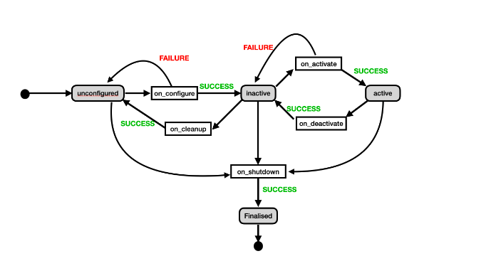

# O gerente do controlador

* O que é o gerenciador de controladores
* Como usar interagir com ele na linha de comando
* Use chamadas de serviço para interagir com ros2_control
* O que é o script do spawner

Para começar, inicie o robô usando o arquivo que você criou na unidade anterior.

```bash
cd ~/ros2_ws && colcon build && source install/setup.bash
ros2 launch my_robot_bringup my_robot.launch.py
```

Aguarde até que o robô apareça na simulação antes de continuar.

## O gerente do controlador explicou
Neste ponto, criamos com sucesso um novo pacote de criação do ros2_control para usar o ros2_control para controlar duas juntas na simulação. Não mostramos muito sobre os muitos recursos adicionais com os quais o ros2_control está equipado. Na verdade, vamos nos concentrar agora no gerenciador do controlador, um componente-chave que implementa muitos dos recursos especiais do ros2_control.

Em sua essência, o gerenciador do controlador apresenta uma máquina de estado que fornece controle abrangente sobre o estado de um controlador. Permite, por exemplo, garantir que o hardware foi instanciado corretamente antes que a recepção de comandos de controle seja habilitada. Graças a ele, também é possível reiniciar os controladores e alternar os controladores on-line.

Para começar, vamos apresentar os diferentes estados, nos quais a máquina de estados pode estar em um determinado momento:

* Desconfigurado
* Inativo
* Ativo
* finalizado

Espere um segundo? O que é um estado?? É simples: o estado de um controlador determina o que ele pode ou não fazer em determinado momento. Por exemplo, se o estado for "ativo" podemos mover o robô, se for "inativo" não podemos. Dependendo do estado atual dos controladores, o ROS2_Control fará coisas diferentes.

Além disso, existem também 6 processos de transição que são tarefas executadas durante a transição de um estado para outro. Os possíveis processos de transição são:

* on_configure
* on_cleanup
* on_activate
* on_deactivate
* on_shutdown
* on_error

Um processo de transição pode ter apenas dois resultados, `SUCESSO` ou `FALHA`. O sucesso ou falha é comunicado de volta ao gerenciador do controlador, que determina o novo estado em que o controlador se encontra.

Este diagrama simples representa os diferentes estados possíveis de um controlador e as transições entre eles:

<div align="center">
     
</div>

O gerenciador do controlador é uma ferramenta que armazena e gerencia o estado de um controlador acionando transições de estado com base na entrada que ele recebe. Como tal, ele gerencia todo o ciclo de vida dos controladores, desde o carregamento até o descarregamento dos controladores e entre eles.

A linha de comando é a primeira ferramenta que você aprenderá a interagir com o gerenciador do controlador. Outras opções disponíveis são usar serviços e usar o script spawner. Para mostrar melhor como tudo isso funciona, vamos percorrer uma série de exercícios. Você está pronto? É hora de praticar um pouco mais!

## Interagir com ros2_control usando a linha de comando

Vamos começar a interagir com o gerenciador do controlador por meio da interface de linha de comando.
Primeiramente vamos verificar os controllers disponíveis cadastrados em nosso sistema:
```bash
ros2 control list_controller_types
```
Este comando listará todos os `controllers/broadcaster` que poderíamos carregar e usar:

> Output
```bash
diff_drive_controller/DiffDriveController                              controller_interface::ControllerInterface
effort_controllers/JointGroupEffortController                          controller_interface::ControllerInterface
force_torque_sensor_broadcaster/ForceTorqueSensorBroadcaster           controller_interface::ControllerInterface
forward_command_controller/ForwardCommandController                    controller_interface::ControllerInterface
imu_sensor_broadcaster/IMUSensorBroadcaster                            controller_interface::ControllerInterface
joint_state_broadcaster/JointStateBroadcaster                          controller_interface::ControllerInterface
joint_trajectory_controller/JointTrajectoryController                  controller_interface::ControllerInterface
position_controllers/JointGroupPositionController                      controller_interface::ControllerInterface
velocity_controllers/JointGroupVelocityController                      controller_interface::ControllerInterface
```

No nosso caso já temos dois deles carregados, então vamos verificar o estado atual dos `controllers/broadcasters`:
```bash
ros2 control list_controllers
```
> Output
```bash
joint_state_broadcaster[joint_state_broadcaster/JointStateBroadcaster] active
forward_position_controller[forward_command_controller/ForwardCommandController] active
```

Isso confirma visualmente que temos um controlador ativo, ou seja, o `forward_position_controller` e um transmissor ativo, ou seja, o `joint_state_broadcaster`.

Se um controlador estiver no estado ativo, podemos usá-lo para mover o robô. Se um transmissor estiver ativo, ele está publicando dados no momento.

Como você pode ver, podemos usar a linha de comando como uma ferramenta de diagnóstico que nos ajuda a realizar inspeções para confirmar se tudo está em ordem.

Em seguida, o comando `set_controller_state`.
```bash
ros2 control set_controller_state forward_position_controller stop
```
> Output
```bash
Successfully stopped forward_position_controller
```
---
```bash
ros2 control set_controller_state joint_state_broadcaster stop
```
> Output 
```bash
Successfully stopped joint_state_broadcaster
```

A partir da saída do comando acima, podemos ver que paramos o controlador e o transmissor. Vamos verificar o status de ambos usando `list_controllers`:
```bash
ros2 control list_controllers
```
> Output
```bash
joint_state_broadcaster[joint_state_broadcaster/JointStateBroadcaster] inactive
forward_position_controller[forward_command_controller/ForwardCommandController] inactive
```

O que significa que o controlador está inativo? Vamos descobrir publicando um novo comando de movimento.
```bash
ros2 topic pub /forward_position_controller/commands std_msgs/msg/Float64MultiArray "data:
- -0.79
- -0.79" -1
```
O robô não se move!

Isso ocorre porque quando o estado de um controlador está inativo, o loop de controle não está em execução. Portanto, as articulações do robô não recebem nenhum comando que enviamos.

Para continuar com o exercício, vamos desligar o controlador e o transmissor, como... desligar completamente. No jargão do ros2_control, dizemos "descarregar", então o comando é denominado descarregar_controlador:
```bash
ros2 control unload_controller forward_position_controller
```
> Output
```bash
Successfully unloaded controller forward_position_controller
```
---
```bash
ros2 control unload_controller joint_state_broadcaster
```
> Output
```bash
Successfully unloaded controller joint_state_broadcaster
```
O que você acha, em que estado o controlador e a emissora estão agora? Vamos dar uma olhada.
```bash
ros2 control list_controllers
```
Este comando não produz nenhuma saída. Claro, não há controladores em execução, nada, portanto, nenhum estado.

Neste ponto, deve estar bastante claro o que podemos interagir com o Controller Manager para consultar e gerenciar o estado de nossos controladores e transmissores.

Vamos verificar um estado adicional que ainda não vimos. Para isso, temos que carregar um controlador novamente. Para carregar um controlador ou um broadcaster usando a linha de comando, usamos o comando load_controller como mostrado aqui:
```bash
ros2 control load_controller joint_state_broadcaster
```
Isso lhe dará uma confirmação visual por meio do terminal de que o controlador foi carregado corretamente.
> Output
```bash
Successfully loaded controller joint_state_broadcaster
```
---
```bash
ros2 control load_controller forward_position_controller
```
> Output
```bash
Successfully loaded controller forward_position_controller
```
Agora liste o estado atual desses controladores como de costume:
```bash
ros2 control list_controllers
```
> Output
```bash
joint_state_broadcaster[joint_state_broadcaster/JointStateBroadcaster] unconfigured
forward_position_controller[forward_command_controller/ForwardCommandController] unconfigured
```
Um controlador não configurado não carregou e configurou seus parâmetros. Mas isso não é tudo, vamos descobrir o que também é diferente agora olhando os tópicos disponíveis.
```bash
ros2 topic list
```
Você consegue encontrar algum desses dois tópicos listados?

* **/dynamic_joint_states**
* **/forward_position_controller/commands**

Não? Você sabe por quê? A resposta é que um controlador não configurado não publica nenhum tópico. Agora será mais fácil para você depurar um aplicativo `ros2_control`. Vamos alterar o estado dos controladores para inativo e depois para ativo.

O comando s`et_controller_state` configure:
```bash
ros2 control set_controller_state joint_state_broadcaster configure
```
> Output
```bash
successfully configured joint_state_broadcaster
```
---
```bash
ros2 control set_controller_state forward_position_controller configure
```
> Output
```bash
successfully configured forward_position_controller
```
---
```bash
ros2 control list_controllers
```
> Output
```bash
joint_state_broadcaster[joint_state_broadcaster/JointStateBroadcaster] inactive 
forward_position_controller[forward_command_controller/ForwardCommandController] inactive
```
Para continuar vamos mudar o estado do nosso controlador para ativo, para que possamos controlar as articulações do robô novamente.
```bash
ros2 control set_controller_state joint_state_broadcaster start
```
> Output
```bash
successfully started joint_state_broadcaster
```
---
```bash
ros2 control set_controller_state forward_position_controller start
```
> Output
```bash
successfully started forward_position_controller
```
---
```shell
ros2 control list_controllers
```
> Output
```shell
joint_state_broadcaster[joint_state_broadcaster/JointStateBroadcaster] active
forward_position_controller[forward_command_controller/ForwardCommandController] active
```
Finalmente, vamos confirmar que nosso robô agora está reagindo aos nossos comandos de posição.
```bash
ros2 topic pub /forward_position_controller/commands std_msgs/msg/Float64MultiArray "data:
- -0.79
- -0.79" -1
```
Tudo bem, mas por que eu deveria me importar com tudo isso?

Se você não entender o que o gerenciador do controlador faz, não saberá quais situações causaram quais erros - ou pior, pode haver problemas na configuração do ros2_control que você nem conhece e nunca descobrirá .
## Usando chamadas de serviço para interagir com ros2_control
Vamos introspeccionar a rede para ver quais serviços são fornecidos pelo gerenciador do controlador.
```bash
ros2 service list | grep controller_manager
```
> Output
```bash
/controller_manager/configure_and_start_controller
/controller_manager/configure_controller
/controller_manager/describe_parameters
/controller_manager/get_parameter_types
/controller_manager/get_parameters
/controller_manager/list_controller_types
/controller_manager/list_controllers
/controller_manager/list_hardware_interfaces
/controller_manager/list_parameters
/controller_manager/load_and_configure_controller
/controller_manager/load_and_start_controller
/controller_manager/load_controller
/controller_manager/reload_controller_libraries
/controller_manager/set_parameters
/controller_manager/set_parameters_atomically
/controller_manager/switch_controller
/controller_manager/unload_controller
```
Para verificar quais controladores estão carregados no momento, você pode executar:
```bash
ros2 service call /controller_manager/list_controllers controller_manager_msgs/srv/ListControllers
```
> Output
```bash
requester: making request: controller_manager_msgs.srv.ListControllers_Request()

response:
controller_manager_msgs.srv.ListControllers_Response(controller=[controller_manager_msgs.msg.ControllerState(name='joint_state_broadcaster', state='active', type='joint_state_broadcaster/JointStateBroadcaster', claimed_interfaces=[], required_command_interfaces=[], required_state_interfaces=['joint1/position', 'joint1/velocity', 'joint2/position', 'joint2/velocity']), controller_manager_msgs.msg.ControllerState(name='forward_position_controller', state='active', type='forward_command_controller/ForwardCommandController', claimed_interfaces=['joint1/position', 'joint2/position'], required_command_interfaces=['joint1/position', 'joint2/position'], required_state_interfaces=[]), controller_manager_msgs.msg.ControllerState(name='position_trajectory_controller', state='inactive', type='joint_trajectory_controller/JointTrajectoryController', claimed_interfaces=[], required
```

A resposta acima confirma que `joint_state_broadcaster`, `forward_position_controller` e `position_trajectory_controller` estão ativos.

No entanto, embora seja possível chamar um serviço a partir da linha de comando e obter informações impressas de volta no terminal, elas não estão sendo usadas em todo o seu potencial. Os servidores de serviço são destinados quando o chamador é um nó diferente, o que significa que eles oferecem uma maneira programática de acessar e controlar o gerenciador do controlador para coisas como carregar, iniciar, parar e alternar controles.

## O script do gerador
O script spawner é um programa python que faz parte do pacote controller_manager. É uma ferramenta de conveniência que aproveita internamente os serviços fornecidos pelo controller_manager e é especialmente útil para interagir com o controller manager a partir dos arquivos de inicialização.

Vamos tentar o script spawner:
```bash
ros2 run controller_manager spawner my_controller_name --controller-type joint_state_broadcaster/JointStateBroadcaster
```
> Output
```bash
Set parameter successful
[INFO] [1666257955.798272985] [spawner_my_controller_name]: Loaded my_controller_name
[INFO] [1666257955.841924355] [spawner_my_controller_name]: Configured and started my_controller_name
```
O benefício do spawner é que ele permite carregar e iniciar um controlador usando apenas um comando.

Vamos confirmar isso agora:
```bash
ros2 control list_controllers
```
Você deve ver esta linha aqui confirmando que o controlador está no estado ativo:
> Output
```bash
my_controller_name  [joint_state_broadcaster/JointStateBroadcaster] active
```
## OK, o que mais o gerente do controlador pode fazer?
O trabalho do gerente do controlador é gerenciar todos os aspectos relevantes do ciclo de vida dos controladores, desde o carregamento até o descarregamento dos controladores e entre eles.

Em outras palavras, o controller manager supervisiona e gerencia o funcionamento do `ros2_control`, que inclui, entre outros:

* Certifique-se de que apenas os controladores do tipo certo possam ser carregados
* Estabeleça conexões entre controladores e interfaces de hardware
* Fornece tópicos e serviços que permitem enviar comandos e recuperar dados de estado
* Executar interfaces que possibilitam outras interações com controladores
* Certifique-se de que dois controladores não possam reivindicar a mesma junta e emitir uma mensagem de erro se tentarem fazê-lo

Com isso, concluímos esta unidade e passaremos agora para os detalhes da criação de uma interface de hardware, parabéns por ter concluído!

Você pode pular para a próxima unidade sempre que quiser!