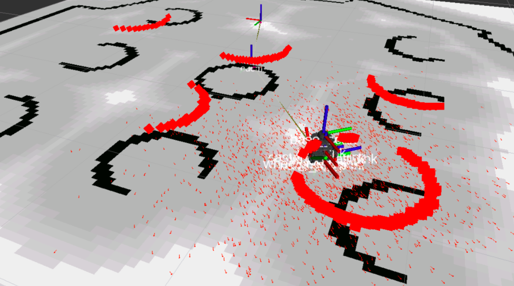
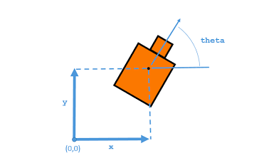

# Localização
No ROS Navigation, é importante que o robô saiba sua posição e orientação dentro do mapa para se mover corretamente. Esse processo é conhecido como localização do robô e é realizado a partir de leituras de sensores para determinar a pose do robô.

O Monte Carlo Location Algorithm (MCL) é usado para rastrear a localização de um robô no espaço 2D. O pacote AMCL fornece o nó amcl, que usa o sistema MCL e assina os dados do laser, do mapa baseado em laser e das transformações do robô para publicar sua posição estimada no mapa. É possível configurar alguns parâmetros no nó amcl para adaptar a localidade. O nó amcl é ativado com um arquivo pré-configurado e uma pose inicial é definida usando a ferramenta `2D Pose Estimate` no Rviz. À medida que o robô se move, o nó amcl lê o laser, mapeia e transforma os dados e publica a estimativa de pose nos tópicos `/amcl_pose` e `/particlecloud`. A nuvem de "setas" na visualização RViz indica a posição mais provável em que o robô está e sua orientação.

### **Particles Filter**

<div align="center">
     
</div>

O nó amcl usa dados de mapa fornecidos pelo nó map_server por meio do lançamento. O arquivo contém uma seção que chama a funcionalidade `map_server` para fornecer os dados do mapa ao nó amcl.

```xml
<arg  name="map_file"  default="$(find  my_robot)/maps/map.yaml"/>
<node name="map_server" pkg="map_server" type="map_server" args="$(arg map_file)"/> 
```

## **Requisitos de hardware**

* Os requisitos de hardware são críticos para o sucesso da localização e mapeamento do robô. O primeiro requisito é fornecer bons dados de laser. Isso significa ter um `sensor laser` preciso e de alta qualidade, que pode medir a distância com precisão e rapidez. O sensor a laser também deve ter uma ampla faixa de medição para cobrir todo o ambiente.

* O segundo requisito é fornecer bons dados de odometria. `Odometry` é a medição da posição do robô com base em sua velocidade e direção. Um codificador preciso e confiável é necessário para medir com precisão a velocidade e a direção. A odometria é usada para estimar a posição do robô entre as leituras do laser.

* O terceiro requisito é fornecer bons dados de `mapa` baseados em laser. O mapa é criado a partir das leituras do laser e é usado para determinar a posição do robô. O mapa deve ser preciso e atualizado regularmente para garantir que o robô possa ser localizado corretamente. É importante ter um computador com boa capacidade de processamento para processar os dados do laser e gerar o mapa em tempo real.

Em resumo, para garantir a localização adequada do robô, é necessário ter um sensor laser de alta qualidade, um codificador preciso para medir a odometria e um computador com boa capacidade de processamento para gerar mapas em tempo real.

## **Transformações**
É importante publicar uma transformação correta entre a estrutura do laser e a base da estrutura do robô para garantir a localização adequada do robô. O nó amcl tem dois requisitos em relação às transformações do robô: transformar as varreduras de laser recebidas no quadro de odometria e procurar a transformação entre o quadro de laser e o quadro de base e bloqueá-lo para sempre. É crucial que haja um caminho através da árvore tf desde o quadro no qual as varreduras a laser são publicadas até o quadro de odometria.

Se o laser se mover em relação à base, o amcl não poderá lidar com isso.

## **Criando um arquivo de inicialização para o nó AMCL**

Para criar um arquivo de inicialização para o nó AMCL, você precisa configurar vários parâmetros para melhorar o desempenho. Alguns dos mais importantes são:
- ***odom_model_type***: define o modelo de odometria em uso.
- ***odom_frame_id***: indica o quadro associado à odometria.
- ***base_frame_id***: indica o frame associado à base do robô.
- ***global_frame_id***: indica o nome do quadro de coordenadas publicado pelo sistema de localização.
- ***use_map_topic***: indica se o nó obtém os dados do mapa do tópico ou de uma chamada de serviço.

Além disso, você pode configurar os parâmetros do filtro para ajustar a maneira como o filtro `partícula` funciona, incluindo o número mínimo e máximo de partículas, a distância `linear` e `angular` que o robô deve mover para executar uma atualização do filtro, o `intervalo taxa de reamostragem`, `tolerância de transformação` e `taxa de publicação para visualização`. Todos os parâmetros disponíveis para configuração podem ser encontrados na documentação do nó AMCL.

O número de partículas usadas para localizar o robô capturado é impressionante, o que tornou a localização do robô imprecisa. Além disso, os parâmetros do laser permitem configurar a maneira como o nó amcl interage com o laser, incluindo o alcance mínimo e máximo de varredura a ser considerado, quantos feixes usar ao atualizar o filtro e misturar pesos para diferentes partes do modelo. .

### **Parâmetros Gerais**

* ***odom_model_type (padrão: "diff")***: Coloca o modelo de odometria para usar. Pode ser "diff", "omni", "diff-corrigido" ou "omni-corrigido".
* ***odom_frame_id (padrão: "odom")***: Indica o quadro associado à odometria.
* ***base_frame_id (padrão: "base_link")***: Indica o quadro associado à base do robô.
* ***global_frame_id (padrão: "map")***: Indica o nome do quadro de coordenadas publicado pelo sistema de localização.
* ***use_map_topic (padrão: false)***: Indica se o nó obtém os dados do mapa do tópico ou de uma chamada de serviço.

### **Parâmetros de filtro**

* ***min_particles (padrão: 100)***: Define o número mínimo permitido de partículas para o filtro.
* ***max_particles (padrão: 5000)***: Define o número máximo permitido de partículas para o filtro.
* ***kld_err (padrão: 0,01)***: Define o erro máximo permitido entre a distribuição verdadeira e a distribuição estimada.
* ***update_min_d (padrão: 0.2)***: Define a distância linear (em metros) que o robô deve mover para executar uma atualização de filtro.
* ***update_min_a (padrão: π/6.0)***: Define a distância angular (em radianos) que o robô deve mover para executar uma atualização de filtro.
* ***resample_interval (padrão: 2)***: Define o número de atualizações de filtro necessárias antes da reamostragem.
* ***transform_tolerance (padrão: 0.1)***: Tempo (em segundos) com o qual atualizar a transformação publicada, para indicar que esta transformação é válida no futuro.
* ***gui_publish_rate (padrão: -1.0)***: Taxa máxima (em Hz) na qual os scans e caminhos são publicados para visualização. Se este valor for -1,0, esta função é desabilitada.

### **Parâmetros do laser**

* ***laser_min_range (padrão: -1.0)***: Faixa de varredura mínima a ser considerada; -1,0 fará com que o alcance mínimo do laser relatado seja usado.
* ***laser_max_range (padrão: -1.0)***: Alcance máximo de varredura a ser considerado; -1,0 fará com que o alcance máximo do laser relatado seja usado.
* ***laser_max_beams (padrão: 30)***: Quantos feixes uniformemente espaçados em cada varredura serão usados ao atualizar o filtro.
* ***laser_z_hit (padrão: 0,95)***: Peso de mistura para a parte "z_hit" do modelo.
* ***laser_z_short (padrão: 0.1)***: Mistura de peso para a parte "z_short" do modelo.
* ***laser_z_max (padrão: 0,05)***: Peso de mistura para a parte "z_max" do modelo.
* ***laser_z_rand (padrão: 0,05)***: Peso da mistura para a parte "z_rand" do modelo.

Este documento descreve o problema de localização do robô e explica como o parâmetro "laser_max_range" pode afetar a precisão da localização. Quando esse parâmetro é reduzido, o alcance do laser é limitado, o que pode resultar em menos informações úteis para ajudar na localização do robô.

Para solucionar esse problema, é recomendado criar arquivos de inicialização personalizados e carregar parâmetros de um arquivo YAML externo. Isso permite a configuração precisa dos parâmetros do nó amcl e ajuda a garantir que o robô seja capaz de se localizar com precisão.

Para uma melhor compreensão dos parâmetros que podem ser configurados no nó amcl, consulte a documentação oficial do ROS. É importante destacar que a configuração adequada desses parâmetros é essencial para o bom desempenho do robô e para garantir uma navegação segura e precisa.

### **AMCL por meio de serviços**
O nó AMCL (Adaptive Monte Carlo Localization) é uma ferramenta de localização usada em robótica. Ele pode se basear em diferentes fontes de dados para determinar a posição do robô, como sensores de laser e odometria, além de um mapa pré-carregado do ambiente.

Além da publicação de tópicos, o AMCL também fornece serviços para ajudar na localização. Um desses serviços é o "global_localization", que reinicia a localização global do robô, dispersando aleatoriamente todas as partículas (hipóteses de localização) pelo espaço livre no mapa. Esse serviço pode ser útil, por exemplo, se o robô estiver perdido ou se a localização inicial for desconhecida.

Por sua vez, o AMCL pode chamar o serviço "static_map" para obter os dados do mapa usado para a localização baseada em laser. Esse serviço é definido pelo pacote "map_server" e fornece o mapa como uma imagem binária (ocupado ou livre) junto com informações de metadados, como a resolução e a origem do mapa.

Em resumo, o AMCL oferece um serviço para reiniciar as posições das partículas e pode chamar um serviço para obter os dados do mapa que ele precisa para executar a localização.

O serviço que permite dispersar as partículas do filtro aleatoriamente pelo ambiente é útil para localizar o robô quando não há uma pose aproximada disponível. Inicializando as partículas ao redor do ambiente e movendo o robô, os sensores coletam informações e as partículas se tornam mais precisas. Isso é importante para o funcionamento do nó `amcl`, que utiliza o filtro de partículas para localizar o robô.

## Resumo

O nó amcl é um componente essencial para a navegação autônoma, pois permite que o robô se localize no mapa e, consequentemente, navegue com precisão e segurança. Por meio do algoritmo MCL, o nó amcl utiliza informações do laser, da odometria e do mapa do ambiente para gerar uma pose estimada do robô. Quanto mais o robô se move, mais informações o sistema de localização coleta, o que resulta em uma pose estimada mais precisa. Com isso, o nó amcl contribui diretamente para o sucesso da navegação autônoma, tornando possível que o robô se mova de forma autônoma em um ambiente desconhecido.

------------
# Localização de robôs no ROS2
* O significado de localizar um robô em um ambiente
* Como realizar a localização no ROS2 usando o AMCL
* Como definir a localização inicial do robô: manualmente, automaticamente e usando a API do ROS
* Como fazer a localização global.

**O que significa localizar um robô no ambiente?**
Localização significa conhecer a posição atual do robô em relação ao ambiente. No seu caso, o robô precisa saber sua posição e orientação em relação ao ambiente, ou seja, o mapa do mundo que foi criado no ultimo topico. Isso é conhecido como a "pose" de um robô.

## AMCL
ROS possui um algoritmo muito robusto para localização, o AMCL (Adaptive Monte-Carlo Localization). É um sistema probabilístico de localização para um robô em movimento em 2D.

Ele implementa a abordagem adaptativa (ou amostragem KLD) de localização de Monte Carlo (conforme descrito por Dieter Fox), que usa um filtro de partículas para rastrear a pose de um robô em relação a um mapa conhecido.

Um robô ROS é localizado quando alguém publica uma transformação entre o quadro `/map` e o quadro `/odom`.
Isso significa que o quadro `/odom` do robô sabe sua posição relativa ao quadro `/map`. Portanto, o robô sabe sua posição no mapa, porque seu quadro `/base_link` está diretamente conectado ao quadro /odom.

Quando tudo está correto, o AMCL é o responsável por publicar essa transformação. Agora você aprenderá como configurar o AMCL para publicar essa transformação.

Como fazer a localização no ROS2
Você precisa iniciar três nós:

1. O servidor de mapas fornece o mapa para o algoritmo de localização
2. O algoritmo de localização
3. O gerenciador do ciclo de vida

### 1. Início do nó do `map_server`
Estes são os campos que você precisa indicar no lançamento do nó:
* O map_server é fornecido pelo pacote `nav2_map_server`
* O executável é chamado `map_server`
* Os parâmetros que ele requer são:
     `use_sim_time`: é um booleano que indica se o map_server deve sincronizar seu tempo com a simulação.
     `yaml_filename`: é o caminho completo para o arquivo yaml do mapa.

```python
     package='nav2_map_server',
     executable='map_server',
     name='map_server',
     output='screen',
     parameters=[{'use_sim_time': True}, 
               {'yaml_filename':map_file} 
               ]),
```  
### 2. Lançamento do nó amcl
Estes são os campos que você precisa indicar no lançamento do nó:
* O amcl é fornecido pelo pacote `nav2_amcl`
* O executável se chama amcl
* O parâmetro necessário é:
     o arquivo `yaml` que contém todos os parâmetros de configuração do nó
```python
     package='nav2_amcl',
     executable='amcl',
     name='amcl',
     output='screen',
     parameters=[nav2_yaml]
```

### 3. Para o lançamento do nó lifecycle_manager
Este nó gerencia o ciclo de vida dos nós envolvidos na navegação. Você aprenderá mais sobre isso mais tarde.
* O lifecycle_manager é fornecido pelo pacote `nav2_lifecycle_manager`.
* O executável se chama `lifecycle_manager`.
* Parâmetros necessários:
     `use_sim_time`: é um booleano que indica se o map_server deve sincronizar seu tempo com a simulação.
     `autostart`: é um booleano que indica se o gerenciador de ciclo de vida deve iniciar quando lançado.
     `node_names`: é uma lista com os nomes dos nós que o gerenciador de ciclo de vida deve cuidar.
```python

     package='nav2_lifecycle_manager',
     executable='lifecycle_manager',
     name='lifecycle_manager_localization',
     output='screen',
     parameters=[{'use_sim_time': True},
               {'autostart': True},
               {'node_names': ['map_server','amcl']}])
```

Crie um arquivo de lançamento que inicie o sistema de localização para o robô simulado usando o mapa criado no topivo anterior.

* Crie um novo pacote chamado `localization_server`.
* Crie um diretório de configuração e um diretório de lançamento.
* Dentro do diretório de lançamento, inclua um arquivo de lançamento chamado `localization.launch.py` que inicie os três nós necessários para a localização.
* Dentro do diretório de configuração, inclua um arquivo yaml chamado `amcl_config.yaml` com o seguinte conteúdo:

> amcl_config.yaml
```lua
amcl:
  ros__parameters:
    use_sim_time: True
    alpha1: 0.2
    alpha2: 0.2
    alpha3: 0.2
    alpha4: 0.2
    alpha5: 0.2
    base_frame_id: "base_footprint"
    beam_skip_distance: 0.5
    beam_skip_error_threshold: 0.9
    beam_skip_threshold: 0.3
    do_beamskip: false
    global_frame_id: "map"
    lambda_short: 0.1
    laser_likelihood_max_dist: 2.0
    laser_max_range: 100.0
    laser_min_range: -1.0
    laser_model_type: "likelihood_field"
    max_beams: 60
    max_particles: 8000
    min_particles: 200
    odom_frame_id: "odom"
    pf_err: 0.05
    pf_z: 0.99
    recovery_alpha_fast: 0.0
    recovery_alpha_slow: 0.0
    resample_interval: 1
    robot_model_type: "differential"
    save_pose_rate: 0.5
    sigma_hit: 0.2
    tf_broadcast: true
    transform_tolerance: 1.0
    update_min_a: 0.2
    update_min_d: 0.25
    z_hit: 0.5
    z_max: 0.05
    z_rand: 0.5
    z_short: 0.05
```

Antes de compilar o pacote `localization_server`, é necessário fazer algumas configurações:

Se você criou um pacote Python puro usando o tipo de construção `ament_python`:

Abra o arquivo `setup.py` do pacote localization_server.
Adicione as linhas de instalação para os diretórios launch e config.

```python
        (os.path.join('share', package_name, 'launch'), glob('launch/*.launch.py')),
        (os.path.join('share', package_name, 'config'), glob('config/*')),
```
Adicione as importações necessárias
```python
import os
from glob import glob
```
Construa o pacote (sempre no diretório `~/ros2_ws`)
```bash
colcon build --packages-select localization_server
source ~/ros2_ws/install/setup.bash
```
Iniciar o sistema de localização
```bash
ros2 launch localization_server localization.launch.py
```
Se o sistema de localização foi iniciado corretamente, você deve ver na tela uma mensagem como esta:

```bash
[amcl-2] [WARN] [1632242660.692356589] [amcl]: ACML cannot publish a pose or update the transform. Please set the initial pose...
```
> IMPORTANTE: Essa mensagem está correta. O sistema de localização aguarda a pose inicial do robô. Isso significa que, uma vez iniciado o sistema de localização, o algoritmo não sabe onde colocar inicialmente o robô no mapa. Ele precisa de alguém para indicar isso, para que o algoritmo possa começar a rastrear o robô enquanto ele se move.

Forneça manualmente a localização inicial
Para fornecer a localização inicial manualmente, siga os próximos passos:

Inicie o RVIZ para visualizar e definir a localização:
```bash
rviz2
```
Adicione ao RVIZ os seguintes Displays:
- `map`, para mostrar o mapa atual que está sendo usado
- `TF`, para mostrar os frames do robô
- `Robot Model`, para mostrar a estrutura do robô. Você precisará especificar o tópico que publica o modelo URDF do robô Turtlebot3 Burger.
     No campo Tópico de descrição, escreva /robot_description. Esse tópico é publicado pelo nó robot_state_publisher que é iniciado com a simulação.
- `Laser Scan`, para mostrar como a estimativa da posição do robô corresponde ao mapa real
- `Pose With Covariance`, para mostrar o status da localização
- `Particle Cloud`, para ver a distribuição (localização) de partículas (Nota: esta exibição não aparece por tópico).

Salve agora esta configuração do RVIZ no diretório ros2_ws/src como `localizer_rviz_config`.

Defina a pose inicial do robô no mapa. Clique na `estimativa de pose 2D` para localizar o robô no ambiente e, em seguida, clique no ponto do mapa que corresponde à posição real do robô na simulação.

Ao definir a estimativa de pose, todo o sistema AMCL começará a localizar o robô. Isso significa que ele começará a publicar a transformação entre `map` e `odom`.

<div align="center">
     
</div>

Remova todos os quadros no RVIZ, exceto o `map`, o `odom` e o `base_footprint`.
Você deve ver a seta do centro do robô até o quadro do mapa. Essa é a transformação de `odom` em `map` frames que a AMCL publica.

Você também deve ver os dados do laser, correspondendo mais ou menos ao desenho do mapa. Isso significa que a localização está correta.
Em seguida, mova o robô com o teclado e observe como a localização se adapta à nova localização do robô. Você deve ver as partículas se concentrarem na localização mais provável do robô.

```bash
ros2 run teleop_twist_keyboard teleop_twist_keyboard
```

Salve a configuração do rviz para uso posterior. Para isso, vá para o topo do menu rviz, selecione Arquivo e, em seguida, Salvar configuração como. Salve a configuração em seu diretório inicial com o nome `localization_rviz_config`.

> localization.launch.py
```python
import os

from ament_index_python.packages import get_package_share_directory
from launch import LaunchDescription
from launch_ros.actions import Node

def generate_launch_description():
    
    nav2_yaml = os.path.join(get_package_share_directory('localization_server'), 'config', 'amcl_config.yaml')
    map_file = os.path.join(get_package_share_directory('map_server'), 'config', 'turtlebot_area.yaml')

    return LaunchDescription([
        Node(
            package='nav2_map_server',
            executable='map_server',
            name='map_server',
            output='screen',
            parameters=[{'use_sim_time': True}, 
                        {'yaml_filename':map_file}]
        ),
            
        Node(
            package='nav2_amcl',
            executable='amcl',
            name='amcl',
            output='screen',
            parameters=[nav2_yaml]
        ),

        Node(
            package='nav2_lifecycle_manager',
            executable='lifecycle_manager',
            name='lifecycle_manager_localization',
            output='screen',
            parameters=[{'use_sim_time': True},
                        {'autostart': True},
                        {'node_names': ['map_server', 'amcl']}]
        )
    ])
```
## Sobre localização de robôs
O robô é localizado quando você conhece seu (x, y, θ) no mapa correspondente (para localização 2D):

* x é a posição x do robô no quadro do mapa
* y é a posição y do robô no quadro do mapa 
* θ é a orientação do robô no quadro do mapa

<div align="center">
     
</div>

O pacote AMCL usa o mapa estático e então calcula o (x, y, θ) do robô usando a abordagem Adaptive Monte Carlo Localization.

A abordagem Adaptive Monte Carlo usa partículas para localizar o robô. Essas partículas têm suas próprias coordenadas e valores de orientação, como o robô real, e um determinado peso. O valor do peso (Wt) é definida como a diferença absoluta entre a pose real do robô e a pose prevista por essa partícula específica. Quanto maior ou maior o peso da partícula, com mais precisão ela define a pose do robô.

As partículas são reamostradas sempre que o robô se move no ambiente e fornece novos dados do sensor. A cada reamostragem, as partículas com pesos baixos perecem e as partículas com pesos altos sobrevivem. Depois de muitas iterações do algoritmo AMCL, as partículas convergirão e avaliarão uma aproximação da pose do robô. Portanto, esse algoritmo estima a orientação e a posição do robô com base na entrada do sensor.

Para obter uma localização precisa do robô no ambiente, você precisa de um nó AMCL bem configurado. Abaixo, você pode ver vários parâmetros para configurar o AMCL para adaptar o algoritmo à sua própria situação.

### Parâmetros de configuração para AMCL:
Existem três categorias de parâmetros do ROS que podem ser usadas para configurar o nó AMCL:

1. parâmetro de filtro geral
2. parâmetro do modelo de laser
3. parâmetro do modelo de odometria

### Parâmetro geral do filtro
* `min_particles` (int, padrão: 500): Número mínimo permitido de partículas.

* `max_particles` (int, padrão: 2000): Número máximo permitido de partículas.

* `update_min_d` (duplo, padrão: 0,25 metros): Movimento translacional necessário antes de executar uma atualização de filtro.

* `update_min_a` (duplo, padrão: 0,2 radianos): O movimento rotacional é necessário antes de executar uma atualização de filtro.

* `resample_interval` (int, padrão: 1): O número de atualizações de filtro necessárias antes da reamostragem.

* `transform_tolerance` (duplo, padrão: 1,0 segundos): Hora com a qual atualizar a transformação que é publicada, indicando que esta transformação é válida no futuro.

* `recovery_alpha_slow` (duplo, padrão: 0.0 (desativado)): A taxa de decaimento exponencial para o filtro de peso médio lento é usada para decidir quando recuperar adicionando poses aleatórias. Um bom valor pode ser 0,001.

* `recovery_alpha_fast` (duplo, padrão: 0.0 (desabilitado)): A taxa de decaimento exponencial para o filtro de peso médio rápido é usada para decidir quando recuperar adicionando poses aleatórias. Um bom valor pode ser 0,1.

* `set_initial_pose` (bool, padrão: falso): Faz com que o AMCL defina a pose inicial dos parâmetros initial_pose* em vez de aguardar a mensagem initial_pose.

* `initial_pose` (Pose2D, {0.0, 0.0, 0.0}): Coordenadas X, Y, Z e guinada da pose inicial do quadro de base do robô (metros e radianos) no quadro global.

* `always_reset_initial_pose` (duplo, padrão: falso): Requer que AMCL receba uma pose inicial por meio do tópico ou do parâmetro initial_pose* (com o parâmetro set_initial_pose: true) quando redefinido. Caso contrário, por padrão, o AMCL usará a última pose conhecida para inicializar.

* `save_pose_rate` (duplo, padrão: 0,5 Hz): Taxa máxima (Hz) na qual armazenar a última pose estimada e covariância para o servidor de parâmetros, nas variáveis ~initialpose e ~initialcov. Essa pose salva será usada nas execuções subsequentes para inicializar o filtro (-1,0 para desabilitar).

### Parâmetro do modelo de laser
Observe que quaisquer pesos de mistura em uso devem somar 1. Por exemplo, o modelo de viga usa todos os 4: `z_hit`, `z_short`, `z_max` e `z_rand`. Por outro lado, o modelo do campo_verossimilhança usa apenas 2: `z_hit` e `z_rand`.

* `laser_min_range` (duplo, padrão: -1.0): Alcance mínimo de varredura a ser considerado; -1,0 fará com que o alcance mínimo relatado do laser seja usado.

* `laser_max_range` (duplo, padrão: 100): Alcance máximo de varredura a ser considerado; -1,0 fará com que o alcance máximo relatado do laser seja usado.

* `max_beams` (int, padrão: 60): Quantos feixes uniformemente espaçados em cada varredura serão usados ao atualizar o filtro.

* `_z_hit` (duplo, padrão: 0,5): Peso da mistura para a parte z_hit do modelo

* `z_short` (duplo, padrão: 0,05): Peso da mistura para a parte z_short do modelo.

* `z_max` (duplo, padrão: 0,05): Peso da mistura para a parte z_max do modelo.

* `z_rand` (duplo, padrão: 0,5): Peso da mistura para a parte z_rand do modelo.

* `sigma_hit` (duplo, padrão: 0,2 metros): O desvio padrão para o modelo gaussiano usado na parte z_hit do modelo.

* `lambda_short` (duplo, padrão: 0,1): Parâmetro de decaimento exponencial para a parte z_short do modelo.

* `laser_likelihood_max_dist` (duplo, padrão: 2,0 metros): Distância máxima para fazer a inflação de obstáculos em um mapa, para uso no modelo de campo de verossimilhança.

* `laser_model_type` (string, padrão: "likelihood_field"): Qual modelo usar, feixe, campo_probabilidade ou campo_probabilidade (o mesmo que campo_probabilidade, mas incorpora o recurso beamskip, se ativado).

### Parâmetros do Modelo de Odometria
* `robot_model_type (string, padrão: "diferencial"): Qual modelo usar, "diferencial" ou "omnidirecional".

* `alfa1` (duplo, padrão: 0,2): Especifica o ruído esperado na estimativa de rotação da odometria do componente rotacional do movimento do robô.

* `alfa2` (duplo, padrão: 0,2): Especifica o ruído esperado na estimativa de rotação da odometria do componente translacional do movimento do robô.

* `alpha3` (duplo, padrão: 0,2): Especifica o ruído esperado na estimativa de translação da odometria do componente translacional do movimento do robô.

* `alpha4` (duplo, padrão: 0,2): Especifica o ruído esperado na estimativa de translação da odometria do componente rotacional do movimento do robô.

* `alpha5` (duplo, padrão: 0,2): Parâmetro de ruído relacionado à tradução (usado apenas se o modelo for "omni").

* `odom_frame_id` (string, padrão: "odom"): Qual quadro usar para odometria.

* `base_frame_id` (string, padrão: "base_footprint"): Qual quadro usar para a base do robô

* `global_frame_id` (string, padrão: "map"): O nome do referencial de coordenadas publicado pelo sistema de localização

* `tf_broadcast` (bool, padrão: true): Defina como false para evitar que AMCL publique a transformação entre o quadro global e o quadro de odometria.


# Como definir a localização inicial do robô a partir do arquivo de configuração
Cada vez que seu robô começar a trabalhar, você deve indicar sua localização inicial. Até agora, você aprendeu a fazer isso com a Ferramenta Gráfica rviz, mas e quando seu robô deve operar de forma autônoma sem um operador que execute o rviz?

Definir a pose inicial do robô durante a inicialização.

* Duplique seu arquivo amcl_config.yaml. Chame o arquivo duplicado `amcl_config_initialized.yaml`.
* Adicione ao novo arquivo de configuração os parâmetros que permitem a inicialização e defina os valores apropriados obtidos do rviz.

```yaml
     set_initial_pose: true
     initial_pose: 
          x: -4.44264
          y: 2.32243
          yaw: 0.328028
```

Modifique o arquivo `localization.launch.py` para iniciar o novo arquivo de configuração.

Inicie o `localization_server` e o `rviz` com a configuração de localização inicial incluída. O robô deve aparecer localizado no local indicado.
```bash
colcon build --packages-select localization_server
```

> amcl_config_initialized.yaml

```yaml
amcl:
  ros__parameters:
     use_sim_time: True
     alpha1: 0.2
     alpha2: 0.2
     alpha3: 0.2
     alpha4: 0.2
     alpha5: 0.2
     base_frame_id: "base_footprint"
     beam_skip_distance: 0.5
     beam_skip_error_threshold: 0.9
     beam_skip_threshold: 0.3
     do_beamskip: false
     global_frame_id: "map"
     lambda_short: 0.1
     laser_likelihood_max_dist: 2.0
     laser_max_range: 100.0
     laser_min_range: -1.0
     laser_model_type: "likelihood_field"
     max_beams: 60
     max_particles: 8000
     min_particles: 200
     odom_frame_id: "odom"
     pf_err: 0.05
     pf_z: 0.99
     recovery_alpha_fast: 0.0
     recovery_alpha_slow: 0.0
     resample_interval: 1
     robot_model_type: "differential"
     save_pose_rate: 0.5
     sigma_hit: 0.2
     tf_broadcast: true
     transform_tolerance: 1.0
     update_min_a: 0.2
     update_min_d: 0.25
     z_hit: 0.5
     z_max: 0.05
     z_rand: 0.5
     z_short: 0.05
     set_initial_pose: true
     initial_pose: 
          x: 4.44264
          y: 2.32243
          yaw: 0.328028
```
## Como definir a localização inicial do robô na linha de comando
O nó AMCL fornece um tópico no qual você pode publicar sua pose inicial desejada do robô. O tópico é chamado `/initialpose`.
```bash
ros2 topic pub -1 /initialpose geometry_msgs/msg/PoseWithCovarianceStamped "{header: {stamp: {sec: 0}, frame_id: 'map'}, pose: {pose: {position: {x: 0.2, y: 0.0, z: 0.0}, orientation: {w: 1.0}}}}"
```
Lembre-se de que você pode publicar valores em qualquer tópico diretamente via terminal usando
```bash     
ros2 topics pub <topic_name> <message_type> <values>
```

## Como definir a localização inicial do robô programaticamente
Se você deseja construir robôs autônomos comerciais, provavelmente não desejará que ninguém faça a inicialização do robô toda vez que o robô for ligado. Para evitar isso, você pode criar um programa ROS que publique a pose inicial por si só no tópico /initialpose.

Definir a posição inicial do robô a partir de um script:

* Dentro do pacote localizer_server, crie um novo programa Python ROS2 chamado initial_pose_pub.py.
* Este nó Python deve ter um assinante para ler os dados do tópico /clicked_point
* Ele também precisa ter um editor, que publicará as coordenadas X e Y no tópico /initial_pose
* Crie um arquivo de inicialização chamado init_robot.launch.py, para iniciar esse nó
* Inicie o nó acima e publique um ponto do RVIZ usando o Publish Point

Lembre-se de colocar seu script Python dentro do `localization_server/localization_server`.
Abra o `setup.py` do pacote
Adicione a seguinte linha entre os colchetes console_scripts do campo entry_points:
```python
entry_points={
        'console_scripts': [
                'initial_pose_pub = <package-name>.<file-name>:main',
        ],
},
```

Você deve substituir o `package-name` pelo nome do pacote no exercício e o `file-name` pelo nome do arquivo.
```bash
colcon build --packages-select localization_server
```

> initial_pose_pub.py

```python
import sys
import rclpy
from rclpy.node import Node
from geometry_msgs.msg import PoseWithCovarianceStamped
from geometry_msgs.msg import PointStamped


class Publisher(Node):

    def __init__(self):
        super().__init__('initial_pose_pub_node')
        self.publisher_ = self.create_publisher(PoseWithCovarianceStamped, '/initialpose', 1)
        self.subscriber_ = self.create_subscription(PointStamped, '/clicked_point', self.callback, 1)
        self.subscriber_  # prevent unused variable warning
    
    def callback(self, msg):
        self.get_logger().info('Recieved Data:\n X : %f \n Y : %f \n Z : %f' % (msg.point.x, msg.point.y, msg.point.z))
        self.publish(msg.point.x, msg.point.y)

    def publish(self,x,y):
        msg = PoseWithCovarianceStamped()
        msg.header.frame_id = '/map'
        msg.pose.pose.position.x = x
        msg.pose.pose.position.y = y
        self.get_logger().info('Publishing  Initial Position  \n X= %f \n Y= %f '% (msg.pose.pose.position.x, msg.pose.pose.position.y))
        self.publisher_.publish(msg)

def main(args=None):
    rclpy.init(args=args)
    publisher = Publisher()
    rclpy.spin(publisher)
    publisher.destroy_node()
    rclpy.shutdown()

if __name__ == '__main__':
    main()
```

>    init_robot.launch.py

```python
from launch import LaunchDescription
from launch_ros.actions import Node

def generate_launch_description():
    return LaunchDescription([
        Node(
            package='localization_server',
            executable='initial_pose_pub',
            output='screen'),
    ])
```

## localização global
A localização global é usada quando nem a pessoa nem o robô sabem onde o robô está localizado no mapa. O robô deve então tentar se localizar. Com localização global, o robô tentará identificar sua localização no mapa.

Para usar a localização global, são necessárias duas etapas:

Distribua todas as partículas do filtro pelo mapa. Essa etapa é realizada chamando o serviço denominado /reinitialize_global_localization.
Mova o robô até que ele detecte onde está localizado. Esta etapa pode ser alcançada movendo o robô aleatoriamente, evitando obstáculos. Se o ambiente for simples, isso também pode ser obtido fazendo o robô girar em sua posição (solução segura).

Serviço `reinitialize_global_localization`.

1. Abra o arquivo de configuração `amcl_config` e atualize os valores das partículas.

* `máx_partículas`: 80000
* `min_particles`: 2000

Lembre-se de recompilar, para que o novo arquivo de configuração seja instalado no diretório de instalação.

2. Agora execute a localização

3. Inicie o rviz e adicione a exibição para visualizar o ParticleCloud

4. Forneça o `2D_pose_estimate` e observe as partículas do robô

5. Agora chame o serviço `reinitialize_global_localization` e observe o espalhamento das partículas

```bash
ros2 service call /reinitialize_global_localization std_srvs/srv/Empty
```
Depois de ligar para o serviço, deverá ver algo como o seguinte no RVIZ:

6. Agora, use o teclado para mover o robô e veja como as partículas começam a se acumular. Em algum momento, as partículas devem estar todas localizadas no local do robô.

> Primeiro, observe que o número de partículas aumentou. Isso é necessário quando você faz localização global. Como você precisa espalhar as partículas pelo mapa, precisará de muito mais delas.
> Ao ligar para o serviço, observe que as partículas se dispersaram pelo mapa e o robô se localizou aleatoriamente. Isso ajuda quando você não sabe a localização estimada do robô no ambiente. Com esse serviço, o robô se localiza no ambiente e tenta localizar com a ajuda dos dados do sensor. À medida que obtém mais dados, o robô tentará se localizar. E quando ele se localizar, todas as partículas estarão acumuladas ao redor do robô.
