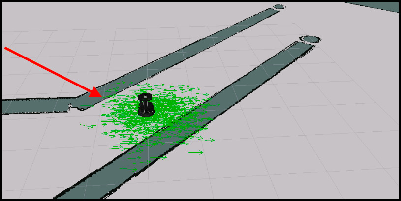

# Localização
No ROS Navigation, é importante que o robô saiba sua posição e orientação dentro do mapa para se mover corretamente. Esse processo é conhecido como localização do robô e é realizado a partir de leituras de sensores para determinar a pose do robô.

O Monte Carlo Location Algorithm (MCL) é usado para rastrear a localização de um robô no espaço 2D. O pacote AMCL fornece o nó amcl, que usa o sistema MCL e assina os dados do laser, do mapa baseado em laser e das transformações do robô para publicar sua posição estimada no mapa. É possível configurar alguns parâmetros no nó amcl para adaptar a localidade. O nó amcl é ativado com um arquivo pré-configurado e uma pose inicial é definida usando a ferramenta `2D Pose Estimate` no Rviz. À medida que o robô se move, o nó amcl lê o laser, mapeia e transforma os dados e publica a estimativa de pose nos tópicos `/amcl_pose` e `/particlecloud`. A nuvem de "setas" na visualização RViz indica a posição mais provável em que o robô está e sua orientação.

### **Particles Filter**

<div align="center">
     
</div>

O nó amcl usa dados de mapa fornecidos pelo nó map_server por meio do lançamento. O arquivo contém uma seção que chama a funcionalidade `map_server` para fornecer os dados do mapa ao nó amcl.

```xml
<arg  name="map_file"  default="$(find  my_robot)/maps/map.yaml"/>
<node name="map_server" pkg="map_server" type="map_server" args="$(arg map_file)"/> 
```

## **Requisitos de hardware**

* Os requisitos de hardware são críticos para o sucesso da localização e mapeamento do robô. O primeiro requisito é fornecer bons dados de laser. Isso significa ter um `sensor laser` preciso e de alta qualidade, que pode medir a distância com precisão e rapidez. O sensor a laser também deve ter uma ampla faixa de medição para cobrir todo o ambiente.

* O segundo requisito é fornecer bons dados de odometria. `Odometry` é a medição da posição do robô com base em sua velocidade e direção. Um codificador preciso e confiável é necessário para medir com precisão a velocidade e a direção. A odometria é usada para estimar a posição do robô entre as leituras do laser.

* O terceiro requisito é fornecer bons dados de `mapa` baseados em laser. O mapa é criado a partir das leituras do laser e é usado para determinar a posição do robô. O mapa deve ser preciso e atualizado regularmente para garantir que o robô possa ser localizado corretamente. É importante ter um computador com boa capacidade de processamento para processar os dados do laser e gerar o mapa em tempo real.

Em resumo, para garantir a localização adequada do robô, é necessário ter um sensor laser de alta qualidade, um codificador preciso para medir a odometria e um computador com boa capacidade de processamento para gerar mapas em tempo real.

## **Transformações**
É importante publicar uma transformação correta entre a estrutura do laser e a base da estrutura do robô para garantir a localização adequada do robô. O nó amcl tem dois requisitos em relação às transformações do robô: transformar as varreduras de laser recebidas no quadro de odometria e procurar a transformação entre o quadro de laser e o quadro de base e bloqueá-lo para sempre. É crucial que haja um caminho através da árvore tf desde o quadro no qual as varreduras a laser são publicadas até o quadro de odometria.

Se o laser se mover em relação à base, o amcl não poderá lidar com isso.

## **Criando um arquivo de inicialização para o nó AMCL**

Para criar um arquivo de inicialização para o nó AMCL, você precisa configurar vários parâmetros para melhorar o desempenho. Alguns dos mais importantes são:
- ***odom_model_type***: define o modelo de odometria em uso.
- ***odom_frame_id***: indica o quadro associado à odometria.
- ***base_frame_id***: indica o frame associado à base do robô.
- ***global_frame_id***: indica o nome do quadro de coordenadas publicado pelo sistema de localização.
- ***use_map_topic***: indica se o nó obtém os dados do mapa do tópico ou de uma chamada de serviço.

Além disso, você pode configurar os parâmetros do filtro para ajustar a maneira como o filtro `partícula` funciona, incluindo o número mínimo e máximo de partículas, a distância `linear` e `angular` que o robô deve mover para executar uma atualização do filtro, o `intervalo taxa de reamostragem`, `tolerância de transformação` e `taxa de publicação para visualização`. Todos os parâmetros disponíveis para configuração podem ser encontrados na documentação do nó AMCL.

O número de partículas usadas para localizar o robô capturado é impressionante, o que tornou a localização do robô imprecisa. Além disso, os parâmetros do laser permitem configurar a maneira como o nó amcl interage com o laser, incluindo o alcance mínimo e máximo de varredura a ser considerado, quantos feixes usar ao atualizar o filtro e misturar pesos para diferentes partes do modelo. .

### **Parâmetros Gerais**

* ***odom_model_type (padrão: "diff")***: Coloca o modelo de odometria para usar. Pode ser "diff", "omni", "diff-corrigido" ou "omni-corrigido".
* ***odom_frame_id (padrão: "odom")***: Indica o quadro associado à odometria.
* ***base_frame_id (padrão: "base_link")***: Indica o quadro associado à base do robô.
* ***global_frame_id (padrão: "map")***: Indica o nome do quadro de coordenadas publicado pelo sistema de localização.
* ***use_map_topic (padrão: false)***: Indica se o nó obtém os dados do mapa do tópico ou de uma chamada de serviço.

### **Parâmetros de filtro**

* ***min_particles (padrão: 100)***: Define o número mínimo permitido de partículas para o filtro.
* ***max_particles (padrão: 5000)***: Define o número máximo permitido de partículas para o filtro.
* ***kld_err (padrão: 0,01)***: Define o erro máximo permitido entre a distribuição verdadeira e a distribuição estimada.
* ***update_min_d (padrão: 0.2)***: Define a distância linear (em metros) que o robô deve mover para executar uma atualização de filtro.
* ***update_min_a (padrão: π/6.0)***: Define a distância angular (em radianos) que o robô deve mover para executar uma atualização de filtro.
* ***resample_interval (padrão: 2)***: Define o número de atualizações de filtro necessárias antes da reamostragem.
* ***transform_tolerance (padrão: 0.1)***: Tempo (em segundos) com o qual atualizar a transformação publicada, para indicar que esta transformação é válida no futuro.
* ***gui_publish_rate (padrão: -1.0)***: Taxa máxima (em Hz) na qual os scans e caminhos são publicados para visualização. Se este valor for -1,0, esta função é desabilitada.

### **Parâmetros do laser**

* ***laser_min_range (padrão: -1.0)***: Faixa de varredura mínima a ser considerada; -1,0 fará com que o alcance mínimo do laser relatado seja usado.
* ***laser_max_range (padrão: -1.0)***: Alcance máximo de varredura a ser considerado; -1,0 fará com que o alcance máximo do laser relatado seja usado.
* ***laser_max_beams (padrão: 30)***: Quantos feixes uniformemente espaçados em cada varredura serão usados ao atualizar o filtro.
* ***laser_z_hit (padrão: 0,95)***: Peso de mistura para a parte "z_hit" do modelo.
* ***laser_z_short (padrão: 0.1)***: Mistura de peso para a parte "z_short" do modelo.
* ***laser_z_max (padrão: 0,05)***: Peso de mistura para a parte "z_max" do modelo.
* ***laser_z_rand (padrão: 0,05)***: Peso da mistura para a parte "z_rand" do modelo.

Este documento descreve o problema de localização do robô e explica como o parâmetro "laser_max_range" pode afetar a precisão da localização. Quando esse parâmetro é reduzido, o alcance do laser é limitado, o que pode resultar em menos informações úteis para ajudar na localização do robô.

Para solucionar esse problema, é recomendado criar arquivos de inicialização personalizados e carregar parâmetros de um arquivo YAML externo. Isso permite a configuração precisa dos parâmetros do nó amcl e ajuda a garantir que o robô seja capaz de se localizar com precisão.

Para uma melhor compreensão dos parâmetros que podem ser configurados no nó amcl, consulte a documentação oficial do ROS. É importante destacar que a configuração adequada desses parâmetros é essencial para o bom desempenho do robô e para garantir uma navegação segura e precisa.

### **AMCL por meio de serviços**
O nó AMCL (Adaptive Monte Carlo Localization) é uma ferramenta de localização usada em robótica. Ele pode se basear em diferentes fontes de dados para determinar a posição do robô, como sensores de laser e odometria, além de um mapa pré-carregado do ambiente.

Além da publicação de tópicos, o AMCL também fornece serviços para ajudar na localização. Um desses serviços é o "global_localization", que reinicia a localização global do robô, dispersando aleatoriamente todas as partículas (hipóteses de localização) pelo espaço livre no mapa. Esse serviço pode ser útil, por exemplo, se o robô estiver perdido ou se a localização inicial for desconhecida.

Por sua vez, o AMCL pode chamar o serviço "static_map" para obter os dados do mapa usado para a localização baseada em laser. Esse serviço é definido pelo pacote "map_server" e fornece o mapa como uma imagem binária (ocupado ou livre) junto com informações de metadados, como a resolução e a origem do mapa.

Em resumo, o AMCL oferece um serviço para reiniciar as posições das partículas e pode chamar um serviço para obter os dados do mapa que ele precisa para executar a localização.

O serviço que permite dispersar as partículas do filtro aleatoriamente pelo ambiente é útil para localizar o robô quando não há uma pose aproximada disponível. Inicializando as partículas ao redor do ambiente e movendo o robô, os sensores coletam informações e as partículas se tornam mais precisas. Isso é importante para o funcionamento do nó `amcl`, que utiliza o filtro de partículas para localizar o robô.

## Resumo

O nó amcl é um componente essencial para a navegação autônoma, pois permite que o robô se localize no mapa e, consequentemente, navegue com precisão e segurança. Por meio do algoritmo MCL, o nó amcl utiliza informações do laser, da odometria e do mapa do ambiente para gerar uma pose estimada do robô. Quanto mais o robô se move, mais informações o sistema de localização coleta, o que resulta em uma pose estimada mais precisa. Com isso, o nó amcl contribui diretamente para o sucesso da navegação autônoma, tornando possível que o robô se mova de forma autônoma em um ambiente desconhecido.