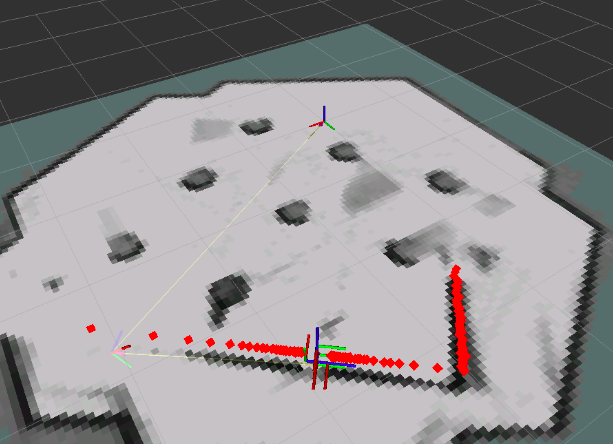
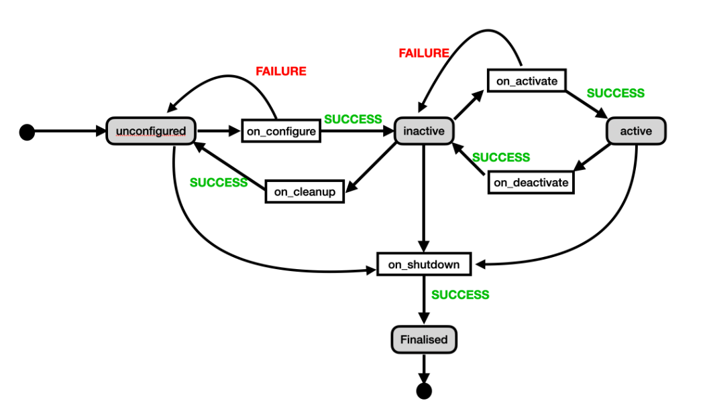
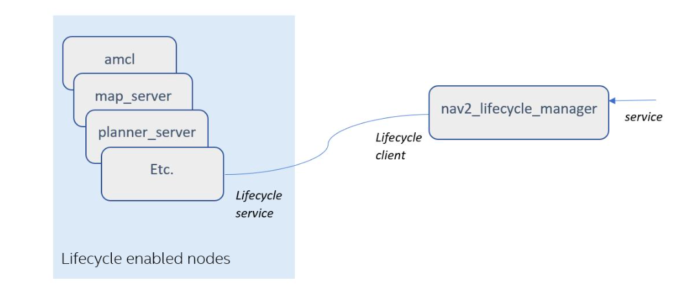

# Mapping

To carry out autonomous navigation of a robot, it is necessary to have a map of the environment in which it must move. This map can be created by the robot itself from the readings of its sensors, such as the laser. This process of creating the map is known as mapping in ROS Navigation.

<div align="center">
     
</div>

* Explicação de um mapa e por que você precisa dele
* O que você precisa para construir um mapa no ROS2
* Como usar o cartógrafo para construir um mapa
* Como fornecer o mapa construído para outros aplicativos ROS2
* Um novo conceito de navegação: Navigation Lifecycle Manager

Um mapa no ROS é uma representação do ambiente em que o robô está operando, utilizado para localização e planejamento de trajetórias. Em termos simples, é uma grade de ocupação onde valores específicos em cada célula do mapa representam obstáculos.

Para construir um mapa, é necessário que o robô esteja equipado com LIDAR, odometria, bateria e um ambiente. O processo de criação de mapas e localização simultânea é conhecido como SLAM, e existem diversos algoritmos SLAM disponíveis para ROS2, como o `Cartógrafo` e o `SLAM-Toolbox`.

O Cartógrafo é um sistema que fornece localização e mapeamento simultâneos em tempo real em 2D e 3D em diversas configurações de sensores e plataformas. O `Cartographer_ros` é um wrapper ROS do Cartógrafo para que ele possa ser integrado ao ROS.

Para criar um arquivo de inicialização do Cartógrafo para o seu robô, é necessário lançar dois nós: o `cartographer_node` e o `cartographer_occupancy_grid_node`. É preciso indicar o pacote, o executável e os parâmetros necessários, como o diretório de configuração e o nome do arquivo de configuração. O arquivo de inicialização permite iniciar vários nós a partir de um único arquivo e definir parâmetros específicos para cada nó.

> O pacote Cartógrafo pode ser comparado a um cartógrafo humano, que utiliza instrumentos para mapear e desenhar a topografia de um terreno desconhecido. Da mesma forma, o Cartógrafo utiliza sensores e algoritmos para criar um mapa detalhado de um ambiente desconhecido em tempo real. Assim como um cartógrafo humano precisa ter conhecimento técnico e habilidades para criar mapas precisos, o pacote Cartógrafo requer configuração e ajustes para fornecer resultados confiáveis e precisos.

### Diferença entre Cartógrafo e Gmapping

O Cartographer ROS e o GMapping são dois pacotes de software de mapeamento simultâneo (SLAM) amplamente utilizados em robótica. Eles possuem algumas diferenças significativas em termos de funcionalidade e recursos.

O Cartographer ROS é um sistema de mapeamento simultâneo baseado em laser que pode ser usado para criar mapas 2D e 3D de ambientes desconhecidos em tempo real. Ele utiliza algoritmos avançados de odometria visual e sensorial, e sua saída é um mapa altamente preciso e detalhado. O Cartographer é projetado para ser altamente escalável, permitindo a utilização em uma ampla variedade de aplicações.

Já o GMapping é um pacote de mapeamento SLAM baseado em grade que também é amplamente utilizado em robótica. Ele usa dados do sensor de varredura a laser para criar mapas de ambientes desconhecidos em tempo real. O GMapping é conhecido por ser rápido e robusto, e pode ser usado em uma ampla variedade de robôs móveis.

Em termos de vantagens e desvantagens, o Cartographer ROS é conhecido por sua precisão e capacidade de mapear ambientes complexos em tempo real. No entanto, ele é um pouco mais exigente em termos de hardware do que o GMapping e pode ser mais difícil de configurar. O GMapping, por outro lado, é mais fácil de usar e requer menos recursos de hardware, mas pode não ser tão preciso em ambientes complexos quanto o Cartographer.

Em resumo, o Cartographer ROS é ideal para aplicações que exigem alta precisão de mapeamento em ambientes complexos, enquanto o GMapping é uma ótima opção para aplicações que requerem um mapeamento rápido e simples em ambientes mais simples.

### Para iniciar o `cartógrafo`, inicie dois nós:

**1. Lançamento do cartógrafo_node**

Estes são os campos que precisa indicar no lançamento do nó:

* O `cartographer_node` é fornecido pelo pacote `cartographer_ros`.
* O executável é chamado `cartographer_node`.
* Os parâmetros necessários são:
     * `use_sim_time`: é um booleano que indica se o nó deve sincronizar seu tempo com a simulação
* Os argumentos são:
     * `configuration_directory`: o diretório onde encontrar os arquivos de configuração
     * `configuration_basename`: o nome do arquivo de configuração

```python
     package='cartographer_ros', 
     executable='cartographer_node', 
     name='cartographer_node',
     output='screen',
     parameters=[{'use_sim_time': True}],
     arguments=['-configuration_directory', cartographer_config_dir,
               '-configuration_basename', configuration_basename]
```

**2. Lançamento do occupation_grid_node**

Estes são os campos que precisa indicar no lançamento do nó:

* O `occupancy_grid_node` é fornecido pelo pacote `cartographer_ros`.
* O executável é chamado `occupancy_grid_node`.
* Os parâmetros necessários são:
     * `use_sim_time`: é um booleano que indica se o nó deve sincronizar seu tempo com a simulação
* Os argumentos são:
     * `resolution`: número de metros por grade no mapa
     * `publish_period_sec`: com que frequência (em número de segundos) o mapa é publicado no tópico `/map`.

```python
     package='cartographer_ros',
     executable='occupancy_grid_node',
     output='screen',
     name='occupancy_grid_node',
     parameters=[{'use_sim_time': True}],
     arguments=['-resolution', '0.05', '-publish_period_sec', '1.0']
```

## Criação de um pacote ROS2 para cartografia e SLAM
Nesta seção, você aprenderá como criar um pacote ROS2 para cartografia e SLAM. Os passos abaixo descrevem como criar um novo pacote e configurar o arquivo de lançamento (launch file) para iniciar o cartógrafo.

### Passo 1: Crie um novo pacote ROS2
Crie um novo pacote ROS2 chamado "cartographer_slam" dentro do diretório "src/" de seu espaço de trabalho ROS2.

### Passo 2: Crie os diretórios "launch" e "config"
Dentro do diretório "src/cartographer_slam", crie dois diretórios chamados "launch" e "config".
Dentro do arquivo de lançamento, importe os seguintes módulos:
```python
import os
from ament_index_python.packages import get_package_share_directory
```
Use a função `get_package_share_directory` para obter o caminho completo para o diretório de configuração do pacote "cartographer_slam".

### Passo 3: Escreva um arquivo de lançamento para iniciar o cartógrafo
Escreva um arquivo de lançamento (launch file) chamado "cartographer.launch.py" dentro do diretório "src/cartographer_slam/launch". O arquivo de lançamento deve incluir dois nodos (nodes) que serão iniciados quando o arquivo for executado.

### Passo 4: Crie um arquivo de configuração para o cartógrafo
Crie um arquivo LUA chamado "cartographer.lua" dentro do diretório "src/cartographer_slam/config". Copie e cole o código abaixo no arquivo:

```lua
include "map_builder.lua"
include "trajectory_builder.lua"

options = {
  map_builder = MAP_BUILDER,
  trajectory_builder = TRAJECTORY_BUILDER,
  map_frame = "map",
  tracking_frame = "base_footprint",
  published_frame = "odom",
  odom_frame = "odom",
  provide_odom_frame = false,
  publish_frame_projected_to_2d = true,
  use_odometry = true,
  use_nav_sat = false,
  use_landmarks = false,
  num_laser_scans = 1,
  num_multi_echo_laser_scans = 0,
  num_subdivisions_per_laser_scan = 1,
  num_point_clouds = 0,
  lookup_transform_timeout_sec = 0.2,
  submap_publish_period_sec = 0.3,
  pose_publish_period_sec = 5e-3,
  trajectory_publish_period_sec = 30e-3,
  rangefinder_sampling_ratio = 1.,
  odometry_sampling_ratio = 1.,
  fixed_frame_pose_sampling_ratio = 1.,
  imu_sampling_ratio = 1.,
  landmarks_sampling_ratio = 1.,
}

MAP_BUILDER.use_trajectory_builder_2d = true

TRAJECTORY_BUILDER_2D.min_range = 0.12
TRAJECTORY_BUILDER_2D.max_range = 3.5
TRAJECTORY_BUILDER_2D.missing_data_ray_length = 3.0
TRAJECTORY_BUILDER_2D.use_imu_data = false
TRAJECTORY_BUILDER_2D.use_online_correlative_scan_matching = true 
TRAJECTORY_BUILDER_2D.motion_filter.max_angle_radians = math.rad(0.1)

POSE_GRAPH.constraint_builder.min_score = 0.65
POSE_GRAPH.constraint_builder.global_localization_min_score = 0.7

-- POSE_GRAPH.optimize_every_n_nodes = 0

return options
```

### Passo 5: Compilar o pacote
Antes de compilar o pacote, você precisa fazer algumas alterações no arquivo "setup.py" do pacote "cartographer_slam". Adicione as seguintes linhas de código

```python

(os.path.join('share', package_name, 'launch'), glob('launch/*.launch.py')),
(os.path.join('share', package_name, 'config'), glob('config/*')),
```
Adicione as importações necessárias:

```python
Copy code
import os
from glob import glob
```
Construa o pacote e lembre-se de compilar no diretório ~/ros2_ws. Nunca compile em outro diretório.
```bash
cd ~/ros2_ws
colcon build --packages-select cartographer_slam
source ~/ros2_ws/install/setup.bash
```
Execute o arquivo de inicialização que acabou de ser criado:
```bash
ros2 launch cartographer_slam cartographer.launch.py
```
Inicie o RVIZ para visualizar a criação do mapa. Será necessário configurar o RVIZ para exibir os dados que deseja controlar.
```bash
rviz2
```

Caso seja necessário minimizá-lo, você pode maximizá-lo novamente clicando no seguinte ícone:

Adicione a exibição do mapa no RVIZ e configure-o para visualizar o mapa que está sendo gerado.

Clique no botão `Add` abaixo de `Displays` e escolha a exibição `Map`. Rviz-add

Nas propriedades da exibição do mapa, defina o tópico para `/map`.

Se você não conseguir ver o mapa, verifique se os parâmetros de qualidade de serviço (QoS) do tópico `/map` estão corretos (como na figura).

Adicione mais algumas exibições:

### TF para visualizar os quadros do robô.

LaserScan para visualizar o laser colidindo com os objetos no mapa. Você também pode adicioná-lo facilmente clicando na guia "By topic" após clicar em "Add". Lembre-se de definir os parâmetros apropriados de QoS para o laser. Especificamente, você precisará alterar a política de confiabilidade do tópico LaserScan de "Reliable" para "Best Effort" para que os dados do laser apareçam.

Salve agora esta configuração do RVIZ no diretório `ros2_ws/src` como `mapper_rviz_config.rviz`.

A imagem abaixo mostra como o RVIZ deve ficar após a aplicação das alterações de configuração:

Movimente o robô pelo mundo do Gazebo usando o teclado teleop para criar um mapa completo do ambiente.

Execute o seguinte comando no shell:
```bash
ros2 run teleop_twist_keyboard teleop_twist_keyboard
```
Após movimentar o robô pelo ambiente, você deve obter um mapa semelhante ao seguinte:

### mapping

Você pode precisar dar zoom out e alterar o ângulo de visão da cena no Gazebo para determinar onde o robô está atualmente. Geralmente, você pode pressionar diretamente o botão de rolagem do mouse e mover o mouse em qualquer direção para girar ou orbitar a visualização em torno do centro da tela.

Após mover o robô pelo ambiente, mude para o RVIZ para ver o progresso do mapeamento.

No RVIZ, pixels cinza representam espaços livres, pixels pretos representam espaços ocupados e áreas vazias (transparentes) representam espaços desconhecidos.

> cartographer.launch.py
```python
import os
from launch import LaunchDescription
from ament_index_python.packages import get_package_share_directory
from launch_ros.actions import Node

def generate_launch_description():

    cartographer_config_dir = os.path.join(get_package_share_directory('cartographer_slam'), 'config')
    configuration_basename = 'cartographer.lua'

    return LaunchDescription([
        
        Node(
            package='cartographer_ros', 
            executable='cartographer_node', 
            name='cartographer_node',
            output='screen',
            parameters=[{'use_sim_time': True}],
            arguments=['-configuration_directory', cartographer_config_dir,
                       '-configuration_basename', configuration_basename]),

        Node(
            package='cartographer_ros',
            executable='occupancy_grid_node',
            output='screen',
            name='occupancy_grid_node',
            parameters=[{'use_sim_time': True}],
            arguments=['-resolution', '0.05', '-publish_period_sec', '1.0']
        ),
    ]) 
```

## Compreender como configurar o cartógrafo para diferentes robôs

O Cartographer pode ser usado com muitos robôs e sensores. Para obter o melhor resultado de mapeamento, é necessário configurá-lo corretamente. Todas as configurações podem ser fornecidas pelo arquivo de configuração Lua.

Primeiro, o Cartographer se inscreve automaticamente nos seguintes tópicos:

* `/scan` para dados de laser
* `/odom` para dados de odometria
* `/imu` para dados de IMU

As seguintes são as principais opções de integração ROS do Cartographer, todas as quais devem ser especificadas no arquivo de configuração Lua:

### 1. Parâmetros gerais
`map_frame`: O ID do quadro ROS para publicar submapas, o quadro pai das poses, geralmente o mapa.

`tracking_frame`: O ID do quadro ROS do quadro rastreado pelo algoritmo SLAM. Se um IMU for usado, ele deve estar em sua posição, embora possa estar girado. Uma escolha comum é base_link ou base_footprint.

`published_frame`: O ID do quadro ROS a ser usado como quadro filho para publicação de poses. Por exemplo, odom, se um quadro odom for fornecido por uma parte diferente do sistema. Nesse caso, a pose de odom no map_frame será publicada. Caso contrário, defini-lo como "base_link" é provavelmente apropriado.

`odom_frame`: Use somente se provide_odom_frame for true. O quadro entre published_frame e map_frame é para ser usado para publicar o resultado SLAM local (não fechado em loop). Geralmente odometria.

`provide_odom_frame`: Se ativado, a pose local, não fechada em loop, contínua será publicada como odom_frame no map_frame.

`use_odometry`: Se ativado, inscreve-se em nav_msgs/Odometry no tópico odom. A odometria deve ser fornecida neste caso, e as informações serão incluídas no SLAM.

`use_nav_sat`: Se ativado, inscreve-se em sensor_msgs/NavSatFix no tópico fix. Os dados de navegação devem ser fornecidos neste caso, e as informações serão incluídas no SLAM global.

### 2. Parâmetros do laser
`num_laser_scans`: O número de tópicos de varredura a laser a serem inscritos. Inscreve-se em sensor_msgs/LaserScan no tópico "scan" para um scanner a laser, ou nos tópicos "scan_1", "scan_2", etc., para vários scanners a laser.

`num_multi_echo_laser_scans`: O número de tópicos de varredura a laser de eco múltiplo a serem inscritos. Inscreve-se em sensor_msgs/MultiEchoLaserScan no tópico "echoes" para um scanner a laser, ou nos tópicos "echoes_1", "echoes_2", etc., para vários scanners a laser.

`num_subdivisions_per_laser_scan`: O número de nuvens de pontos para dividir cada varredura a laser (de eco múltiplo) recebida. A subdivisão de uma varredura torna possível desembaralhar varreduras adquiridas enquanto os scanners se movem. Há uma opção correspondente de construtor de trajetória para acumular as varreduras subdivididas em uma nuvem de pontos que será usada para o pareamento de varredura.

`num_point_clouds`: O número de tópicos de nuvem de pontos a serem inscritos. Inscreve-se em sensor_msgs/PointCloud2 no tópico "points2" para um telêmetro, ou nos tópicos "points2_1", "points2_2", etc., para vários telêmetros.

### 3. Parâmetros do filtro
`lookup_transform_timeout_sec`: Tempo limite em segundos para procurar transformações usando tf2.

`submap_publish_period_sec`: Intervalo em segundos para publicar as poses do submap, ou seja, 0,3 segundos.

`pose_publish_period_sec`: Intervalo em segundos para publicar poses, ou seja, 5e-3 para uma frequência de 200 Hz.

`trajectory_publish_period_sec`: Intervalo em segundos para publicar os marcadores da trajetória, ou seja, 30e-3 para 30 milissegundos.

`odometry_sampling_ratio`: Amostragem de taxa fixa para mensagens de odometria.

`fixed_frame_sampling_ratio`: Amostragem de taxa fixa para mensagens de quadros fixos.

`imu_sampling_ratio`: Amostragem de taxa fixa para mensagens de IMU.

`landmarks_sampling_ratio`: Amostragem de taxa fixa para mensagens de marcos.

### 4. Parâmetros do construtor de trajetórias
`TRAJECTORY_BUILDER_2D.min_range`: A distância mínima medida que será levada em conta para construir o mapa.

`TRAJECTORY_BUILDER_2D.max_range`: A distância máxima medida que será levada em conta para construir o mapa.

`TRAJECTORY_BUILDER_2D.missing_data_ray_length`: A distância medida a ser considerada como um raio de laser perdido.

`TRAJECTORY_BUILDER_2D.use_imu_data`: Se deve ou não usar IMU.

Este trecho de documentação explica como salvar o mapa criado utilizando o pacote Cartographer SLAM. Para salvar o mapa, é necessário executar o programa map_saver, que é um nó da biblioteca `nav2_map_server`.

É importante lembrar de executar o comando dentro do diretório onde você deseja salvar o mapa. O comando para salvar o mapa é:
```bash
cd ~/ros2_ws/src/cartographer_slam/config

ros2 run nav2_map_server map_saver_cli -f name_area
```
Onde "name_area" é o nome que você deseja dar para o arquivo de mapa salvo.

> IMPORTANTE: Deixo claro que o mapa será salvo no local onde você executar o comando.

> IMPORTANTE: Não feche o nó Cartographer antes de chamar o map_saver. Caso contrário, você perderá o mapa que criou.

O comando de salvamento gerará dois arquivos:

O arquivo de imagem `name_area.pgm` é o mapa como uma imagem de grade de ocupação.
O arquivo `name_area.yaml` contém detalhes sobre a resolução do mapa.
Arquivo YAML do mapa.
```yaml
image: name_area.pgm
mode: trinary
resolution: 0.05
origin: [-5.9, -5.22, 0]
negate: 0
occupied_thresh: 0.65
free_thresh: 0.25
```
`image`: Nome do arquivo contendo a imagem do mapa gerado.

`resolution`: Resolução do mapa (em metros/pixel).

`origin`: Coordenadas do pixel inferior esquerdo no mapa. Essas coordenadas são dadas em 2D (x, y, z). O terceiro valor indica a rotação. Se não houver rotação, o valor será 0.

`occupied_thresh`: Pixels com um valor maior que este valor serão considerados como uma zona ocupada (marcada como um obstáculo).

`free_thresh`: Pixels com um valor menor que este serão considerados uma zona completamente livre.

`negate`: Inverte as cores do mapa. Por padrão, o branco significa completamente livre, e o preto significa completamente ocupado.

## Fornecendo o mapa para outros aplicativos
Depois de criar o mapa com o cartógrafo e salvá-lo com o map_saver, você pode fechar todos os programas anteriores. Você não precisará usar o cartógrafo novamente (a menos que queira criar outros mapas).

O mapa que você criou precisa ser fornecido a outros aplicativos de navegação, como o sistema de localização ou o planejador de caminho. Para fazer isso, inicie o map_server.

Você lançará os seguintes nós para carregar o mapa e visualizá-lo no RVIZ:

* map_server
* nav2_lifecycle_manager
Dados necessários para lançar cada nó

### 1. Para o lançamento do nó map_server
Estes são os campos que você precisa indicar no lançamento do nó:
* O map_server é fornecido pelo pacote nav2_map_server.
* O executável é chamado de map_server.
* Os parâmetros necessários são:
     `use_sim_time`: é um booleano que indica se o map_server deve sincronizar seu tempo com a simulação.
     `yaml_filename`: é o caminho completo para o arquivo yaml do mapa.

```python

     package='nav2_map_server',
     executable='map_server',
     name='map_server',
     output='screen',
     parameters=[{'use_sim_time': True}, 
               {'yaml_filename':map_file} 
               ]),
```
## 2. Para o lançamento do nó de gerenciamento de ciclo de vida

Este nó gerencia o ciclo de vida dos nós envolvidos na navegação. 
* O lifecycle_manager é fornecido pelo pacote nav2_lifecycle_manager.
* O executável é chamado de lifecycle_manager.
* Parâmetros requeridos:
     1. `use_sim_time`: é um booleano que indica se o map_server deve sincronizar seu tempo com a simulação.
     2. `autostart`: é um booleano que indica se o gerenciador de ciclo de vida deve iniciar quando lançado.
     3. `node_names`: é uma lista com os nomes dos nós que o gerenciador de ciclo de vida deve cuidar. Até agora, apenas o map_server.

```python
     package='nav2_lifecycle_manager',
     executable='lifecycle_manager',
     name='lifecycle_manager_mapper',
     output='screen',
     parameters=[{'use_sim_time': True},
               {'autostart': True},
               {'node_names': ['map_server']}])
```

## Passos para criar um arquivo de lançamento para o map_server:

1. Crie um pacote chamado "map_server" no diretório "ros2_ws".
2. Crie um diretório "launch" dentro do pacote "map_server", e crie um arquivo de lançamento com o nome "nav2_map_server.launch.py".
3. No arquivo de lançamento, inclua o lançamento dos dois nós necessários para executar um servidor de mapas:
     * map_server
     * nav2_lifecycle_manager
4. Crie um diretório "config" dentro do pacote "map_server" e coloque dentro dele os arquivos de mapa que você gerou da área do TurtleBot.
5. Inicie o servidor de mapas carregando o mapa do diretório "config" e visualize-o no RVIZ.
> Observações 

* Lembre-se de editar o arquivo setup.py
* Lembre-se de verificar o QoS do tópico "/map" para visualizá-lo no RVIZ.

```python
import os
from ament_index_python.packages import get_package_share_directory
from launch import LaunchDescription
from launch_ros.actions import Node

def generate_launch_description():
    
    map_file = os.path.join(get_package_share_directory('map_server'), 'config', 'turtlebot_area.yaml')

    return LaunchDescription([
        Node(
            package='nav2_map_server',
            executable='map_server',
            name='map_server',
            output='screen',
            parameters=[{'use_sim_time': True}, 
                        {'yaml_filename':map_file} 
                       ]),

        Node(
            package='nav2_lifecycle_manager',
            executable='lifecycle_manager',
            name='lifecycle_manager_mapper',
            output='screen',
            parameters=[{'use_sim_time': True},
                        {'autostart': True},
                        {'node_names': ['map_server']}])            
        ])
```
## Gerenciador de Ciclo de Vida do Nav2
É possível controlar o status de um nó de navegação e modificar seu status de execução.

Revisão de nós do ciclo de vida
Os nós de navegação são o que chamamos de nós gerenciados. Os nós gerenciados podem ser facilmente controlados para serem reiniciados, pausados ou executados. Os nós gerenciados controlam isso estando em qualquer um dos seguintes estados:

* Não configurado
* Inativo
* Ativo
* Finalizado
O diagrama a seguir indica como os nós transitam de um estado para outro.

<div align="center">
     
</div>

O Nav2 possui um gerenciador de ciclo de vida chamado nav2_lifecycle_manager, que é responsável por controlar o status dos nós de navegação e modificar o seu status de execução.

Os nós de navegação são considerados nós gerenciados e podem ser facilmente controlados para serem reiniciados, pausados ou executados. Eles possuem estados como: não configurado, inativo, ativo e finalizado. Para mudar de um estado para outro, os nós precisam de um agente externo que os mova para o novo estado.

Vários nós do Nav2, como o map_server, amcl, planner_server e controller_server, são habilitados para o ciclo de vida, o que significa que são nós gerenciados que fornecem as funções de ciclo de vida necessárias: `on_configure()`, `on_activate()`, `on_deactivate()`, `on_cleanup()`, `on_shutdown()` e `on_error()`.

O nav2_lifecycle_manager é responsável por tornar todos os nós de navegação ativos, alterando os seus estados para alcançar uma inicialização, desligamento, reinício, pausa ou retomada controlada da pilha de navegação.

<div align="center">
     
</div>

Nav2 utiliza um invólucro de `LifecycleNode`, o `nav2_util` `LifecycleNode`. Este invólucro oculta muitas das complexidades dos `LifecycleNodes` para aplicações típicas. Ele também inclui uma conexão bond para o gerenciador de ciclo de vida para garantir que, depois que um nó transitar para cima, ele também permaneça ativo. Quando um nó falha, ele informa ao gerenciador de ciclo de vida e transita para baixo do sistema para evitar uma falha crítica.

O `nav2_lifecycle_manager` fornece um serviço ROS, a partir do qual outros nós ROS podem invocar as funções de inicialização, desligamento, reinicialização, pausa ou retomada. Com base nessa solicitação de serviço, o `nav2_lifecycle_manager` chama os serviços de ciclo de vida necessários nos nós gerenciados.

Você pode chamar esse serviço em seus programas para reiniciar/desativar a navegação de forma controlada.

O serviço fornecido pelo `nav2_lifecycle_manager` é chamado <o nome do seu nó de gerenciador de ciclo de vida>/manage_nodes.

O nav2_lifecycle_manager requer uma lista de nós a serem gerenciados. Pegue este trecho de arquivo de lançamento como exemplo:

```python
Node(
    package='nav2_lifecycle_manager',
    executable='lifecycle_manager',
    name='lifecycle_manager',
    output='screen',
    parameters=[{'autostart': True},
                {'node_names': ['map_server',
                                'amcl',
                                'controller_server',
                                'planner_server',
                                'recoveries_server',
                                'bt_navigator']}])
```
Ele usará a lista de node_names e a ordem nessa lista para identificar os nós a serem gerenciados, a ordem em que eles devem ser movidos para o estado inicializado (do primeiro ao último) e a ordem em que devem ser pausados/parados (do último ao primeiro).

```bash
cd ~/ros2_ws/
colcon build
source install/setup.bash
```
Em seguida, inicie o map_server.
```bash
ros2 launch map_server nav2_map_server.launch.py
```
No outro terminal, execute o seguinte comando para verificar se o serviço fornecido pelo gerenciador de ciclo de vida do nav2 está em execução:
```bash
ros2 service list | grep lifecycle
```
Este comando irá listar todos os serviços em execução e, em seguida, filtrá-los com o grep para mostrar apenas o serviço manage_nodes fornecido pelo nav2_lifecycle_manager.
```bash
ros2 service type /lifecycle_manager_mapper/manage_nodes
```
Esse comando é usado para verificar como a mensagem de serviço é composta para chamar uma das funções do nav2_lifecycle_manager. Para isso, primeiro precisamos verificar a estrutura da mensagem de serviço, que podemos fazer usando o seguinte comando:
```bash
ros2 interface show nav2_msgs/srv/ManageLifecycleNodes
```
Para chamar o serviço, você precisa fornecer um número entre 0 e 4 para indicar em que estado deseja colocar o sistema de navegação. O serviço retornará um valor booleano indicando se foi bem-sucedido.

Por exemplo, você pode chamar esse serviço com a seguinte mensagem para pausar o sistema de navegação:
```bash
ros2 service call /lifecycle_manager_mapper/manage_nodes lifecycle_msgs/ChangeState '{transition_id: 2, node_names: ["<nome_do_node>"]}'
```
Nesse caso, o valor transition_id é 2, que significa "pausar" o sistema. Você precisa substituir <nome_do_node> pelo nome do nó que deseja pausar.