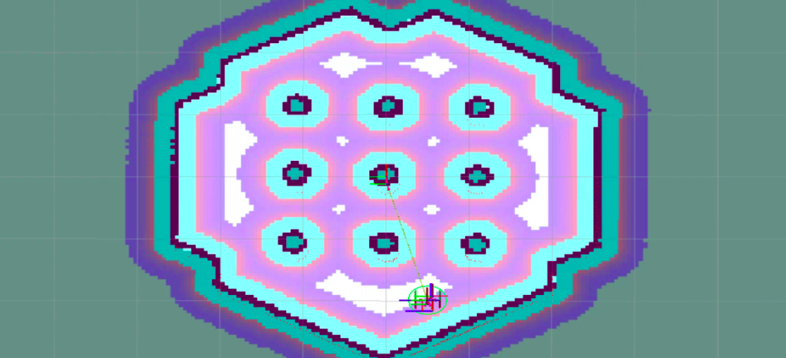
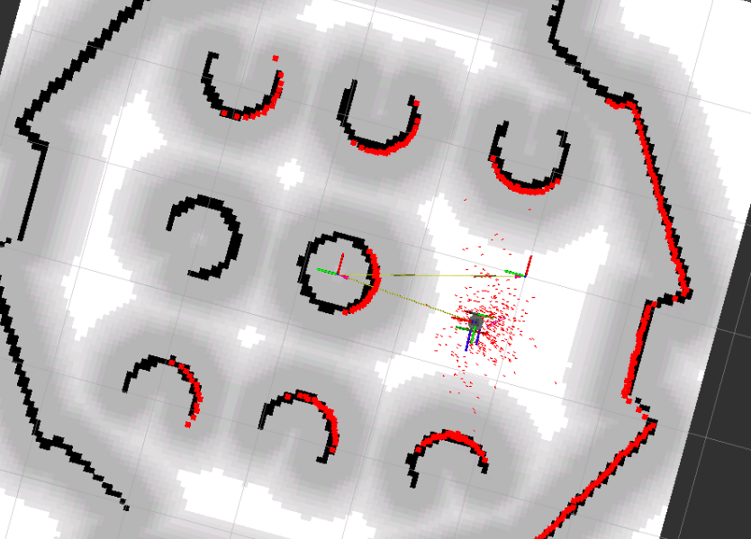
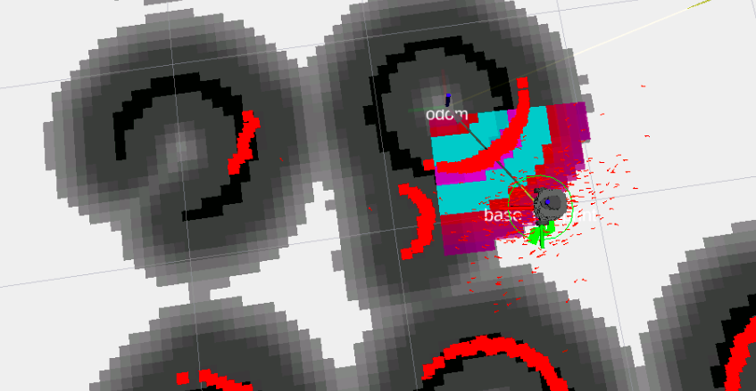

# Como a prevenção de obstáculos acontece no ROS2
* Uma explicação do Costmap 2D
* Mapas de custos globais
* Mapas de custos locais
* Como o Nav2 usa Costmaps para evitar obstáculos
FINALMENTE: integre todas as partes de navegação em um único arquivo de inicialização

## Mapas de custo
Este é um mapa de custos.

<div align="center">
     
</div>

Um Costmap é uma representação 2D de obstáculos detectados por robôs em um mapa de grade.

Cada célula da grade contém informações sobre os obstáculos detectados pelos sensores
O custo da célula pode ser desconhecido, livre, ocupado ou inflado
Cores diferentes indicam a probabilidade de colisão e obstáculo
Essas informações são usadas pelos controladores, planejadores e recuperações para calcular suas tarefas com segurança e eficiência
Mapas de custos globais e locais
Existem dois tipos de mapas de custos:

Um mapa de custo global (imagem à esquerda) é gerado a partir dos obstáculos no mapa estático. É o mapa usado pelo planejador para gerar o caminho de longo prazo.
Um mapa de custo local (imagem à direita) é criado a partir de novos obstáculos detectados pelo robô em uma pequena área ao redor do robô. O controlador o utiliza para gerar o caminho de curto prazo e evitar obstáculos dinâmicos.

## Diferenças entre mapas de custos globais e locais
* O Global Costmap ajuda a evitar os obstáculos conhecidos no mapa, enquanto o Local Costmap é usado para evitar os obstáculos dinâmicos, que não estão no mapa.
* O Global Costmap cobre todo o mapa, enquanto o Local Costmap cobre uma pequena área ao redor do robô.
* O mapa de custo global é estático sobre o mapa, enquanto o mapa de custo local rola sobre o mapa de custo global à medida que o robô se move pelo espaço.

## Adicione um mapa de custos global ao seu sistema de navegação
Para adicionar um mapa de custos global, adicione a seguinte série de parâmetros ao arquivo de configuração do planejador.

```yaml
global_costmap:
  global_costmap:
    ros__parameters:
      update_frequency: 1.0
      publish_frequency: 1.0
      global_frame: map
      robot_base_frame: base_link
      use_sim_time: True
      robot_radius: 0.15
      resolution: 0.05
      track_unknown_space: true
      plugins: ["static_layer", "inflation_layer"]
      static_layer:
        plugin: "nav2_costmap_2d::StaticLayer"
        map_subscribe_transient_local: True
      inflation_layer:
        plugin: "nav2_costmap_2d::InflationLayer"
        cost_scaling_factor: 3.0
        inflation_radius: 0.35
      always_send_full_costmap: True
```

Adicione a lista de configurações acima ao `planner_server.yaml`.
> MUITO IMPORTANTE: leve em consideração a indentação. O início da configuração global_costmap deve corresponder à primeira coluna do arquivo.

* Compilar e fonte.
* Inicie todos os sistemas de planejamento de caminho (lembre-se, ele também precisa ter o map_server e o AMCL).
* Abra o RVIZ, carregue a configuração RVIZ do planejador de caminho que você criou e localize corretamente o robô.
* Em seguida, adicione uma exibição de mapa de custos ao RVIZ para o tópico /global_costmap/costmap (selecione o esquema de cores como mapa). Salve esta nova configuração.
* Configure essa exibição para visualizar o global_costmap.

<div align="center">
     
</div>

Os obstáculos do mapa foram expandidos em diferentes tons de cinza para indicar os espaços que o robô não pode mover (por estar muito próximo do obstáculo). As áreas cinza claro são aquelas que o planejador usará para planejar.
O laser detecta o cone extra, mas não o inclui no Costmap. Isso significa que o objeto não será levado em consideração no caminho e o robô poderá colidir com ele.
Agora, envie uma pose de objetivo 2D para o lado oposto do cone. Você verá que o caminho gerado não leva em consideração o cone (o caminho o atravessa), e o Costmap não inclui o cone, e o robô se choca contra ele.

> INFORMAÇÕES ADICIONAIS: qualquer coisa incluída em seu mapa será considerada um obstáculo existente pelo planejador do caminho, mesmo que não exista mais no mundo real.

## Camadas de obstáculos do mapa de custo global
O mapa de custos global é gerado como a superposição de diferentes camadas de obstáculos. Cada camada adiciona um conjunto de obstáculos ao mapa de custos global com base em como a camada calcula os obstáculos.

Camadas de mapa de custo disponíveis:

* `Static Layer` - Adiciona como obstáculo ao Global Costmap qualquer ponto preto que exista no mapa estático
* `Layer de Inflação` - Adiciona uma inflação a qualquer obstáculo no Mapa de Custo Global, como uma distância segura para manter
* `Obstacle Layer` - Adiciona ao Global Costmap qualquer objeto detectado por um sensor 2D
* `Layer Voxel` - Adiciona ao Global Costmap obstáculos 3D a partir de dados PointCloud
Você pode especificar uma ou todas as camadas anteriores para aplicar ao mapa de custo global. No entanto, para incluí-los, você precisa adicioná-los à lista de plugins e depois incluir os parâmetros de configuração de cada um.
```python
    plugins: ["static_layer", "obstacle_layer", "inflation_layer"]
```

1. Adicione o obstáculo_layer no mapa de custo global como um plug-in.
2. Inclua a seguinte configuração no planner_server.yaml (no mesmo nível da configuração de outros plug-ins).
> MUITO IMPORTANTE: leve em consideração a indentação. A configuração a seguir deve ter o mesmo nível de indentação que static_layer.

```yaml
    obstacle_layer:
        plugin: "nav2_costmap_2d::ObstacleLayer"
        enabled: True
        observation_sources: scan
        scan:
          topic: /scan
          max_obstacle_height: 2.0
          clearing: True
          marking: True
          data_type: "LaserScan"
          raytrace_max_range: 3.0
          raytrace_min_range: 0.0
          obstacle_max_range: 2.5
          obstacle_min_range: 0.0
```
> MUITO IMPORTANTE: Inclua o "obstacle_layer" na lista de plugins antes do "inflation_layer". Caso contrário, os obstáculos recém-detectados não serão ampliados pelo plug-in "inflation_layer".

Agora reinicie-o e repita os caminhos da configuração anterior. Você pode ver a diferença?
Ao adicionar essa camada, novos obstáculos são levados em consideração no cálculo do caminho e podem ser evitados.

Configurando os parâmetros globais do mapa de custos
1. Parâmetros gerais
Aqui estão os parâmetros mais comuns usados. Há mais para situações mais obscuras. Verifique a documentação oficial para obter uma lista completa.

## Configurando os parâmetros globais do mapa de custos
### 1. Parâmetros gerais
Aqui estão os parâmetros mais comuns usados. Há mais para situações mais obscuras. Verifique a documentação oficial para obter uma lista completa.

```yaml
global_costmap:
  global_costmap:
    ros__parameters:
      update_frequency: 1.0
      publish_frequency: 1.0
      global_frame: map
      robot_base_frame: base_link
      use_sim_time: True
      robot_radius: 0.15
      resolution: 0.05
      track_unknown_space: true
      plugi
      ns: ["static_layer", "obstacle_layer", "inflation_layer"]
```      
* `global_frame` (string, "map"): Quadro de referência.
* `height` (int, 5 m): Altura do mapa de custos.
* `width` (int, 5 m): Largura do mapa de custos.
* `plugin` (vetor, “static_layer”, “obstacle_layer”, “inflation_layer”): Lista de nomes de plugins mapeados para namespaces e nomes de parâmetros.
* `publish_frequency` (duplo, 1,0 Hz): Frequência para publicar o Costmap no tópico.
* `resolution` (duplo, 0,1): Resolução de 1 pixel do Costmap, em metros.
* `robot_base_frame` (string, "base_link"): Estrutura base do robô.
* `robot_radius` (duplo, 0,1 m): Raio do robô a ser usado, se as coordenadas do perímetro não forem fornecidas.
* `update_frequency` (duplo, 5,0 Hz): Frequência de atualização do mapa de custo

### 2. Camada Estática

```yaml
    static_layer:
        plugin: "nav2_costmap_2d::StaticLayer"
        map_subscribe_transient_local: True
```
A camada do mapa estático representa uma parte amplamente imutável do Costmap, como aquelas geradas pelo SLAM.

* `map_subscribe_transient_local` (bool, verdadeiro): Configurações de QoS para o tópico do mapa.

* `enabled (bool, verdadeiro)`: Se está habilitado.

* `Subscribe_to_updates (bool, verdadeiro)`: Assine atualizações de mapas estáticos depois de recebê-los.

* `transform_tolerance (duplo, 0,1 m)`: Tolerância TF

### 3. Camada de Inflação

```yaml
  inflation_layer:
        plugin: "nav2_costmap_2d::InflationLayer"
        cost_scaling_factor: 3.0
        inflation_radius: 0.35
```

A camada de inflação é uma otimização que adiciona novos valores em torno de obstáculos letais (ou seja, infla os obstáculos) para fazer o Costmap representar o espaço de configuração do robô.

* `enabled` (bool, verdadeiro): Se está habilitado.
* `inflation_radius` (duplo, 0,55): Raio para inflar o Costmap em torno de obstáculos letais.
* `cost_scaling_factor` (duplo, 1,0): Fator de decaimento exponencial ao longo do raio de inflação.
* `always_send_full_costmap` (bool, verdadeiro): Se deve enviar um Costmap completo a cada atualização, em vez de atualizações parciais.

### 4. Camada de Obstáculo

```yaml
      obstacle_layer:
        plugin: "nav2_costmap_2d::ObstacleLayer"
        enabled: True
        observation_sources: scan
        scan:
          topic: /scan
          max_obstacle_height: 2.0
          clearing: True
          marking: True
          data_type: "LaserScan"
          raytrace_max_range: 3.0
          raytrace_min_range: 0.0
          obstacle_max_range: 2.5
          obstacle_min_range: 0.0
```

A camada de obstáculos rastreia os obstáculos lidos pelos dados do sensor. O ObstacleCostmapPlugin marca e traça os obstáculos em duas dimensões, enquanto o VoxelCostmapPlugin o faz em três dimensões.

* `enabled` (bool, verdadeiro): Se está habilitado.
* `observation_sources` (vetor {""}): Namespace de fontes de dados.
* `footprint_clearing_enabled` (bool, verdadeiro): Limpe todas as células ocupadas sob a pegada do robô.
* `max_obstacle_height` (duplo, 2.0): Altura máxima para adicionar um retorno à grade de ocupação.
* `combination_method` (int, 1): Enum para um método para adicionar dados ao mapa de custo mestre, padrão para o máximo.
* `topic` (string, ""): Tópico de dados.
* `obstáculo_range` (duplo, 2,5): Alcance máximo para marcar obstáculos no Costmap.
* `raytrace_range` (duplo, 3.0): Alcance máximo para raytrace eliminar obstáculos do Costmap.
* `min_obstacle_height` (duplo, 0.0): Altura mínima a acrescentar para voltar à grelha de ocupação.
* `clearing` (bool, verdadeiro): Se a fonte deve limpar o raytrace no Costmap.
* `marking` (bool, true): Se a origem deve ser marcada no Costmap.
* `data_type` (string, "LaserScan"): O tipo de dados de entrada, LaserScan ou PointCloud2.
* `inf_is_valid` (bool, falso): Os retornos infinitos de scanners a laser são medições válidas para raycast?

#### 5. Camada de voxels
A camada voxel inclui obstáculos detectados em 3D nos Costmaps 2D.
```yaml
    voxel_layer:
        plugin: "nav2_costmap_2d::VoxelLayer"
        enabled: True
        footprint_clearing_enabled: true
        max_obstacle_height: 2.0
        publish_voxel_map: True
        origin_z: 0.0
        z_resolution: 0.05
        z_voxels: 16
        max_obstacle_height: 2.0
        unknown_threshold: 15
        mark_threshold: 0
        observation_sources: pointcloud
        combination_method: 1
        pointcloud:  # no frame set, uses frame from message
          topic: /intel_realsense_r200_depth/points
          max_obstacle_height: 2.0
          min_obstacle_height: 0.0
          obstacle_max_range: 2.5
          obstacle_min_range: 0.0
          raytrace_max_range: 3.0
          raytrace_min_range: 0.0
          clearing: True
          marking: True
          data_type: "PointCloud2"
```
Verifique a [documentação oficial](https://navigation.ros.org/configuration/packages/costmap-plugins/voxel.html) aqui para saber mais sobre esta camada.

## Adicionar um mapa de custos local
Para adicionar um mapa de custos local, você deve adicionar uma série de parâmetros ao arquivo de configuração do controlador (na parte inferior do arquivo).

> MUITO IMPORTANTE: leve em consideração a indentação. O início da configuração deve corresponder à primeira coluna do arquivo.

```yaml
local_costmap:
  local_costmap:
    ros__parameters:
      update_frequency: 5.0
      publish_frequency: 2.0
      global_frame: odom
      robot_base_frame: base_link
      use_sim_time: True
      rolling_window: true
      width: 1
      height: 1
      resolution: 0.05
      robot_radius: 0.15
      plugins: ["voxel_layer", "inflation_layer"]
      inflation_layer:
        plugin: "nav2_costmap_2d::InflationLayer"
        cost_scaling_factor: 3.0
        inflation_radius: 0.35
      voxel_layer:
        plugin: "nav2_costmap_2d::VoxelLayer"
        enabled: True
        publish_voxel_map: True
        origin_z: 0.0
        z_resolution: 0.05
        z_voxels: 16
        max_obstacle_height: 2.0
        mark_threshold: 0
        observation_sources: scan
        scan:
          topic: /scan
          max_obstacle_height: 2.0
          clearing: True
          marking: True
          data_type: "LaserScan"
          raytrace_max_range: 3.0
          raytrace_min_range: 0.0
          obstacle_max_range: 2.5
          obstacle_min_range: 0.0
      static_layer:
        map_subscribe_transient_local: True
      always_send_full_costmap: True
```

Como você pode ver, o mapa de custos local contém a mesma estrutura e conjunto de parâmetros do mapa de custos global. Isso faz todo o sentido, já que este Costmap é apenas uma versão reduzida e mais dinâmica do global.

1. Adicione a lista anterior de configurações ao `controller.yaml` que você criou no topico anterior.
2. Compilar e fonte.
3. Em seguida, inicie todos os sistemas de planejamento de caminho (lembre-se de que também precisa ter o `map_server` e o `AMCL`).
4. Abra o RVIZ, carregue o arquivo de configuração `pathplanning_rviz_config` que você criou na lição anterior e localize corretamente o arquivo robot.
5. Em seguida, adicione outra exibição de `mapa de custos` ao RVIZ (selecione o esquema de cores como mapa de custos). Salve esta nova configuração.
6. Configure essa exibição para visualizar o `local_costmap`. Você deve ver algo assim:

<div align="center">
     
</div>

A parte em cores é o mapa de custos local. No entanto, como você pode ver, ele cobre apenas uma pequena seção do mapa (porque o mapa de custos local cobre apenas os metros de largura e altura especificados no arquivo de configuração).

* Salve a configuração do Rviz para não perder suas alterações
* Adicione o cone à simulação como um objeto extra que não está no mapa (caso ainda não o tenha).
* Peça ao robô para se mover para o outro lado do cone.

O mapa de custos local é usado por sua reação rápida diante de obstáculos próximos. Por esse motivo, seu tamanho é reduzido a poucos metros. O tamanho real deste Costmap é especificado em dois parâmetros adicionais:

- width
- height

Esses dois parâmetros determinam o tamanho da área do Costmap ao redor do robô que os sensores atualizam.

## O papel da forma do robô nos Costmaps
A forma do robô indica até que ponto os obstáculos nos Costmaps serão inflados. Essa forma será levada em consideração para calcular se um caminho está disponível em uma determinada zona.

Você especifica a forma do robô nos parâmetros Costmaps, tanto no local quanto no global.

Normalmente, você usa robôs redondos (ou próximos disso). Nesses casos, use o parâmetro robot_radius nos parâmetros de configuração. Por exemplo, verifique os parâmetros anteriores. Você deve encontrar isto:
```bash
robot_radius: 0.3
```
Para robôs mais complicados, por exemplo, robôs retangulares, robôs grandes quadrados e robôs de formas estranhas - você teria que usar o parâmetro `footprint`, indicando as coordenadas para cada ponto do robô.

A `footprint` significa a projeção do robô no chão.

Por exemplo, para um robô quadrado de 65 cm de lado, você especificaria:
```bash
footprint: '[[0.325, 0.325], [0.325, -0.325], [-0.325, -0.325], [-0.325, 0.325]]'
```

> IMPORTANTE: Não especifique os dois parâmetros ao mesmo tempo! Especifique a pegada ou o robot_radius.

### Mudança adicional para configuração do controlador
Há uma etapa extra para a configuração do controlador na seção de críticas do arquivo de configuração, dependendo de qual parâmetro você está usando.

* Se você usar o parâmetro robot_radius, especifique o crítico BaseObstacle.
* Se você usar o parâmetro footprint, especifique o crítico ObstacleFootprint.

Passos:

1. Identifique as dimensões do robô
2. Crie a lista de pontos para cada um dos cantos do robô
3. Modifique ambos os parâmetros do Costmaps
4. Verifique se a navegação ainda está funcionando corretamente

## Criando um único arquivo de inicialização de navegação
Se você chegou a este ponto, significa que você tem a navegação completa para o robô em execução. No entanto, você ainda precisa fazer uma pequena alteração para ter um sistema de navegação completo funcionando.

Para um sistema de navegação completo, você deve ter um único nó nav2_lifecycle_manager gerenciando TODOS OS NÓS DE NAVEGAÇÃO.

Até agora, você tem dois nós nav2_lifecycle_manager:

* Um deles é gerenciar o map_server e o localization_server.
* Outra é gerenciar o planejador de caminho, o controlador, o bt_navigator e o recovery_server.

Fizemos esta divisão para fins de aprendizagem. Além disso, essa estrutura é muito útil quando você tem problemas para identificar qual nó está causando problemas.

No entanto, para sistemas de navegação reais, você precisa de um único arquivo de inicialização onde todos os nós são gerenciados pelo mesmo nav2_lifecycle_manager.

Lembre-se de incluir:

* O lançamento do map_server, localização, pathplanner, controlador, bt_navigator e o recovery_server.
* Lembre-se de gerenciar todos eles com um único nav2_lifecycle_manager. Além disso, forneça um nome genérico para o nó do nav2_lifecycle_manager. Chame-o lifecycle_manager.
* Lembre-se de incluir os arquivos de configuração para cada nó.

> navigation.launch.py

```python
import os
from ament_index_python.packages import get_package_share_directory
from launch import LaunchDescription
from launch_ros.actions import Node

def generate_launch_description():

    controller_yaml = os.path.join(get_package_share_directory('path_planner_server'), 'config', 'controller.yaml')
    bt_navigator_yaml = os.path.join(get_package_share_directory('path_planner_server'), 'config', 'bt_navigator.yaml')
    planner_yaml = os.path.join(get_package_share_directory('path_planner_server'), 'config', 'planner_server.yaml')
    recovery_yaml = os.path.join(get_package_share_directory('path_planner_server'), 'config', 'recovery.yaml')
    nav2_yaml = os.path.join(get_package_share_directory('localization_server'), 'config', 'amcl_config.yaml')
    map_file = os.path.join(get_package_share_directory('map_server'), 'config', 'turtlebot_area.yaml')
    
    return LaunchDescription([     
        Node(
            package='nav2_map_server',
            executable='map_server',
            name='map_server',
            output='screen',
            parameters=[{'use_sim_time': True}, 
                        {'yaml_filename':map_file}]
        ),
            
        Node(
            package='nav2_amcl',
            executable='amcl',
            name='amcl',
            output='screen',
            parameters=[nav2_yaml]
        ),
        Node(
            package='nav2_controller',
            executable='controller_server',
            name='controller_server',
            output='screen',
            parameters=[controller_yaml]),

        Node(
            package='nav2_planner',
            executable='planner_server',
            name='planner_server',
            output='screen',
            parameters=[planner_yaml]),
            
        Node(
            package='nav2_recoveries',
            executable='recoveries_server',
            name='recoveries_server',
            parameters=[recovery_yaml],
            output='screen'),

        Node(
            package='nav2_bt_navigator',
            executable='bt_navigator',
            name='bt_navigator',
            output='screen',
            parameters=[bt_navigator_yaml]),

        Node(
            package='nav2_lifecycle_manager',
            executable='lifecycle_manager',
            name='lifecycle_manager',
            output='screen',
            parameters=[{'autostart': True},
                        {'node_names': ['map_server',
                                        'amcl',
                                        'controller_server',
                                        'planner_server',
                                        'recoveries_server',
                                        'bt_navigator']}])
    ])
```