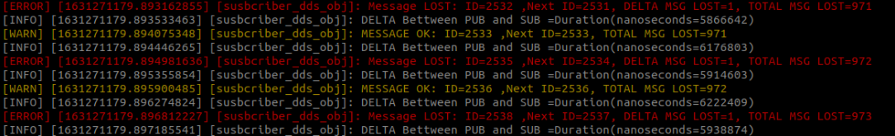

# Entendendo o DDS no ROS2
* Entendendo o DDS no ROS2
* Uso básico das ferramentas de depuração RVIZ2
* ferramenta view_frames
* Médico ROS2

## O que é DDS?
O Serviço de Distribuição de Dados (DDS) é um Middleware que visa permitir trocas de dados de alto desempenho usando um método de publicação-assinatura semelhante ao usado no ROS.

Existem três vantagens principais de usar sistemas DDS:

* Conectividade de dados de baixa latência
* Confiabilidade extrema e flexível
* Arquiteturas escaláveis

Então, DDS é o mesmo que ROS?
NÃO! DDS é um padrão de comunicação. Seu mercado é mais geral, como militar, controle de tráfego aéreo, veículos autônomos e dispositivos médicos.

ROS2 é mais como um ecossistema.

Ele fornece uma estrutura amigável para quem deseja criar aplicativos robóticos.

O ROS2 fornece um nível de abstração mais alto que o DDS, especialmente para aplicações robóticas. Por exemplo, fornece tipos de dados prontos e componentes projetados para robótica.

O ROS2 também fornece configurações de protocolo de qualidade de serviço (QoS) predefinidas, adaptadas para robótica.

Resumindo: o ROS2 fornece, entre outras coisas, uma camada de simplificação sobre o protocolo DDS que facilita a vida de um roboticista.

Portanto, o ROS2 é construído sobre o DDS/RTPS, pois é um middleware. Em resumo, o DDS é um Middleware end-to-end que fornece recursos relevantes para sistemas ROS, como descoberta distribuída (não centralizada como no ROS1) e controle sobre diferentes opções de QoS para transporte.

### Fundamentos do DDS
O DDS tem os seguintes elementos básicos:

* Data Centricity
* QoS
* Descoberta Dinâmica
* Segurança

#### 1. Centralização de dados:
Um dos problemas que os sistemas complexos têm é: onde transmitir os dados gerados por um aplicativo para todos os outros aplicativos, com o mínimo de impacto no sistema e baixa latência.

O DDS usa um assinante, editor e arquitetura NODE para gerenciar seus dados.

* Ele decide quando publicar informações. Se não houver ninguém ouvindo esse tópico, ele para de publicar.
* Se informações de tópicos específicos forem lidas por vários `app/nodes`, ele as gerenciará para evitar cópias inúteis das informações.
* Ele limpa as informações antigas ou as armazena por um tempo específico, dependendo das especificações e necessidades do editor.

Estas são algumas das tarefas transparentes para o usuário que o DDS gerencia.

#### 2. QoS:
Este é um recurso essencial para os usuários do ROS2 porque é um dos elementos com os quais você mais trabalhará.

A maneira como os dados são compartilhados nos tópicos DDS pode ser configurada de várias maneiras. Alguns deles são:

* Confiabilidade: Você quer que as informações enviadas cheguem aos assinantes? Quantos pacotes você concorda em perder e similares?
* Integridade do sistema: deseja verificar se o publicador publica informações a cada 0,1 segundos e, caso contrário, alertar o sistema? Isso é crítico em sistemas de segurança e de risco de vida.
* Segurança: Você quer que alguém acesse os dados? Você quer criptografar?

O DDS também armazena informações extras dos assinantes e editores do tópico para gerenciar a compatibilidade de ambas as extremidades da QoS.

#### 3. Descoberta dinâmica:
O DDS permite a funcionalidade PLUG&PLAY graças a esta descoberta dinâmica.

O DDS rastreia todos os Nodes que se inscrevem e publicam os tipos de mensagens, QoS, etc. Isso permite que os sistemas iniciem e parem os Nodes sem afetar os outros elementos do sistema usando o DDS.

O DDS também se adapta às novas versões das mensagens enviadas e propaga essas alterações pelo sistema.

#### 4. Segurança:
O DDS inclui mecanismos de autenticação, controle de acesso e integridade das informações.

Para ver um tutorial sobre como ativar a segurança, assista a este vídeo: [ROS2 Security](https://www.youtube.com/watch?v=UJa4XWRA6EY).

Então, o DDS é usado no ROS1?

Não. No ROS1, esses conceitos de comunicação foram implementados com base em protocolos personalizados (ou seja, TCPROS).

Para usar uma implementação DDS/RTPS com ROS2, deve ser criado um pacote “ROS Middleware interface” que implemente a interface abstrata ROS Middleware usando a API e as ferramentas da implementação DDS ou RTPS.

O ROS poderia se basear em uma implementação específica do DDS. No entanto, várias implementações diferentes estão disponíveis e cada uma tem seus prós e contras em termos de plataformas suportadas, linguagens de programação, características de desempenho, consumo de memória, dependências e licenciamento.

Portanto, o ROS visa suportar várias implementações DDS, embora cada uma difira ligeiramente em sua API exata. Uma interface abstrata é introduzida para abstrair das especificidades dessas APIs, que podem ser implementadas para diferentes implementações de DDS. Essa interface Middleware define a API entre a biblioteca do cliente ROS e qualquer implementação específica.

## Verifique o Middleware atual
Primeiro, obtenha o ROS2 Humble para garantir que você possa acessar a ferramenta ROS2 doctor.

```bash
cd ~/ros2_ws
source install/setup.bash
```
Agora, gere um relatório usando o ROS2 doctor.
```bash
ros2 doctor --report
```
Isso gerará um relatório completo detalhando alguns dados sobre a configuração atual do seu ambiente. Além disso, você verá uma seção entre os dados do relatório indicando o RMW MIDDLEWARE atual usado.

No caso do Humble, por padrão, cyclonedds é usado:

```bash
RMW MIDDLEWARE
    , bymiddleware name    : rmw_fastrtps_cpp
```

> Embora tenhamos que observar que as principais pilhas do ROS2 Humble, como navegação e outros sistemas, relataram ter problemas com fastrtps e solicitam que você mude para Cyclone.

## Implementações de DDS suportadas no Humble

### Começando

Existem três implementações DDS suportadas nativamente no ROS2 Humble:

* eProsima Fast DDS [padrão]
* Eclipse Ciclone DDS
* Connextdds

#### Fast DDS Eprosima
É o middleware DDS padrão fornecido com o ROS2 Humble.

Eprosima afirma ser muito mais rápido e eficiente que o ciclone. Você pode dar uma olhada em suas reivindicações aqui [AQUI](https://www.eprosima.com/index.php/resources-all/performance/fast-dds-vs-cyclone-dds-performance)

Como dissemos, existem várias pilhas ROS2 como Navigation, RMF e outras que parecem ter problemas com o FastDDS. É por isso que, embora normalmente tenhamos usado o FastDDS durante todo o curso, leve em consideração que nem sempre funcionará como esperado.

#### Ciclone Eclipse
Então o que é?

Por que é a versão padrão?

O que o torna uma boa opção de DDS para ROS2?

#### Elementos do Eclipse Cyclone
O Eclipse Cyclone é uma implementação de DDS que teve um bom desempenho e possui dois projetos filhos que estão integrados ou provavelmente serão integrados no futuro, o que o torna uma boa opção para DDS:

* Eclipse iceoryx:

É o sistema de protocolo de cópia zero - um ponto a ponto que usa o Cyclone para transmitir grandes quantidades de um nó para outro.

O truque é que você não está passando os dados originais, mas POINTERS para esses dados. Isso não é novidade. O Iceoryx adiciona o gerenciamento principal da estrutura do editor/assinante ao mix, tornando-o compatível com o DDS.

Isso foi desenvolvido especialmente para veículos autônomos, que geram grandes quantidades de dados de vídeo que devem ser processados para aplicativos de detecção de faixa, aplicativos de detecção de pedestres, aplicativos de detecção de veículos e aplicativos de navegação. A lista continua. Era impossível enviar cópias de todos esses dados para cada aplicativo a tempo de decidir o que fazer e mover o carro de acordo.

O envio de ponteiros reduz a latência.

* Eclipse zenoh:

Foi comprovado que o DDS é eficaz na transmissão de dados local e LAN. No entanto, não foi criado pensando em WIFI e INTERNET. É aí que entra o Zenoh. Ele gera uma ponte entre os sistemas DDS e gerencia a descoberta do Node por meio de sistemas WIFI e INTERNET, que é o principal problema na comunicação pela INTERNET.

Você pode revisar este tutorial se estiver interessado: Tutorial de integração do [ZENOH ROS2](https://zenoh.io/blog/2021-04-28-ros2-integration/).

Eles são instalados assim:

```bash
sudo apt update
# Installed when you install ROS2
sudo apt install ros-humble-rmw-fastrtps-cpp
# Installed when you install ROS2
sudo apt install ros-humble-rmw-cyclonedds-cpp
# You will probably have to install it 
# Be aware that it is a 30-day trial, and you cannot use it for commercial purposes
sudo apt install ros-humble-rmw-connextdds
```
Vamos instalar o Cyclone para poder utilizá-lo:

```bash
sudo apt update
sudo apt install ros-humble-rmw-cyclonedds-cpp -y
```
Para obter mais informações, consulte o seguinte:

Referência: [Implementações DDS em Humble](https://docs.ros.org/en/humble/Concepts/About-Different-Middleware-Vendors.html)

### Como alterar o DDS a ser utilizado no sistema
Para fazer isso, altere o valor de uma variável de sistema RMW_IMPLEMENTATION:

```bash
# FastDDS
export RMW_IMPLEMENTATION=rmw_fastrtps_cpp
# CycloneDDS
export RMW_IMPLEMENTATION=rmw_cyclonedds_cpp
# ContextDDS
export RMW_IMPLEMENTATION=rmw_connextdds
```
Leve em consideração que no ros2doctor, ele ainda indicará que você está usando o Fast DDS padrão.

Para executar um lançamento DDS ou Node, execute o comando em um terminal com a exportação feita assim:

```bash
export RMW_IMPLEMENTATION=rmw_fastrtps_cpp
ros2 run <your_package> <your application>
```
É melhor parar o ros2daemon e reiniciá-lo para garantir que usamos o middleware correto:

```bash
ros2 daemon stop
ros2 daemon start
ps faux | grep "rmw-implementation"
```
Você deve ver que agora ele indica o que você definiu com a exportação:

```bash
ps faux | grep "rmw-implementation"
user       5132  0.0  0.0   3468  1676 pts/0    S+   10:26   0:00  |   \_ grep --color=auto rmw-implementation
user       5073  1.0  0.1 675144 47348 pts/0    Sl   10:26   0:00 /usr/bin/python3 -c from ros2cli.daemon.daemonize import main; main() --name ros2-daemon --ros-domain-id 0 --rmw-implementation rmw_cyclonedds_cpp
```
Faça um teste:

```bash
cd ~/ros2_ws;source install/setup.bash
export RMW_IMPLEMENTATION=rmw_fastrtps_cpp
ros2 run demo_nodes_py talker
```

```bash
cd ~/ros2_ws;source install/setup.bash
export RMW_IMPLEMENTATION=rmw_fastrtps_cpp
ros2 run demo_nodes_py listener
```
Agora faça a mesma coisa com a exportação:
```bash
exportar RMW_IMPLEMENTATION=rmw_cyclonedds_cpp
```

```bash
cd ~/ros2_ws;source install/setup.bash
export RMW_IMPLEMENTATION=rmw_cyclonedds_cpp
ros2 run demo_nodes_py talker
```

```bash
cd ~/ros2_ws;source install/setup.bash
export RMW_IMPLEMENTATION=rmw_cyclonedds_cpp
ros2 run demo_nodes_py listener
```

Então, como você pode ver, não há muita diferença entre usar um ou outro.

Então, por que se preocupar?

Boa pergunta. Para a maioria dos usuários do ROS2, isso não será importante. No entanto, para alguns, não. Por exemplo:

* O FastDDS dá acesso a alguns perfis extras de QoS que o Cyclone não oferece.
* E o CycloneDDS é melhor com usuários que já possuem aplicativos CycloneDDS fora do ROS2.
* Existem alguns eventos que FastDDS ou Cyclone não suportam. Por exemplo, o FastDDS não oferece suporte a eventos de QoS incompatíveis, o que o Cyclone oferece.
* Algumas pilhas como navegação, moveit e rmf funcionam melhor com o ciclone.

### Crie um Assinante simples e um Publicador para testar o DDS

Crie dois scripts que você usará para testar a configuração do DDS.

#### **1. Crie um novo pacote** chamado dds_tests_pkg em seu diretório `~/ros2_ws/src` e adicione as interfaces necessárias para trabalhar com tópicos.

```bash
cd ~/ros2_ws/src
ros2 pkg create --build-type ament_python dds_tests_pkg --dependencies rclpy std_msgs
```
#### **2. Crie dois novos arquivos** chamados `publisher_dds.py` e `Subscriber_dds.py` dentro da pasta `dds_tests_pkg` dentro do pacote recém-criado.

No arquivo que você acabou de criar, copie o seguinte código:

> publisher_dds.py

```python
import rclpy
# import the ROS2 python libraries
from rclpy.node import Node
# import the Twist module from geometry_msgs interface
from std_msgs.msg import String
import random


class PublisherDDS(Node):

    def __init__(self):
        # Here you have the class constructor
        # call super() in the constructor to initialize the Node object
        # the parameter you pass is the Node name
        super().__init__('publisher_dds_obj')
        # create the publisher object
        # in this case, the publisher will publish on /cmd_vel topic with a queue size of one message.
        self.publisher_ = self.create_publisher(String, '/dds_test', 1)
        # This is the Unique id for each of the messages that will be sent
        self.msgs_id = 0
        #self.current_time = self.get_clock().now()
        self.current_time_s = 0
        self.current_time_ns = 0
        # define the timer period for 0.5 seconds
        timer_period = 0.05
        # create a timer sending two parameters:
        # - the duration between two Callbacks (0.5 seconds)
        # - the timer function (timer_callback)
        self.timer = self.create_timer(timer_period, self.timer_callback)

    def timer_callback(self):
        # here you have the Callback method
        # create a Twist message
        msg = String()
        test_time = self.get_clock().now()
        self.current_time_s, self.current_time_ns = test_time.seconds_nanoseconds()
        time_str = str(self.current_time_s)+","+str(self.current_time_ns)
        dds_msg_str = str(self.msgs_id)+":"+time_str
        msg.data = dds_msg_str
        # publish the message to the topic
        self.publisher_.publish(msg)
        # display the message on the console
        self.get_logger().info('Publishing: "%s"' % msg)
        
        self.msgs_id += 1
            
def main(args=None):
    # initialize the ROS communication
    rclpy.init(args=args)
    # declare the Node constructor
    publisher_dds_obj = PublisherDDS()
    # pause the program execution, waits for a request to kill the Node (ctrl+c)
    rclpy.spin(publisher_dds_obj)
    # Explicity destroy the Node
    publisher_dds_obj.destroy_node()
    # shutdown the ROS communication
    rclpy.shutdown()

if __name__ == '__main__':
    main()
```

> subscriber_dds.py

```python
import rclpy
# import the ROS2 python libraries
from rclpy.node import Node
# import the LaserScan module from sensor_msgs interface
from std_msgs.msg import String
# import QoS library, to set the correct profile and reliability to read sensor data.
from rclpy.qos import ReliabilityPolicy, QoSProfile
# Time
from rclpy.clock import ClockType
from rclpy.time import Time

class SubscriberDDS(Node):

    def __init__(self):
        # here you have the class constructor
        # call super() in the constructor to initialize the Node object
        # the parameter you pass is the Node name
        super().__init__('subscriber_dds_obj')

        self.id = 0
        self.id_next = -1
        self.lost_messages_counter = 0

        # create the subscriber object
        self.subscriber= self.create_subscription(
            String,
            '/dds_test',
            self.listener_callback,
            QoSProfile(depth=10, reliability=ReliabilityPolicy.BEST_EFFORT)) #is the most used to read LaserScan data and some sensor data.
        # prevent unused variable warning
        self.subscriber

        

    def listener_callback(self, msg):
        # print the log info in the terminal
        
        # self.get_logger().info('I receive: "%s"' % str(msg))
        # save the received data
        self.process_dds_test_data(msg.data)

    def process_dds_test_data(self,data):
        """
        The data has the format ID:Seconds,NanoSeconds
        return:
        ID
        TIME Object
        """
        array = data.split(":")
        self.id = int(array[0])
        if self.id == 0:
            self.id_next = 0


        if self.id == self.id_next:
            self.get_logger().warning("MESSAGE OK: ID="+str(self.id)+" ,Next ID="+str(self.id_next)+", TOTAL MSG LOST="+str(self.lost_messages_counter))
        else:
            if self.id_next != -1:
                delta_messages_lost = self.id - self.id_next
                self.lost_messages_counter += delta_messages_lost
                self.get_logger().error("Message LOST: ID="+str(self.id)+" ,Next ID="+str(self.id_next)+", DELTA MSG LOST="+str(delta_messages_lost)+", TOTAL MSG LOST="+str(self.lost_messages_counter))
                
            else:
                # This is to avoid error in the first init message
                pass
        
        self.id_next = self.id + 1

        seconds = int(array[1].split(",")[0])
        nano_seconds = int(array[1].split(",")[1])
        time_obj = Time(seconds=seconds, 
                        nanoseconds=nano_seconds,
                        clock_type=ClockType.ROS_TIME)
        time_now_obj = self.get_clock().now()
        delta = time_now_obj - time_obj

        self.get_logger().info("DELTA Between PUB and SUB ="+str(delta))
        
        
            
def main(args=None):
    # initialize the ROS communication
    rclpy.init(args=args)
    # declare the Node constructor
    subscriber_dds_obj = SubscriberDDS()
    # pause the program execution, waits for a request to kill the Node (ctrl+c)
    rclpy.spin(subscriber_dds_obj)
    # explicity destroy the Node
    subscriber_dds_obj.destroy_node()
    # shutdown the ROS communication
    rclpy.shutdown()

if __name__ == '__main__':
    main()
```
Esta combinação de editor e assinante destina-se a fazer o seguinte:

* O editor gera um ID exclusivo para cada uma das mensagens a serem enviadas e seu tempo de geração.
* Em seguida, publica essas informações.

```python
# You get the time NOW
test_time = self.get_clock().now()
self.current_time_s, self.current_time_ns = test_time.seconds_nanoseconds()
# Generate a string version with the seconds and nanoseconds time NOW
time_str = str(self.current_time_s)+","+str(self.current_time_ns)
# Add to the string the mesage ID
dds_msg_str = str(self.msgs_id)+":"+time_str
msg.data = dds_msg_str
# Publish the message to the topic
self.publisher_.publish(msg)

# Increase the message ID by one once the message has been published
self.msgs_id += 1
```
* Em seguida, o assinante recebe essa mensagem e compara o horário de geração da mensagem com o horário atual. Dessa forma, você sabe se um determinado Middleware tem mais tempo de overhead do que o outro.
* Por outro lado, ele registra o ID das mensagens e verifica se esse é o ID da mensagem que esperava obter a seguir. Como os IDs das mensagens são sequenciais, é fácil saber com essas informações se você perdeu uma mensagem e quantas.

```python
if self.id == self.id_next:
    # The message ID is what you were waiting for
    # Therefore, you have not lost any message
    self.get_logger().warning("MESSAGE OK: ID="+str(self.id)+" ,Next ID="+str(self.id_next)+", TOTAL MSG LOST="+str(self.lost_messages_counter))
else:
    if self.id_next != -1:
        # The message ID is not the one you hoped for
        # Calculate how many messages have been lost
        delta_messages_lost = self.id - self.id_next
        self.lost_messages_counter += delta_messages_lost
        self.get_logger().error("Message LOST: ID="+str(self.id)+" ,Next ID="+str(self.id_next)+", DELTA MSG LOST="+str(delta_messages_lost)+", TOTAL MSG LOST="+str(self.lost_messages_counter))

    else:
        # This is to avoid error in the first init message
        pass
```
#### **3. Crie dois arquivos de inicialização** chamados `publisher_dds.launch.py` e `Subscriber_dds.launch.py` para iniciar o Node que você criou.

Para fazer isso, execute os seguintes códigos:
```bash
cd ~/ros2_ws/src/dds_tests_pkg
mkdir launch
```

```bash
cd ~/ros2_ws/src/dds_tests_pkg/launch
touch publisher_dds.launch.py
touch subscriber_dds.launch.py
chmod +x publisher_dds.launch.py
chmod +x subscriber_dds.launch.py
```
Dentro do novo arquivo de inicialização, escreva o código necessário para iniciar os arquivos executáveis:

> publisher_dds.launch.py

```python
from launch import LaunchDescription
from launch_ros.actions import Node

def generate_launch_description():
    return LaunchDescription([
        Node(
            package='dds_tests_pkg',
            executable='publisher_dds_exe',
            output='screen',
            emulate_tty=True),
    ])
```

> subscriber_dds.launch.py

```python
from launch import LaunchDescription
from launch_ros.actions import Node

def generate_launch_description():
    return LaunchDescription([
        Node(
            package='dds_tests_pkg',
            executable='subscriber_dds_exe',
            output='screen',
            emulate_tty=True),
    ])
```
#### **4. Modifique o setup.py** para adicionar o arquivo de inicialização que você criou. Em seguida, adicione os pontos de entrada ao executável para o script `simple_publisher`.

```python
from setuptools import setup
import os
from glob import glob

package_name = 'dds_tests_pkg'

setup(
    name=package_name,
    version='0.0.0',
    packages=[package_name],
    data_files=[
        ('share/ament_index/resource_index/packages',
            ['resource/' + package_name]),
        ('share/' + package_name, ['package.xml']),
        (os.path.join('share', package_name, 'launch'), glob('launch/*.launch.py'))
    ],
    install_requires=['setuptools'],
    zip_safe=True,
    maintainer='somebody very awesome',
    maintainer_email='user@user.com',
    description='TODO: Package description',
    license='TODO: License declaration',
    tests_require=['pytest'],
    entry_points={
        'console_scripts': [
            'publisher_dds_exe = dds_tests_pkg.publisher_dds:main',
            'subscriber_dds_exe = dds_tests_pkg.subscriber_dds:main'
        ],
    },
)
```

#### **5. Compile seu pacote**.

```bash
cd ~/ros2_ws/
colcon build --packages-select dds_tests_pkg
source ~/ros2_ws/install/setup.bash
```

#### **6. Por fim,** inicie o nó do assinante em seu shell.

```bash
cd ~/ros2_ws/
source ~/ros2_ws/install/setup.bash
export RMW_IMPLEMENTATION=rmw_cyclonedds_cpp
ros2 daemon stop
ros2 daemon start
ps faux | grep "rmw-implementation"
ros2 launch dds_tests_pkg publisher_dds.launch.py
```

```bash
cd ~/ros2_ws/
source ~/ros2_ws/install/setup.bash
export RMW_IMPLEMENTATION=rmw_cyclonedds_cpp
ros2 launch dds_tests_pkg subscriber_dds.launch.py
```
Você deve obter um resultado semelhante ao seguinte:

Como você pode ver, você obtém as seguintes informações:

* Status da mensagem: Se você perdeu ou não
* Total de mensagens perdidas
* Delta de tempo entre a publicação da mensagem e a assinatura da mensagem em nanossegundos.

Agora force o sistema a perder algumas mensagens.

Você pode conseguir isso por:

* Diminuir o tempo entre a publicação até que seu sistema não consiga lidar com isso.
PERÍODO de Tempo de Publicação = 0
Primeiro, modifique o timer_period no script `publisher_dds.py`:

```python
    def __init__(self):
        ...
        # define the timer period for 0.5 seconds
        timer_period = 0.05 --> timer_period = 0.0
        ...
```
Definir como 0.0 irá sobrecarregar o sistema com mensagens, perdendo mensagens no processo.

```bash
cd ~/ros2_ws/
colcon build --packages-select dds_tests_pkg
source ~/ros2_ws/install/setup.bash
```


```bash
# With modified version of timer_period = 0.0
cd ~/ros2_ws/
source ~/ros2_ws/install/setup.bash
export RMW_IMPLEMENTATION=rmw_cyclonedds_cpp
ros2 daemon stop
ros2 daemon start
ps faux | grep "rmw-implementation"
ros2 launch dds_tests_pkg publisher_dds.launch.py
```

```bash
cd ~/ros2_ws/
source ~/ros2_ws/install/setup.bash
export RMW_IMPLEMENTATION=rmw_cyclonedds_cpp
ros2 launch dds_tests_pkg subscriber_dds.launch.py
```

<div align="center">
     
</div>

Os efeitos podem variar, dependendo do sistema em que você está executando isso:

Em um sistema de 8 núcleos, você pode obter perdas de cerca de 9 mensagens no máximo.
Em um sistema de 12 núcleos, a perda é de apenas 1 mensagem.
Você pode comparar os resultados obtidos com a solução abaixo.

Agora inicie os mesmos scripts, mas com DDS Middleware diferente, neste caso, FASTDDS.

* Compare a perda de dados e o delta entre Pub/Sub e veja se há uma diferença notável.

Você pode comparar os resultados obtidos com a solução abaixo.

#### **1.FastDDS**

```bash
export RMW_IMPLEMENTATION=rmw_fastrtps_cpp
ros2 daemon stop
ros2 daemon start
ps faux | grep "rmw-implementation"
ros2 run dds_tests_pkg publisher_dds_exe
```
Segundo terminal:
```bash
export RMW_IMPLEMENTATION=rmw_fastrtps_cpp
ros2 run dds_tests_pkg subscriber_dds_exe
```

<div align="center">
     
</div>

#### **2. CycloneDDS**
```bash
export RMW_IMPLEMENTATION=rmw_cyclonedds_cpp
ros2 run dds_tests_pkg publisher_dds_exe
```
Segundo terminal:
```bash
export RMW_IMPLEMENTATION=rmw_cyclonedds_cpp
reset;ros2 run dds_tests_pkg subscriber_dds_exe
```

<div align="center">
     
</div>

Então, como você pode ver:

* Ambos os sistemas perdem mensagens.
* Esses testes variam muito dependendo do sistema em que você os executa. Nesse sistema em particular, nenhum deles parece dar uma vantagem significativa.
* Em sistemas maiores, baseado em FastDDS, em nossos testes, supera Cyclone.

Além disso, leve em consideração que, ao iniciar uma versão diferente do Middleware, certifique-se de que seu daemon ROS, que é iniciado quando algo ROS2 é iniciado, tenha a versão correta:

```bash
ps faux | grep "rmw-implementation"
```

> Output 

```bash
user       6819 29.0  0.1 675136 47252 pts/0    Sl   10:40   0:00 /usr/bin/python3 -c from ros2cli.daemon.daemonize import main; main() --name ros2-daemon --ros-domain-id 0 --rmw-implementation rmw_cyclonedds_cpp
```

Caso contrário, pare primeiro:

```bash
ros2 daemon stop
ros2 daemon start
```

## O que é ROS2 Daemon?
Em ROS1, você tinha ROS_MASTER ou ROSCORE.

Ele coordenou todos os Nodos para que eles pudessem se encontrar e se comunicar, entre outras coisas, como servir parâmetros, etc.

No ROS2, isso é inútil.

Ao usar o DDS, cada vez que você inicia o Node, ele usa um protocolo de descoberta para saber quais Nodes estão em execução e como a comunicação está conectada. NENHUM ROSCORE é necessário.

No entanto, isso tem um preço a pagar. Velocidade.

Isso é especialmente verdadeiro em sistemas complexos com centenas de nós.

Antes de começar, um novo Node descobre TODA a web do Node, o que não é o ideal.

É aqui que entra o ROS2 DAEMON.

Quando você executa o primeiro comando que precisa do daemon ROS, o daemon ROS2 é iniciado. Teste isto:

```bash
ps faux | grep "ros2_daemon"
ros2 daemon stop
ros2 daemon status
```

> Output 

```bash
The daemon is not running.
```
Agora, execute um comando que precisa do daemon ROS2 para funcionar e você verá que o daemon é reiniciado automaticamente.

Os nós de inicialização não iniciam o daemon ROS2 por si só. Portanto, é bom que antes de iniciar um sistema Node complexo, você o inicie.

```bash
ps faux | grep "ros2_daemon"
ros2 topic list
ros2 daemon status
```

> Output 

```bash
The daemon is running.
```

Claro, você também pode iniciá-lo com:
```bash
ros2 daemon start
```
> Output
```bash
The daemon has been started.
```
E dependendo de qual exportação de MiddleWare você fez, ele usará um ou outro:

```bash
export RMW_IMPLEMENTATION=rmw_fastrtps_cpp
ros2 daemon stop
ros2 daemon start
ps faux | grep "rmw-implementation"
```

> Output 

```bash
user       6740 32.0  0.1 558196 55652 pts/0    Sl   10:39   0:00 /usr/bin/python3 -c from ros2cli.daemon.daemonize import main; main() --name ros2-daemon --ros-domain-id 0 --rmw-implementation rmw_fastrtps_cpp
```

```bash
export RMW_IMPLEMENTATION=rmw_cyclonedds_cpp
ros2 daemon stop
ros2 daemon start
ps faux | grep "rmw-implementation"
```

> Output

```bash
user       6819 29.0  0.1 675136 47252 pts/0    Sl   10:40   0:00 /usr/bin/python3 -c from ros2cli.daemon.daemonize import main; main() --name ros2-daemon --ros-domain-id 0 --rmw-implementation rmw_cyclonedds_cpp
```