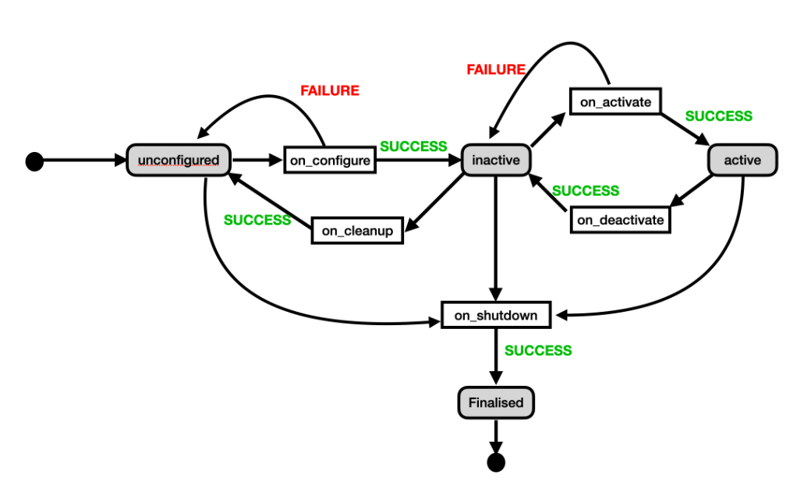
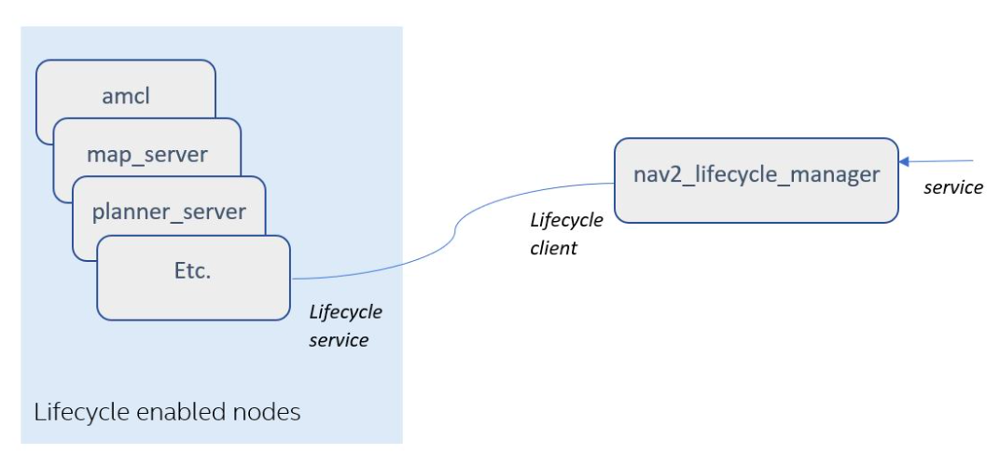

# Nós gerenciados

* Nós que herdam de Node()
* Nós que herdam de LifecycleNode()

## Por que você precisa de nós gerenciados?
Duas razões principais:

* Você precisa coordenar vários nós. Todos os nós envolvidos em um aplicativo de robô são iniciados em uma ordem específica antes do início da ação. Por exemplo, o sistema de localização não deve ser iniciado antes que o servidor de mapas seja iniciado e forneça mapas.
* Você deseja reiniciar ou pausar um sistema de software enquanto ele está em execução sem ter que eliminá-lo e reiniciá-lo, por exemplo. Você deseja reiniciar o sistema de navegação porque as condições mudaram.

Os nós gerenciados ainda não estão totalmente desenvolvidos. Mesmo assim, são massivamente utilizados em projetos Nav2 e MoveIt2 ROS2.

## O que é um nó gerenciado?
Um nó gerenciado é um nó com diferentes estados possíveis. O nó faz coisas diferentes dependendo de seu estado atual.

Os estados possíveis de um nó gerenciado são:

* Desconfigurado
* Inativo
* Ativo
* finalizado

Quando um nó gerenciado é criado, ele inicia no estado Não configurado.

Para mudar de um estado para outro, alguém tem que chutar o nó para pular para o outro. Isso é feito por um nó externo que geralmente assume o trabalho de gerenciar os nós e coordená-los. Também pode ser feito manualmente através da linha de comando (veja abaixo).

A figura a seguir representa os estados de um nó gerenciado e as transições entre eles:

<div align="center">
     
</div>

> NOTA: Atualmente, os nós gerenciados estão disponíveis para C++, não para Python. Portanto, no restante desta unidade, você trabalhará com C++.

## Exemplo simples de nó gerenciado
Crie um nó gerenciado simples chamado `scan_publisher` que simule uma conexão com o hardware do laser do robô. Quando a conexão é estabelecida e o laser está funcionando corretamente, ele publica os dados do laser no tópico `/managed_scan`.

Crie um novo pacote chamado `managed_scan` e adicione esse código a ele em um arquivo `cpp` chamado `managed_scan.cpp`.

```bash
ros2 pkg create --build-type ament_cmake managed_scan --dependencies rclcpp
```

**Qualquer aplicativo de ciclo de vida criado depende dos seguintes pacotes:**

* lifecycle_msgs.
* rclcpp_lifecycle
* std_msgs

Lembre-se de adicionar as dependências ao `CMakeLists.txt` e a instalação do executável para compilar. Em seguida, chame o executável `scan_publisher` e adicione o seguinte ao `CMakeLists.txt`:

> managed_scan/CMakelists.txt

```cmake
cmake_minimum_required(VERSION 3.8)
project(managed_scan)

if(CMAKE_COMPILER_IS_GNUCXX OR CMAKE_CXX_COMPILER_ID MATCHES "Clang")
  add_compile_options(-Wall -Wextra -Wpedantic)
endif()

# find dependencies
find_package(ament_cmake REQUIRED)
find_package(rclcpp REQUIRED)
find_package(lifecycle_msgs REQUIRED)
find_package(rclcpp_lifecycle REQUIRED)

if(BUILD_TESTING)
  find_package(ament_lint_auto REQUIRED)
  # the following line skips the linter which checks for copyrights
  # comment the line when a copyright and license is added to all source files
  set(ament_cmake_copyright_FOUND TRUE)
  # the following line skips cpplint (only works in a git repo)
  # comment the line when this package is in a git repo and when
  # a copyright and license is added to all source files
  set(ament_cmake_cpplint_FOUND TRUE)
  ament_lint_auto_find_test_dependencies()
endif()

ament_package()


add_executable(scan_publisher src/managed_scan.cpp)
ament_target_dependencies(scan_publisher 
    "lifecycle_msgs"
    "rclcpp_lifecycle"
    "std_msgs"
    rclcpp)

install(TARGETS
   scan_publisher
   DESTINATION lib/${PROJECT_NAME}
 )

install(DIRECTORY
    launch
    DESTINATION share/${PROJECT_NAME}
)
```

Aqui está o código do nó a ser colocado no `managed_scan.cpp`:

```cpp
#include <chrono>
#include <iostream>
#include <memory>
#include <string>
#include <thread>
#include <utility>

#include "lifecycle_msgs/msg/transition.hpp"

#include "rclcpp/rclcpp.hpp"
#include "rclcpp/publisher.hpp"

#include "rclcpp_lifecycle/lifecycle_node.hpp"
#include "rclcpp_lifecycle/lifecycle_publisher.hpp"

#include "rcutils/logging_macros.h"

#include "std_msgs/msg/string.hpp"

using namespace std::chrono_literals;

class ManagedScan : public rclcpp_lifecycle::LifecycleNode
{
public:

  explicit ManagedScan(const std::string & node_name, bool intra_process_comms = false)
  : rclcpp_lifecycle::LifecycleNode(node_name,
      rclcpp::NodeOptions().use_intra_process_comms(intra_process_comms))
  {}

  void
  publish()
  {
    static size_t count = 0;
    auto msg = std::make_unique<std_msgs::msg::String>();
    msg->data = "Lifecycle HelloWorld #" + std::to_string(++count);

    if (!pub_->is_activated()) {
      RCLCPP_INFO(
        get_logger(), "Lifecycle publisher is currently inactive. Messages are not published.");
    } else {
      RCLCPP_INFO(
        get_logger(), "Lifecycle publisher is active. Publishing: [%s]", msg->data.c_str());
    }

    pub_->publish(std::move(msg));
  }

  rclcpp_lifecycle::node_interfaces::LifecycleNodeInterface::CallbackReturn
  on_configure(const rclcpp_lifecycle::State &)
  {
    pub_ = this->create_publisher<std_msgs::msg::String>("managed_scan", 10);
    timer_ = this->create_wall_timer(
      1s, std::bind(&ManagedScan::publish, this));

    RCLCPP_INFO(get_logger(), "on_configure() is called.");

    return rclcpp_lifecycle::node_interfaces::LifecycleNodeInterface::CallbackReturn::SUCCESS;
  }


  rclcpp_lifecycle::node_interfaces::LifecycleNodeInterface::CallbackReturn
  on_activate(const rclcpp_lifecycle::State &)
  {
    pub_->on_activate();

    RCUTILS_LOG_INFO_NAMED(get_name(), "on_activate() is called.");

    std::this_thread::sleep_for(2s);

    return rclcpp_lifecycle::node_interfaces::LifecycleNodeInterface::CallbackReturn::SUCCESS;
  }

  rclcpp_lifecycle::node_interfaces::LifecycleNodeInterface::CallbackReturn
  on_deactivate(const rclcpp_lifecycle::State &)
  {
    pub_->on_deactivate();

    RCUTILS_LOG_INFO_NAMED(get_name(), "on_deactivate() is called.");

    return rclcpp_lifecycle::node_interfaces::LifecycleNodeInterface::CallbackReturn::SUCCESS;
  }

  rclcpp_lifecycle::node_interfaces::LifecycleNodeInterface::CallbackReturn
  on_cleanup(const rclcpp_lifecycle::State &)
  {

    timer_.reset();
    pub_.reset();

    RCUTILS_LOG_INFO_NAMED(get_name(), "on cleanup is called.");

    return rclcpp_lifecycle::node_interfaces::LifecycleNodeInterface::CallbackReturn::SUCCESS;
  }

  rclcpp_lifecycle::node_interfaces::LifecycleNodeInterface::CallbackReturn
  on_shutdown(const rclcpp_lifecycle::State & state)
  {

    timer_.reset();
    pub_.reset();

    RCUTILS_LOG_INFO_NAMED(
      get_name(),
      "on shutdown is called from state %s.",
      state.label().c_str());

    return rclcpp_lifecycle::node_interfaces::LifecycleNodeInterface::CallbackReturn::SUCCESS;
  }
    
  rclcpp_lifecycle::node_interfaces::LifecycleNodeInterface::CallbackReturn
  on_error(const rclcpp_lifecycle::State &)
  {

    RCUTILS_LOG_INFO_NAMED(get_name(), "something went wrong!");

    return rclcpp_lifecycle::node_interfaces::LifecycleNodeInterface::CallbackReturn::FAILURE;
  }

private:
  std::shared_ptr<rclcpp_lifecycle::LifecyclePublisher<std_msgs::msg::String>> pub_;

  std::shared_ptr<rclcpp::TimerBase> timer_;
};


int main(int argc, char * argv[])
{
  // force flush of the stdout buffer.
  // this ensures a correct sync of all prints
  // even when executed simultaneously within the launch file.
  setvbuf(stdout, NULL, _IONBF, BUFSIZ);

  rclcpp::init(argc, argv);

  rclcpp::executors::SingleThreadedExecutor exe;

  std::shared_ptr<ManagedScan> lc_node =
    std::make_shared<ManagedScan>("managed_scan_node");

  exe.add_node(lc_node->get_node_base_interface());

  exe.spin();

  rclcpp::shutdown();

  return 0;
}
```

### Criando o arquivo de ativação de um nó gerenciado
Para ativar um nó gerenciado, use a classe `LifeCycleNode` no arquivo de ativação, em vez da classe Node típica para ativar outros nós não gerenciados.

Crie o arquivo de inicialização chamado `start_managed_scan.launch.py` da seguinte maneira:

```python
from launch import LaunchDescription
from launch_ros.actions import LifecycleNode


def generate_launch_description():
    return LaunchDescription([
        LifecycleNode(package='managed_scan', executable='scan_publisher',
                      name='managed_scan_node', namespace='', output='screen')
    ])
```

Agora compile-o e crie o `install/setup.bash`.

Agora inicie o nó com o comando:
```bash
ros2 launch managed_scan start_managed_scan.launch.py
```
Você pode observar as seguintes coisas:

## 1. Há um tópico chamado `/managed_scan_node/transition_event`
Se você fizer uma lista de tópicos do ros2, deverá ver o seguinte tópico (entre outras coisas):

```bash
ros2 topic list | grep /managed_scan_node/transition_event 
```

Esse tópico é criado automaticamente por qualquer nó gerenciado com o nome `< your_node_name>/transition_event`.

Este tópico é usado para observar quando o nó faz uma transição. Você pode ouvi-lo e ser notificado quando uma transição no estado do nó for realizada.

Digite o seguinte comando em um terminal e observe periodicamente esse terminal enquanto conclui a unidade.

ANTES DE FAZER QUALQUER COISA, certifique-se de ter reiniciado todos os shells e o daemon ros2, para que esteja usando o fastrtp padrão.

```bash
ps faux | grep rmw
```

> Output 
```bash
user      13446  0.9  0.1 756732 57040 pts/5    Sl+  11:24   0:00  |       \_ /usr/bin/python3 -c from ros2cli.daemon.daemonize import main; main() --name ros2-daemon --ros-domain-id 0 --rmw-implementation rmw_fastrtps_cpp
```

```bash
ros2 topic echo /managed_scan_node/transition_event
```

Agora você não deve ver nada lá, pois nenhuma transição foi feita ainda. No entanto, algumas informações de transição serão impressas à medida que você avança nesta unidade.

## 2. Não há tópico chamado `/managed_scan`
Mesmo que seu nó gerenciado construa um publicador de tópico, não haverá tópico `/managed_scan`.

Isso ocorre porque o nó não está no estado em que cria o tópico. Então, qual estado é aquele em que o editor é definido? Se você verificar o código, poderá ver o seguinte:

```cpp
  rclcpp_lifecycle::node_interfaces::LifecycleNodeInterface::CallbackReturn
  on_configure(const rclcpp_lifecycle::State &)
  {
    pub_ = this->create_publisher<std_msgs::msg::String>("managed_scan", 10);
    timer_ = this->create_wall_timer(
      1s, std::bind(&ManagedScan::publish, this));

    RCLCPP_INFO(get_logger(), "on_configure() is called.");

    return rclcpp_lifecycle::node_interfaces::LifecycleNodeInterface::CallbackReturn::SUCCESS;
  }
```

Essa é a parte que cria o publicador do tópico. Como você pode ver, essa função é chamada on_configure. Este é o nome da função que é ativada quando o nó gerenciado está sendo alternado para um estado configurado.

Você deve definir essa função com esse nome e assinatura para cada nó gerenciado que criar.

Na função on_configure, você deve incluir tudo o que o nó deve preparar antes de começar a fazer seu trabalho. Você pode considerá-lo como a função construtora do nó.

Considere um ponto importante: os publicadores dentro de um nó gerenciado devem ser de um tipo específico, denominado `LifecyclePublisher`.

Isso é necessário para permitir a ativação e desativação do editor nos estados apropriados.

Você pode ver como o editor é definido assim na seção privada do código:

```cpp
std::shared_ptr<rclcpp_lifecycle::LifecyclePublisher<std_msgs::msg::String>> pub_;
```

Atualmente (ROS2 Humble), não existe classe semelhante para assinantes.

#### A questão agora é: em que estado está o nó?
Você pode responder a essa pergunta perguntando ao nó.

Em um terminal, execute o comando `ros2 service list`. Você deve obter isso (entre outras coisas):

```bash
/managed_scan_node/change_state
/managed_scan_node/describe_parameters
/managed_scan_node/get_available_states
/managed_scan_node/get_available_transitions
/managed_scan_node/get_parameter_types
/managed_scan_node/get_parameters
/managed_scan_node/get_state
/managed_scan_node/get_transition_graph
/managed_scan_node/list_parameters
/managed_scan_node/set_parameters
/managed_scan_node/set_parameters_atomically
```

Esta é uma lista de serviços criados automaticamente pelo nó gerenciado. Cada nó gerenciado fornece, por padrão, todos esses serviços.

Agora obtenha o estado do nó chamando o serviço `/managed_scan_node/get_state`:
```bash
ros2 service call /managed_scan_node/get_state lifecycle_msgs/srv/GetState {}
```
Você deve obter uma resposta como esta:
```bash
waiting for service to become available...
requester: making request: lifecycle_msgs.srv.GetState_Request()

response:
lifecycle_msgs.srv.GetState_Response(current_state=lifecycle_msgs.msg.State(id=1, label='unconfigured'))
```
Isso significa que o nó está em um estado não configurado. Isso faz todo o sentido, de acordo com o que foi explicado acima.

### A interface da linha de comandos (CLI) dos nós gerenciados
Outra maneira de identificar o estado do nó é usar a CLI fornecida pelo ciclo de vida para simplificar isso. Por exemplo, para verificar o estado do nó, você pode usar o seguinte comando:

```bash
ros2 lifecycle get /managed_scan_node
```
Você deve obter uma resposta como esta:
```bash
unconfigured [1]
```
Agora, faça com que o nó mude para o estado configurado. Para isso, chame o serviço `/managed_scan_node/change_state`:
```bash
ros2 service call /managed_scan_node/change_state lifecycle_msgs/ChangeState "{transition: {id: 2}}"
```
Como alternativa, você pode obter o mesmo resultado usando a CLI do ciclo de vida:
```bash
ros2 lifecycle set <node_name> <name_of_the_new_state>
```
Para o seu caso:
```bash
ros2 lifecycle set /managed_scan_node configure
```
Depois de emitir esse comando, você deve receber a mensagem:
```bash
Transitioning successful
```
Se você digitar um comando ros2 topic list novamente, deverá ver o tópico `/managed_scan`.

Bravo!

O que aconteceu é que quando você solicitou a transição para um estado configurado, o nó chamou a função on_configuring, que inclui a criação do editor.

Se você agora for para o terminal onde tinha seu comando echo em `/managed_scan_node/transition_event`, deverá ver a seguinte saída:

```bash
timestamp: 0
transition:
  id: 0
  label: ''
start_state:
  id: 1
  label: unconfigured
goal_state:
  id: 10
  label: configuring
---
timestamp: 0
transition:
  id: 0
  label: ''
start_state:
  id: 10
  label: configuring
goal_state:
  id: 2
  label: inactive
---
```
Isso significa que o nó fez duas transições: uma de desconfigurado para configurador (ou seja, está executando a função on_configure) e outra de configurador para inativo (porque a chamada on_configuring foi finalizada com sucesso).

Assim, após ter feito a ativação, o nó fica em estado inativo.

Finalmente, você tem outro comando que permite ver a máquina de estado completa do nó, que é útil para depurar:
```bash
ros2 lifecycle list managed_scan_node -a
```
## 3. Nenhuma publicação no tópico
Você mudou com sucesso para o estado inativo e o tópico foi criado. No entanto, ainda não está publicando. Tente o seguinte comando
```bash
ros2 topic echo /managed_scan
```
Você não deve receber nada.

O motivo é que a publicação só é realizada em um estado ativo. Portanto, se você deseja obter alguns dados publicados sobre o tópico, é necessário alterar o status do nó novamente.
```bash
ros2 lifecycle set /managed_scan_node activate
```
Então agora, verifique se depois de ter feito a transição para o estado ativo, o nó agora está publicando no tópico.

O motivo é que o código de ativação foi executado. O código para ativação do nó é aquele que você deve colocar na sua função `on_activate`.
```cpp
rclcpp_lifecycle::node_interfaces::LifecycleNodeInterface::CallbackReturn
  on_activate(const rclcpp_lifecycle::State &)
  {
    pub_->on_activate();

    RCUTILS_LOG_INFO_NAMED(get_name(), "on_activate() is called.");

    std::this_thread::sleep_for(2s);

    return rclcpp_lifecycle::node_interfaces::LifecycleNodeInterface::CallbackReturn::SUCCESS;
  }
```
Como você pode ver, essa função é a que ativa o editor.

## 4. O resultado de cada função de transição de estado
Como você pode ver nas funções de transição de estado anteriores, todas elas têm uma assinatura específica e devem retornar um valor de SUCESSO.

Bem, eles devem retornar SUCCESS ou FAILURE, dependendo do que aconteceu dentro da função de transição de estado.

```cpp
return rclcpp_lifecycle::node_interfaces::LifecycleNodeInterface::CallbackReturn::SUCCESS;

return rclcpp_lifecycle::node_interfaces::LifecycleNodeInterface::CallbackReturn::FAILURE;
```
Dependendo do que a função retorna, o nó faz a transição para o estado solicitado se for SUCCESS ou permanece no mesmo estado FAILURE. Você pode ver como as transições são feitas na figura acima.

## 5. Parando o nó
Para parar o nó corretamente, faça a transição do nó para finalizado. Isso chama a função on_shutdown, onde você coloca todo o código de limpeza necessário para finalizar o nó perfeitamente.

O que é interessante aqui é que você pode fazer a transição do nó para finalizado de qualquer outro estado.

```cpp
rclcpp_lifecycle::node_interfaces::LifecycleNodeInterface::CallbackReturn
  on_shutdown(const rclcpp_lifecycle::State & state)
  {

    timer_.reset();
    pub_.reset();

    RCUTILS_LOG_INFO_NAMED(
      get_name(),
      "on shutdown is called from state %s.",
      state.label().c_str());

    return rclcpp_lifecycle::node_interfaces::LifecycleNodeInterface::CallbackReturn::SUCCESS;
  }
```
Você faz a transição do nó para finalizado definindo seu estado como desligado.

Pare o nó chamando a transição:
```bash
ros2 lifecycle set /managed_scan_node shutdown
```
Agora o nó está parado, mas não morto. Você pode ver que o nó existe emitindo o comando:
```bash
ros2 node list
```
No entanto, a partir desse estado, a única coisa que o nó pode fazer é morrer. Você não pode trazer o nó de volta à vida do estado finalizado.

## 6. Pausando o nó
Em alguns casos, pode não ser necessário parar o nó; em vez disso, você deseja pausá-lo. Nesse caso, você coloca o nó no estado inativo. Fazendo isso, a função on_deactivate é chamada:
```cpp
  rclcpp_lifecycle::node_interfaces::LifecycleNodeInterface::CallbackReturn
  on_deactivate(const rclcpp_lifecycle::State &)
  {
    pub_->on_deactivate();

    RCUTILS_LOG_INFO_NAMED(get_name(), "on_deactivate() is called.");

    return rclcpp_lifecycle::node_interfaces::LifecycleNodeInterface::CallbackReturn::SUCCESS;
  }
```
Essa função exige que você escreva o que for necessário para pausar seu nó de forma limpa. Leve em consideração que após chamar esta função, o nodo passará para o estado Inativo, e deverá funcionar corretamente se voltar ao estado Ativo.

## 7. Desativando o nó e reativando (reiniciando)
Caso seja necessário reiniciar o nó, o procedimento a seguir é diferente.

1. Primeiro, coloque o nó no estado inativo
2. Então você traz o nó para o estado não configurado
3. Em seguida, traga-o de volta ao estado inativo
4. Por fim, traga-o de volta ao estado ativo

Você já sabe como funcionam os passos 1, 3 e 4. Na etapa 2, o sistema chama a função on_cleanup:

```cpp
  rclcpp_lifecycle::node_interfaces::LifecycleNodeInterface::CallbackReturn
  on_cleanup(const rclcpp_lifecycle::State &)
  {

    timer_.reset();
    pub_.reset();

    RCUTILS_LOG_INFO_NAMED(get_name(), "on cleanup is called.");

    return rclcpp_lifecycle::node_interfaces::LifecycleNodeInterface::CallbackReturn::SUCCESS;
  }
```
Essa é a função responsável por redefinir tudo de volta ao seu estado inicial como se nunca tivesse sido ativado, para que esteja pronto para começar do zero.

## 8. Exceções não detectadas
Uma função pode gerar uma exceção que não é capturada. Nesse caso, a máquina de estados que gerencia as transições gera uma mensagem de erro e pula diretamente para a função on_error, levando o nó direto para o estado finalizado.

```cpp
  rclcpp_lifecycle::node_interfaces::LifecycleNodeInterface::CallbackReturn
  on_error(const rclcpp_lifecycle::State &)
  {

    RCUTILS_LOG_INFO_NAMED(get_name(), "something went wrong!");

    return rclcpp_lifecycle::node_interfaces::LifecycleNodeInterface::CallbackReturn::FAILURE;
  }
```

## Gerente de Ciclo de Vida
Um Lifecycle Manager é um programa para gerenciar a transição de estado de um nó gerenciado ou um conjunto deles, portanto, você não precisa gerenciá-los manualmente.

Todos os nós gerenciados fornecem esse serviço que permite que estranhos alterem seu estado. O `Lifecycle Manager` se conecta a ele por meio de um cliente de serviço e gerencia a mudança de estado do nó.

Um exemplo desse programa é o seguinte, que faz a transição do `managed_scan_node` para o estado ativo.

```cpp
#include <chrono>
#include <memory>
#include <string>
#include <thread>

//#include "lifecycle_msgs/msg/state.hpp"
#include "lifecycle_msgs/msg/transition.hpp"
#include "lifecycle_msgs/srv/change_state.hpp"

#include "rclcpp/rclcpp.hpp"

#include "rcutils/logging_macros.h"

using namespace std::chrono_literals;


static constexpr char const * change_state_topic = "/managed_scan_node/change_state";

template<typename FutureT, typename WaitTimeT>
std::future_status
wait_for_result(
  FutureT & future,
  WaitTimeT time_to_wait)
{
  auto end = std::chrono::steady_clock::now() + time_to_wait;
  std::chrono::milliseconds wait_period(100);
  std::future_status status = std::future_status::timeout;
  do {
    auto now = std::chrono::steady_clock::now();
    auto time_left = end - now;
    if (time_left <= std::chrono::seconds(0)) {break;}
    status = future.wait_for((time_left < wait_period) ? time_left : wait_period);
  } while (rclcpp::ok() && status != std::future_status::ready);
  return status;
}

class MyLifecycleServiceClient : public rclcpp::Node
{
private:
  std::shared_ptr<rclcpp::Client<lifecycle_msgs::srv::ChangeState>> client_change_state_;

public:
  explicit MyLifecycleServiceClient(const std::string & node_name)
  : Node(node_name)
  {}

  void
  init()
  {
    client_change_state_ = this->create_client<lifecycle_msgs::srv::ChangeState>(
      change_state_topic);
  }


  bool
  change_state(std::uint8_t transition, std::chrono::seconds time_out = 3s)
  {
    auto request = std::make_shared<lifecycle_msgs::srv::ChangeState::Request>();
    request->transition.id = transition;

    if (!client_change_state_->wait_for_service(time_out)) {
      RCLCPP_ERROR(
        get_logger(),
        "Service %s is not available.",
        client_change_state_->get_service_name());
      return false;
    }

    auto future_result = client_change_state_->async_send_request(request);

    auto future_status = wait_for_result(future_result, time_out);

    if (future_status != std::future_status::ready) {
      RCLCPP_ERROR(
        get_logger(), "Server time out while getting current state for node managed_scan_node");
      return false;
    }

    if (future_result.get()->success) {
      RCLCPP_INFO(
        get_logger(), "Transition %d successfully triggered.", static_cast<int>(transition));
      return true;
    } else {
      RCLCPP_WARN(
        get_logger(), "Failed to trigger transition %u", static_cast<unsigned int>(transition));
      return false;
    }
  }

};

void
sv_callback(std::shared_ptr<MyLifecycleServiceClient> lc_client)
{
  rclcpp::WallRate time_between_state_changes(0.1);  // 10s

  if (!lc_client->change_state(lifecycle_msgs::msg::Transition::TRANSITION_CONFIGURE)) 
      return;

  time_between_state_changes.sleep();

  if (!rclcpp::ok())
      return;
    
  if (!lc_client->change_state(lifecycle_msgs::msg::Transition::TRANSITION_ACTIVATE))
      return;
}

int main(int argc, char ** argv)
{
  setvbuf(stdout, NULL, _IONBF, BUFSIZ);

  rclcpp::init(argc, argv);

  auto manager_client_node = std::make_shared<MyLifecycleServiceClient>("manager_client");
  manager_client_node->init();

  rclcpp::executors::SingleThreadedExecutor exe;
  exe.add_node(manager_client_node);

  std::shared_future<void> script = std::async(
    std::launch::async,
    std::bind(sv_callback, manager_client_node));
  exe.spin_until_future_complete(script);

  rclcpp::shutdown();

  return 0;
}
```

Adicione esse código ao pacote managed_scan em um novo arquivo chamado `lifecycle_manager.cpp`. Modifique o `CMakeLists.txt` adequadamente.

Primeiro, adicione ao `CMakeLists.txt` a seguinte parte:

```cmake
add_executable(lifecycle_manager
  src/lifecycle_manager.cpp)
ament_target_dependencies(lifecycle_manager
  "lifecycle_msgs"
  "rclcpp_lifecycle"
  "std_msgs"
)
```
Em seguida, modifique a seção de instalação com a seguinte linha:
```cmake
install(TARGETS
  scan_publisher
  lifecycle_manager  # <--- ADD THIS LINE!
  DESTINATION lib/${PROJECT_NAME})
```
Em seguida, modifique o arquivo de inicialização para que ele possa iniciar este outro nó:
```python
from launch import LaunchDescription
from launch_ros.actions import LifecycleNode, Node


def generate_launch_description():
    return LaunchDescription([
        LifecycleNode(package='managed_scan', executable='scan_publisher',
                      name='managed_scan_node', namespace='', output='screen'),
        Node(package='managed_scan', name='manager_client_node', 
             executable='lifecycle_manager', output='screen')
    ])
```
Compile novamente e re-source.

Inicie o programa managed_scan com o comando launch. Isso deve iniciar dois nós:

* O `managed_scan_node`. Este nó é gerenciado ao publicar dados do laser.
* O `manager_client_node`. Este nó faz a transição do anterior para um estado ativo.
Vejamos como funciona esse gerenciador.

### 1. Crie o cliente de serviço
Seu gerente se comunicará com o serviço que os nós gerenciados fornecem por padrão. É assim que o gerente muda os estados dos nós à vontade.

O gerente usará o serviço `/managed_scan_node/change_state`.

O cliente é feito na seguinte linha:

```cpp
client_change_state_ = this->create_client<lifecycle_msgs::srv::ChangeState>(
      node_change_state_topic);
```
### 2. Chame o cliente para fazer uma transição
O serviço é chamado no seguinte código:

```cpp
auto request = std::make_shared<lifecycle_msgs::srv::ChangeState::Request>();
    request->transition.id = transition;

    if (!client_change_state_->wait_for_service(time_out)) {
      RCLCPP_ERROR(
        get_logger(),
        "Service %s is not available.",
        client_change_state_->get_service_name());
      return false;
    }

    auto future_result = client_change_state_->async_send_request(request);

    auto future_status = wait_for_result(future_result, time_out);
```
Lembre-se que as mensagens de estado que você vai usar são:
```cpp
lifecycle_msgs::msg::Transition::TRANSITION_CONFIGURE

lifecycle_msgs::msg::Transition::TRANSITION_ACTIVATE
```

## Nós gerenciados no Nav2
O Nav2 usa extensivamente nós gerenciados.

Nav2 usa um wrapper de LifecycleNode, o nav2_util e LifecycleNode. Esse wrapper oculta muitas das complexidades de LifecycleNodes para aplicativos típicos. Ele também inclui uma conexão de vínculo para o gerenciador de ciclo de vida para garantir que ele permaneça ativo após a transição de um nó. Quando um nó trava, ele avisa o gerenciador do ciclo de vida e desativa o sistema para evitar uma falha crítica.

<div align="center">
     
</div>

Além disso, o `nav2_lifecycle_manager` fornece um serviço que permite o controle do estado dos nós carregados no gerenciador.

Você pode chamar esse serviço de seus próprios programas para `reiniciar/desativar` a navegação de forma controlada.

O serviço fornecido pelo `nav2_lifecycle_manager` é chamado `< o nome do nó do gerenciador de ciclo de vida>/manage_nodes`.

O `nav2_lifecycle_manager` requer uma lista de nós a serem gerenciados:

```python
Node(
    package='nav2_lifecycle_manager',
    executable='lifecycle_manager',
    name='lifecycle_manager',
    output='screen',
    parameters=[{'autostart': True},
                {'node_names': ['map_server',
                                'amcl',
                                'controller_server',
                                'planner_server',
                                'recoveries_server',
                                'bt_navigator']}])
```

Ele usa esta lista e a ordem da lista para identificar os nós que deve gerenciar, a ordem em que eles devem ser movidos para inicializados (do primeiro ao último) e a ordem em que devem ser pausados/parados (do último ao primeiro ).

> Observe que este gerenciador possui um parâmetro 'autostart': True, que indica o que o nav2_lifecycle_manager faz por padrão quando os nós são carregados na memória.

Verifique seu sistema de navegação
Feche todos os programas que você pode estar executando. Em seguida, inicie o sistema de navegação completo que

Use o IDE para fazer upload dos pacotes que você baixou para este diretório `~/ros2_ws/src`
Compile tudo novamente e fonte.
Agora você está pronto para iniciar o sistema de navegação. Digite o seguinte:

```bash
ros2 launch path_planner navigation.launch.py
```

Em seguida, inicie o RVIZ2 e forneça uma localização inicial ao seu robô.

Em seguida, verifique se o serviço fornecido pelo `nav2_lifecycle_manager` está em execução. Para isso, digite o seguinte comando:

```bash
ros2 service list | grep lifecycle
```
Você deve obter esta resposta:
```bash
/lifecycle_manager/describe_parameters
/lifecycle_manager/get_parameter_types
/lifecycle_manager/get_parameters
/lifecycle_manager/is_active
/lifecycle_manager/list_parameters
/lifecycle_manager/manage_nodes
/lifecycle_manager/set_parameters
/lifecycle_manager/set_parameters_atomically
/lifecycle_manager_bond_client/describe_parameters
/lifecycle_manager_bond_client/get_parameter_types
/lifecycle_manager_bond_client/get_parameters
/lifecycle_manager_bond_client/list_parameters
/lifecycle_manager_bond_client/set_parameters
/lifecycle_manager_bond_client/set_parameters_atomically
```
Como você pode ver, o serviço `/lifecycle_manager/manage_nodes` é fornecido pelo `nav2_lifecycle_manager`.

Veja qual tipo de mensagem é necessária para ser chamada:

```bash
ros2 service type /lifecycle_manager/manage_nodes
```
A saída deve ser:

```bash
nav2_msgs/srv/ManageLifecycleNodes
```
Veja como essa mensagem é composta com o seguinte comando:
```bash
ros2 interface show nav2_msgs/srv/ManageLifecycleNodes
```
A saída deve ser:
```bash
uint8 STARTUP = 0
uint8 PAUSE = 1
uint8 RESUME = 2
uint8 RESET = 3
uint8 SHUTDOWN = 4

uint8 command
---
bool success
```

Ao ligar para o serviço, indique um número entre 0 e 4 para indicar em que estado pretende colocar o sistema de navegação. O serviço retornará um valor booleano indicando se foi bem-sucedido.

Assim, por exemplo, você pode chamar esse serviço com a seguinte mensagem para pausar o sistema de navegação:
```bash
ros2 service call /lifecycle_manager/manage_nodes nav2_msgs/srv/ManageLifecycleNodes command:\ 1\
```
Você deve obter a seguinte resposta:
```bash

requester: making request: nav2_msgs.srv.ManageLifecycleNodes_Request(command=1)

response:
nav2_msgs.srv.ManageLifecycleNodes_Response(success=True)
```
Se verificar o terminal onde iniciou o sistema de navegação, deverá aparecer uma mensagem como esta:
```bash
[lifecycle_manager-7] [INFO] [1654106254.304654558] [lifecycle_manager]: Terminating bond timer...
[lifecycle_manager-7] [INFO] [1654106254.304739236] [lifecycle_manager]: Pausing managed nodes...
[lifecycle_manager-7] [INFO] [1654106254.304767839] [lifecycle_manager]: Deactivating bt_navigator
[bt_navigator-6] [INFO] [1654106254.305069544] [bt_navigator]: Deactivating
[bt_navigator-6] [INFO] [1654106254.305131264] [bt_navigator]: Destroying bond (bt_navigator) to lifecycle manager.
[lifecycle_manager-7] [INFO] [1654106254.408318692] [lifecycle_manager]: Deactivating recoveries_server
[recoveries_server-5] [INFO] [1654106254.409160575] [recoveries_server]: Deactivating
[recoveries_server-5] [INFO] [1654106254.409248013] [recoveries_server]: Destroying bond (recoveries_server) to lifecycle manager.
[lifecycle_manager-7] [INFO] [1654106254.608338846] [lifecycle_manager]: Deactivating planner_server
[planner_server-4] [INFO] [1654106254.608590767] [planner_server]: Deactivating
[planner_server-4] [INFO] [1654106254.608634224] [global_costmap.global_costmap]: Deactivating
[planner_server-4] [INFO] [1654106254.742662158] [planner_server]: Deactivating plugin GridBased of type NavfnPlanner
[planner_server-4] [INFO] [1654106254.742721854] [planner_server]: Destroying bond (planner_server) to lifecycle manager.
[lifecycle_manager-7] [INFO] [1654106254.845320391] [lifecycle_manager]: Deactivating controller_server
[controller_server-3] [INFO] [1654106254.845569540] [controller_server]: Deactivating
[controller_server-3] [INFO] [1654106254.845616843] [local_costmap.local_costmap]: Deactivating
[controller_server-3] [INFO] [1654106254.988873264] [controller_server]: Destroying bond (controller_server) to lifecycle manager.
[lifecycle_manager-7] [INFO] [1654106255.092264764] [lifecycle_manager]: Deactivating amcl
[amcl-2] [INFO] [1654106255.092541322] [amcl]: Deactivating
[amcl-2] [INFO] [1654106255.092585021] [amcl]: Destroying bond (amcl) to lifecycle manager.
[lifecycle_manager-7] [INFO] [1654106255.194495191] [lifecycle_manager]: Deactivating map_server
[map_server-1] [INFO] [1654106255.194733397] [map_server]: Deactivating
[map_server-1] [INFO] [1654106255.194792877] [map_server]: Destroying bond (map_server) to lifecycle manager.
[lifecycle_manager-7] [INFO] [1654106255.297208839] [lifecycle_manager]: Managed nodes have been paused
```
Isso indica que os nós do sistema de navegação foram pausados.

Agora você não pode enviar gols para o robô porque o sistema de navegação, mesmo que esteja em execução, está pausado. Caso queira retomar a navegação, chame novamente o serviço com o seguinte comando:
```bash
ros2 service call /lifecycle_manager/manage_nodes nav2_msgs/srv/ManageLifecycleNodes command:\ 2\
```
O objetivo deste serviço é simplificar a gestão do estado do sistema de navegação. Você pode adicionar funcionalidade a seus programas para iniciar, pausar, parar e reconfigurar o sistema de navegação adicionando uma chamada de cliente de serviço, em vez de gerenciar todos os nós de uma vez.
```bash
end
```