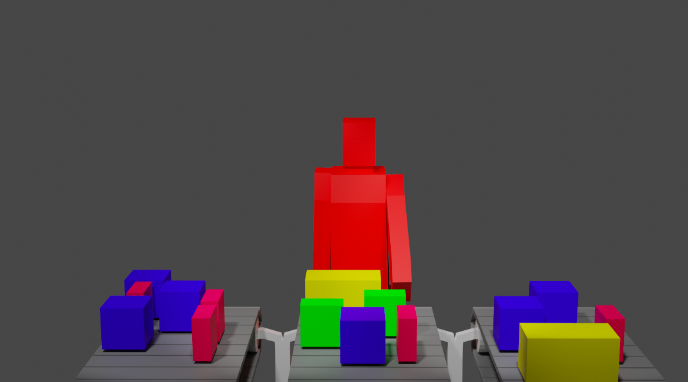
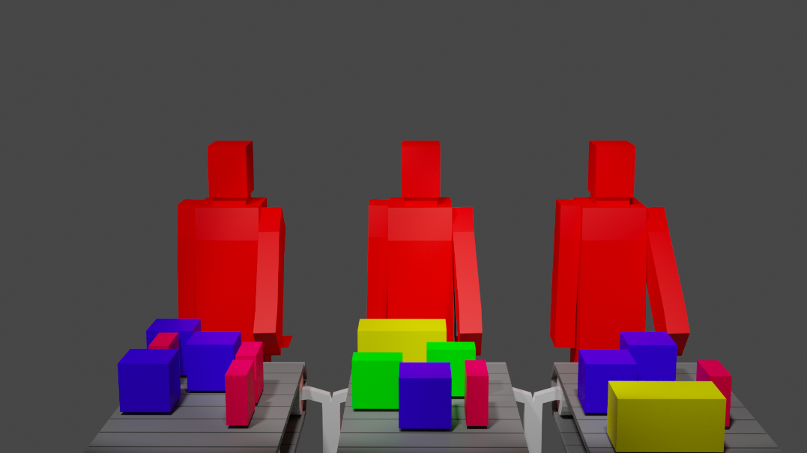
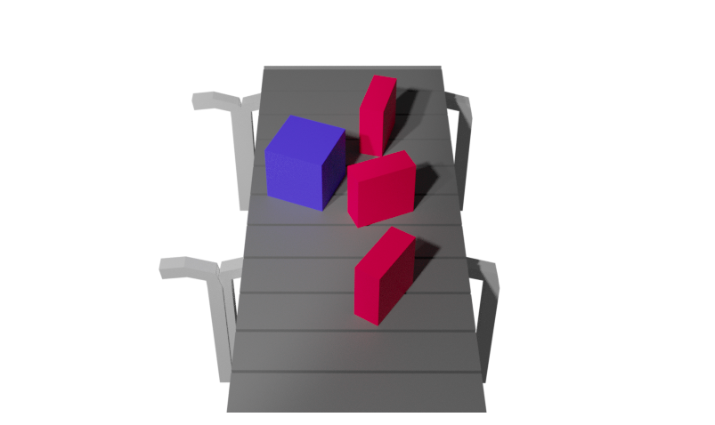
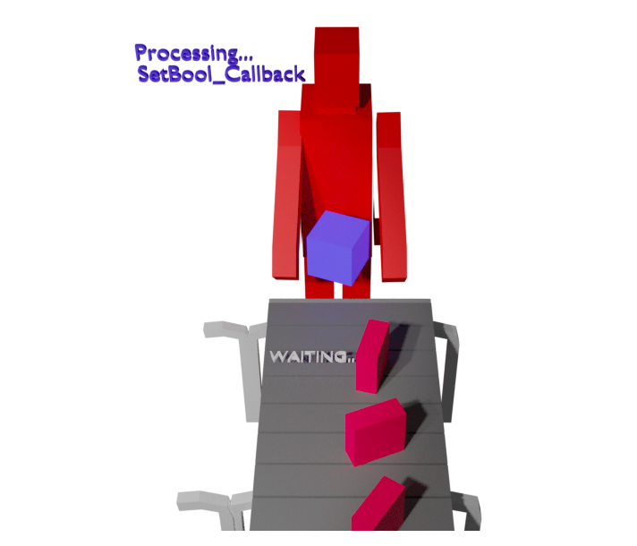
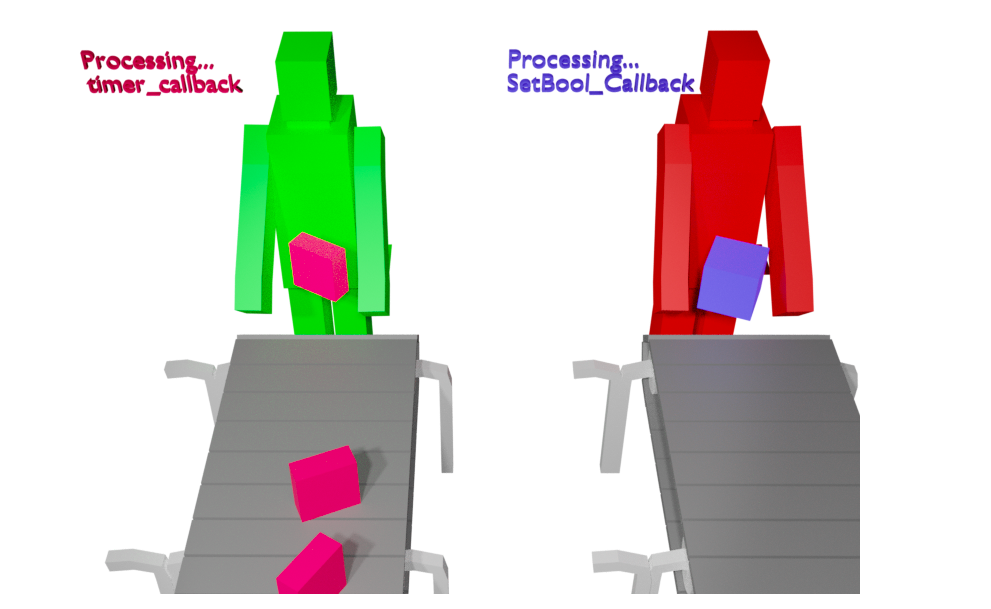
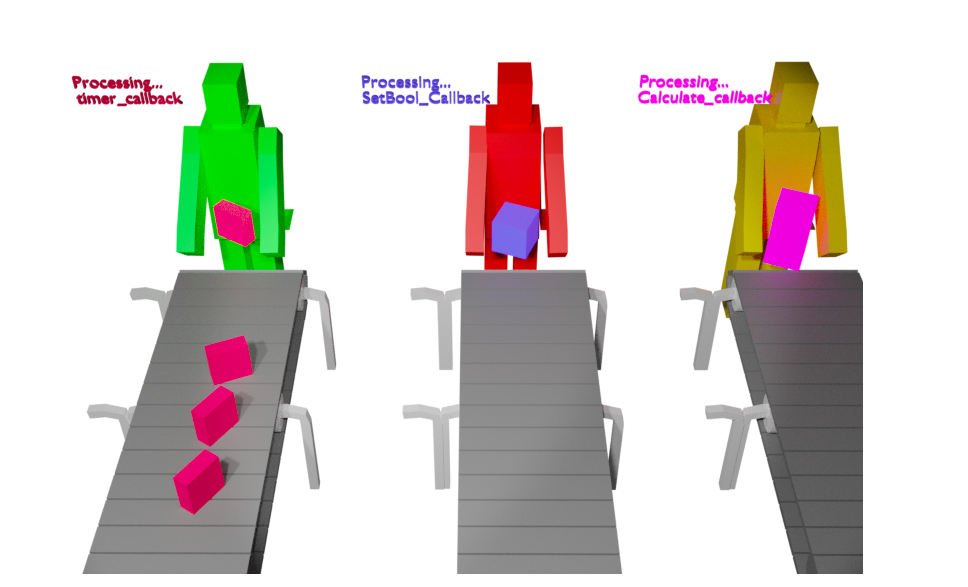

# Gerenciando Nós

* Como gerenciar nós mais complexos
* Executores
* Grupos de retorno de chamada

## Gerenciando programas complexos
Você tem trabalhado com programas relativamente fáceis de gerenciar. No entanto, alguns problemas podem aparecer conforme os programas que você cria se tornam mais complexos.

Comece criando um programa mais complexo.

### 1. Crie um novo pacote chamado `node_pkg`.
```bash
cd ~/ros2_ws/src
ros2 pkg create --build-type ament_python node_pkg --dependencies rclpy std_msgs sensor_msgs geometry_msgs nav_msgs
```

2. Crie um novo arquivo chamado node.py dentro da pasta node_pkg no pacote que você acabou de criar.
```python
import rclpy
from rclpy.node import Node
import time
import numpy as np
import math
from sensor_msgs.msg import LaserScan
from nav_msgs.msg import Odometry
from geometry_msgs.msg import Twist
from rclpy.qos import ReliabilityPolicy, QoSProfile

class ControlClass(Node):

    def __init__(self, seconds_sleeping=10):
        super().__init__('sub_node')
        self._seconds_sleeping = seconds_sleeping
        self.vel_pub = self.create_publisher(Twist, 'cmd_vel', 10)
        self.cmd = Twist()
        self.odom_sub = self.create_subscription(Odometry, 'odom', self.odom_callback, 10)
        self.scan_sub = self.create_subscription(LaserScan, 'scan', self.scan_callback, QoSProfile(depth=10, reliability=ReliabilityPolicy.BEST_EFFORT))
        self.timer = self.create_timer(0.5, self.timer_callback)
        self.laser_msg = LaserScan()
        self.odom_msg = Odometry()
        self.roll = 0.0
        self.pitch = 0.0
        self.yaw = 0.0

    def odom_callback(self, msg):
        self.get_logger().info("Odom CallBack")
        orientation_q = msg.pose.pose.orientation
        orientation_list = [orientation_q.x, orientation_q.y, orientation_q.z, orientation_q.w]
        (self.roll, self.pitch, self.yaw) = self.euler_from_quaternion (orientation_list)

    def scan_callback(self, msg):
        self.get_logger().info("Scan CallBack")
        self.laser_msg = msg

    def get_front_laser(self):
        return self.laser_msg.ranges[360]

    def get_yaw(self):
        return self.yaw

    def euler_from_quaternion(self, quaternion):
        """
        Converts quaternion (w in last place) to Euler roll, pitch, yaw
        quaternion = [x, y, z, w]
        Below should be replaced when porting for ROS2 Python tf_conversions is done.
        """
        x = quaternion[0]
        y = quaternion[1]
        z = quaternion[2]
        w = quaternion[3]

        sinr_cosp = 2 * (w * x + y * z)
        cosr_cosp = 1 - 2 * (x * x + y * y)
        roll = np.arctan2(sinr_cosp, cosr_cosp)

        sinp = 2 * (w * y - z * x)
        pitch = np.arcsin(sinp)

        siny_cosp = 2 * (w * z + x * y)
        cosy_cosp = 1 - 2 * (y * y + z * z)
        yaw = np.arctan2(siny_cosp, cosy_cosp)

        return roll, pitch, yaw
    
    def stop_robot(self):
        self.cmd.linear.x = 0.0
        self.cmd.angular.z = 0.0
        self.vel_pub.publish(self.cmd)

    def move_straight(self):
        self.cmd.linear.x = 0.08
        self.cmd.angular.z = 0.0
        self.vel_pub.publish(self.cmd)
    
    def rotate(self):
        self.cmd.angular.z = -0.2
        self.cmd.linear.x = 0.0
        self.vel_pub.publish(self.cmd)
        
        self.get_logger().info("Rotating for "+str(self._seconds_sleeping)+" seconds")
        for i in range(self._seconds_sleeping):
            self.get_logger().info("SLEEPING=="+str(i)+" seconds")
            time.sleep(1)
        
        self.stop_robot()


    def timer_callback(self):
        self.get_logger().info("Timer CallBack")
        try:
            self.get_logger().warning(">>>>>>>>>>>>>>RANGES Value="+str(self.laser_msg.ranges[360]))
            if not self.laser_msg.ranges[360] < 0.5:
                self.get_logger().info("MOVE STRAIGHT")
                self.move_straight()
            else:
                self.get_logger().info("STOP ROTATE")
                self.stop_robot()
                self.rotate()
        except:
            pass
    

def main(args=None):
    rclpy.init(args=args)
    try:
        control_node = ControlClass()
        
        try:
            rclpy.spin(control_node)

        finally:
            control_node.destroy_node()

    finally:
        rclpy.shutdown()

if __name__ == '__main__':
    main()
```

### 3. Crie um arquivo de inicialização chamado `node_pkg_launch_file.launch.py` para iniciar o Node que você acabou de criar.

```bash
cd ~/ros2_ws/src/node_pkg
mkdir launch
cd launch   
cd ~/ros2_ws/src/node_pkg/launch
touch node_pkg_launch_file.launch.py
chmod +x node_pkg_launch_file.launch.py
```   
Adicione o seguinte código ao arquivo `node_pkg_launch_file.launch.py` que você criou.

```python
from launch import LaunchDescription
from launch_ros.actions import Node

def generate_launch_description():
    return LaunchDescription([
        Node(
            package='node_pkg',
            executable='node',
            output='screen',
            emulate_tty=True),
    ])
```
### 4. Modifique o setup.py para adicionar o arquivo de inicialização que você acabou de criar e os pontos de entrada para o executável do script `node.py`.

```python
from setuptools import setup
import os
from glob import glob

package_name = 'node_pkg'

setup(
    name=package_name,
    version='0.0.0',
    packages=[package_name],
    data_files=[
        ('share/ament_index/resource_index/packages',
            ['resource/' + package_name]),
        ('share/' + package_name, ['package.xml']),
        (os.path.join('share', package_name, 'launch'), glob('launch/*.launch.py'))
    ],
    install_requires=['setuptools'],
    zip_safe=True,
    maintainer='somebody very awesome',
    maintainer_email='user@user.com',
    description='TODO: Package description',
    license='TODO: License declaration',
    tests_require=['pytest'],
    entry_points={
        'console_scripts': [
            'node = node_pkg.node:main'
        ],
    },
)
```
### 5. Compile seu pacote.

```bash
cd ~/ros2_ws
colcon build --packages-select node_pkg
source ~/ros2_ws/install/setup.bash
```
Por fim, inicie o Node em seu shell.
```bash
ros2 launch node_pkg node_pkg_launch_file.launch.py
```

Então, algo estranho está acontecendo.

1. Parece que o retorno de chamada `/scan` foi substituído pelo retorno de chamada do Timer.
2. Parece que quando o robô está girando, nenhum outro Callback é executado.

> Output

```bash
[exercise31-1] [INFO] [1631462014.163838534] [sub_node]: Odom CallBack
[exercise31-1] [INFO] [1631462014.167065180] [sub_node]: Scan CallBack
[exercise31-1] [INFO] [1631462014.173721644] [sub_node]: Odom CallBack
[exercise31-1] [INFO] [1631462014.177145493] [sub_node]: Scan CallBack
    
# Here comes the timer and gets inside the STOP ROTATE
[exercise31-1] [INFO] [1631462014.183357178] [sub_node]: Timer CallBack
[exercise31-1] [WARN] [1631462014.183843557] [sub_node]: >>>>>>>>>>>>>>RANGES Value=0.43359941244125366
[exercise31-1] [INFO] [1631462014.184297364] [sub_node]: STOP ROTATE
[exercise31-1] [INFO] [1631462014.184905910] [sub_node]: Rotating for 10 seconds
[exercise31-1] [INFO] [1631462014.185361387] [sub_node]: SLEEPING==0 seconds
[exercise31-1] [INFO] [1631462015.187221747] [sub_node]: SLEEPING==1 seconds
[exercise31-1] [INFO] [1631462016.188986502] [sub_node]: SLEEPING==2 seconds
[exercise31-1] [INFO] [1631462017.190589988] [sub_node]: SLEEPING==3 seconds
[exercise31-1] [INFO] [1631462018.191754193] [sub_node]: SLEEPING==4 seconds
[exercise31-1] [INFO] [1631462019.192855738] [sub_node]: SLEEPING==5 seconds
[exercise31-1] [INFO] [1631462020.194047276] [sub_node]: SLEEPING==6 seconds
[exercise31-1] [INFO] [1631462021.195551992] [sub_node]: SLEEPING==7 seconds
[exercise31-1] [INFO] [1631462022.197470055] [sub_node]: SLEEPING==8 seconds
[exercise31-1] [INFO] [1631462023.199393248] [sub_node]: SLEEPING==9 seconds

# When it finishes, it executes again, because of stack priorities
# The sensor value is the same because the scan Callback has not been called yet.
[exercise31-1] [INFO] [1631462024.201929184] [sub_node]: Timer CallBack
[exercise31-1] [WARN] [1631462024.202541739] [sub_node]: >>>>>>>>>>>>>>RANGES Value=0.43359941244125366
[exercise31-1] [INFO] [1631462024.203118334] [sub_node]: STOP ROTATE
[exercise31-1] [INFO] [1631462024.203789991] [sub_node]: Rotating for 10 seconds
[exercise31-1] [INFO] [1631462024.204353594] [sub_node]: SLEEPING==0 seconds
[exercise31-1] [INFO] [1631462025.206108691] [sub_node]: SLEEPING==1 seconds
[exercise31-1] [INFO] [1631462026.207503346] [sub_node]: SLEEPING==2 seconds
[exercise31-1] [INFO] [1631462027.209666668] [sub_node]: SLEEPING==3 seconds
[exercise31-1] [INFO] [1631462028.211459854] [sub_node]: SLEEPING==4 seconds
[exercise31-1] [INFO] [1631462029.213224914] [sub_node]: SLEEPING==5 seconds
[exercise31-1] [INFO] [1631462030.215086652] [sub_node]: SLEEPING==6 seconds
[exercise31-1] [INFO] [1631462031.215881326] [sub_node]: SLEEPING==7 seconds
[exercise31-1] [INFO] [1631462032.217448376] [sub_node]: SLEEPING==8 seconds
[exercise31-1] [INFO] [1631462033.218958477] [sub_node]: SLEEPING==9 seconds

# And now that the scan finally was called, and the sensor value updated
# The Timer Callback can now move straight.
[exercise31-1] [INFO] [1631462034.222230681] [sub_node]: Odom CallBack
[exercise31-1] [INFO] [1631462034.224277957] [sub_node]: Scan CallBack
[exercise31-1] [INFO] [1631462034.226654888] [sub_node]: Timer CallBack
[exercise31-1] [WARN] [1631462034.228090777] [sub_node]: >>>>>>>>>>>>>>RANGES Value=13.314866065979004
[exercise31-1] [INFO] [1631462034.229608321] [sub_node]: MOVE STRAIGHT
[exercise31-1] [INFO] [1631462034.232116453] [sub_node]: Odom CallBack
[exercise31-1] [INFO] [1631462034.234230636] [sub_node]: Scan CallBack
```

A razão pela qual o timer Callback só é chamado duas vezes quando há uma inversão de prioridade provavelmente está relacionada ao timer relacionado à criação de um timer que possui um comportamento exclusivo na pilha de rotação do Callback.

Como você pode ver, há um problema real aqui:

Você precisa que os dados do sensor sejam atualizados. Portanto, você não pode permitir que timer_callback interrompa os retornos de chamada do sensor. Se fosse um carro, você não poderia esperar que o sistema de controle terminasse de mover o carro para obter uma nova leitura do sensor.

Por outro lado, o sistema de controle deve ser muito regular porque você não pode esperar que um retorno de chamada de processamento do sensor termine para agir. Em sistemas reais, se os dados do sensor forem muito antigos, o sistema é PARADO por `MOTIVOS DE SEGURANÇA`.

Então o que você pode fazer? Você precisa de vários threads para evitar essa colisão entre Callbacks, e cada thread pode se comportar de maneira diferente, dependendo do tipo de sistema.

Para parar o movimento do robô a partir do shell, use o seguinte comando:

```bash
ros2 topic pub /cmd_vel geometry_msgs/msg/Twist "linear:
  x: 0.0
  y: 0.0
  z: 0.0
angular:
  x: 0.0
  y: 0.0
  z: 0.0
"
```

Para redefinir a posição inicial do robô, use o seguinte comando:
```bash
ros2 service call /reset_world std_srvs/srv/Empty "{}"
```
Você também pode reiniciar a simulação pressionando o último ícone na janela de simulação:

## Executores e Grupos de Callback
Na seção anterior, o `thread` principal bloqueou a chamada de função para move_straight().

Dois componentes controlam a execução de Callbacks: executores e grupos de Callback.

Os executores são responsáveis pela execução real dos callbacks.

Grupos de retorno de chamada são usados para impor regras de simultaneidade para retornos de chamada.

### Executores
Um executor controla o modelo de threading usado para processar Callbacks. Callbacks são unidades de trabalho como Callbacks de assinatura, Timer Callbacks, Service Callbacks e respostas recebidas do cliente - um executor controla onde Thread Callbacks são executados.

Você encontrará dois tipos de executores:

* `MultiThreadedExecutor`: Executa callbacks em um pool de threads.

* `SingleThreadedExecutor`: Executa callbacks no thread que chama `Executor.spin()`.

Grupos de retorno de chamada
Um grupo de retorno de chamada controla quando os retornos de chamada podem ser executados.

Esta classe não deve ser instanciada. Em vez disso, as classes devem estendê-lo e implementar `can_execute()`, `Beginning_Execution()` e `Ending_Execution()`.

Você pode encontrar diferentes tipos de grupos de retorno de chamada:

* `ReentrantCallbackGroup`: Permite que Callbacks sejam executados em paralelo sem restrições.

* `MutuallyExclusiveCallbackGroup`: permite que apenas um retorno de chamada seja executado por vez.

Agora, faça algumas modificações no programa anterior, adicionando um executor e usando Grupos de Callback.

### 1. Crie um novo arquivo chamado node1.py com o código mostrado logo abaixo.

Você afirma explicitamente que está usando um único thread e que todos os retornos de chamada estão no mesmo thread.

> node1.py

```python
import rclpy
from rclpy.node import Node
import time
import numpy as np
import math
from sensor_msgs.msg import LaserScan
from nav_msgs.msg import Odometry
from geometry_msgs.msg import Twist
from rclpy.callback_groups import ReentrantCallbackGroup, MutuallyExclusiveCallbackGroup
from rclpy.executors import MultiThreadedExecutor, SingleThreadedExecutor
from rclpy.qos import ReliabilityPolicy, QoSProfile

class SubscriberClass(Node):

    def __init__(self):
        super().__init__('sub_node')
        rclpy.logging.set_logger_level('sub_node', rclpy.logging.LoggingSeverity.DEBUG)
        
        self.group = ReentrantCallbackGroup()
        self.odom_sub = self.create_subscription(Odometry, 'odom', self.odom_callback, 10, callback_group=self.group)
        self.scan_sub = self.create_subscription(LaserScan, 'scan', self.scan_callback, QoSProfile(depth=10, reliability=ReliabilityPolicy.BEST_EFFORT), callback_group=self.group)
        self.timer = self.create_timer(0.5, self.timer_callback, callback_group=self.group)
        self.laser_msg = LaserScan()
        self.odom_msg = Odometry()
        self.roll = 0.0
        self.pitch = 0.0
        self.yaw = 0.0
        self.publisher = PublisherClass()

    def odom_callback(self, msg):
        self.get_logger().debug("Odom CallBack")
        orientation_q = msg.pose.pose.orientation
        orientation_list = [orientation_q.x, orientation_q.y, orientation_q.z, orientation_q.w]
        (self.roll, self.pitch, self.yaw) = self.euler_from_quaternion (orientation_list)

    def scan_callback(self, msg):
        self.get_logger().debug("Scan CallBack")
        self.laser_msg = msg

    def get_front_laser(self):
        return self.laser_msg.ranges[360]

    def get_yaw(self):
        return self.yaw

    def euler_from_quaternion(self, quaternion):
        """
        Converts quaternion (w in last place) to Euler roll, pitch, yaw
        quaternion = [x, y, z, w]
        Below should be replaced when porting for ROS2 Python tf_conversions is done.
        """
        x = quaternion[0]
        y = quaternion[1]
        z = quaternion[2]
        w = quaternion[3]

        sinr_cosp = 2 * (w * x + y * z)
        cosr_cosp = 1 - 2 * (x * x + y * y)
        roll = np.arctan2(sinr_cosp, cosr_cosp)

        sinp = 2 * (w * y - z * x)
        pitch = np.arcsin(sinp)

        siny_cosp = 2 * (w * z + x * y)
        cosy_cosp = 1 - 2 * (y * y + z * z)
        yaw = np.arctan2(siny_cosp, cosy_cosp)

        return roll, pitch, yaw

    def timer_callback(self):
        self.get_logger().info("Timer CallBack")
        try:
            self.get_logger().warning(">>>>>>>>>>>>>>RANGES Value="+str(self.laser_msg.ranges[360]))
            if not self.laser_msg.ranges[360] < 0.8:                
                self.publisher.move_straight()
            else:                
                self.publisher.stop_robot()
                self.publisher.rotate()
        except:
            pass

class PublisherClass(Node):

    def __init__(self, seconds_sleeping=10):
        super().__init__('pub_node')
        self._seconds_sleeping = seconds_sleeping
        rclpy.logging.set_logger_level('pub_node', rclpy.logging.LoggingSeverity.DEBUG)
        self.vel_pub = self.create_publisher(Twist, 'cmd_vel', 10)
        self.cmd = Twist()
    
    def stop_robot(self):
        self.get_logger().info("Ex2 MOVE STOP")
        self.cmd.linear.x = 0.0
        self.cmd.angular.z = 0.0
        self.vel_pub.publish(self.cmd)

    def move_straight(self):
        self.get_logger().info("Ex2 MOVE STRAIGHT")
        self.cmd.linear.x = 0.15
        self.cmd.angular.z = 0.0
        self.vel_pub.publish(self.cmd)
    
    def rotate(self):
        self.get_logger().info("Ex2 MOVE ROTATE")
        self.cmd.angular.z = -0.2
        self.cmd.linear.x = 0.0
        self.get_logger().info("PUBLISH COMMAND...")
        self.vel_pub.publish(self.cmd)        
        self.get_logger().info("PUBLISH COMMAND...FINISHED")
        self.get_logger().info("Ex2 Rotating for "+str(self._seconds_sleeping)+" seconds")
        for i in range(self._seconds_sleeping):
            self.get_logger().info("Ex2 SLEEPING=="+str(i)+" seconds")
            time.sleep(1)
        
        self.stop_robot()
    

def main(args=None):
    rclpy.init(args=args)
    try:
        subs_node = SubscriberClass()
        pub_node = PublisherClass()
        
        executor = SingleThreadedExecutor()
        executor.add_node(subs_node)
        executor.add_node(pub_node)
        
        try:
            executor.spin()
        finally:
            executor.shutdown()
            subs_node.destroy_node()
            pub_node.destroy_node()

    finally:
        rclpy.shutdown()

if __name__ == '__main__':
    main()
```
### 2. Crie um arquivo de inicialização chamado `node1_pkg_launch_file.launch.py` para iniciar o Node que você criou.

```bash
cd ~/ros2_ws/src/node1_pkg
mkdir launch
cd ~/ros2_ws/src/node1_pkg/launch
touch node1_pkg_launch_file.launch.py
chmod +x node1_pkg_launch_file.launch.py
```
Adicione o seguinte código ao arquivo `node1_pkg_launch_file.launch.py` que você criou.
```python
from launch import LaunchDescription
from launch_ros.actions import Node

def generate_launch_description():
    return LaunchDescription([
        Node(
            package='node1_pkg',
            executable='node1',
            output='screen',
            emulate_tty=True),
    ])
```
### 3. Modifique o `setup.py` para adicionar o arquivo de inicialização que você acabou de criar e os pontos de entrada para o executável do script node1.py.

```python
from setuptools import setup
import os
from glob import glob

package_name = 'node1_pkg'

setup(
    name=package_name,
    version='0.0.0',
    packages=[package_name],
    data_files=[
        ('share/ament_index/resource_index/packages',
            ['resource/' + package_name]),
        ('share/' + package_name, ['package.xml']),
        (os.path.join('share', package_name, 'launch'), glob('launch/*.launch.py'))
    ],
    install_requires=['setuptools'],
    zip_safe=True,
    maintainer='somebody very awesome',
    maintainer_email='user@user.com',
    description='TODO: Package description',
    license='TODO: License declaration',
    tests_require=['pytest'],
    entry_points={
        'console_scripts': [
            'node1 = node1_pkg.node1:main'
        ],
    },
)
```
### 5. Compile seu pacote.
```bash
cd ~/ros2_ws
colcon build --packages-select node1_pkg
source ~/ros2_ws/install/setup.bash
```
### 6. Por fim, inicie o Node em seu shell.
```bash
ros2 launch node1_pkg node1_pkg_launch_file.launch.py
```
Então, algo estranho está acontecendo.

1. Parece que o retorno de chamada `/scan` foi substituído pelo retorno de chamada do Timer.
2. Parece que quando o robô está girando, nenhum outro Callback é executado.

```bash
[exercise31-1] [INFO] [1631462014.163838534] [sub_node]: Odom CallBack
[exercise31-1] [INFO] [1631462014.167065180] [sub_node]: Scan CallBack
[exercise31-1] [INFO] [1631462014.173721644] [sub_node]: Odom CallBack
[exercise31-1] [INFO] [1631462014.177145493] [sub_node]: Scan CallBack
    
# Here comes the timer and gets inside the STOP ROTATE
[exercise31-1] [INFO] [1631462014.183357178] [sub_node]: Timer CallBack
[exercise31-1] [WARN] [1631462014.183843557] [sub_node]: >>>>>>>>>>>>>>RANGES Value=0.43359941244125366
[exercise31-1] [INFO] [1631462014.184297364] [sub_node]: STOP ROTATE
[exercise31-1] [INFO] [1631462014.184905910] [sub_node]: Rotating for 10 seconds
[exercise31-1] [INFO] [1631462014.185361387] [sub_node]: SLEEPING==0 seconds
[exercise31-1] [INFO] [1631462015.187221747] [sub_node]: SLEEPING==1 seconds
[exercise31-1] [INFO] [1631462016.188986502] [sub_node]: SLEEPING==2 seconds
[exercise31-1] [INFO] [1631462017.190589988] [sub_node]: SLEEPING==3 seconds
[exercise31-1] [INFO] [1631462018.191754193] [sub_node]: SLEEPING==4 seconds
[exercise31-1] [INFO] [1631462019.192855738] [sub_node]: SLEEPING==5 seconds
[exercise31-1] [INFO] [1631462020.194047276] [sub_node]: SLEEPING==6 seconds
[exercise31-1] [INFO] [1631462021.195551992] [sub_node]: SLEEPING==7 seconds
[exercise31-1] [INFO] [1631462022.197470055] [sub_node]: SLEEPING==8 seconds
[exercise31-1] [INFO] [1631462023.199393248] [sub_node]: SLEEPING==9 seconds

# When it finishes, it executes again, because of stack priorities
# The sensor value is the same because the scan Callback has not been called yet.
[exercise31-1] [INFO] [1631462024.201929184] [sub_node]: Timer CallBack
[exercise31-1] [WARN] [1631462024.202541739] [sub_node]: >>>>>>>>>>>>>>RANGES Value=0.43359941244125366
[exercise31-1] [INFO] [1631462024.203118334] [sub_node]: STOP ROTATE
[exercise31-1] [INFO] [1631462024.203789991] [sub_node]: Rotating for 10 seconds
[exercise31-1] [INFO] [1631462024.204353594] [sub_node]: SLEEPING==0 seconds
[exercise31-1] [INFO] [1631462025.206108691] [sub_node]: SLEEPING==1 seconds
[exercise31-1] [INFO] [1631462026.207503346] [sub_node]: SLEEPING==2 seconds
[exercise31-1] [INFO] [1631462027.209666668] [sub_node]: SLEEPING==3 seconds
[exercise31-1] [INFO] [1631462028.211459854] [sub_node]: SLEEPING==4 seconds
[exercise31-1] [INFO] [1631462029.213224914] [sub_node]: SLEEPING==5 seconds
[exercise31-1] [INFO] [1631462030.215086652] [sub_node]: SLEEPING==6 seconds
[exercise31-1] [INFO] [1631462031.215881326] [sub_node]: SLEEPING==7 seconds
[exercise31-1] [INFO] [1631462032.217448376] [sub_node]: SLEEPING==8 seconds
[exercise31-1] [INFO] [1631462033.218958477] [sub_node]: SLEEPING==9 seconds

# And now that the scan finally was called, and the sensor value updated
# The Timer Callback can now move straight.
[exercise31-1] [INFO] [1631462034.222230681] [sub_node]: Odom CallBack
[exercise31-1] [INFO] [1631462034.224277957] [sub_node]: Scan CallBack
[exercise31-1] [INFO] [1631462034.226654888] [sub_node]: Timer CallBack
[exercise31-1] [WARN] [1631462034.228090777] [sub_node]: >>>>>>>>>>>>>>RANGES Value=13.314866065979004
[exercise31-1] [INFO] [1631462034.229608321] [sub_node]: MOVE STRAIGHT
[exercise31-1] [INFO] [1631462034.232116453] [sub_node]: Odom CallBack
[exercise31-1] [INFO] [1631462034.234230636] [sub_node]: Scan CallBack
```
A razão pela qual o timer Callback só é chamado duas vezes quando há uma inversão de prioridade provavelmente está relacionada ao timer relacionado à criação de um timer que possui um comportamento exclusivo na pilha de rotação do Callback.

* Você precisa que os dados do sensor sejam atualizados. Portanto, você não pode permitir que timer_callback interrompa os retornos de chamada do sensor. Se fosse um carro, você não poderia esperar que o sistema de controle terminasse de mover o carro para obter uma nova leitura do sensor.

* Por outro lado, o sistema de controle deve ser muito regular porque você não pode esperar que um retorno de chamada de processamento do sensor termine para agir. Em sistemas reais, se os dados do sensor forem muito antigos, o sistema é `PARADO por MOTIVOS DE SEGURANÇA`.

Então o que você pode fazer? Você precisa de vários threads para evitar essa colisão entre Callbacks, e cada thread pode se comportar de maneira diferente, dependendo do tipo de sistema.

```bash
ros2 topic pub /cmd_vel geometry_msgs/msg/Twist "linear:
  x: 0.0
  y: 0.0
  z: 0.0
angular:
  x: 0.0
  y: 0.0
  z: 0.0
"
```
Para redefinir a posição inicial do robô, use o seguinte comando:
```bash
ros2 service call /reset_world std_srvs/srv/Empty "{}"
```
### Executores e Grupos de Callback
Na seção anterior, o thread principal bloqueou a chamada de função para `move_straight()`.

Dois componentes controlam a execução de Callbacks: executores e grupos de Callback.

* Os executores são responsáveis pela execução real dos callbacks.

* Grupos de retorno de chamada são usados para impor regras de simultaneidade para retornos de chamada.

### Executores
Um executor controla o modelo de threading usado para processar Callbacks. Callbacks são unidades de trabalho como Callbacks de assinatura, Timer Callbacks, Service Callbacks e respostas recebidas do cliente - um executor controla onde Thread Callbacks são executados.

Você encontrará dois tipos de executores:

* **MultiThreadedExecutor**: Executa callbacks em um pool de threads.

* **SingleThreadedExecutor**: Executa callbacks no thread que chama `Executor.spin()`.

### Grupos de retorno de chamada
Um grupo de retorno de chamada controla quando os retornos de chamada podem ser executados.

Esta classe não deve ser instanciada. Em vez disso, as classes devem estendê-lo e implementar `can_execute()`, `Beginning_Execution()` e `Ending_Execution()`.

Você pode encontrar diferentes tipos de grupos de retorno de chamada:

* **ReentrantCallbackGroup**: Permite que Callbacks sejam executados em paralelo sem restrições.

* **MutuallyExclusiveCallbackGroup**: permite que apenas um retorno de chamada seja executado por vez.

Agora, faça algumas modificações no programa anterior, adicionando um executor e usando Grupos de Callback.

### 1. Crie um novo arquivo chamado `node2.py` com o código mostrado logo abaixo.

Você afirma explicitamente que está usando um único thread e que todos os retornos de chamada estão no mesmo thread.

> node2.py

```python
import rclpy
from rclpy.node import Node
import time
import numpy as np
import math
from sensor_msgs.msg import LaserScan
from nav_msgs.msg import Odometry
from geometry_msgs.msg import Twist
from rclpy.callback_groups import ReentrantCallbackGroup, MutuallyExclusiveCallbackGroup
from rclpy.executors import MultiThreadedExecutor, SingleThreadedExecutor
from rclpy.qos import ReliabilityPolicy, QoSProfile

class SubscriberClass(Node):

    def __init__(self):
        super().__init__('sub_node')
        rclpy.logging.set_logger_level('sub_node', rclpy.logging.LoggingSeverity.DEBUG)
        
        self.group = ReentrantCallbackGroup()
        self.odom_sub = self.create_subscription(Odometry, 'odom', self.odom_callback, 10, callback_group=self.group)
        self.scan_sub = self.create_subscription(LaserScan, 'scan', self.scan_callback, QoSProfile(depth=10, reliability=ReliabilityPolicy.BEST_EFFORT), callback_group=self.group)
        self.timer = self.create_timer(0.5, self.timer_callback, callback_group=self.group)
        self.laser_msg = LaserScan()
        self.odom_msg = Odometry()
        self.roll = 0.0
        self.pitch = 0.0
        self.yaw = 0.0
        self.publisher = PublisherClass()

    def odom_callback(self, msg):
        self.get_logger().debug("Odom CallBack")
        orientation_q = msg.pose.pose.orientation
        orientation_list = [orientation_q.x, orientation_q.y, orientation_q.z, orientation_q.w]
        (self.roll, self.pitch, self.yaw) = self.euler_from_quaternion (orientation_list)

    def scan_callback(self, msg):
        self.get_logger().debug("Scan CallBack")
        self.laser_msg = msg

    def get_front_laser(self):
        return self.laser_msg.ranges[360]

    def get_yaw(self):
        return self.yaw

    def euler_from_quaternion(self, quaternion):
        """
        Converts quaternion (w in last place) to Euler roll, pitch, yaw
        quaternion = [x, y, z, w]
        Below should be replaced when porting for ROS2 Python tf_conversions is done.
        """
        x = quaternion[0]
        y = quaternion[1]
        z = quaternion[2]
        w = quaternion[3]

        sinr_cosp = 2 * (w * x + y * z)
        cosr_cosp = 1 - 2 * (x * x + y * y)
        roll = np.arctan2(sinr_cosp, cosr_cosp)

        sinp = 2 * (w * y - z * x)
        pitch = np.arcsin(sinp)

        siny_cosp = 2 * (w * z + x * y)
        cosy_cosp = 1 - 2 * (y * y + z * z)
        yaw = np.arctan2(siny_cosp, cosy_cosp)

        return roll, pitch, yaw

    def timer_callback(self):
        self.get_logger().info("Timer CallBack")
        try:
            self.get_logger().warning(">>>>>>>>>>>>>>RANGES Value="+str(self.laser_msg.ranges[360]))
            if not self.laser_msg.ranges[360] < 0.8:                
                self.publisher.move_straight()
            else:                
                self.publisher.stop_robot()
                self.publisher.rotate()
        except:
            pass

class PublisherClass(Node):

    def __init__(self, seconds_sleeping=10):
        super().__init__('pub_node')
        self._seconds_sleeping = seconds_sleeping
        rclpy.logging.set_logger_level('pub_node', rclpy.logging.LoggingSeverity.DEBUG)
        self.vel_pub = self.create_publisher(Twist, 'cmd_vel', 10)
        self.cmd = Twist()
    
    def stop_robot(self):
        self.get_logger().info("Ex2 MOVE STOP")
        self.cmd.linear.x = 0.0
        self.cmd.angular.z = 0.0
        self.vel_pub.publish(self.cmd)

    def move_straight(self):
        self.get_logger().info("Ex2 MOVE STRAIGHT")
        self.cmd.linear.x = 0.15
        self.cmd.angular.z = 0.0
        self.vel_pub.publish(self.cmd)
    
    def rotate(self):
        self.get_logger().info("Ex2 MOVE ROTATE")
        self.cmd.angular.z = -0.2
        self.cmd.linear.x = 0.0
        self.get_logger().info("PUBLISH COMMAND...")
        self.vel_pub.publish(self.cmd)        
        self.get_logger().info("PUBLISH COMMAND...FINISHED")
        self.get_logger().info("Ex2 Rotating for "+str(self._seconds_sleeping)+" seconds")
        for i in range(self._seconds_sleeping):
            self.get_logger().info("Ex2 SLEEPING=="+str(i)+" seconds")
            time.sleep(1)
        
        self.stop_robot()
    

def main(args=None):
    rclpy.init(args=args)
    try:
        subs_node = SubscriberClass()
        pub_node = PublisherClass()
        
        executor = SingleThreadedExecutor()
        executor.add_node(subs_node)
        executor.add_node(pub_node)
        
        try:
            executor.spin()
        finally:
            executor.shutdown()
            subs_node.destroy_node()
            pub_node.destroy_node()

    finally:
        rclpy.shutdown()

if __name__ == '__main__':
    main()
```
### 2. Crie um arquivo de inicialização chamado `node2_pkg_launch_file.launch.py` para iniciar o Node que você criou.

```bash
cd ~/ros2_ws/src/node2_pkg/launch
touch node2_pkg_launch_file.launch.py
chmod +x node2_pkg_launch_file.launch.py
```
Adicione o seguinte código ao arquivo `node2_pkg_launch_file.launch.py` que você criou.

```python
from launch import LaunchDescription
from launch_ros.actions import Node

def generate_launch_description():
    return LaunchDescription([
        Node(
            package='node2_pkg',
            executable='node2',
            output='screen',
            emulate_tty=True),
    ])
```
### 3. Modifique o `setup.py` para adicionar o arquivo de inicialização que você acabou de criar e os pontos de entrada para o executável do script `node2.py`.

```python
from setuptools import setup
import os
from glob import glob

package_name = 'node1_pkg'

setup(
    name=package_name,
    version='0.0.0',
    packages=[package_name],
    data_files=[
        ('share/ament_index/resource_index/packages',
            ['resource/' + package_name]),
        ('share/' + package_name, ['package.xml']),
        (os.path.join('share', package_name, 'launch'), glob('launch/*.launch.py'))
    ],
    install_requires=['setuptools'],
    zip_safe=True,
    maintainer='somebody very awesome',
    maintainer_email='user@user.com',
    description='TODO: Package description',
    license='TODO: License declaration',
    tests_require=['pytest'],
    entry_points={
        'console_scripts': [
            'node1 = node1_pkg.node1:main',
            'node2 = node1_pkg.node2:main',
        ],
    },
)
```
### 4. Compile seu pacote.

```bash
cd ~/ros2_ws
colcon build --packages-select node1_pkg
source ~/ros2_ws/install/setup.bash
```

### 5. Finalmente, reinicie seu programa.

```bash
ros2 launch node1_pkg node2_pkg_launch_file.launch.py
```

> Output

```bash
[exercise31-1] [INFO] [1631462014.163838534] [sub_node]: Odom CallBack
[exercise31-1] [INFO] [1631462014.167065180] [sub_node]: Scan CallBack
[exercise31-1] [INFO] [1631462014.173721644] [sub_node]: Odom CallBack
[exercise31-1] [INFO] [1631462014.177145493] [sub_node]: Scan CallBack
    
# Here comes the timer and gets inside the STOP ROTATE
[exercise31-1] [INFO] [1631462014.183357178] [sub_node]: Timer CallBack
[exercise31-1] [WARN] [1631462014.183843557] [sub_node]: >>>>>>>>>>>>>>RANGES Value=0.43359941244125366
[exercise31-1] [INFO] [1631462014.184297364] [sub_node]: STOP ROTATE
[exercise31-1] [INFO] [1631462014.184905910] [sub_node]: Rotating for 10 seconds
[exercise31-1] [INFO] [1631462014.185361387] [sub_node]: SLEEPING==0 seconds
[exercise31-1] [INFO] [1631462015.187221747] [sub_node]: SLEEPING==1 seconds
[exercise31-1] [INFO] [1631462016.188986502] [sub_node]: SLEEPING==2 seconds
[exercise31-1] [INFO] [1631462017.190589988] [sub_node]: SLEEPING==3 seconds
[exercise31-1] [INFO] [1631462018.191754193] [sub_node]: SLEEPING==4 seconds
[exercise31-1] [INFO] [1631462019.192855738] [sub_node]: SLEEPING==5 seconds
[exercise31-1] [INFO] [1631462020.194047276] [sub_node]: SLEEPING==6 seconds
[exercise31-1] [INFO] [1631462021.195551992] [sub_node]: SLEEPING==7 seconds
[exercise31-1] [INFO] [1631462022.197470055] [sub_node]: SLEEPING==8 seconds
[exercise31-1] [INFO] [1631462023.199393248] [sub_node]: SLEEPING==9 seconds

# When it finishes, it executes again, because of stack priorities
# The sensor value is the same because the Scan Callback has not been called yet.
[exercise31-1] [INFO] [1631462024.201929184] [sub_node]: Timer CallBack
[exercise31-1] [WARN] [1631462024.202541739] [sub_node]: >>>>>>>>>>>>>>RANGES Value=0.43359941244125366
[exercise31-1] [INFO] [1631462024.203118334] [sub_node]: STOP ROTATE
[exercise31-1] [INFO] [1631462024.203789991] [sub_node]: Rotating for 10 seconds
[exercise31-1] [INFO] [1631462024.204353594] [sub_node]: SLEEPING==0 seconds
[exercise31-1] [INFO] [1631462025.206108691] [sub_node]: SLEEPING==1 seconds
[exercise31-1] [INFO] [1631462026.207503346] [sub_node]: SLEEPING==2 seconds
[exercise31-1] [INFO] [1631462027.209666668] [sub_node]: SLEEPING==3 seconds
[exercise31-1] [INFO] [1631462028.211459854] [sub_node]: SLEEPING==4 seconds
[exercise31-1] [INFO] [1631462029.213224914] [sub_node]: SLEEPING==5 seconds
[exercise31-1] [INFO] [1631462030.215086652] [sub_node]: SLEEPING==6 seconds
[exercise31-1] [INFO] [1631462031.215881326] [sub_node]: SLEEPING==7 seconds
[exercise31-1] [INFO] [1631462032.217448376] [sub_node]: SLEEPING==8 seconds
[exercise31-1] [INFO] [1631462033.218958477] [sub_node]: SLEEPING==9 seconds

# And now that the scan finally was called, and the sensor value updated
# The Timer Callback can now move straight.
[exercise31-1] [INFO] [1631462034.222230681] [sub_node]: Odom CallBack
[exercise31-1] [INFO] [1631462034.224277957] [sub_node]: Scan CallBack
[exercise31-1] [INFO] [1631462034.226654888] [sub_node]: Timer CallBack
[exercise31-1] [WARN] [1631462034.228090777] [sub_node]: >>>>>>>>>>>>>>RANGES Value=13.314866065979004
[exercise31-1] [INFO] [1631462034.229608321] [sub_node]: MOVE STRAIGHT
[exercise31-1] [INFO] [1631462034.232116453] [sub_node]: Odom CallBack
[exercise31-1] [INFO] [1631462034.234230636] [sub_node]: Scan CallBack
```

Isso é porque você não mudou nada. Você ainda está em um executor `Singlethread`, com todos os Callbacks no mesmo grupo. Então nada mudou, apenas a estrutura.
```python
executor = MultiThreadedExecutor(num_threads=4)
```
Isso definirá o executor como um MultiThreadedExecutor. Você pode indicar quantos segmentos ele terá. Se nenhum for declarado, `multiprocessing.cpu_count()` extrairá do sistema quantos estão disponíveis.

Você deve conter esses encadeamentos para evitar esgotar os recursos de seu sistema, a menos que você precise deles.
Aqui você tem um exemplo que você pode tentar:

```bash
$ python3
>>> import multiprocessing
>>> multiprocessing.cpu_count()
8
```
E é assim que você cria grupos para Callbacks.

Coloque um retorno de chamada em cada grupo, dependendo de suas necessidades.
Mais grupos significam que mais threads são necessários e, portanto, mais recursos.

```python
self.group1 = MutuallyExclusiveCallbackGroup()
self.group2 = MutuallyExclusiveCallbackGroup()
self.group3 = MutuallyExclusiveCallbackGroup()
```
Aqui você tem a documentação para ter uma ideia dos parâmetros que você vai precisar:
[RCLPY Documentation](https://docs.ros2.org/crystal/api/rclpy/api/execution_and_callbacks.html)

Então, por que você precisa de `Multithreaded_Executor` e `Multiple CallBackgroups`?

Suponha que você considere, por exemplo, definir `num_threads=3`. Você terá três trabalhadores no `multithreaded_executor`. E as correias transportadoras aqui representadas são os grupos `call_back`. Então, nesse caso, você também considera que tem três.

Porque se você tiver Grupos de Callback separados, cada processo é definido em diferentes filas, mas apenas um executor estará disponível para processar os métodos de várias filas.

É como ter UM trabalhador trabalhando em três áreas diferentes da fábrica. Só pode funcionar em uma área por vez.

<div align="center">
     
</div>

Por outro lado, se você tiver um executor multi-threaded, mas apenas um grupo de retorno de chamada, haverá apenas uma fila onde o processo será colocado.

É como ter MÚLTIPLOS trabalhadores, mas apenas uma área para trabalhar com uma cadeira. Eles vão competir para ver quem consegue sentar e trabalhar.

<div align="center">
     
</div>

Você precisa de MÚLTIPLOS trabalhadores e MÚLTIPLAS Áreas para usar seus recursos com eficiência.

<div align="center">
     
</div>

Dependendo da morfologia do seu sistema, você deve decidir quantos `num_threads` (workers) você precisará para o número de filas ou Grupos de Callback que você definir. O melhor conselho é usar a quantidade mínima de threads de que você precisa para ter entrada de dados simultânea e não perder seus dados ou diminuir a velocidade do algoritmo.

## Vários nodes

Depois de cobrir o básico, aprofunde-se em mais casos de uso e pratique.

Use as analogias dos trabalhadores, das correias transportadoras e das caixas para limpar os diferentes tópicos para explicar os grupos de retorno de chamada e as tarefas a serem realizadas.

### 1. Crie um novo pacote denominado `multithreading_ros2_examples`, com as seguintes dependências: std_msgs, geometry_msgs, std_srvs.

### 2. Crie um script Python com uma classe chamada ServiceServer, que herda da classe Node. Nomeie o arquivo `multithreading_movement_server.py`.

Dentro desta classe, você deve começar:

Um servidor de serviço chamado `/start_turn`, que usa o tipo de mensagem `std_srvs/SetBool`. Seu retorno de chamada deve ser nomeado `SetBool_callback`. Dependendo do valor da solicitação de serviço, se TRUE, ele deve definir uma variável de classe interna self.cmd do tipo `geometry_msgs/Twist` para fazer o robô GIRAR em 0,3 radiante por segundo. Se False, defina o self.cmd para fazer o robô AVANÇAR.
Dentro do `SetBool_callback` você precisa definir um `time.sleep(15.0)` (15.0 segundos de espera). A razão para definir isso é ver melhor o comportamento multithreading.
Além disso, imprima o tempo que ele está dormindo para que você possa ver quando estiver executando este Callback, principalmente na fase de espera.

Um editor rostopic publicado no tópico `/cmd_vel`, chamado `publisher_` .

Um cronômetro que faz um loop a cada 1,0 segundo e publica no `publisher_` os valores `self.cmd` definidos no `SetBool_callback`. No método init, inicialize a variável `self.cmd` como `self.cmd = Twist()`. Registre o `self.cmd` enviado em cada loop para ver melhor o círculo do loop.

Se você não adicionar nada relacionado a multithreading e `Callback Group`, o comportamento que você deve ter do seu script deve ser o seguinte:

Quando iniciado, o `timer_loop` deve ser executado a cada 1,0 segundos.
Quando o serviço é chamado, o `timer_loop` deve ser executado até que o callback do serviço termine.
Isso ocorre porque, por padrão, cada nó que você cria possui UM grupo de retorno de chamada atribuído a ele. E porque quando você inicia um script ROS por padrão, apenas UM thread é atribuído e apenas UM retorno de chamada por VEZ pode ser executado.

```bash
ros2 service call /reset_world std_srvs/srv/Empty "{}"
ros2 service call /start_turn std_srvs/srv/SetBool "data: true
"
```

Então o que aconteceu aqui?

Como você mesmo pode constatar, o robô não começou a se mover até que a espera de serviço de 15 segundos começou. A publicação não foi executada porque está dentro do `timer_callback`, aguardando o término do `SetBool_callback`.

Esclareça o que aconteceu com as seguintes analogias:

Os retornos de chamada
Você está iniciando um script que possui DOIS Callbacks para serem processados:

1. O SetBool_callback será solicitado a ser executado toda vez que você chamar o serviço `/start_turn`.

2. O `timer_callback`, que será chamado, neste caso, a cada 1,0 segundos.

Portanto, você pode representar esses dois retornos de chamada como duas caixas diferentes.

* `SetBool_callback`: caixa vermelha
* `timer_callback`: Caixa Azul

### Os grupos de retorno de chamada
Os Callback Groups são como as correias transportadoras onde o script Python define cada callback que deve ser processado toda vez que ele deseja que seja processado.

Assim, por exemplo, se você deseja que o `timer_calback` seja executado a cada 1,0 segundos, coloque uma nova instância dele na esteira a cada segundo.

<div align="center">
     
</div>

Ok, então o que acontece se você chamar o serviço `start_turn`? O Callback do serviço `SetBool_callback` é definido na fila da esteira, e processado quando as instâncias anteriores do `timer_callback` são processadas.

<div align="center">
     
</div>

E é aqui que entra o NÚMERO de threads.

### Os Threads Multithreading

Um thread processa cada retorno de chamada. Então, seguindo a analogia, cada thread que você criou no seu script Python ROS2 é como ter um worker que processa cada Callback (caixas) no callback_group (esteira), seguindo essas regras:

Só pode processar UM de cada vez, e eles foram colocados na esteira no pedido.
Isso significa que se um determinado Callback, como o `SetBool_callback`, leva 15,0 segundos para ser processado, NENHUM outro Callback será processado até que termine com este `SetBool_callback` (5,0 segundos se passaram).

<div align="center">
     
</div>

Como você deve ter adivinhado, isso é inconveniente se você quiser Callbacks rodando em paralelo, que geralmente é o objetivo de ter Callbacks.

Então, como você pode consertar isso?

### 1. Crie um novo script Python chamado `multithreading_movement_server_parallel.py` que é capaz de processar simultaneamente:

* O retorno de chamada do servidor de serviço SetBool_callback do servidor de serviço chamado `/start_turn`.
* O timer de retorno de chamada `timer_callback`.

Para resolver isso, lembre-se do seguinte:

* Você precisa de DOIS threads (trabalhadores) para processar duas coisas simultaneamente. Não há outra maneira de contornar isso. Portanto, você deve declarar um executor com pelo menos DUAS threads. Use o método MultiThreadedExecutor para isso, conforme explicado nos exemplos anteriores.
* No entanto, isso não é suficiente. Por exemplo, se você tiver DOIS workers, mas apenas UM grupo de callback, apenas um worker poderá processar o callback, não importa quantos outros workers (threads) você tenha declarado.

<div align="center">
     
</div>

* Você precisa de DUAS correias transportadoras. Para isso, crie pelo menos DOIS Grupos de Callback, um para `timer_callback` e outro para `SetBool_callback`

Como você pode ver, o robô começa a se mover imediatamente e não "espera pelos 15,0 segundos". Aqui, o `timer_callback` é executado a cada 1,0 segundos. E como o valor `cmd_vel` é definido antes da espera, não importa quanto tempo o `SetBool_callback` leve para terminar, o `cmd_vel` já está definido para o publicador publicar esse novo valor.

Como você pode ver, ao chamar o serviço, o `timer_callback` continua sendo chamado a cada segundo, o que permite que ele publique em `cmd_vel`, mesmo que o serviço não tenha finalizado.

Isso ocorre porque agora você tem esta configuração:

<div align="center">
     
</div>

### 1. Crie um novo script Python chamado `multithreading_movement_server_and_calculation_server.py` baseado no criado no exemplo 3.5 que agora é capaz de processar simultaneamente:

* O retorno de chamada do servidor de serviço `SetBool_callback` do servidor de serviço chamado `/start_turn`.
* DEFINIMOS UMA BANDEIRA PARA SÓ PUBLICAR QUANDO INICIAR E QUANDO O SERVIÇO FOR CHAMADO.
* O timer de retorno de chamada `timer_callback`.
* Um novo serviço chamado `/calculations`, do tipo de mensagem `std_srvs/SetBool`, declarado em uma classe de nó diferente, que você chamaria de `CalculationsServiceServer`.
* Este Nó `CalculationsServer` deve ser registrado nos dados do laser e recuperar os valores do laser frontal (`self.laser_forward = msg.ranges[359]`).
* O servidor de serviço desse nó `CalculationsServer` deve recuperar os dados frontais do laser mais recentes, aguardar cinco segundos e, em seguida, recuperar os dados do laser novamente. Em seguida, calcule a diferença e envie uma resposta dependendo se o delta é positivo ou negativo. E também deve publicar no `cmd_vel` para ir para trás ou para frente com base no sinal de delta.
### 2. Ambas as classes de Node devem ser iniciadas no mesmo script.

### 3. Decida quantos trabalhadores e Grupos de Callback você precisará declarar para atender às especificações.

Há uma informação que você precisa saber:

* No ROS2 Python, você obtém UM Grupo de Callback independente para cada objeto de classe Node que você declara e inicializa. Seguindo a analogia, você obtém uma correia transportadora para cada Node.
* Isso significa que cada Node pode executar um Callback independente por vez. Portanto, se você iniciar dois Nodes, em teoria, poderá executar DOIS Callbacks simultaneamente. No entanto, há um problema: você tem BY DEFAULT ONE thread para seu script Python. Isso significa que você terá apenas UM trabalhador e, portanto, efetivamente executará apenas UM retorno de chamada por vez.
* Portanto, você precisa declarar tantos threads (workers) quanto Callbacks que deseja executar simultaneamente.
Comandos úteis:

```bash
ros2 service call /start_turn std_srvs/srv/SetBool "data: true
"
ros2 service call /calculations std_srvs/srv/SetBool "data: false
"
```

Como você pode ver, ao chamar até mesmo AMBOS OS SERVIDORES ao mesmo tempo, o timer_calback continua funcionando e ambos os serviços são chamados.

<div align="center">
     
</div>

Tente diminuir o número de threads para 2 e 1, para ver os diferentes comportamentos. Veja como ambos os serviços podem entrar em conflito e não serem processados até que o processamento seja concluído.

## Detalhes dos grupos de retorno de chamada
Você usou apenas grupos de retorno de chamada do tipo MutuallyExclusiveCallbackGroup. Isso ocorre porque eles são o tipo padrão em Nodes. No entanto, existe outro tipo chamado ReentrantCallbackGroup.

A principal diferença é:

* `ReentrantCallbackGroup`: Qualquer callback dentro deste grupo pode ser executado em paralelo se houver threads suficientes. Por exemplo, se você adicionar três Callbacks dentro do mesmo `ReentrantCallbackGroup` e tiver dois threads, poderá executar simultaneamente DOIS dos TRÊS Callbacks.

* `MutuallyExclusiveCallbackGroup`: Todos os Callbacks dentro deste grupo serão executados apenas um a um naquele grupo, não importa quantas threads você tenha. Por exemplo, se você tiver três Callbacks dentro deste grupo e três threads, apenas UM Callback por vez será executado.

Crie um script que forneça um exemplo de uso desses dois grupos de retorno de chamada diferentes:

Neste script, você tem um servidor e um Timer Callback.
Você pode alterar alguns elementos dos tempos, o número de threads e o tipo de callbacks por meio de argumentos.
### 1. Crie um novo pacote chamado example_4_4_pkg.

```bash

cd ~/ros2_ws/src
ros2 pkg create --build-type ament_python example_4_4_pkg --dependencies rclpy
cd ~/ros2_ws/src/example_4_4_pkg/
touch example_4_4_pkg/callback_groups_examples.py
chmod +x example_4_4_pkg/callback_groups_examples.py
```

> callback_groups_examples.py
```python
# import the SetBool module from std_servs service interface
from pickle import TRUE
from std_srvs.srv import SetBool
import rclpy
from rclpy.node import Node
import time

from rclpy.callback_groups import ReentrantCallbackGroup, MutuallyExclusiveCallbackGroup
from rclpy.executors import MultiThreadedExecutor, SingleThreadedExecutor
from rclpy.qos import ReliabilityPolicy, QoSProfile

import argparse

# Basic Docs:
# https://docs.ros2.org/foxy/api/rclpy/api/execution_and_callbacks.html

class DummyServer(Node):

    def __init__(self, args, callback_group_type="reentrant"):

        self.timer_flag = True

        

        super().__init__('service_start_turn')

        # More info here: https://docs.python.org/3/library/argparse.html
        parser = argparse.ArgumentParser(
            description='Dummy Server to Learn about Callback Groups and Threads')
        
        # All the arguments in this group will only be allowed to pass one of them as an argument

        parser.add_argument('-service_wait_time',
                            type=float, 
                            #default=5.0,
                            help='Time the service will be waiting',
                            required=True)
        
        # Metvar will replace the default NAME_OF_ARGUMENT with the value shown in the command parser.print_help()
        # Warning: Setting the Nargs makes the variable now a list
        parser.add_argument('-timer_period', 
                            type=float, 
                            nargs=1,
                            metavar='TIMEOUT', 
                            default=1.0,                           
                            help="Time period of the Callback for the timer")
        
        parser.add_argument('-callback_group_type', 
                            type=str, 
                            default="reentrant",                           
                            help="Type of Callback Groups REENTRANT of EXCLUSIVE")
        
        parser.add_argument('-threads', 
                            type=int, 
                            default=1,                           
                            help="Number of threads to use in the executor")
        
        self.args = parser.parse_args(args[1:])

        parser.print_help()

        # <rclpy.callback_groups.MutuallyExclusiveCallbackGroup object at 0x7ff58fc9e8e0>
        # By default, the Callbacks are mutually exclusive. This means that in each group, only
        # one Callback can be done: https://docs.ros2.org/foxy/api/rclpy/api/node.html
        print("## DEFAULT Node Callback Group="+str(self.default_callback_group))

        self.get_logger().warning("Setting "+self.args.callback_group_type+" Groups")
        if self.args.callback_group_type == "reentrant":       
            # If you set the group reentrant, any Callback inside will be executed in parallel
            # If there are enough threads     
            self.group1 = ReentrantCallbackGroup()
            self.get_logger().warning("ReentrantCallbackGroup Set")
            self.srv = self.create_service(SetBool, '/dummy_server_srv', self.SetBool_callback, callback_group=self.group1)
            self.timer = self.create_timer(self.args.timer_period[0], self.timer_callback, callback_group=self.group1)

        elif self.args.callback_group_type == "exclusive":            
            self.group1 = MutuallyExclusiveCallbackGroup()
            self.group2 = MutuallyExclusiveCallbackGroup()
            self.get_logger().warning("MutuallyExclusiveCallbackGroup Set")
            self.srv = self.create_service(SetBool, '/dummy_server_srv', self.SetBool_callback, callback_group=self.group1)
            self.timer = self.create_timer(self.args.timer_period[0], self.timer_callback, callback_group=self.group2)

        else:
            # You do not set groups. Therefore, they will get the default group for the Node
            self.get_logger().error("NO GROUPS SET Set")
            self.srv = self.create_service(SetBool, '/dummy_server_srv', self.SetBool_callback)
            self.timer = self.create_timer(self.args.timer_period[0], self.timer_callback)


    def get_threads(self):
        return self.args.threads
    
        

    def SetBool_callback(self, request, response):
        self.get_logger().warning("Processing Server Message...")
        self.wait_for_sec(self.args.service_wait_time)
        self.get_logger().warning("Processing Server Message...DONE")
        response.message = 'TURNING'
        # return the response parameters
        return response
    
    def wait_for_sec(self, wait_sec, delta=1.0):
        i = 0
        while i < wait_sec :
             self.get_logger().info("..."+str(i)+"[WAITING...]")
             time.sleep(delta)
             i += delta

    def timer_callback(self):
        self.print_dummy_msgs()

    def print_dummy_msgs(self):
        if self.timer_flag:
            self.get_logger().info("TICK")
            self.timer_flag = False
        else:
            self.get_logger().info("TACK")
            self.timer_flag = True


def mutualexclusive_demo_fun(args=None):
    # To Use: ros2 service call /dummy_server_srv std_srvs/srv/SetBool data:\ false\
    # ros2 run execution_and_callbacks_examples mutualexclusive_demo_fun -service_wait_time 5.0 -timer_period 1.0 
    # initialize the ROS communication
    rclpy.init(args=args)
    print("args==="+str(args))
    # Format the arguments given through ROS to use the arguments
    args_without_ros = rclpy.utilities.remove_ros_args(args)
    print("clean ROS args==="+str(args_without_ros))
    start_stop_service_node = DummyServer(args_without_ros)

    num_threads = start_stop_service_node.get_threads()
    start_stop_service_node.get_logger().info('DummyServer Started with threads='+str(num_threads))

    executor = MultiThreadedExecutor(num_threads=num_threads)
    executor.add_node(start_stop_service_node)
        
    try:
        executor.spin()
    finally:
        executor.shutdown()
        start_stop_service_node.destroy_node()
            
    
    # shutdown the ROS communication
    rclpy.shutdown()

def main(args=None):
    # initialize the ROS communication
    rclpy.init(args=args)
    # shutdown the ROS communication
    rclpy.shutdown()


if __name__ == '__main__':
    main()
```
2. Modifique o setup.py para adicionar o arquivo de inicialização que você criou e os pontos de entrada para o executável do script node1.py.

```python
from setuptools import setup

package_name = 'example_4_4_pkg'

setup(
    name=package_name,
    version='0.0.0',
    packages=[package_name],
    data_files=[
        ('share/ament_index/resource_index/packages',
            ['resource/' + package_name]),
        ('share/' + package_name, ['package.xml']),
    ],
    install_requires=['setuptools'],
    zip_safe=True,
    maintainer='user',
    maintainer_email='user@todo.todo',
    description='TODO: Package description',
    license='TODO: License declaration',
    tests_require=['pytest'],
    entry_points={
        'console_scripts': [
            'mutualexclusive_demo_fun = example_4_4_pkg.callback_groups_examples:mutualexclusive_demo_fun'  
        ],
    },
)
```
### 3. Compile seu pacote.
```bash
cd ~/ros2_ws
colcon build --packages-select example_4_4_pkg
source ~/ros2_ws/install/setup.bash
```
### 4. Por fim, inicie o Node em seu shell. Agora, execute-o assim e faça alguns exemplos de execução e veja os diferentes resultados:

#### TESTE 1: 2 Threads - 2 MutuallyExclusiveCallbackGroups

```bash
cd ~/ros2_ws/
source install/setup.bash
# Different tests
ros2 run example_4_4_pkg mutualexclusive_demo_fun -service_wait_time 5.0 -timer_period 1.0 -callback_group_type exclusive -threads 2
```

> Output

```bash
args===None
clean ROS args===['/home/user/ros2_ws/install/example_4_4_pkg/lib/example_4_4_pkg/mutualexclusive_demo_fun', '-service_wait_time', '5.0', '-timer_period', '1.0', '-callback_group_type', 'exclusive', '-threads', '2']
usage: mutualexclusive_demo_fun [-h] -service_wait_time SERVICE_WAIT_TIME [-timer_period TIMEOUT]
                                [-callback_group_type CALLBACK_GROUP_TYPE] [-threads THREADS]

Dummy Server to learn about Callback Groups and Threads

optional arguments:
  -h, --help            show this help message and exit
  -service_wait_time SERVICE_WAIT_TIME
                        Time the service will be waiting
  -timer_period TIMEOUT
                        Time period of the Callback for the timer
  -callback_group_type CALLBACK_GROUP_TYPE
                        Type of Callback Groups REENTRANT of EXCLUSIVE
  -threads THREADS      Number of threads to use in the executor
## DEFAULT Node Callback Group=<rclpy.callback_groups.MutuallyExclusiveCallbackGroup object at 0x7f5dd8a5ba90>
[WARN] [1642597535.656961711] [service_start_turn]: Setting exclusive Groups
[WARN] [1642597535.657662490] [service_start_turn]: MutuallyExclusiveCallbackGroup Set
[INFO] [1642597535.659347743] [service_start_turn]: DummyServer Started with threads=2
[INFO] [1642597536.660330787] [service_start_turn]: TICK
[INFO] [1642597537.660840205] [service_start_turn]: TACK
[INFO] [1642597538.660295927] [service_start_turn]: TICK
[INFO] [1642597539.660024152] [service_start_turn]: TACK
```
Aqui você pode ver o seguinte:

O número de threads definido, neste caso, 2.
O tipo de Callback Group, neste caso, MutuallyExclusiveCallbackGroup.
Ligue para o serviço. Dessa forma, você verifica como ele se comporta, executando dois Callbacks ao mesmo tempo:

```bash
cd ~/ros2_ws/
source install/setup.bash
ros2 service call /dummy_server_srv std_srvs/srv/SetBool data:\ false\
```
Como você pode ver, ele executa os dois Callbacks simultaneamente. Isto é porque:

Definir dois tópicos
Defina o tipo MutuallyExclusiveCallback e cada retorno de chamada estará em um grupo diferente.
Assim, você pode executar AMBOS os retornos de chamada ao mesmo tempo.

#### TESTE 2: 2 Threads - 1 ReentrantCallbackGroup

```bash
cd ~/ros2_ws/
source install/setup.bash
# Different tests
ros2 run example_4_4_pkg mutualexclusive_demo_fun -service_wait_time 5.0 -timer_period 1.0 -callback_group_type reentrant -threads 2
```

> Output 

```bash
args===None
clean ROS args===['/home/user/ros2_ws/install/example_4_4_pkg/lib/example_4_4_pkg/mutualexclusive_demo_fun', '-service_wait_time', '5.0', '-timer_period', '1.0', '-callback_group_type', 'reentrant', '-threads', '2']
usage: mutualexclusive_demo_fun [-h] -service_wait_time SERVICE_WAIT_TIME [-timer_period TIMEOUT]
                                [-callback_group_type CALLBACK_GROUP_TYPE] [-threads THREADS]

Dummy Server to learn about Callback Groups and Threads

optional arguments:
  -h, --help            show this help message and exit
  -service_wait_time SERVICE_WAIT_TIME
                        Time the service will be waiting
  -timer_period TIMEOUT
                        Time period of the Callback for the timer
  -callback_group_type CALLBACK_GROUP_TYPE
                        Type of Callback Groups REENTRANT of EXCLUSIVE
  -threads THREADS      Number of threads to use in the executor
## DEFAULT Node Callback Group=<rclpy.callback_groups.MutuallyExclusiveCallbackGroup object at 0x7f4095ca3a90>
[WARN] [1642598228.281397084] [service_start_turn]: Setting reentrant Groups
[WARN] [1642598228.281990686] [service_start_turn]: ReentrantCallbackGroup Set
[INFO] [1642598228.283569796] [service_start_turn]: DummyServer Started with threads=2
[INFO] [1642598229.284564388] [service_start_turn]: TICK
```

Aqui você pode ver o seguinte:

O número de threads definido, neste caso, 2.
O tipo de Callback Group, neste caso, ReentrantCallbackGroup.
Defina ambos os retornos de chamada no mesmo grupo. Você não precisa de vários grupos.
Ligue para o serviço. Dessa forma, você verifica como ele se comporta executando dois Callbacks ao mesmo tempo:

```bash
cd ~/ros2_ws/
source install/setup.bash
ros2 service call /dummy_server_srv std_srvs/srv/SetBool data:\ false\
```

Ambos os Callbacks são executados simultaneamente. Isto é porque:

Definir dois tópicos
Defina o tipo ReentrantCallbackGroup e ambos os retornos de chamada estarão neste grupo reentrante, para que possam ser executados em paralelo enquanto você tiver threads suficientes.
Assim, você pode executar AMBOS os retornos de chamada ao mesmo tempo.

#### TESTE 3: 1 Threads - 1 ReentrantCallbackGroup

```bash
cd ~/ros2_ws/
source install/setup.bash
# Different tests
ros2 run example_4_4_pkg mutualexclusive_demo_fun -service_wait_time 5.0 -timer_period 1.0 -callback_group_type reentrant -threads 1
```

> Output

```bash
args===None
clean ROS args===['/home/user/ros2_ws/install/example_3_4_pkg/lib/example_3_4_pkg/mutualexclusive_demo_fun', '-service_wait_time', '5.0', '-timer_period', '1.0', '-callback_group_type', 'reentrant', '-threads', '1']
usage: mutualexclusive_demo_fun [-h] -service_wait_time SERVICE_WAIT_TIME [-timer_period TIMEOUT]
                                [-callback_group_type CALLBACK_GROUP_TYPE] [-threads THREADS]

Dummy Server to learn about Callback Groups and Threads

optional arguments:
  -h, --help            show this help message and exit
  -service_wait_time SERVICE_WAIT_TIME
                        Time the service will be waiting
  -timer_period TIMEOUT
                        Time period of the Callback for the timer
  -callback_group_type CALLBACK_GROUP_TYPE
                        Type of Callbacks Groups REENTRANT of EXCLUSIVE
  -threads THREADS      Number of threads to use in the executor
## DEFAULT Node Callback Group=<rclpy.callback_groups.MutuallyExclusiveCallbackGroup object at 0x7fa695143a90>
[WARN] [1642598548.233686096] [service_start_turn]: Setting reentrant Groups
[WARN] [1642598548.234280348] [service_start_turn]: ReentrantCallbackGroup Set
[INFO] [1642598548.235857734] [service_start_turn]: DummyServer Started with threads=1
[INFO] [1642598549.237222539] [service_start_turn]: TICK
[INFO] [1642598550.236794753] [service_start_turn]: TACK
```

Aqui você pode ver o seguinte:

O número de threads definido, neste caso, 1.
O tipo de Callback Group, neste caso, `ReentrantCallbackGroup`.
Defina ambos os retornos de chamada no mesmo grupo. Você não precisa de vários grupos.
Ligue para o serviço. Dessa forma, você verifica como ele se comporta executando dois Callbacks ao mesmo tempo:

```bash
cd ~/ros2_ws/
source install/setup.bash
ros2 service call /dummy_server_srv std_srvs/srv/SetBool data:\ false\
```

Agora ele executa apenas UM CALLBACK por vez. Isto é porque:

Defina um fio.
Defina o tipo ReentrantCallbackGroup e ambos os retornos de chamada estarão neste grupo reentrante, para que possam ser executados em paralelo enquanto você tiver threads suficientes. No entanto, você NÃO tem threads suficientes. Você só tem um, então o outro Callback tem que esperar, mesmo usando Callbacks reentrantes.

Crie um script Python que detecta formas circulares usando o sensor de varredura a laser e passa essa informação para outro Node que publica um marcador RVIZ para cada detecção.
RESTRIÇÕES:

* Inicie os dois nós no mesmo script Python.
* Usar multithreading
Tente reciclar o máximo de código possível, mesmo classes de exemplos EXTRA anteriores.
Ele deve publicar APENAS o círculo mais próximo detectado se vários forem detectados.
Defina uma restrição de distância. Filtre todos os círculos detectados além de 5,0 metros.
RESULTADOS

Você deve ter algo assim mostrado no RVIZ

### 1. Crie um novo arquivo chamado `node3.py` com o código mostrado logo abaixo.

```python
import rclpy
from rclpy.node import Node
import time
import numpy as np
import math
from sensor_msgs.msg import LaserScan
from nav_msgs.msg import Odometry
from geometry_msgs.msg import Twist
from rclpy.callback_groups import ReentrantCallbackGroup, MutuallyExclusiveCallbackGroup
from rclpy.executors import MultiThreadedExecutor, SingleThreadedExecutor
from rclpy.qos import ReliabilityPolicy, QoSProfile

class SubscriberClass(Node):

    def __init__(self):
        super().__init__('sub_node')
        rclpy.logging.set_logger_level('sub_node', rclpy.logging.LoggingSeverity.DEBUG)
        
        self.group1 = MutuallyExclusiveCallbackGroup()
        self.group2 = MutuallyExclusiveCallbackGroup()
        self.group3 = MutuallyExclusiveCallbackGroup()
        self.odom_sub = self.create_subscription(Odometry, 'odom', self.odom_callback, 10, callback_group=self.group1)
        self.scan_sub = self.create_subscription(LaserScan, 'scan', self.scan_callback, QoSProfile(depth=10, reliability=ReliabilityPolicy.BEST_EFFORT), callback_group=self.group2)
        self.timer = self.create_timer(0.5, self.timer_callback, callback_group=self.group3)
        self.laser_msg = LaserScan()
        self.odom_msg = Odometry()
        self.roll = 0.0
        self.pitch = 0.0
        self.yaw = 0.0
        self.publisher = PublisherClass()

    def odom_callback(self, msg):
        self.get_logger().debug("Odom CallBack")
        orientation_q = msg.pose.pose.orientation
        orientation_list = [orientation_q.x, orientation_q.y, orientation_q.z, orientation_q.w]
        (self.roll, self.pitch, self.yaw) = self.euler_from_quaternion (orientation_list)

    def scan_callback(self, msg):
        self.get_logger().debug("Scan CallBack")
        self.laser_msg = msg

    def get_front_laser(self):
        return self.laser_msg.ranges[360]

    def get_yaw(self):
        return self.yaw

    def euler_from_quaternion(self, quaternion):
        """
        Converts quaternion (w in last place) to euler roll, pitch, yaw
        quaternion = [x, y, z, w]
        Bellow should be replaced when porting for ROS 2 Python tf_conversions is done.
        """
        x = quaternion[0]
        y = quaternion[1]
        z = quaternion[2]
        w = quaternion[3]

        sinr_cosp = 2 * (w * x + y * z)
        cosr_cosp = 1 - 2 * (x * x + y * y)
        roll = np.arctan2(sinr_cosp, cosr_cosp)

        sinp = 2 * (w * y - z * x)
        pitch = np.arcsin(sinp)

        siny_cosp = 2 * (w * z + x * y)
        cosy_cosp = 1 - 2 * (y * y + z * z)
        yaw = np.arctan2(siny_cosp, cosy_cosp)

        return roll, pitch, yaw

    def timer_callback(self):
        self.get_logger().info("Timer CallBack")
        try:
            self.get_logger().warning(">>>>>>>>>>>>>>RANGES Value="+str(self.laser_msg.ranges[360]))
            if not self.laser_msg.ranges[360] < 0.8:                
                self.publisher.move_straight()
            else:                
                self.publisher.stop_robot()
                self.publisher.rotate()
        except:
            pass

class PublisherClass(Node):

    def __init__(self, seconds_sleeping=10):
        super().__init__('pub_node')
        self._seconds_sleeping = seconds_sleeping
        rclpy.logging.set_logger_level('pub_node', rclpy.logging.LoggingSeverity.DEBUG)
        self.vel_pub = self.create_publisher(Twist, 'cmd_vel', 10)
        self.cmd = Twist()
    
    def stop_robot(self):
        self.get_logger().info("Ex2 MOVE STOP")
        self.cmd.linear.x = 0.0
        self.cmd.angular.z = 0.0
        self.vel_pub.publish(self.cmd)

    def move_straight(self):
        self.get_logger().info("Ex2 MOVE STRAIGHT")
        self.cmd.linear.x = 0.15
        self.cmd.angular.z = 0.0
        self.vel_pub.publish(self.cmd)
    
    def rotate(self):
        self.get_logger().info("Ex2 MOVE ROTATE")
        self.cmd.angular.z = -0.2
        self.cmd.linear.x = 0.0
        self.get_logger().info("PUBLISH COMMAND...")
        self.vel_pub.publish(self.cmd)        
        self.get_logger().info("PUBLISH COMMAND...FINISHED")
        self.get_logger().info("Ex2 Rotating for "+str(self._seconds_sleeping)+" seconds")
        for i in range(self._seconds_sleeping):
            self.get_logger().info("Ex2 SLEEPING=="+str(i)+" seconds")
            time.sleep(1)
        
        self.stop_robot()
    

def main(args=None):
    rclpy.init(args=args)
    try:
        subs_node = SubscriberClass()
        pub_node = PublisherClass()
        
        executor = MultiThreadedExecutor(num_threads=4)
        executor.add_node(subs_node)
        executor.add_node(pub_node)
        
        try:
            executor.spin()
        finally:
            executor.shutdown()
            subs_node.destroy_node()
            pub_node.destroy_node()

    finally:
        rclpy.shutdown()

if __name__ == '__main__':
    main()
```

### 2. Crie um arquivo de inicialização chamado `node3_pkg_launch_file.launch.py` para iniciar o nó que você acabou de criar.

```bash
cd ~/ros2_ws/src/node3_pkg/launch
touch node3_pkg_launch_file.launch.py
chmod +x node3_pkg_launch_file.launch.py
```
Adicione o seguinte código ao arquivo `node3_pkg_launch_file.launch.py` que você acabou de criar.

```python
from launch import LaunchDescription
from launch_ros.actions import Node

def generate_launch_description():
    return LaunchDescription([
        Node(
            package='node3_pkg',
            executable='node3',
            output='screen',
            emulate_tty=True),
    ])
```
4. Modifique o setup.py para adicionar o arquivo de inicialização, que você acabou de criar, e os pontos de entrada para o executável do script `node3.py`.

```python
from setuptools import setup
import os
from glob import glob

package_name = 'node1_pkg'

setup(
    name=package_name,
    version='0.0.0',
    packages=[package_name],
    data_files=[
        ('share/ament_index/resource_index/packages',
            ['resource/' + package_name]),
        ('share/' + package_name, ['package.xml']),
        (os.path.join('share', package_name, 'launch'), glob('launch/*.launch.py'))
    ],
    install_requires=['setuptools'],
    zip_safe=True,
    maintainer='somebody very awesome',
    maintainer_email='user@user.com',
    description='TODO: Package description',
    license='TODO: License declaration',
    tests_require=['pytest'],
    entry_points={
        'console_scripts': [
            'node1 = node1_pkg.node1:main',
            'node2 = node2_pkg.node2:main',
            'node3 = node3_pkg.node3:main',
        ],
    },
)
```
### 5. Compile seu pacote.

```bash
cd ~/ros2_ws
colcon build --packages-select node1_pkg
source ~/ros2_ws/install/setup.bash
```
### 6. Finalmente, inicie o seu programa novamente.

```bash
ros2 launch node1_pkg node3_pkg_launch_file.launch.py
```

> Output

```bash
...
[exercise33-1] [DEBUG] [1631470181.788377457] [sub_node]: Odom CallBack
[exercise33-1] [DEBUG] [1631470181.791153816] [sub_node]: Scan CallBack
[exercise33-1] [DEBUG] [1631470181.798119357] [sub_node]: Odom CallBack
[exercise33-1] [DEBUG] [1631470181.800446200] [sub_node]: Scan CallBack
[exercise33-1] [INFO] [1631470181.803483915] [sub_node]: Timer CallBack
[exercise33-1] [WARN] [1631470181.803869439] [sub_node]: >>>>>>>>>>>>>>RANGES Value=0.7287035584449768
[exercise33-1] [INFO] [1631470181.804246708] [pub_node]: Ex2 MOVE STOP
[exercise33-1] [INFO] [1631470181.804702294] [pub_node]: Ex2 MOVE ROTATE
[exercise33-1] [INFO] [1631470181.805068446] [pub_node]: PUBLISH COMMAND...
[exercise33-1] [INFO] [1631470181.805477708] [pub_node]: PUBLISH COMMAND...FINISHED
[exercise33-1] [INFO] [1631470181.805835984] [pub_node]: Ex2 Rotating for 10 seconds
[exercise33-1] [INFO] [1631470181.806193604] [pub_node]: Ex2 SLEEPING==0 seconds
[exercise33-1] [DEBUG] [1631470181.807819701] [sub_node]: Odom CallBack
[exercise33-1] [DEBUG] [1631470181.810499886] [sub_node]: Scan CallBack
[exercise33-1] [DEBUG] [1631470181.818330023] [sub_node]: Odom CallBack
...
[exercise33-1] [DEBUG] [1631470182.797825756] [sub_node]: Odom CallBack
[exercise33-1] [DEBUG] [1631470182.800017268] [sub_node]: Scan CallBack
[exercise33-1] [INFO] [1631470182.808608286] [pub_node]: Ex2 SLEEPING==1 seconds
[exercise33-1] [DEBUG] [1631470182.808680376] [sub_node]: Odom CallBack
[exercise33-1] [DEBUG] [1631470182.809962959] [sub_node]: Scan CallBack
...
...
[exercise33-1] [DEBUG] [1631470182.797825756] [sub_node]: Odom CallBack
[exercise33-1] [DEBUG] [1631470182.800017268] [sub_node]: Scan CallBack
[exercise33-1] [INFO] [1631470182.808608286] [pub_node]: Ex2 SLEEPING==2 seconds
[exercise33-1] [DEBUG] [1631470182.808680376] [sub_node]: Odom CallBack
[exercise33-1] [DEBUG] [1631470182.809962959] [sub_node]: Scan CallBack
...
...
[exercise33-1] [DEBUG] [1631470182.797825756] [sub_node]: Odom CallBack
[exercise33-1] [DEBUG] [1631470182.800017268] [sub_node]: Scan CallBack
[exercise33-1] [INFO] [1631470182.808608286] [pub_node]: Ex2 SLEEPING==3 seconds
[exercise33-1] [DEBUG] [1631470182.808680376] [sub_node]: Odom CallBack
[exercise33-1] [DEBUG] [1631470182.809962959] [sub_node]: Scan CallBack
...
...
[exercise33-1] [DEBUG] [1631470182.797825756] [sub_node]: Odom CallBack
[exercise33-1] [DEBUG] [1631470182.800017268] [sub_node]: Scan CallBack
[exercise33-1] [INFO] [1631470182.808608286] [pub_node]: Ex2 SLEEPING==4 seconds
[exercise33-1] [DEBUG] [1631470182.808680376] [sub_node]: Odom CallBack
[exercise33-1] [DEBUG] [1631470182.809962959] [sub_node]: Scan CallBack
...
...
[exercise33-1] [DEBUG] [1631470182.797825756] [sub_node]: Odom CallBack
[exercise33-1] [DEBUG] [1631470182.800017268] [sub_node]: Scan CallBack
[exercise33-1] [INFO] [1631470182.808608286] [pub_node]: Ex2 SLEEPING==5 seconds
[exercise33-1] [DEBUG] [1631470182.808680376] [sub_node]: Odom CallBack
[exercise33-1] [DEBUG] [1631470182.809962959] [sub_node]: Scan CallBack
...
```
Como você pode ver aqui, agora o método rotate não para os outros dois grupos (neste caso os assinantes odom e scan).

Isso permite que o robô gire apenas 10 segundos e, quando terminar, os dados da varredura foram atualizados e, portanto, param de girar e se movem em linha reta.

```bash
cd ~/ros2_ws/src
ros2 pkg create --build-type ament_python multithreading_ros2_examples --dependencies rclpy std_msgs geometry_msgs std_srvs
```
### 2. Crie um novo arquivo chamado `node1.py` dentro da pasta `multithreading_ros2_examples` no pacote que você acabou de criar.

```bash
cd ~/ros2_ws/src/multithreading_ros2_examples/multithreading_ros2_examples
touch multithreading_movement_server.py
chmod +x multithreading_movement_server.py
```