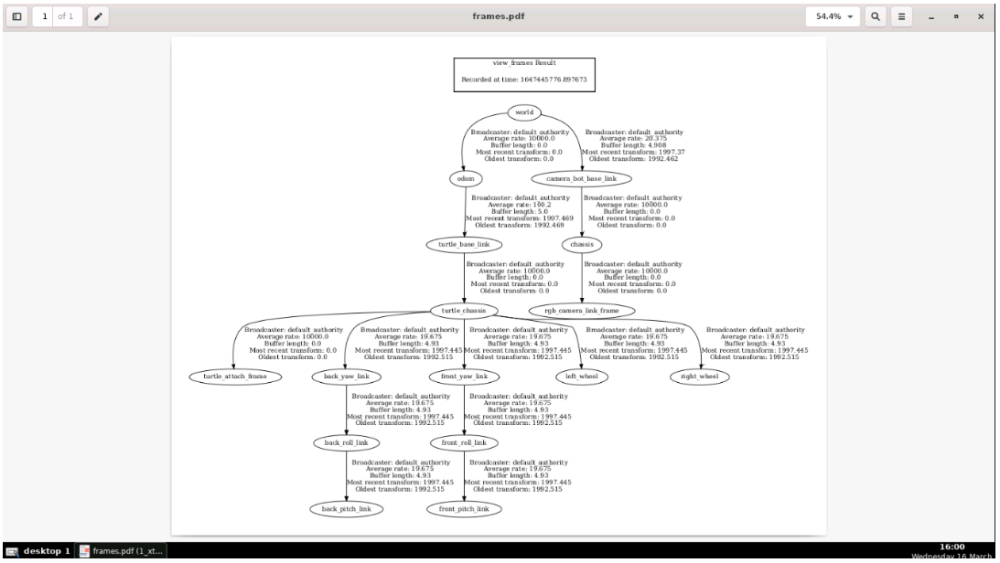
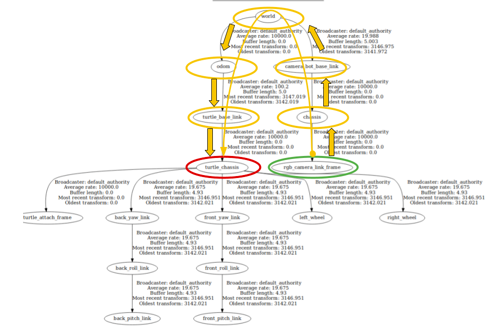

# Fundamentos do TF

* As ferramentas que o ROS2 possui para introspecção e interação com a biblioteca tf2
* Visualizando quadros TF através de árvores TF
* Visualizando quadros TF através do RVIZ2

Dica: talvez seja necessário reduzir um pouco o zoom para poder ver a cena inteira.

Esta simulação tem dois robôs diferentes:

* Cam_bot
* Tartaruga

## CAM_BOT
Este robô tem 6 graus de liberdade, o que significa que ele pode se mover nos eixos X, Y e Z e pode girar nos três eixos.

Ele tem uma câmera que você usa para gravar o que quiser e é controlado de uma maneira muito especial: ele seguirá qualquer quadro de robô que você disser para seguir.

## TARTARUGA
Este robô se comporta como o clássico ROS `turtle_sim` usado em muitos tutoriais do ROS. A única diferença é que é um robô 3D. Portanto, ele se move como qualquer robô de acionamento diferencial se moveria (para frente/para trás e gira, mas não para os lados).

## Onde está a tartaruga?
Então vamos montar o cenário: o Cam_bot tem uma câmera montada na frente do robô. O robô pode se mover em qualquer lugar no espaço e em qualquer orientação. Perfeito! Agora queremos dizer ao `Cam_bot` para seguir a Tartaruga. No entanto, logo percebemos que existem algumas dificuldades com as quais teremos que lidar, por exemplo:

* Onde está a tartaruga?
* Como você pode colocar o `Cam_bot` em uma posição fixa em relação à tartaruga?
* Como você pode calcular os movimentos de translação e rotação que o `Cam_bot` deve fazer quando a tartaruga se move?

Como você pode ver, muitos problemas surgem dessa cena simples.

Você precisa informar ao `Cam_bot` ONDE (posição e orientação) onde sua câmera está montada. E também, onde está localizado o Turtle em relação ao `Cam_bot` ou a um ponto global comum.

Todos esses itens requerem a aplicação do mesmo conceito: transformações entre referenciais de coordenadas.

Uma transformação especifica como os dados expressos em um quadro de coordenadas podem ser transformados em um quadro de coordenadas diferente. Por exemplo, se você detectar a Tartaruga com a câmera, ainda não saberá onde está a Tartaruga.

A câmera apenas informa que vê uma Tartaruga, não onde ela está no espaço. Para te dizer isso, você precisa:

* A posição do Cam_bot no espaço
* A distância do centro do corpo do `Cam_bot` (comumente chamado de `base_link`) até o sensor da câmera
* E, finalmente, a distância do sensor da câmera ao Turtle.

Então, o que realmente precisamos são os quadros de coordenadas e as transformações entre eles.

Então, qual é a posição do `Cam_bot` no espaço? Para ter um valor útil para a programação da robótica, precisamos acompanhar suas posições no espaço. Para podermos ter uma medição útil precisamos de um ponto de referência fixo de onde possamos avaliar a sua posição e orientação. É por isso que, antes de podermos descrever qualquer objeto na cena, precisamos de quadros de coordenadas.

Mas, como trabalhamos com quadros de coordenadas no ROS? Quais são as ferramentas que o ROS fornece nesse sentido? O restante desta unidade visa delinear ferramentas e bibliotecas úteis que podem ser usadas para visualizar e depurar problemas de TF.

## View_frames in PDF format

Para `view_frames`, o nó ROS2 gera um diagrama com a árvore TF atual do sistema.

Agora, gere a árvore TF do sistema atual.

Neste exemplo, veja o que é gerado ao publicar o TF e como usar a ferramenta `view_frames`.

> Importante: Certifique-se de que a simulação no canto superior direito da tela foi totalmente carregada. Verifique isso usando a roda de rolagem do mouse para diminuir o zoom e confirme se você pode ver o `Cam_bot` e a tartaruga. Às vezes, arquivos de imagem grandes em simulações podem demorar muito para carregar.

O seguinte comando produzirá um arquivo PDF no diretório em que for executado:
```bash
ros2 run tf2_tools view_frames
```
Agora você deve ter um arquivo PDF chamado `frames.pdf` contendo a árvore TF atual que está sendo transmitida no momento no sistema.

Para baixar o arquivo PDF gerado, você pode usar o IDE. Simplesmente encontre o arquivo no navegador de arquivos do lado esquerdo, clique com o botão direito nele e selecione 'baixar' no menu. Isso permitirá que você visualize o arquivo PDF em sua máquina local

<div align="center">
     
</div>

Aqui você pode ver o que é chamado de árvore TF. Ele descreve todos os quadros dos robôs no sistema e suas conexões. A árvore TF acima mostra 16 quadros de coordenadas. Se você vir menos do que isso, recarregue a simulação, pois os robôs podem não ter aparecido.

Como você pode ver na parte superior, o quadro de coordenadas mundiais é a raiz da estrutura da árvore. Ele também fornece algumas informações extras:

* Broadcaster: Esse é o nome do transmissor de dados TF.
* A taxa média de publicação, neste caso, gira em torno de 5,2 Hz.
* Número de transformação mais recente e sua idade. 0.0 significa que é uma transformação constante ou transformação estática.
* Quantos dados o buffer TF armazenou; neste caso, 4,93 segundos de dados.

## Ver quadros TF usando rqt_tf_tree
`rqt_tf_tree` dá a mesma funcionalidade que `view_frames`, com um extra interessante:

* Você pode atualizar e ver as alterações sem gerar outro arquivo PDF a cada vez.

Isso é muito útil ao testar novas transmissões de TF e verificar se o que você está usando ainda está sendo publicado ou se é uma publicação antiga.

Neste exemplo, aprenda a usar a ferramenta rqt_tf_tree e atualize as alterações com um clique do botão atualizar ao alterar o TF publicado.

Inicie o nó rqt_tf_tree ROS. Role para ampliar o diagrama se for muito pequeno ou pressione o botão de atualização na janela `diagrama rqt_tree`:
```bash
ros2 run rqt_tf_tree rqt_tf_tree
```
Agora, este TF não é estático, mas pode ser atualizado para mostrar o status atual da árvore do TF. Pressione o botão de atualização sempre que desejar a atualização mais recente.

Como você pode ver, a estrutura é a mesma e a árvore do TF não mudou.

## Veja quadros TF no terminal usando tf_echo
Abaixo, o ROS usa tópicos para comunicar transformações, como resultado, você pode ver todos esses dados brutos por meio de tópicos.

Existe um tópico chamado `/tf` e outro chamado `/tf_static` onde todos os TFs são publicados. O único problema é que TODOS os quadros são publicados lá.

Existe uma ferramenta de linha de comando muito útil que filtra qual transformação você está interessado e mostra aquela. Ou, mais importante, calcula uma transformação indireta entre dois quadros conectados, mas não diretamente. Isso é muito útil e usado para muitas aplicações.

O tópico `/tf` publica apenas os TFs diretos, não todas as transformações entre todos os quadros. tf_echo retorna as transformações entre quaisquer quadros conectados para você.

Neste exemplo, veja como ecoar o tópico `/tf` e então como usar a ferramenta `tf_echo` para filtrar os dados do tópico `/tf`.

Execute o seguinte comando para ver uma publicação do tópico `/tf` diretamente:

```bash
ros2 topic echo /tf
```
Como você pode ver, sua carga de dados é publicada a cada segundo. Portanto, é difícil ou impossível obter os dados necessários porque aqui você está apenas publicando as transformações TF de um quadro para o próximo quadro conectado.

No entanto, se você estiver interessado em dois quadros que não estão diretamente conectados, você precisa de outra ferramenta: `tf2_echo`.

Agora, filtre os dados TF com a ferramenta tf2_echo para ver apenas a transformação entre o quadro `/rgb_camera_link_frame` e o quadro `/turtle_chassis`. Aqui estão o caminho e as transformações acumuladas que este sistema irá realizar e, ao final, entregar um resultado:

<div align="center">
     
</div>

O comando tf2_echo deve ser executado com a seguinte estrutura geral:
```bash
ros2 run tf2_ros tf2_echo [reference_frame] [target_frame]
```
Neste esquema:

* [reference_frame] é onde você inicia a transformação, por exemplo rgb_camera_link_frame.

* [target_frame] é onde você deseja terminar a transformação, por exemplo turtle_chassis.

Isso significa que você deseja saber a translação e a rotação do `reference_frame` para o `target_frame`.

Deixe-me dar um exemplo:

```bash
ros2 run tf2_ros tf2_echo rgb_camera_link_frame turtle_chassis
```
Aguarde aproximadamente 10 segundos. Ele começará a mostrar as transformações. Normalmente, a primeira mensagem diz que não existe, mas o sistema TF precisa de um pouco de sincronização com os horários publicados do TF.

Aqui você pode ver a tradução e rotação de `rgb_camera_link_frame` para `turtle_chassis`, com seu carimbo de data/hora.

Mova a Tartaruga e veja como essa transformação muda quando você se move:
```bash
ros2 run teleop_twist_keyboard teleop_twist_keyboard --ros-args --remap cmd_vel:=/turtle_cmd_vel
```
Agora use o teclado para mover a tartaruga. Use as seguintes teclas do seu teclado:

Agora você deve ver o movimento da tartaruga e o resultado `tf2_echo` mudar.

## View_frames Usando RVIZ2
Uma das melhores maneiras de confirmar se os TFs estão sendo publicados e visualizar as alterações é visualizando cada quadro no espaço 3D. O RVIZ2 pode ajudar nisso.

O RVIZ2 serve a vários propósitos:

* É a melhor forma de ver o que o tópico /tf está publicando, pois você o vê representado no espaço.
* Se um TF não for mais publicado, ele ficará cinza e desaparecerá, então o RVIZ2 fornece informações importantes sobre os problemas.
*Também não renderizará dados de sensor ou qualquer coisa que precise de TF se o frame fixo não estiver configurado corretamente no RVIZ, e mesmo assim, não renderizará se, por exemplo, você tiver uma árvore quebrada com vários `frames raiz`. Esse é um problema comum em sistemas com vários robôs.

Neste exemplo, você representa os dados do tópico `/tf` no espaço 3D e vê como eles mudam ao mover a Tartaruga. Você também dirá à câmera para seguir um quadro específico.

Execute o comando de teleoperação para mover a Tartaruga com o teclado.
```bash
ros2 run teleop_twist_keyboard teleop_twist_keyboard --ros-args --remap cmd_vel:=/turtle_cmd_vel
```
Vamos começar o Rviz:

Primeiro, crie o espaço de trabalho onde os modelos de robô estão localizados:
```bash
source /home/simulations/ros2_sims_ws/install/setup.bash
```
Then start Rviz:
```bash
rviz2
```
Ao adicionar um modelo de robô ao RVIZ, podem aparecer alguns erros relativos às texturas do Cam_bot. Este é um problema conhecido com RVIZ com certas codificações de texturas. No entanto, não há nenhum problema que afete o curso.

A janela Ferramentas Gráficas deve aparecer e exibir RVIZ2 quando estiver pronto:

Agora, adicione os seguintes elementos ao RVIZ e configurações:

* Defina o 'Fixed Frame' para /world como mostrado abaixo:
* Adicione dois modelos de robôs com diferentes configurações de tópicos:
     * Encontre os botões 'Adicionar' na parte inferior do grupo 'Exibições' e clique neles para adicionar cada modelo de robô.
     * Use a função 'Renomear' para definir o nome exibido para cada modelo. Na imagem abaixo, usamos os nomes * * 'TurtleRobotModel' e 'CamBotRobotModel', mas você pode escolher qualquer nome que preferir. Este nome é usado apenas para * identificar o modelo do robô no painel do lado esquerdo do Rviz.
     * Configure o primeiro modelo de robô para ler a partir do tópico turtle_robot_description.
     * Configure o segundo modelo de robô para ler no tópico cam_bot_robot_description.
     * Verifique se as configurações de QoS estão corretas.

* Adicione uma leitura de imagem do tópico `/camera/image_raw` e configure o QoS correto.

* Claro, adicione o tf para visualizar os TFs em ação:
      * Altere a escala do marcador para 1,0 para ver melhor os quadros.

Você deve salvar o arquivo de configuração do RVIZ em algum lugar, para que não precise configurá-lo toda vez que abrir o RVIZ2.

Recomendamos que você o salve dentro do diretório `/home/user/ros2_ws/src/` e use nomes como `tf_ros2_course.rviz`.

Agora, observe que um frame sempre segue o Turtle, este frame é chamado `turtle_attach_frame`.

Agora vamos dizer ao Cam_bot para imitar a posição e orientação do turtle_attach_frame. Ao fazer isso, ele seguirá a Tartaruga e a câmera capturará a Tartaruga o tempo todo.

Para isso, execute o seguinte comando:

Este script ativará o movimento para um sistema de quadro do `Cam_bot`.
```bash
ros2 run turtle_tf_3d_ros2 move_generic_model.py
```
Envie um comando para o tópico `/desired_frame` para dizer ao Cam_bot para mover e imitar a posição e orientação desse quadro.
```bash
ros2 topic pub /destination_frame std_msgs/msg/String "data: 'turtle_attach_frame'"
```
Agora você deve obter o Cam_bot seguindo a tartaruga onde quer que vá:
Como você pode ver, usando os TFs publicados, o Cam_bot pode seguir a orientação que você deseja atingir, no caso, a Tartaruga.

Você pode ter mais perguntas agora, por exemplo:

* Como funciona este move_generic_model.py?
* Como todos esses TFs são publicados?

Você terá essas perguntas respondidas na próxima unidade!
