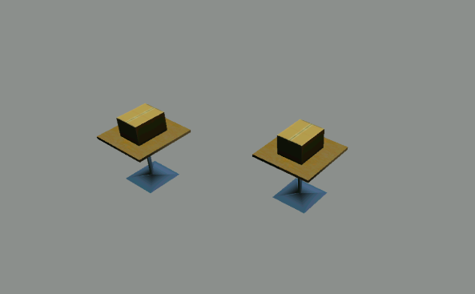
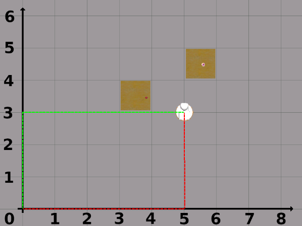
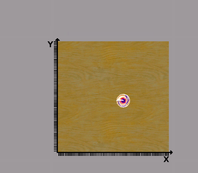
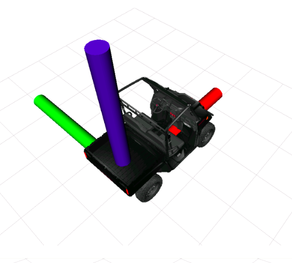
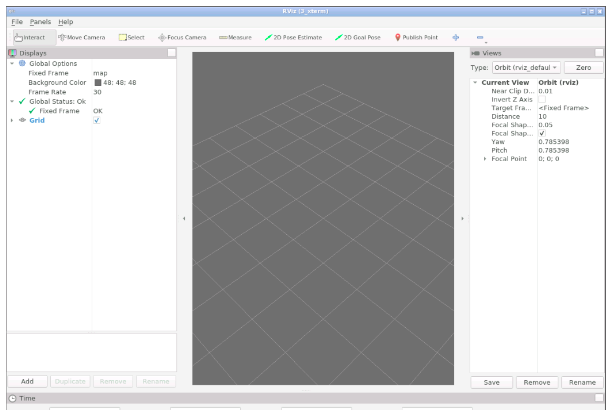
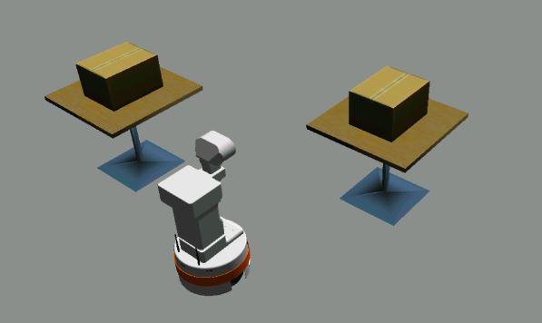

# Introdução a TF

* Aprenda alguns conceitos básicos por trás da teoria do TF
* Experimente uma demonstração do robô Tiago e veja os quadros TF em ação

## Configuração preliminar
Antes de iniciar a seção, você precisa executar um comando git clone da sua pasta `ros2_ws/src` para obter os pacotes que precisaremos.
```bash
cd ~/ros2_ws/src
git clone https://bitbucket.org/theconstructcore/ros2_tf_course.git
```

Em seguida, execute o seguinte comando no shell para instalar tudo corretamente.
```bash
cd ~/ros2_ws && colcon build && source install/setup.bash
```
E agora você pode iniciar a simulação:
```bash
ros2 launch tiago_demo start_simulation.launch.py
```
E é isso para o processo de configuração.
Um problema típico de robô

<div align="center">
     
</div>

Na cena acima, digamos que queremos comandar um robô para uma das mesas, em seguida gostaríamos que ele pegasse uma das caixas. Uma informação fundamental que precisamos saber é: Qual é a posição atual das mesas na sala?

Para um ser humano, esta parece ser uma pergunta fácil. Bem ali no meio da sala! Mas em robótica devemos ser muito precisos e fornecer a posição exata usando valores numéricos.

Para poder fornecer uma posição das mesas usando valores precisos, precisamos de um ponto de referência fixo de onde possamos determinar suas coordenadas de posição. Este é um conceito muito importante aqui: as coordenadas de posição não têm significado sem especificar um quadro de coordenadas. Vamos explorar um pouco mais o conceito de referencial de coordenadas.

## Sistemas de coordenadas, referenciais e referenciais
Um referencial de coordenadas é um conjunto de eixos ortogonais que se cruzam em um ponto que chamamos de origem que serve para descrever a posição dos pontos em relação a essa origem. Observe que o termo sistema de coordenadas pode ser usado de forma intercambiável com quadro de referência ou quadro de coordenadas, mas usaremos o último termo para esta seção, pois ele se tornou mais amplamente usado pelo ROS. Na verdade, no ROS, na maioria das vezes, você verá apenas o termo tf frame, que é apenas a forma abreviada de transform frame.

### Quadros de Coordenadas em 2D
Você provavelmente está familiarizado com o plano cartesiano, que usa coordenadas de posição na forma (x, y). Por exemplo, olhe para o plano cartesiano abaixo.

<div align="center">
     
</div>

Para descrever a posição de uma das mesas da imagem acima, mediremos a distância ao longo de cada eixo até o centro exato da mesa. Podemos ver que a primeira tabela está cinco unidades à direita e três unidades acima da origem. Essa relação é mostrada pelas linhas tracejadas vermelhas. As linhas tracejadas verdes mostram a mesma relação. A partir da origem de nosso referencial de coordenadas, o centro da mesa está três unidades para cima e cinco unidades para a direita. No ROS, como trabalhamos no espaço 3D, usamos coordenadas 3D, vamos dar uma breve olhada nas coordenadas 3D.

### Quadros de Coordenadas em 3D
Para especificar a localização de um ponto no espaço, precisamos de três coordenadas (x, y, z), onde as coordenadas x e y especificam localizações em um plano e a coordenada z fornece uma posição vertical acima ou abaixo do plano. Agora considere a mesa do exemplo, o tampo da mesa tem 0,92m de altura. Agora a questão que surge é onde colocamos o valor da coordenada Z? Por enquanto, digamos que para definir a posição desta mesa em 3D, sempre mediremos Z na altura da superfície do tampo da mesa. Ao fazer isso, sabemos que quando a coordenada Z = 0,0 o objeto estará tocando o tampo da mesa.

### Quadro de Coordenadas Globais
Até agora discutimos o que é chamado de referencial de coordenadas de base ou referencial de coordenadas globais. Este é um quadro arbitrário que colocamos no ambiente em relação ao qual quaisquer pontos de interesse no ambiente podem ser localizados. No entanto, na maioria das vezes, pode ser conveniente ou necessário ter mais de um referencial de coordenadas. É aqui que entra em jogo o conceito de referenciais de coordenadas locais.

### Quadro de coordenadas locais e nomes de quadro de coordenadas
Por conveniência, podemos criar uma nova coordenada local na qual podemos referenciar mais facilmente um ponto ou objeto na cena. Tomemos, por exemplo, uma das tabelas na cena:

<div align="center">
     
</div>

Existem muitas situações em que é mais útil definir as coordenadas de um objeto em relação à mesa e não em relação à sala. Para fazer isso, podemos definir um novo quadro de coordenadas arbitrárias na borda da mesa. Agora, para identificar esse novo referencial de coordenadas, devemos dar um nome a ele. O quadro de coordenadas acima pode ser denominado "table_1", pois há mais de uma tabela na cena.

E isso nos leva a outro conceito-chave para quadros de coordenadas: pode haver vários quadros de coordenadas, e cada quadro de coordenadas deve ter um nome exclusivo que o descreva e o diferencie de outros quadros de coordenadas. Mais adiante nesta unidade, você verá que no ROS geralmente usamos o rótulo frame_id para especificar o nome de um quadro de coordenadas.

Agora, cada vez que criamos um novo quadro de coordenadas, devemos especificar sua localização em relação a outro quadro de coordenadas. Sempre deve existir uma relação entre dois quadros. Isso é o que uma chamada transformação faz por nós. Agora, como cada dois quadros de coordenadas estão relacionados por uma única transformação, podemos representar todos os quadros de coordenadas que existem em nosso sistema como uma hierarquia ou árvore.

Falaremos mais sobre este conceito tão importante em um momento, vamos aprender sobre convenções antes de continuar.

Convenções
Na última seção, dissemos que todo referencial de coordenadas deve ter um nome. Mas não fornecemos nenhum nome ao nosso quadro de coordenadas global. Na verdade, um referencial de coordenadas pode ter o nome que você quiser, desde que o nome seja único. A fim de evitar confusão entre os desenvolvedores, o ROS tem certas convenções para nomear estruturas de coordenadas, que você verá usadas por muitos robôs. Uma delas é que o quadro de coordenadas globais é normalmente chamado de mundo ou mapa.

Quadro de coordenadas canhoto x destro
Uma das convenções mais importantes no ROS é que os quadros de coordenadas seguem a regra da mão direita. Isso significa que o eixo X apontará para frente, o eixo Y para a esquerda e o eixo Z sempre para cima. Observe que a regra da mão direita é bastante padrão em física e engenharia, mas há algumas exceções notáveis, como o sistema de coordenadas usado para definir a localização de um pixel em uma imagem ou tela.

Outro padrão amplamente adotado que você verá no ROS é usar vermelho, verde e azul para colorir os eixos x,y,z, respectivamente.

Dos fatos mencionados acima, segue-se que um robô ROS terá, por convenção, seu quadro de coordenadas do corpo principal escolhido de forma que o eixo x (em vermelho) aponte para frente, o eixo y (em verde) aponte para a esquerda e o eixo z (em azul) aponta para cima.

Todas as ferramentas do ROS2 aderirão automaticamente a essa convenção de quadro de coordenadas; portanto, normalmente não há muito o que fazer a esse respeito além de estar ciente disso. No entanto, se você escrever seu próprio nó de direção, por exemplo, um nó de acionamento diferencial, certifique-se de que uma taxa de giro positiva faça com que seu robô vire à esquerda, caso contrário, você não estará em conformidade com o padrão. Seguir esta convenção é muito importante se você deseja integrar com outros componentes do ROS e reutilizar software como o Navigation2.

A mesma convenção se aplica a outros tipos de robôs, como robôs semelhantes a carros e drones.

<div align="center">
     
</div>

Abaixo você encontrará links para recursos onde você pode aprender mais sobre as convenções ROS que podem lhe interessar.

* [Standard Units of Measure and Coordinate Conventions (ROS.org)](https://www.ros.org/reps/rep-0103.html)
* [REP 105 -- Coordinate Frames for Mobile Platforms (ROS.org)](https://www.ros.org/reps/rep-0105.html)
* [REP 120 -- Coordinate Frames for Humanoid Robots (ROS.org)](https://www.ros.org/reps/rep-0120.html)
* [Coordinate Frames for Serial Industrial Manipulators (ROS.org)](https://gavanderhoorn.github.io/rep/rep-0199.html)
* [REP 147 -- A Standard interface for Aerial Vehicles (ROS.org)](https://ros.org/reps/rep-0147.html)

## Criar um quadro de coordenadas
O primeiro passo para trabalhar com quadros de coordenadas no ROS2 é criar um quadro de coordenadas. No ROS, existem várias maneiras pelas quais podemos criar um quadro de coordenadas. Para começar, deixe-me apresentar a ferramenta de linha de comando chamada `static_transform_publisher` que está incluída no pacote `tf2_ros`.

A estrutura de comando típica para criar um novo quadro de coordenadas é assim:

Vamos dissecá-lo e dar uma olhada em cada um de seus componentes:

* ros2 run tf2_ros `static_transform_publisher`: esta parte é a sintaxe típica que usamos para executar um nó ROS2. Como de costume, devemos especificar o nome do pacote, neste caso tf2_ros e o nome do nó, neste caso `static_transform_publisher`.

* x y z yaw pitch roll: uma vez que cada quadro de coordenadas é 6DOF (seis graus de liberdade), também devemos fornecer informações para os três graus de liberdade rotacionais (em graus).

* `frame_id` `child_frame_id`: Aqui definimos tanto `frame_id` (pai) quanto `child_frame_id` da transformação.

* Quando criamos um novo referencial de coordenadas, devemos especificar sua localização em relação a outro referencial de coordenadas. Sempre existe uma relação entre dois quadros.

* Então, o que realmente precisamos são os quadros de coordenadas e as transformações entre eles. Transformações são relações entre conjuntos de quadros de coordenadas. Usando essas transformações, podemos expressar a posição de um objeto em um quadro de referência/coordenada diferente.

* Devemos especificar um nome exclusivo para identificar cada quadro de coordenadas.

## Visualize transformações e coordene quadros no Rviz
O Rviz é uma interface gráfica que permite visualizar diversas informações presentes no sistema ROS2. Como tal, também fornece elementos para visualizar a posição e os quadros de coordenadas de orientação. Vamos pular para um pequeno exemplo prático para demonstrar como visualizar tf frames no RViz.

Para abrir o Rviz na linha de comando, execute o seguinte:
```bash
rviz2
```
Após alguns segundos de carregamento, o Rviz2 deve ser iniciado em cima de todas as outras janelas.
Neste ponto, você deve ver um painel "Displays" à esquerda que inclui apenas "Opções globais", "Status global" e "Grade". Observe como em "Status Global" há uma mensagem de erro que diz: "Frame Fixa: Quadro [mapa] não existe."

Isso é importante: para ver qualquer um dos quadros de coordenadas no Rviz, você deve escolher um quadro fixo onde exista o quadro TF nomeado de acordo.

Você pode selecionar todos os quadros disponíveis na caixa de combinação. Normalmente mundo, mapa ou odom são as melhores escolhas.

Para corrigir esse erro, devemos criar um quadro de coordenadas. Vamos criar o quadro de coordenadas 'mapa' a partir de um novo terminal. Minimize a janela de ferramentas gráficas e execute o seguinte comando:
```bash
ros2 run tf2_ros static_transform_publisher 1.5 -0.5 0.92 0 0 0 map table1
```
Saída esperada:
```bash
[INFO] [1668596746.538277460] [static_transform_publisher_oPVPTP1wV466TN7B]: Spinning until killed publishing transform from 'map' to 'table1'
```
Volte para o Rviz2 clicando no ícone Ferramentas Gráficas na barra de ferramentas inferior.

Verifique se "Global Status" mudou para Ok e "Fixed Frame" também está OK.

<div align="center">
     
</div>

O Rviz2 possui um `TransformListener` integrado e o plug-in TF é codificado para ouvir os tópicos `/tf` e `/tf_static`.

Para exibir os dados do TF no Rviz2, precisamos adicionar um novo elemento de visualização, chamado "TF". Para fazer isso, clique no botão Adicionar no canto inferior esquerdo, role um pouco a lista e selecione TF. Em seguida, pressione "Ok".

Ao expandir a exibição do TF, você pode ver várias opções configuráveis, vamos analisá-las individualmente:

* Show Names: Ativa/desativa a visualização 3D do nome dos quadros de coordenadas
* Show Axes: Ativa/desativa a visualização 3D dos eixos dos quadros
* Show Arrows: Ativa/desativa a visualização 3D das setas que representam a transformação de filho em pai
* Marker Scale: insira um valor diferente para redimensionar o tamanho dos eixos, setas e nomes do TF
* Update Interval: o intervalo, em segundos, no qual atualizar as transformações de quadro. Deixe em 0 para ver cada atualização
* Frame Timeout: O período de tempo, em segundos, antes que um quadro que não foi atualizado seja considerado morto. Em 1/3 desse tempo, o quadro aparecerá correto, no segundo 1/3 ele ficará cinza e, em seguida, desaparecerá completamente
* Frames: isso permitirá que você ative/desative a visualização de quadros individuais colocando uma marca de seleção ao lado do nome do quadro. Clique em qualquer nome de quadro para obter informações mais detalhadas.
* Tree: mostra toda a árvore TF, com todos os quadros de coordenadas disponíveis e sua relação pai-filho

Um dos recursos mais importantes é a capacidade de ativar/desativar a visualização de quadros individuais. Isso permite que você se concentre apenas nas transformações mais importantes para sua tarefa atual e mantenha sua janela do Rviz organizada.

Além disso, normalmente você não deseja adicionar manualmente o TF toda vez que usar o RViz. Em vez disso, você pode salvar sua configuração atual, mas vamos pular isso agora.

> Quando terminar o exercício anterior, pressione CTRL+C para parar os nós static_transform_publisher e rviz2 e poder digitar mais comandos. Não pare o Shell #1, que contém a simulação em execução.

## Os muitos quadros de coordenadas de um robô
Ao trabalhar com robôs, devemos criar um modelo de robô para ter uma representação da estrutura do robô. No ROS usamos o que chamamos de arquivos URDF e XACRO para criar esses modelos de robôs. O que você precisa saber ao trabalhar com transformações é que cada articulação do robô tem um quadro de coordenadas associado a ela. Dessa forma, podemos acompanhar facilmente a posição dos links do robô no espaço. Para entender melhor esse conceito, dê uma olhada no seguinte exercício:
```bash
source ~/ros2_ws/install/setup.bash
ros2 lançamento tiago_demo tiago_demo.launch.py
```
Não feche este terminal, caso contrário, ele matará um nó importante que usaremos. Você deve ver um robô no Gazebo agora.

<div align="center">
     
</div>

```bash
source ~/ros2_ws/install/setup.bash
rviz2
```

Vá para as Ferramentas Gráficas e adicione uma exibição de modelo de robô.

Para adicionar um modelo de robô, clique no botão Adicionar na parte inferior do painel lateral esquerdo. Você verá uma lista de diferentes tipos de exibição oferecidos na janela emergente que aparecerá. Role a lista até encontrar RobotModel e clique em OK. Um item RobotModel agora deve aparecer no painel do lado esquerdo do RVIZ, mas nada é exibido na tela principal do RVIZ. Isso é esperado, pois você precisa clicar no triângulo preto à esquerda do RobotModel para abrir os detalhes. Confirme se a Fonte da descrição está definida como Tópico e, em seguida, clique no espaço vazio em branco à direita do Tópico da descrição e digite `/robot_description`. Veja a imagem abaixo para referência:

Você está indo bem até agora, mas como pode ver, há outro problema: todo o modelo é branco.

Este é um problema comum ao carregar um modelo de robô no Rviz. Felizmente, você já sabe como resolver o problema! O modelo do robô não é exibido corretamente porque o quadro fixo no Rviz não foi definido corretamente. Se você alterar o quadro fixo para base_footprint, verá que o modelo do robô é exibido normalmente e o status global: Ok.

Em seguida, adicione um display TF como você fez no exercício anterior.

Cada um desses eixos vermelho, azul e verde representa um quadro de coordenadas. Como você pode ver, mesmo em um robô de tamanho médio, dezenas de quadros de coordenadas podem ser usados. Portanto, é essencial acompanhar onde cada quadro de coordenadas está em qualquer ponto no tempo para garantir que o robô esteja ciente da posição de seus elos no espaço e de outros objetos no ambiente. Para gerenciar essa complexidade, precisamos de ferramentas e métodos especializados.