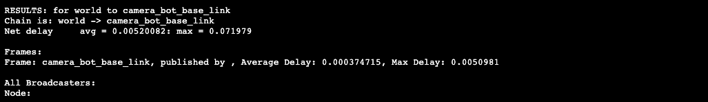
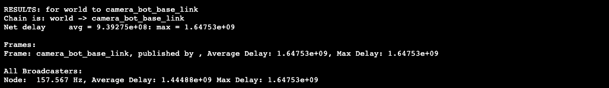

# TF Broadcasting and Listening
Nesta unidade, você fará o seguinte:

* Crie uma emissora TF estática
* Crie um Ouvinte TF
* Entenda a relação entre tempo e TFs

Nesta unidade, aprenda os fundamentos do TF Broadcasting and Listening através da seguinte cena:

* Esta é uma simulação ligeiramente nova.
* A principal diferença, fora do mundo, é o fato de que:
     * Cam_bot não publica seu TF de cam_bot_base_linkto world. Isso significa que você não pode posicionar o Cam_bot no mundo.
     * O quadro Turtle odom NÃO está conectado ao quadro mundial, o que cria uma cena TF de duas árvores, uma para cada robô.
     * O Cam_bot não possui esse sistema de acompanhamento de frames, portanto não é fácil seguir a Tartaruga usando apenas o controle básico.

Assim, você corrigirá esses problemas e, no processo, aprenderá sobre o TF2 no ROS2.

> Observação: aguarde até que a simulação esteja totalmente carregada e ambos os robôs estejam visíveis antes de continuar.

## Transmissão
Objetivo: Resolver o problema em que o `Cam_bot` não tem uma transformação do `cam_bot_base_linkto world`.

Dê uma olhada no problema primeiro. Execute os seguintes comandos para configurá-lo:
```bash
source /home/simulations/ros2_sims_ws/install/setup.bash
rviz2
```
Você deve ver que a janela de ferramentas gráficas aparece automaticamente. Alguns segundos depois, você deve ver o Rviz aberto em um estado não configurado.

Tarefas:

* Adicione dois itens RobotModel à lista de exibição: um para o `Cam_bot`, o outro para a tartaruga. Os tópicos devem ser configurados corretamente.
* Adicione uma nova exibição TF para que você possa ver os quadros TF na visualização 3D com a grade.
* Selecione **world** como o Quadro Fixo em Opções Globais.
* Adicione também uma exibição de imagem para exibir a visão da perspectiva da câmera do robô. Lembre-se que você deve preencher o seu **Tópico da Imagem**.
* Agora você deve ter uma janela de imagem que será usada mais tarde.
Dica:

Os comandos ros2 topic list e ros2 topic info -v são úteis para ajudá-lo a definir algumas configurações do Rviz.

Salve a configuração do RVIZ, para não ter que criar tudo de novo. Use um nome de arquivo descritivo como unit3_config.rviz e salve-o em um local temporário, por exemplo aqui: `~/ros2_ws/src/`. Posteriormente, isso nos permitirá iniciar o Rviz com o arquivo de configuração:
```bash
rviz2 -d ~/ros2_ws/src/unit3_config.rviz
```

Como você pode ver, ambos os modelos de robôs são brancos e se sobrepõem. Isso significa que NÃO há transformação do mundo para o link raiz de qualquer um dos modelos de robô.

Portanto, o primeiro que podemos tentar é alterar o quadro fixo e selecionar o chassi. Dessa forma, você verá pelo menos o `Cam_bot`:

Agora você pode ver as texturas de malha do Cam_bot e as imagens da câmera agora estão visíveis. Isso ocorre porque quando o frame_id fornecido pelo cabeçalho da imagem não é encontrado na árvore TF, o Rviz não é capaz de exibir a imagem com a exibição da imagem.

Tente também mudar o Fixed Frame para `turtle_chassis`. Você deve ver as texturas de malha do Turtle.

Agora defina o quadro fixo de volta ao chassi, pois vamos nos concentrar no Cam_bot agora.
```bash
ros2 run teleop_twist_keyboard teleop_twist_keyboard --ros-args --remap cmd_vel:=/cam_bot_cmd_vel
```

Agora, mova o Cam_bot ao redor. Use o cam_bot_cmd_vel para enviar comandos de força para o robô em diferentes direções.

A velocidade inicial é 0, você precisa pressionar [j] ou [l] para fazer o robô girar. Observe que esse movimento do robô é como seria em um veículo no espaço. Isso significa que se você `PRESSIONAR PARA A FRENTE` uma vez, por exemplo, ele exercerá uma força no eixo X do robô. A inércia fará com que o robô se mova indefinidamente até que você exerça uma força igual na direção oposta ao movimento. O mesmo acontece com as rotações.

Novamente, cada vez que você pressiona uma tecla, ela exerce essa força. Isso significa que se você deixar a `TECLA PRESSIONADA`, ele continuará exercendo aquela força, que irá acelerar o robô muito rápido, dificultando sua parada.

Sempre que sentir que perdeu o controle do robô, PARE o script teleop do teclado usando Ctrl + C e reinicie a simulação. Para isso, pressione o ÍCONE abaixo na janela de simulação:

Ao mover o `Cam_bot`, você deve ver algo semelhante a isto:

E também, você deve ver que no RVIZ, o robô não se move, mas a imagem da câmera mostra que ele está se movendo.

Este é o comportamento esperado desde que o Quadro Fixo esteja definido como chassi.

Mas e se quisermos mover o robô e também ver esse movimento refletido dentro da área principal de visualização 3D do Rviz com a grade?

Não podemos fazer isso agora, porque nossa árvore TF tem uma transformação ausente.

NÃO há transformação do chassi para o quadro mundial. Verifique isso dando uma olhada na árvore TF:
```bash
ros2 run rqt_tf_tree rqt_tf_tree
```
Como você pode ver, você tem DUAS árvores TF com duas raízes diferentes. E não há moldura MUNDIAL.

Crie um script Python chamado `cam_bot_odom_to_tf_pub.py` dentro do pacote chamado `my_tf_ros2_course_pkg`.

Este script irá:

Extraia a odometria do Cam_bot e publique uma transformação TF do `camera_bot_base_link` para o frame world.
Agora crie o novo pacote e o script Python:
```bash
cd ~/ros2_ws/src
ros2 pkg create --build-type ament_cmake my_tf_ros2_course_pkg --dependencies tf2_ros geometry_msgs nav_msgs
```
Como este pacote é do tipo de compilação `ament_cmake`, criaremos uma pasta chamada scripts para colocar um script python lá.
```bash
mkdir my_tf_ros2_course_pkg/scripts
touch my_tf_ros2_course_pkg/scripts/cam_bot_odom_to_tf_pub.py
chmod +x my_tf_ros2_course_pkg/scripts/cam_bot_odom_to_tf_pub.py
```
Adicione os comandos de instalação ao arquivo CMakeLists.txt para poder executar os scripts Python.
Você pode usar o exemplo abaixo para ajudá-lo a modificar o script pré-criado.
> CMakeLists.txt

```cmake
cmake_minimum_required(VERSION 3.8)
project(my_tf_ros2_course_pkg)

if(CMAKE_COMPILER_IS_GNUCXX OR CMAKE_CXX_COMPILER_ID MATCHES "Clang")
  add_compile_options(-Wall -Wextra -Wpedantic)
endif()

# find dependencies
find_package(ament_cmake REQUIRED)
find_package(tf2_ros REQUIRED)
find_package(geometry_msgs REQUIRED)
find_package(nav_msgs REQUIRED)

if(BUILD_TESTING)
  find_package(ament_lint_auto REQUIRED)
  ament_lint_auto_find_test_dependencies()
endif()

install(PROGRAMS
  scripts/cam_bot_odom_to_tf_pub.py
  DESTINATION lib/${PROJECT_NAME}
)

ament_package()
```
> cam_bot_odom_to_tf_pub.py

```python
#! /usr/bin/env python3

import sys
import rclpy
from rclpy.node import Node
from rclpy.qos import ReliabilityPolicy, DurabilityPolicy, QoSProfile
import tf2_ros
from geometry_msgs.msg import TransformStamped
from nav_msgs.msg import Odometry


class CamBotOdomToTf(Node):

    def __init__(self, robot_base_frame="camera_bot_base_link"):
        super().__init__('odom_to_tf_broadcaster_node')

        self._robot_base_frame = robot_base_frame
        self.init_tf_message()

        self.subscriber = self.create_subscription(
            Odometry,
            '/cam_bot_odom',
            self.listener_callback,
            QoSProfile(depth=1, durability=DurabilityPolicy.VOLATILE, reliability=ReliabilityPolicy.BEST_EFFORT))

        self.br = tf2_ros.TransformBroadcaster(self)

        self.get_logger().info("odom_to_tf_broadcaster_node READY!")

    def listener_callback(self, msg):
        # print the log info in the terminal
        self.update_data(msg)
        self.get_logger().debug('Odom VALUE: "%s"' % str(self.cam_bot_odom))
        self.broadcast_new_tf()

    def update_data(self, msg):
        self.cam_bot_odom = msg

    def get_odom_data(self):

        position = self.cam_bot_odom.pose.pose.position
        orientation = self.cam_bot_odom.pose.pose.orientation

        return position, orientation

    def init_tf_message(self):
        self.transform_stamped = TransformStamped()
        self.transform_stamped.header.frame_id = "world"
        self.transform_stamped.child_frame_id = self._robot_base_frame

    def broadcast_new_tf(self):

        position, orientation = self.get_odom_data()
        self.transform_stamped.header.stamp = self.get_clock().now().to_msg()
        self.transform_stamped.transform.translation.x = position.x
        self.transform_stamped.transform.translation.y = position.y
        self.transform_stamped.transform.translation.z = position.z
        self.transform_stamped.transform.rotation.x = orientation.x
        self.transform_stamped.transform.rotation.y = orientation.y
        self.transform_stamped.transform.rotation.z = orientation.z
        self.transform_stamped.transform.rotation.w = orientation.w

        self.br.sendTransform(self.transform_stamped)


def main(args=None):

    rclpy.init()

    odom_to_tf_obj = CamBotOdomToTf()

    rclpy.spin(odom_to_tf_obj)


if __name__ == '__main__':
    main()
```

Vamos comentar o código.

## A estrutura básica da emissora TF
Isso cria o objeto TF Broadcasting que você usa para transmitir os TFs.
```python
self.br = tf2_ros.TransformBroadcaster(self)

def init_tf_message(self):
    self.transform_stamped = TransformStamped()
    self.transform_stamped.header.frame_id = "world"
    self.transform_stamped.child_frame_id = self._robot_base_frame
```

* Esta função inicia a mensagem usada para o TF
* Iniciar os valores que não mudarão
* frame_id = O frame respeita o transform, o Parent Frame
* child_frame_id, é o quadro no qual você está publicando a transformação TF.
Observe que quando você transmite, não importa se esses quadros existem:

* Se ambos existirem, você estará publicando um novo TF que provavelmente irá interferir naquele que outra pessoa está publicando.
* Se um dos frames existir e o outro não, o que não existe será criado e publicado para transformar o que existe.
* Se nenhum existir, ambos os quadros serão criados.

Na realidade, os quadros não são criados. Os dados TF são apenas um tópico que possui transformações entre os quadros, nada mais. Portanto, não há conexão real entre os quadros TF e o robô real/simulado por padrão.

```python
def broadcast_new_tf(self):

    position, orientation = self.get_odom_data()
    self.transform_stamped.header.stamp = self.get_clock().now().to_msg()
    self.transform_stamped.transform.translation.x = position.x
    self.transform_stamped.transform.translation.y = position.y
    self.transform_stamped.transform.translation.z = position.z
    self.transform_stamped.transform.rotation.x = orientation.x
    self.transform_stamped.transform.rotation.y = orientation.y
    self.transform_stamped.transform.rotation.z = orientation.z
    self.transform_stamped.transform.rotation.w = orientation.w

    self.br.sendTransform(self.transform_stamped)
```
Use o método `sendTransform()` para publicar a transformação preparada.
Neste caso, você está extraindo a posição e a orientação do robô por meio de sua odometria. Os robôs normalmente têm esses tópicos de odometria publicados e é uma ótima maneira de ter os primeiros dados de TF.

```python
self.subscriber = self.create_subscription(
            Odometry,
            '/cam_bot_odom',
            self.listener_callback,
            QoSProfile(depth=1, durability=DurabilityPolicy.VOLATILE, reliability=ReliabilityPolicy.BEST_EFFORT))
```
---
```python
def listener_callback(self, msg):
    # print the log info in the terminal
    self.update_data(msg)
    self.get_logger().debug('Odom VALUE: "%s"' % str(self.cam_bot_odom))
    self.broadcast_new_tf()

def update_data(self, msg):
    self.cam_bot_odom = msg

def get_odom_data(self):

    position = self.cam_bot_odom.pose.pose.position
    orientation = self.cam_bot_odom.pose.pose.orientation

    return position, orientation
```
* Aqui está o código relacionado à extração dos dados de odometria.
* Cada vez que você receber dados de odometria, transmita a transformação TF.
Compilar e executar:

```bash
cd ~/ros2_ws && colcon build && source install/setup.bash
ros2 run my_tf_ros2_course_pkg cam_bot_odom_to_tf_pub.py
```

Agora, verifique no RVIZ2:
```bash
source /home/simulations/ros2_sims_ws/install/setup.bash
rviz2 -d '~/ros2_ws/src/unit3_config.rviz'
```
Agora vamos ver se podemos observar o movimento do robô. Para publicar comandos pressionando teclas no teclado, inicie o nó teleop novamente.

```bash   
ros2 run teleop_twist_keyboard teleop_twist_keyboard --ros-args --remap cmd_vel:=/cam_bot_cmd_vel
``` 
Tente, por exemplo, fazer seu robô girar.

O robô não se move no Rviz? Verifique se você tem seu quadro fixo definido como **world**.
Mas espere. Por que você não pode ver as imagens agora?

Você vê algum erro estranho no terminal onde você lançou o RVIZ2:

Verifique se há um caminho de transformação do mundo para `rgb_camera_link_frame`. Você precisa disso para o RVIZ2 renderizar a imagem:
```bash
ros2 run rqt_tf_tree rqt_tf_tree
```
Alterne para a janela Ferramentas Gráficas. Nesse ponto, você deve ver um gráfico parecido com a imagem abaixo:

Você vê um caminho de transformação do mundo para `rgb_camera_link_frame`?

Sim, existe um caminho de transformação do mundo para `rgb_camera_link_frame` (o quadro da câmera). Então esse NÃO É O PROBLEMA.

Reveja a mensagem dada no terminal RVIZ2:

'O carimbo de data/hora na mensagem é anterior a todos os dados no cache de transformação.' Isso nos diz que o tempo da última transformação entre world e `camera_bot_base_link` é considerado OLD por RVIZ2.

Vamos apresentar uma nova ferramenta que nos permitirá monitorar a saúde de nossas transformações TF: o `tf2_monitor`.

## tf2 monitor

Esta ferramenta é usada para verificar o atraso entre as transformações. Isso significa quanto tempo passa entre a publicação de um quadro e outro quadro conectado.

* Se eles estiverem conectados diretamente, é o tempo entre esses quadros.
* No entanto, suponha que os quadros NÃO estejam conectados diretamente. Nesse caso, o tempo será acumulado desde a publicação do quadro original até a publicação do quadro de destino.

E por que você precisa disso? Um sistema muito comum e crítico são os timestamps. Os dados do sensor, referidos como um quadro, devem ser consistentes com a publicação de tempo do TF. Caso contrário, os dados do sensor serão descartados. Isso soa um sino?

Dê uma olhada no seu sistema para entender isso melhor.

Agora veja os tempos do frame `camera_bot_base_link` para `rgb_camera_link_frame`:
```bash
ros2 run tf2_ros tf2_monitor camera_bot_base_link rgb_camera_link_frame
```
Agora veja os tempos do frame world até `camera_bot_base_link`:
```bash
ros2 run tf2_ros tf2_monitor world camera_bot_base_link
```

<div align="center">
     
</div>

Você pode ver isso:

* Atraso médio para `rgb_camera_link_frame` -> `chassis` -> `camera_bot_base_link` == 3.1348e+08 == 313480000 s
* Atraso médio para o `world` -> `camera_bot_base_link` == 0,00520082 == 5,20082 ms

Por que `rgb_camera_link_frame` -> `chassis` -> `camera_bot_base_link` tem um tempo tão alto?

* Isso ocorre porque são transformações STATIC ou se comportam como estáticas. Isso significa que o atraso do TF é, na verdade, nulo. É um comportamento estranho que é contra-intuitivo.
* Qual é o problema, então?

A questão é que o atraso médio do `world` -> `camera_bot_base_link` == 5,20082 ms. 5 ms é muito para o módulo de imagem no RVIZ considerar essas transformações aceitáveis.

Então o que você pode fazer? Bom, houve um pequeno erro no código original que gerou toda essa confusão:

* Extraia a hora dos dados do sensor e use-a no TF. Neste caso, o tempo de odometria.
* Os dados TF serão consistentes e não haverá atraso entre os dois quadros. Agora faça essas correções para criar um novo script:

```bash
cd ~/ros2_ws/src
touch my_tf_ros2_course_pkg/scripts/cam_bot_odom_to_tf_pub_late_tf_fixed.py
chmod +x my_tf_ros2_course_pkg/scripts/cam_bot_odom_to_tf_pub_late_tf_fixed.py
```

> CMakeLists.txt

```cmake
cmake_minimum_required(VERSION 3.8)
project(my_tf_ros2_course_pkg)

if(CMAKE_COMPILER_IS_GNUCXX OR CMAKE_CXX_COMPILER_ID MATCHES "Clang")
  add_compile_options(-Wall -Wextra -Wpedantic)
endif()

# find dependencies
find_package(ament_cmake REQUIRED)
find_package(tf2_ros REQUIRED)
find_package(geometry_msgs REQUIRED)
find_package(nav_msgs REQUIRED)

if(BUILD_TESTING)
  find_package(ament_lint_auto REQUIRED)
  ament_lint_auto_find_test_dependencies()
endif()

install(PROGRAMS
  scripts/cam_bot_odom_to_tf_pub.py
  scripts/cam_bot_odom_to_tf_pub_late_tf_fixed.py
  DESTINATION lib/${PROJECT_NAME}
)

ament_package()
```
A única coisa que você mudou é que você extrai o tempo das mensagens de dados de odometria, não do horário atual do relógio.
```python
...
def get_odom_data(self):
    time_header = self.cam_bot_odom.header
    position = self.cam_bot_odom.pose.pose.position
    orientation = self.cam_bot_odom.pose.pose.orientation
...
position, orientation, time_header = self.get_odom_data()
self.transform_stamped.header.stamp = time_header.stamp
```

Agora, vamos lançar o novo script:
```bash
cd ~/ros2_ws && colcon build && source install/setup.bash
ros2 run my_tf_ros2_course_pkg cam_bot_odom_to_tf_pub_late_tf_fixed.py
```
Vamos criar o espaço de trabalho onde as malhas estão localizadas e, em seguida, executar o rviz2 configurado.
```bash
source /home/simulations/ros2_sims_ws/install/setup.bash
rviz2 -d '~/ros2_ws/src/unit3_config.rviz'
```
Confira o tempo médio:
```bash
ros2 run tf2_ros tf2_monitor world camera_bot_base_link
```

<div align="center">
     
</div>

Agora você tem o seguinte:

Atraso médio para o `world` -> `camera_bot_base_link` == 9.39275e+08 == 939275000 s
Ele se comporta como uma estática, o que significa que o atraso é nulo.

Mova-o e veja se agora os quadros no mundo `fixed_frame` se movem com o robô de acordo:
```bash
source ~/ros2_ws/install/setup.bash
ros2 run teleop_twist_keyboard teleop_twist_keyboard --ros-args --remap cmd_vel:=/cam_bot_cmd_vel
```

Ótimo! No entanto, agora você tem que resolver os seguintes problemas:

Os quadros Turtle não são representados corretamente no RVIZ2.
Isso ocorre porque ambas as estruturas do robô **NÃO ESTÃO CONECTADAS**.
Corrija isso usando **STATIC Transforms**.

### Emissora Estática
Você pode publicar transformações estáticas de três maneiras diferentes:

* Através da linha de comando
* Através de um programa Python/C++
* Através de arquivos de inicialização

As transformações estáticas são usadas para TFs que NÃO mudam com o tempo. O motivo é que as transformações estáticas são publicadas no tópico tf_static e publicadas apenas quando são alteradas, o que reduz significativamente o impacto no desempenho do sistema e no uso de recursos.

### Linha de comando
Estes são os comandos para fazer isso:

* Opção 1 XYZ Roll-Pitch-Yaw (radianos)

Se você deseja definir a orientação usando os ângulos de Euler, o comando ros2 run deve obedecer à seguinte estrutura:
```bash
ros2 run tf2_ros static_transform_publisher --x x --y y --z z --yaw yaw --pitch pitch --roll roll --frame-id frame_id --child-frame-id child_frame_id
```
* Opção 2 XYZW Quaternion

O esquema geral para definir a orientação em Quaternions é o seguinte:
```bash
ros2 run tf2_ros static_transform_publisher --x x --y y --z z --qx qx --qy qy --qz qz --qw qw --frame-id frame_id --child-frame-id child_frame_id
```
No entanto, você também pode usar esses comandos dentro de um arquivo de inicialização. Isso é o que você vai usar para publicar uma transformação estática do mundo (frame raiz do cam_bot) -> odom (frame raiz do TurtleBot), vamos lá!

## Por meio de um arquivo de inicialização
```bash
cd ~/ros2_ws/src/my_tf_ros2_course_pkg
mkdir launch
touch launch/publish_static_transform_odom_to_world.launch.py
chmod +x launch/publish_static_transform_odom_to_world.launch.py
```
> CMakeLists.txt

```cmake
cmake_minimum_required(VERSION 3.8)
project(my_tf_ros2_course_pkg)

if(CMAKE_COMPILER_IS_GNUCXX OR CMAKE_CXX_COMPILER_ID MATCHES "Clang")
  add_compile_options(-Wall -Wextra -Wpedantic)
endif()

# find dependencies
find_package(ament_cmake REQUIRED)
find_package(tf2_ros REQUIRED)
find_package(geometry_msgs REQUIRED)
find_package(nav_msgs REQUIRED)

if(BUILD_TESTING)
  find_package(ament_lint_auto REQUIRED)
  ament_lint_auto_find_test_dependencies()
endif()

install(
  DIRECTORY
    launch
  DESTINATION
    share/${PROJECT_NAME}/
)

install(PROGRAMS
  scripts/cam_bot_odom_to_tf_pub.py
  scripts/cam_bot_odom_to_tf_pub_late_tf_fixed.py
  DESTINATION lib/${PROJECT_NAME}
)

ament_package()
```
> publish_static_transform_odom_to_world.launch.py

```python
#! /usr/bin/env python3
from launch import LaunchDescription
from launch_ros.actions import Node


def generate_launch_description():

    st_pub = Node(
        package='tf2_ros',
        executable='static_transform_publisher',
        name='static_transform_publisher_turtle_odom',
        output='screen',
        emulate_tty=True,
        arguments=['0', '0', '0', '0', '0', '0', 'world', 'odom']
    )

    return LaunchDescription(
        [
            st_pub
        ]
    )
```
Agora, vamos lançar o novo script:
```bash
cd ~/ros2_ws && colcon build && source install/setup.bash
ros2 run my_tf_ros2_course_pkg cam_bot_odom_to_tf_pub_late_tf_fixed.py
```
No segundo terminal:
```bash
source /home/simulations/ros2_sims_ws/install/setup.bash
rviz2 -d '~/ros2_ws/src/unit3_config.rviz'
```
No terceiro terminal:
```bash
source ~/ros2_ws/install/setup.bash
ros2 launch my_tf_ros2_course_pkg publish_static_transform_odom_to_world.launch.py
```
Verifique a árvore TF:
```bash
ros2 run rqt_tf_tree rqt_tf_tree
```
Agora você tem todos os quadros TF conectados em uma única `ÁRVORE TF`. Isso permite que o RVIZ renderize tudo no espaço. E agora, você deve ser capaz de mover os dois robôs e ver que a posição deles no espaço no RVIZ2 está correta e igual ao mundo `real/simulação`:

## Script Python

```bash
cd ~/ros2_ws/src/my_tf_ros2_course_pkg/scripts
touch static_broadcaster_front_turtle_frame.py
chmod +x static_broadcaster_front_turtle_frame.py
```

> CMakeLists.txt
```cmake
cmake_minimum_required(VERSION 3.8)
project(my_tf_ros2_course_pkg)

if(CMAKE_COMPILER_IS_GNUCXX OR CMAKE_CXX_COMPILER_ID MATCHES "Clang")
  add_compile_options(-Wall -Wextra -Wpedantic)
endif()

# find dependencies
find_package(ament_cmake REQUIRED)
find_package(tf2_ros REQUIRED)
find_package(geometry_msgs REQUIRED)
find_package(nav_msgs REQUIRED)

if(BUILD_TESTING)
  find_package(ament_lint_auto REQUIRED)
  ament_lint_auto_find_test_dependencies()
endif()


install(
  DIRECTORY
    launch
  DESTINATION
    share/${PROJECT_NAME}/
)

install(PROGRAMS
  scripts/cam_bot_odom_to_tf_pub.py
  scripts/cam_bot_odom_to_tf_pub_late_tf_fixed.py
  scripts/static_broadcaster_front_turtle_frame.py
  DESTINATION lib/${PROJECT_NAME}
)

ament_package()
```

> static_broadcaster_front_turtle_frame.py

Este script pode ser usado para publicar qualquer coisa estaticamente onde você quiser, essencialmente o mesmo que os comandos que você usou anteriormente:

```python
#! /usr/bin/env python3
import sys
from geometry_msgs.msg import TransformStamped
import rclpy
from rclpy.node import Node
from tf2_ros.static_transform_broadcaster import StaticTransformBroadcaster
import tf_transformations


class StaticFramePublisher(Node):

    def __init__(self):
        super().__init__('static_broadcaster_front_turtle_frame_node')

        self._tf_publisher = StaticTransformBroadcaster(self)

        # Publish static transforms once at startup
        self.make_transforms()

        self.get_logger().info("static_broadcaster_front_turtle_frame- READY!")

    def make_transforms(self):
        static_transformStamped = TransformStamped()
        static_transformStamped.header.stamp = self.get_clock().now().to_msg()
        static_transformStamped.header.frame_id = sys.argv[1]
        static_transformStamped.child_frame_id = sys.argv[2]
        static_transformStamped.transform.translation.x = float(sys.argv[3])
        static_transformStamped.transform.translation.y = float(sys.argv[4])
        static_transformStamped.transform.translation.z = float(sys.argv[5])
        quat = tf_transformations.quaternion_from_euler(
            float(sys.argv[6]), float(sys.argv[7]), float(sys.argv[8]))
        static_transformStamped.transform.rotation.x = quat[0]
        static_transformStamped.transform.rotation.y = quat[1]
        static_transformStamped.transform.rotation.z = quat[2]
        static_transformStamped.transform.rotation.w = quat[3]

        self._tf_publisher.sendTransform(static_transformStamped)


def main():

    rclpy.init()
    assert len(sys.argv) > 8, "Please add all the arguments: ros2 run tf_ros2_solutions parent_frame child_frame x y z roll pitch yaw"
    node_obj = StaticFramePublisher()
    try:
        rclpy.spin(node_obj)
    except KeyboardInterrupt:
        pass

    rclpy.shutdown()


if __name__ == "__main__":
    main()
```

A única diferença real é que você usa o seguinte:
```python
StaticTransformBroadcaster(self)
```
Em vez do seguinte:

```python
TransformBroadcaster(auto)
```
Isso torna o quadro permanente após a publicação. Portanto, você não precisa publicá-lo regularmente para evitar considerá-lo obsoleto. Essa é a vantagem do Static Transforms Broadcasting.

É por isso que NÃO há LOOP de transmissão - apenas o giro.

Agora execute tudo e veja como fica seu novo quadro:
```bash
cd ~/ros2_ws && colcon build && source install/setup.bash
ros2 run my_tf_ros2_course_pkg cam_bot_odom_to_tf_pub_late_tf_fixed.py
```
---
```bash
source ~/ros2_ws/install/setup.bash
rviz2 -d '~/ros2_ws/src/unit3_config.rviz'
```
---
```bash
source ~/ros2_ws/install/setup.bash
ros2 launch my_tf_ros2_course_pkg publish_static_transform_odom_to_world.launch.py
``` 
Você definirá os seguintes parâmetros:

* **parent frame** = turtle_chassis
* **child frame** = my_front_turtle_frame (você pode colocar o nome que quiser)
* **X** = 0,4 (é 0,4 metros no eixo X do quadro principal)
* **Y** = 0,0
* **Z** = 0,4 (é 0,4 metros no eixo Z do quadro principal)
* **Role** = 0,0
* **Pitch** = 0,7 (você quer apontar para 45 graus/0,7 radianos)
* **Yaw** = 3,1416 (você quer apontar para 180 graus/3,1416 radianos)

```bash
source ~/ros2_ws/install/setup.bash
ros2 run my_tf_ros2_course_pkg static_broadcaster_front_turtle_frame.py turtle_chassis my_front_turtle_frame 0.4 0 0.4 0 
```

Agora você deve ver o quadro como este no Rviz2:

> OBSERVE QUE você não está executando o script. Por ser uma transformação STATIC, a transformação de quadro permanece lá para sempre - não há necessidade de publicá-la novamente.

## TF Ouvinte
Os ouvintes do TF recebem dados do TF e os usam para o que você precisar. Quando um novo nó inicia um ouvinte TF, ele começa a ouvir os tópicos tf e tf_static. Em seguida, ele cria um buffer de relacionamentos de quadros que usa para resolver consultas de TF. Portanto, cada nó só estará ciente das transformações que foram publicadas desde que esse nó foi iniciado.

Para mostrar como isso funciona, crie o script que faz o `Cam_bot` seguir um quadro, neste caso, o `turtle_attach_frame`, como você fez na unidade anterior.

Primeiro, crie os arquivos:
```bash
cd ~/ros2_ws/src/my_tf_ros2_course_pkg/scripts
touch move_generic_model.py
chmod +x move_generic_model.py
```
>  CMakeLists.txt
```cmake
cmake_minimum_required(VERSION 3.8)
project(my_tf_ros2_course_pkg)

if(CMAKE_COMPILER_IS_GNUCXX OR CMAKE_CXX_COMPILER_ID MATCHES "Clang")
  add_compile_options(-Wall -Wextra -Wpedantic)
endif()

# find dependencies
find_package(ament_cmake REQUIRED)
find_package(tf2_ros REQUIRED)
find_package(geometry_msgs REQUIRED)
find_package(nav_msgs REQUIRED)

if(BUILD_TESTING)
  find_package(ament_lint_auto REQUIRED)
  ament_lint_auto_find_test_dependencies()
endif()

install(
  DIRECTORY
    launch
  DESTINATION
    share/${PROJECT_NAME}/
)

install(PROGRAMS
  scripts/cam_bot_odom_to_tf_pub.py
  scripts/cam_bot_odom_to_tf_pub_late_tf_fixed.py
  scripts/static_broadcaster_front_turtle_frame.py
  scripts/move_generic_model.py
  DESTINATION lib/${PROJECT_NAME}
)

ament_package()
```
> move_generic_model.py
```python
#! /usr/bin/env python3

import rclpy
from rclpy.node import Node
from rclpy.qos import QoSProfile

from tf2_ros import TransformException
from tf2_ros.buffer import Buffer
from tf2_ros.transform_listener import TransformListener

import tf_transformations

from std_msgs.msg import String

from gazebo_msgs.srv import SetEntityState
from gazebo_msgs.msg import EntityState
# from gazebo_msgs.msg import ModelState

from geometry_msgs.msg import Pose
from geometry_msgs.msg import Twist
from geometry_msgs.msg import Vector3


class Coordinates:
    def __init__(self, x, y, z, roll, pitch, yaw):
        self.x = x
        self.y = y
        self.z = z
        self.roll = roll
        self.pitch = pitch
        self.yaw = yaw

        
class CamBotMove(Node):

    def __init__(self, timer_period=0.05, model_name="cam_bot", init_dest_frame="carrot", trans_speed=1.0, rot_speed=0.1):
        super().__init__('force_move_cam_bot')
        
        self._model_name = model_name

        self.set_destination_frame(new_dest_frame=init_dest_frame)
        self.set_translation_speed(speed=trans_speed)
        self.set_rotation_speed(speed=rot_speed)

        # For the TF listener
        self.tf_buffer = Buffer()
        self.tf_listener = TransformListener(self.tf_buffer, self)

        self.timer_period = timer_period
        self.timer_rate = 1.0 / self.timer_period
        self.timer = self.create_timer(self.timer_period, self.timer_callback)

        self.subscriber= self.create_subscription(
            String,
            '/destination_frame',
            self.move_callback,
            QoSProfile(depth=1))

        self.set_entity_client = self.create_client(SetEntityState, "/cam_bot/set_entity_state")
        while not self.set_entity_client.wait_for_service(timeout_sec=1.0):
            self.get_logger().info('service not available, waiting again...')
        self.get_logger().info('service READY...')
        
        # create a request
        self.req = SetEntityState.Request()

        self.timer = self.create_timer(self.timer_period, self.timer_callback)

    def timer_callback(self):
        self.move_step_speed()
        self.get_logger().info("Moved the Robot to frame ="+str(self.objective_frame))

    def set_translation_speed(self, speed):
        self.trans_speed = speed
    
    def set_rotation_speed(self, speed):
        self.rot_speed = speed

    def set_destination_frame(self, new_dest_frame):
        self.objective_frame = new_dest_frame

    def move_callback(self, msg):
        self.set_destination_frame(new_dest_frame=msg.data)
        
    
    def move_step_speed(self):
        coordinates_to_move_to = self.calculate_coord()
        if coordinates_to_move_to is not None:
            self.move_model(coordinates_to_move_to)
        else:
            self.get_logger().warning("No Coordinates available yet...")

    def get_model_pose_from_tf(self, origin_frame="world", dest_frame="camera_bot_base_link"):
        """
        Extract the pose from the TF
        """
        # Look up for the transformation between dest_frame and turtle2 frames
        # and send velocity commands for turtle2 to reach dest_frame
        try:
            now = rclpy.time.Time()
            trans = self.tf_buffer.lookup_transform(
                origin_frame,
                dest_frame,
                now)
        except TransformException as ex:
            self.get_logger().error(
                f'Could not transform {origin_frame} to {dest_frame}: {ex}')
            return None


        translation_pose = trans.transform.translation
        rotation_pose = trans.transform.rotation

        self.get_logger().info("type translation_pose="+str(type(translation_pose)))
        self.get_logger().info("type rotation_pose="+str(type(rotation_pose)))


        pose = Pose()
        pose.position.x = translation_pose.x
        pose.position.y = translation_pose.y
        pose.position.z = translation_pose.z
        pose.orientation.x = rotation_pose.x
        pose.orientation.y = rotation_pose.y
        pose.orientation.z = rotation_pose.z
        pose.orientation.w = rotation_pose.w

        return pose


    def calculate_coord(self):
        """
        Gets the current position of the model and adds the increment based on the Publish rate
        """
        pose_dest = self.get_model_pose_from_tf(origin_frame="world", dest_frame=self.objective_frame)
        self.get_logger().error("POSE DEST="+str(pose_dest))
        if pose_dest is not None:

            explicit_quat = [pose_dest.orientation.x, pose_dest.orientation.y,
                             pose_dest.orientation.z, pose_dest.orientation.w]
            pose_now_euler = tf_transformations.euler_from_quaternion(explicit_quat)

            roll = pose_now_euler[0]
            pitch = pose_now_euler[1]
            yaw = pose_now_euler[2]

            coordinates_to_move_to = Coordinates(x=pose_dest.position.x,
                                                y=pose_dest.position.y,
                                                z=pose_dest.position.z,
                                                roll=roll,
                                                pitch=pitch,
                                                yaw=yaw)
        else:
            coordinates_to_move_to = None

        return coordinates_to_move_to

    def move_model(self, coordinates_to_move_to):

    
        pose = Pose()

        pose.position.x = coordinates_to_move_to.x
        pose.position.y = coordinates_to_move_to.y
        pose.position.z = coordinates_to_move_to.z


        quaternion = tf_transformations.quaternion_from_euler(coordinates_to_move_to.roll,
                                                              coordinates_to_move_to.pitch,
                                                              coordinates_to_move_to.yaw)
        pose.orientation.x = quaternion[0]
        pose.orientation.y = quaternion[1]
        pose.orientation.z = quaternion[2]
        pose.orientation.w = quaternion[3]

        # You set twist to Null to remove any prior movements
        twist = Twist()
        linear = Vector3()
        angular = Vector3()

        linear.x = 0.0
        linear.y = 0.0
        linear.z = 0.0

        angular.x = 0.0
        angular.y = 0.0
        angular.z = 0.0

        twist.linear = linear
        twist.angular = angular

        state = EntityState()
        state.name = self._model_name
        state.pose = pose
        state.twist = twist
        state.reference_frame = "world"

        self.req.state = state

        self.get_logger().error("STATE to SEND="+str(self.req.state))

        # send the request
        try:     
            self.future = self.set_entity_client.call_async(self.req)
        except Exception as e:
            self.get_logger().error('Error on calling service: %s', str(e))
        
            

def main(args=None):
    rclpy.init()

    move_obj = CamBotMove()

    print("Start Moving")
    rclpy.spin(move_obj)


if __name__ == '__main__':
    main()
```
Este script é bastante complexo, mas repasse os elementos que definem um Ouvinte:
```python
# For the TF listener
self.tf_buffer = Buffer()
self.tf_listener = TransformListener(self.tf_buffer, self)
```
Aqui, inicie o objeto Ouvinte. Observe que você usa esse objeto Buffer.
```python
def get_model_pose_from_tf(self, origin_frame="world", dest_frame="camera_bot_base_link"):
    """
    Extract the pose from the TF
    """
    # Look up for the transformation between dest_frame and turtle2 frames
    # and send velocity commands for turtle2 to reach dest_frame
    try:
        now = rclpy.time.Time()
        trans = self.tf_buffer.lookup_transform(
            origin_frame,
            dest_frame,
            now)
    except TransformException as ex:
        self.get_logger().error(
            f'Could not transform {origin_frame} to {dest_frame}: {ex}')
        return None


    translation_pose = trans.transform.translation
    rotation_pose = trans.transform.rotation

    self.get_logger().info("type translation_pose="+str(type(translation_pose)))
    self.get_logger().info("type rotation_pose="+str(type(rotation_pose)))


    pose = Pose()
    pose.position.x = translation_pose.x
    pose.position.y = translation_pose.y
    pose.position.z = translation_pose.z
    pose.orientation.x = rotation_pose.x
    pose.orientation.y = rotation_pose.y
    pose.orientation.z = rotation_pose.z
    pose.orientation.w = rotation_pose.w

    return pose
```
Aqui você está recebendo o tempo agora:
```python
now = rclpy.time.Time()
```
Agora verifique o buffer e procure as transformações de origin_frame para dest_frame no momento.

Se nada for encontrado, capture a exceção.

Use isso para mover o robô Cam_bot para esse local preciso, que colocará o robô exatamente no mesmo quadro que você pediu para transformar por meio de um tópico chamado `/destination_frame`.

Antes de tentar isso, crie um script de inicialização que inicie tudo o que você fez nas seções anteriores necessárias para que todas as transformações funcionem e este novo script. Isso é para facilitar sua vida:
```bash
cd ~/ros2_ws/src/my_tf_ros2_course_pkg/launch/
touch start_tf_fixes.launch.xml
```

>  start_tf_fixes.launch.xml
```xml
<?xml version="1.0" encoding="UTF-8"?>
<launch>

    <include file="$(find-pkg-share my_tf_ros2_course_pkg)/launch/publish_static_transform_odom_to_world.launch.py"/>

    <node pkg="my_tf_ros2_course_pkg" exec="cam_bot_odom_to_tf_pub_late_tf_fixed.py" name="cam_bot_odom_to_tf_pub_late_tf_fixed_node">
    </node>

    <node pkg="my_tf_ros2_course_pkg" exec="move_generic_model.py" name="move_generic_model_node">
    </node>

</launch>
```
---
```bash
cd ~/ros2_ws && colcon build && source install/setup.bash
ros2 launch my_tf_ros2_course_pkg start_tf_fixes.launch.xml
```
No segundo terminal:
```bash
cd ~/ros2_ws
```
Desde que mudamos para um novo WebShell:
```bash
source install/setup.bash
```
Inicie o Rviz com o arquivo de configuração abaixo:
```bash
rviz2 -d '~/ros2_ws/src/unit3_config.rviz'
```
Publique o TF static que queremos, no terceiro terminal:
```bash
ros2 run my_tf_ros2_course_pkg static_broadcaster_front_turtle_frame.py turtle_chassis my_front_turtle_frame 0.4 0 0.4 0 0.7 3.1416
```
Mate esse nó com **CTRL+C**.

Em seguida, diga ao `Cam_bot` para seguir esse quadro:
```bash
ros2 topic pub /destination_frame std_msgs/msg/String "data: 'my_front_turtle_frame'"
```
Após alguns segundos, o `Cam_bot` deve estar onde você colocou o quadro `my_front_turtle_frame`.
Agora, se você mover a tartaruga, o `Cam_bot` deve segui-la:
```bash
ros2 run teleop_twist_keyboard teleop_twist_keyboard --ros-args --remap cmd_vel:=/turtle_cmd_vel
```